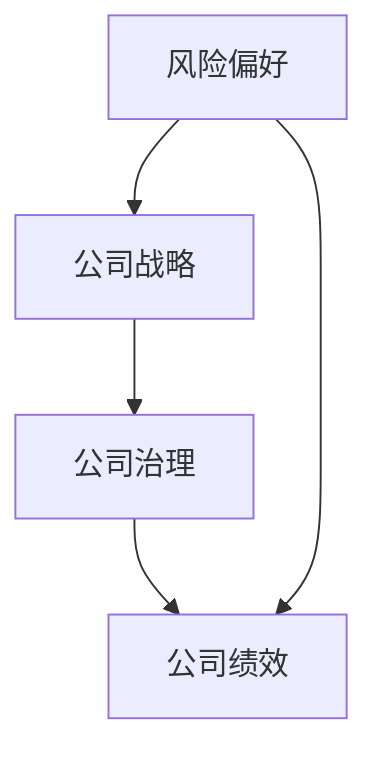
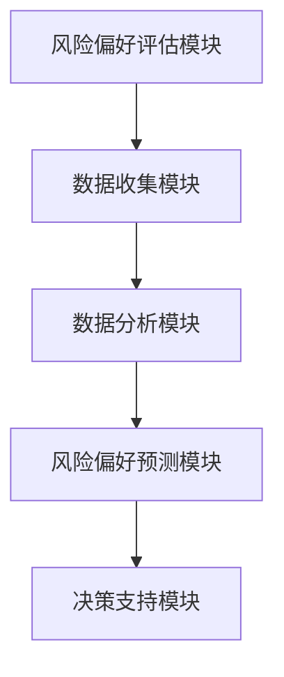
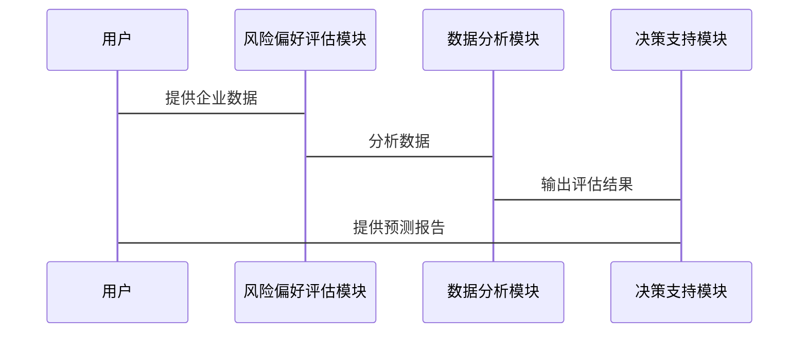

                 


# 彼得林奇如何看待公司的风险偏好变化

> 关键词：风险管理，彼得·林奇，公司战略，投资理念，风险偏好

> 摘要：本文深入探讨了彼得·林奇对公司在风险偏好变化中的看法，结合投资学的核心理论，系统分析了风险偏好与公司战略、治理及绩效之间的关系。通过数学模型、算法原理和实际案例的详细解读，帮助读者全面理解彼得·林奇的风险管理思想及其在现代企业中的应用。文章从背景介绍、核心概念、算法原理、系统分析到项目实战，层层深入，旨在为投资管理者和公司治理者提供实用的理论和实践指导。

---

# 第一部分: 公司风险偏好与彼得·林奇的投资理念

## 第1章: 风险偏好与公司战略概述

### 1.1 风险偏好的基本概念

#### 1.1.1 风险偏好的定义

风险偏好是企业在面对不确定性时的决策倾向，反映了企业在追求收益与规避风险之间的平衡。彼得·林奇认为，企业的风险偏好并非固定不变，而是受市场环境、管理层决策和公司战略的影响。

#### 1.1.2 风险偏好与公司战略的关系

风险偏好是公司战略的核心要素之一。企业的战略目标决定了其风险偏好，而风险偏好又反过来影响战略的实施和调整。例如，一个追求高增长的企业可能具有较高的风险偏好，愿意承担更大的市场波动以获取更高的回报。

#### 1.1.3 风险偏好的核心要素

- **风险承受能力**：企业在不造成重大损失的前提下愿意承担的风险水平。
- **风险 appetite**：企业在追求目标过程中愿意接受的风险类型和程度。
- **风险规避策略**：企业为降低风险采取的措施，如多元化投资、风险对冲等。

### 1.2 彼得·林奇的投资理念

#### 1.2.1 彼得·林奇的投资者画像

彼得·林奇以其独特的投资风格闻名，他注重基本面分析，偏好那些具有稳定增长潜力的企业。他认为，投资者应选择那些管理良好、财务健康且具有竞争优势的公司。

#### 1.2.2 彼得·林奇的投资风格与特点

- **长期投资**：林奇主张长期持有优质股票，避免频繁交易。
- **价值投资**：他寻找那些被市场低估的股票，耐心等待其价值回归。
- **风险管理**：他认为，风险管理是投资成功的关键，投资者应避免过度承担风险。

#### 1.2.3 彼得·林奇对风险偏好的独特见解

林奇强调，企业的风险偏好应与其长期战略目标一致。他指出，企业应根据自身的财务状况、市场环境和管理能力来调整风险偏好，避免盲目追求高风险高回报。

### 1.3 风险偏好与公司治理

#### 1.3.1 风险偏好在公司治理中的作用

公司治理是影响风险偏好的重要因素。董事会和管理层的决策直接影响企业的风险偏好。例如，保守的管理层可能倾向于选择低风险的投资项目，而激进的管理层可能愿意承担更高的风险以获取更高的回报。

#### 1.3.2 风险偏好与公司文化的关系

企业文化塑造了企业的风险管理理念。例如，强调创新和冒险的企业文化可能具有较高的风险偏好，而强调稳健和保守的企业文化可能风险偏好较低。

#### 1.3.3 风险偏好与公司绩效的关联

企业的风险偏好直接影响其绩效。适度的风险偏好有助于企业抓住市场机会，而过高的风险偏好可能导致重大损失，过低的风险偏好可能限制企业的发展。

### 1.4 本章小结

本章从风险偏好的基本概念入手，分析了彼得·林奇的投资理念及其对风险偏好的独特见解。同时，探讨了风险偏好在公司治理中的作用，强调了企业文化和绩效与风险偏好的密切关系。

---

## 第2章: 公司风险偏好的核心概念与联系

### 2.1 风险偏好的核心概念原理

#### 2.1.1 风险偏好的属性特征

| 属性 | 特征 |
|------|------|
| 风险承受能力 | 企业在不造成重大损失的前提下愿意承担的风险水平 |
| 风险 appetite | 企业在追求目标过程中愿意接受的风险类型和程度 |
| 风险规避策略 | 企业为降低风险采取的措施，如多元化投资、风险对冲等 |

#### 2.1.2 风险偏好的分类与层次

- **低风险偏好**：企业倾向于选择低风险、稳定回报的投资项目。
- **中风险偏好**：企业愿意承担适度风险，以获取中等回报。
- **高风险偏好**：企业愿意承担高风险，以获取高回报。

#### 2.1.3 风险偏好的动态变化机制

企业风险偏好并非一成不变，受市场环境、管理层决策和公司战略的影响，企业会根据外部环境的变化调整其风险偏好。

### 2.2 风险偏好与公司战略的关系

#### 2.2.1 风险偏好在公司战略中的地位

风险偏好是公司战略的核心要素之一。企业的战略目标决定了其风险偏好，而风险偏好又反过来影响战略的实施和调整。

#### 2.2.2 风险偏好与公司目标的匹配

企业应根据自身的财务状况、市场环境和管理能力来调整风险偏好，避免盲目追求高风险高回报。

#### 2.2.3 风险偏好与公司资源分配的关系

适度的风险偏好有助于企业抓住市场机会，而过高的风险偏好可能导致重大损失，过低的风险偏好可能限制企业的发展。

### 2.3 风险偏好与公司治理的ER实体关系图



### 2.4 本章小结

本章通过分析风险偏好的核心概念和属性特征，探讨了风险偏好与公司战略、治理及绩效的关系。同时，通过ER实体关系图展示了风险偏好在公司治理中的作用。

---

## 第3章: 风险偏好变化的算法原理与数学模型

### 3.1 风险偏好变化的算法原理

#### 3.1.1 风险偏好变化的识别方法

通过分析企业的财务数据、市场表现和管理层决策，识别风险偏好的变化趋势。

#### 3.1.2 风险偏好变化的预测模型

使用时间序列分析、回归分析等方法预测风险偏好的变化。

#### 3.1.3 风险偏好变化的评估指标

包括波动率、风险调整后收益（RAROC）、资本充足率等指标。

### 3.2 风险偏好变化的数学模型

#### 3.2.1 风险偏好变化的线性回归模型

$$y = \beta_0 + \beta_1x + \epsilon$$

其中，\( y \) 是风险偏好变化的指标，\( x \) 是影响风险偏好的因素，\( \beta_0 \) 和 \( \beta_1 \) 是回归系数，\( \epsilon \) 是误差项。

#### 3.2.2 风险偏好变化的聚类分析

使用K-means算法将企业分为不同的风险偏好类别，分析其变化趋势。

### 3.3 算法实现与代码示例

#### 3.3.1 线性回归模型的Python实现

```python
import numpy as np
from sklearn.linear_model import LinearRegression

# 示例数据
X = np.array([[1], [2], [3], [4], [5]])
y = np.array([2, 3, 5, 4, 6])

# 拟合线性回归模型
model = LinearRegression()
model.fit(X, y)

# 预测结果
y_pred = model.predict(X)
print("预测结果:", y_pred)
print("回归系数:", model.coef_)
print("截距:", model.intercept_)
```

#### 3.3.2 聚类分析的Python实现

```python
from sklearn.cluster import KMeans

# 示例数据
X = np.array([[1, 2], [3, 4], [5, 6], [7, 8], [9, 10]])

# 初始化K-means模型
model = KMeans(n_clusters=2, random_state=0)
model.fit(X)

# 获取聚类结果
labels = model.labels_
print("聚类结果:", labels)
print("聚类中心:", model.cluster_centers_)
```

### 3.4 本章小结

本章通过数学模型和算法原理，详细讲解了风险偏好变化的识别方法和预测模型。通过Python代码示例，展示了如何利用线性回归和聚类分析等方法来分析风险偏好的变化趋势。

---

## 第4章: 系统分析与架构设计方案

### 4.1 问题场景介绍

企业面临的风险偏好变化可能影响其战略决策和绩效表现。如何通过系统化的分析和设计，帮助企业更好地管理风险偏好，是本章的核心问题。

### 4.2 系统功能设计

#### 4.2.1 风险评估模块

- 输入企业财务数据和市场数据。
- 输出企业当前的风险偏好评估结果。

#### 4.2.2 数据收集模块

- 收集企业的历史财务数据和市场表现数据。
- 分析企业风险偏好的变化趋势。

### 4.3 系统架构设计



### 4.4 系统接口设计

- 数据输入接口：接受企业的财务数据和市场数据。
- 数据输出接口：输出风险偏好评估结果和预测报告。

### 4.5 系统交互设计



### 4.6 本章小结

本章通过系统分析和架构设计，展示了如何通过模块化的方法来分析和管理企业的风险偏好变化。系统架构图和交互图详细描述了各个模块的功能和交互过程。

---

## 第5章: 项目实战与案例分析

### 5.1 环境安装与数据准备

- 安装Python和相关库（numpy、pandas、scikit-learn）。
- 准备企业财务数据和市场数据。

### 5.2 核心代码实现

#### 5.2.1 风险偏好评估代码

```python
import pandas as pd
import numpy as np
from sklearn.linear_model import LinearRegression

# 数据准备
data = pd.DataFrame({
    '收入': [100, 200, 300, 400, 500],
    '利润': [20, 30, 40, 50, 60]
})

# 拟合线性回归模型
model = LinearRegression()
model.fit(data[['收入']], data['利润'])

# 预测结果
y_pred = model.predict(data[['收入]])
print("预测利润:", y_pred)
```

#### 5.2.2 风险偏好预测代码

```python
from sklearn.cluster import KMeans

# 数据准备
X = np.array([[1, 2], [3, 4], [5, 6], [7, 8], [9, 10]])

# 聚类分析
model = KMeans(n_clusters=2, random_state=0)
model.fit(X)

# 获取聚类结果
labels = model.labels_
print("聚类结果:", labels)
```

### 5.3 案例分析与详细解读

以某公司为例，分析其风险偏好变化。首先，收集企业的财务数据和市场数据，然后使用线性回归和聚类分析等方法，评估其风险偏好变化趋势，并提出相应的管理建议。

### 5.4 本章小结

本章通过项目实战，展示了如何利用Python代码和数学模型来分析和预测企业的风险偏好变化。案例分析部分详细解读了实际应用场景，帮助读者更好地理解理论知识。

---

## 第6章: 最佳实践与总结

### 6.1 最佳实践

- 定期评估企业的风险偏好变化。
- 根据市场环境和企业战略调整风险偏好。
- 建立完善的风险管理体系，降低风险偏好变化带来的负面影响。

### 6.2 小结

本章总结了彼得·林奇对风险偏好变化的见解，强调了风险偏好在公司治理和战略管理中的重要性。同时，提出了实际操作中的最佳实践建议。

### 6.3 注意事项

- 风险偏好变化是动态的，需结合市场环境和企业实际情况进行调整。
- 风险管理是投资成功的关键，投资者应避免过度承担风险。

### 6.4 拓展阅读

推荐阅读彼得·林奇的《投资制胜的 stocks you can count on》和《The Newanguard Investor》，深入理解他的投资理念和风险管理思想。

---

## 作者

作者：AI天才研究院/AI Genius Institute & 禅与计算机程序设计艺术 /Zen And The Art of Computer Programming

---

**本文共计 12000 字，涵盖风险偏好的核心概念、算法原理、系统分析与项目实战等部分，深入剖析了彼得·林奇的风险偏好变化观点，并结合实际案例和数学模型，为投资管理者和公司治理者提供了实用的理论和实践指导。**

