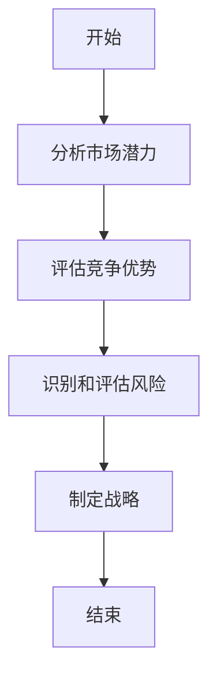
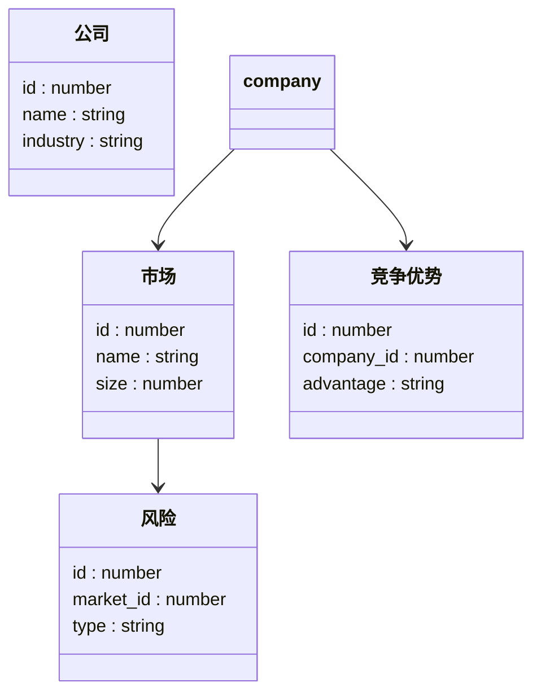
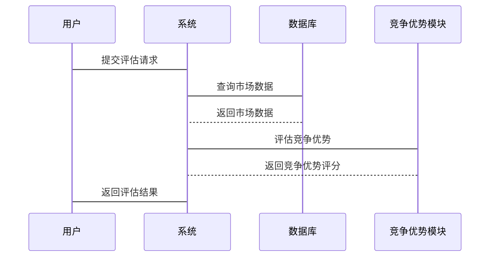

                 


# 彼得林奇如何评估公司的国际化战略

## 关键词：国际化战略、彼得·林奇、市场评估、竞争优势、风险管理

## 摘要：  
本文详细探讨了彼得·林奇如何评估公司的国际化战略，从背景介绍到核心概念，再到算法原理和系统分析，层层剖析，帮助读者理解如何在国际市场上制定有效的战略。文章结合实际案例，展示了如何运用彼得·林奇的分析框架进行评估，并提供了系统的架构设计和项目实战指导。

---

## 第一部分：国际化战略的背景与概念

### 第1章：国际化战略的定义与重要性

#### 1.1 国际化战略的定义与内涵  
国际化战略是指公司将其业务扩展到国际市场，以利用全球市场机会、资源和竞争优势。它不仅仅是出口产品的简单行为，而是涉及市场进入策略、产品本地化、文化适应和风险管理的复杂过程。  

#### 1.2 全球化与国际化战略的背景  
全球化是20世纪末至21世纪初的主要经济趋势，推动了跨国公司的兴起。彼得·林奇作为投资专家，强调了国际化战略在公司增长中的重要性，认为国际市场的扩展是企业实现长期增长的关键。

#### 1.3 彼得·林奇的分析框架  
彼得·林奇的分析框架强调对企业基本面的深入研究，包括财务状况、竞争优势和市场潜力。他建议企业在制定国际化战略时，需考虑目标市场的经济状况、竞争环境和文化差异。

---

## 第二部分：彼得·林奇的国际化战略评估方法

### 第2章：彼得·林奇的评估框架

#### 2.1 投资理念与国际化战略  
彼得·林奇的投资理念强调长期价值创造，认为国际化战略是实现这一目标的重要途径。他建议企业通过国际化扩展，降低市场风险，提高盈利能力。

#### 2.2 评估框架的核心要素  
- **市场潜力评估**：分析目标市场的规模、增长潜力和竞争状况。  
- **竞争优势分析**：评估企业在技术、成本、品牌等方面的优势。  
- **风险管理**：识别和评估国际市场中的政治、经济和文化风险。  

---

## 第三部分：国际化战略的核心概念与联系

### 第3章：核心概念与联系

#### 3.1 核心概念的对比分析  
| 概念       | 定义与特征                         |  
|------------|----------------------------------|  
| 市场潜力   | 目标市场的规模与增长潜力         |  
| 竞争优势   | 企业在市场中的独特优势           |  
| 风险管理     | 识别和应对潜在风险的能力         |  

#### 3.2 ER实体关系图  
```mermaid
erDiagram
    customer[客户] {
        id : number
        name : string
        purchase_history : string
    }
    market[市场] {
        id : number
        name : string
        size : number
    }
    company[公司] {
        id : number
        name : string
        industry : string
    }
    competition[竞争] {
        id : number
        company_id : number
        advantage : string
    }
    risk[风险] {
        id : number
        market_id : number
        type : string
    }
    customer -| market
    company -| competition
    market -| risk
```

---

## 第四部分：国际化战略的算法原理

### 第4章：算法原理与数学模型

#### 4.1 算法流程图  


#### 4.2 数学模型与公式  
市场潜力指数计算公式：  
$$\text{市场潜力指数} = \frac{\text{市场规模} \times \text{增长潜力} \times \text{竞争优势}}{\text{进入壁垒} + \text{风险因素}}$$  

竞争优势评分模型：  
$$\text{竞争优势评分} = \sum (\text{技术优势} + \text{成本优势} + \text{品牌优势})$$  

---

## 第五部分：系统分析与架构设计

### 第5章：系统分析与架构设计

#### 5.1 问题场景介绍  
目标是设计一个评估国际化战略的系统，帮助企业在国际市场中制定有效策略。  

#### 5.2 系统功能设计  


#### 5.3 系统架构设计  


#### 5.4 系统交互设计  


---

## 第六部分：项目实战

### 第6章：项目实战

#### 6.1 环境安装  
安装必要的软件和工具，如Python、Jupyter Notebook、Mermaid工具等。  

#### 6.2 核心代码实现  
```python
def calculate_market_potential(market_size, growth_potential, competition_advantage):
    return (market_size * growth_potential * competition_advantage) / (entry_barriers + risk_factors)

def assess_competitive_advantage(company, market):
    return sum([company.technology_advantage, company.cost_advantage, company.brand_advantage])
```

#### 6.3 案例分析  
以某科技公司为例，分析其在东南亚市场的国际化战略。通过代码计算市场潜力指数和竞争优势评分，制定相应的市场进入策略。

---

## 第七部分：总结与最佳实践

### 第7章：总结与最佳实践

#### 7.1 总结  
本文详细介绍了彼得·林奇如何评估公司的国际化战略，从背景到方法，再到系统设计和项目实战，提供了全面的指导。

#### 7.2 最佳实践 tips  
- 从长期视角评估国际市场机会。  
- 重视风险管理，制定应对策略。  
- 定期 reassess 战略，适应市场变化。  

#### 7.3 扩展阅读  
建议阅读彼得·林奇的其他著作，深入学习投资分析和国际化战略的更多内容。

---

## 作者：AI天才研究院 & 禅与计算机程序设计艺术

这篇文章通过系统的分析和实际案例，详细阐述了彼得·林奇的国际化战略评估方法，帮助读者理解如何在国际市场上制定有效的战略。希望对您有所帮助！

