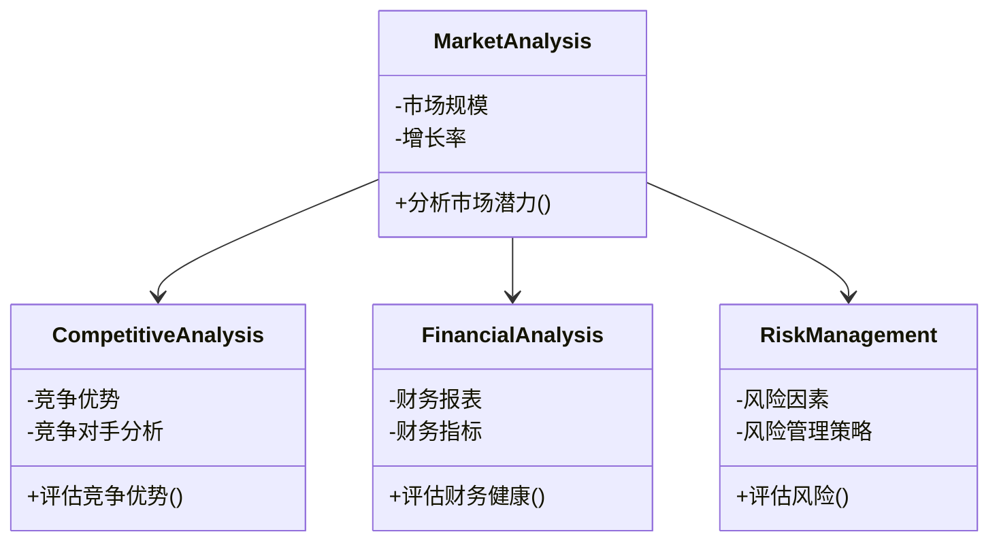

                 


# 彼得林奇如何评估公司的国际化策略

## 关键词：国际化策略、彼得·林奇、投资评估、风险管理、竞争优势

## 摘要：彼得·林奇作为投资大师，他的国际化策略评估方法对投资者和企业具有重要的指导意义。本文将从背景、核心概念、评估维度与方法、数学模型、系统架构、项目实战等多个方面详细阐述彼得·林奇的评估策略，帮助读者更好地理解和应用。

---

### 第一部分：引言

### 1. 引言

国际化战略是企业在全球化背景下扩展市场、寻求增长的重要手段。然而，如何评估一个公司的国际化策略，以确定其是否具备长期竞争优势和投资价值，是投资者和企业管理者面临的重大挑战。本文将从彼得·林奇的投资者视角出发，系统分析国际化策略的评估方法和技巧。

---

### 第二部分：彼得·林奇的投资者背景

### 2. 彼得·林奇的投资者背景

彼得·林奇（Peter Lynch）是美国著名投资经理人，以其在富达投资管理公司的长期任职期间取得了卓越的投资业绩而闻名。他的投资理念强调深入分析企业的基本面，寻找那些具有长期竞争优势且管理良好的公司。本文将探讨他如何将这些理念应用到国际化策略的评估中。

---

### 第三部分：国际化战略的核心概念

### 3.1 核心概念的理论基础

国际化战略是指企业将其业务扩展到全球市场的过程。这一过程涉及市场进入策略、跨文化管理、全球运营等多个方面。彼得·林奇认为，成功的国际化战略不仅需要企业具备强大的财务实力，还需要在目标市场中具备独特的竞争优势。

**3.2 相关概念对比分析**

以下是几个相关概念的对比表格：

| 概念               | 描述                                                                 |
|--------------------|----------------------------------------------------------------------|
| 市场进入策略       | 企业进入新市场的具体方式，如直接投资、合资企业、特许经营等。                  |
| 竞争优势           | 企业在市场上独特的优势，如成本优势、技术优势、品牌优势等。                  |
| 全球化运营         | 企业在多个国家和地区开展业务，并实现资源共享和协同效应。                    |

---

### 第四部分：国际化战略的评估维度与方法

### 4.1 评估维度

彼得·林奇在评估国际化策略时，主要关注以下几个维度：

- **市场潜力**：目标市场的市场规模和增长潜力。
- **竞争优势**：企业在目标市场中的竞争优势，包括成本、技术、品牌等。
- **财务表现**：企业的财务健康状况，包括盈利能力、资产负债情况等。
- **风险管理**：企业在国际化过程中可能面临的政治、经济、文化等风险。

### 4.2 评估方法

彼得·林奇提出的评估方法包括以下几个步骤：

1. **市场分析**：通过SWOT分析（优势、劣势、机会、威胁）来评估目标市场的潜力。
2. **竞争优势分析**：分析企业在目标市场中的竞争优势，并与竞争对手进行对比。
3. **财务指标分析**：通过分析企业的财务报表，评估其财务健康状况和盈利能力。
4. **风险管理**：识别和评估企业在国际化过程中可能面临的风险，并制定相应的风险管理策略。

---

### 第五部分：数学模型与公式

### 5.1 市场潜力评估公式

彼得·林奇认为，市场潜力可以通过以下公式进行评估：

$$
\text{市场潜力} = \text{市场规模} \times \text{增长率}
$$

其中，市场规模可以通过市场调研数据获取，增长率则根据历史数据和市场预测确定。

### 5.2 竞争优势评估模型

竞争优势评估模型可以通过以下步骤进行：

1. 确定企业的核心竞争优势（如成本优势、技术优势等）。
2. 对比分析竞争对手的核心竞争力。
3. 评估企业在目标市场中的竞争优势程度。

---

### 第六部分：系统分析与架构设计

### 6.1 问题场景介绍

企业在制定国际化策略时，需要综合考虑市场、竞争、财务和风险等多个因素。彼得·林奇的评估方法提供了一种系统化的解决方案，帮助企业在复杂多变的全球化市场中做出明智的决策。

### 6.2 系统功能设计

以下是系统功能设计的类图（使用mermaid）：



---

### 第七部分：项目实战

### 7.1 环境安装

为了应用彼得·林奇的评估方法，我们需要安装以下工具：

- 数据分析工具：Excel、Python（Pandas库）
- 图表工具：Matplotlib、Tableau
- 系统设计工具：Lucidchart、Draw.io

### 7.2 核心代码实现

以下是使用Python实现的市场潜力评估代码示例：

```python
import pandas as pd

# 数据输入
data = {
    '市场规模': [100, 200, 150],
    '增长率': [0.1, 0.15, 0.12]
}

df = pd.DataFrame(data)

# 计算市场潜力
df['市场潜力'] = df['市场规模'] * df['增长率']

print(df)
```

### 7.3 案例分析

以某科技公司为例，分析其国际化策略：

1. **市场分析**：目标市场为新兴经济体，市场规模增长迅速。
2. **竞争优势分析**：公司在技术创新方面具有优势。
3. **财务分析**：公司财务状况稳健，利润率较高。
4. **风险管理**：制定应对政治和经济风险的策略。

---

### 第八部分：最佳实践、小结、注意事项和拓展阅读

### 8.1 最佳实践

- **持续学习**：关注国际市场动态，不断提升自身的知识储备。
- **风险管理**：制定全面的风险管理策略，以应对国际化过程中的各种不确定性。
- **竞争优势**：确保企业在目标市场中具备独特的优势。

### 8.2 小结

彼得·林奇的国际化策略评估方法为我们提供了一个系统化的框架，帮助我们在全球化背景下做出明智的投资决策。通过深入分析企业的市场潜力、竞争优势、财务表现和风险管理能力，我们可以更好地评估一个公司的国际化策略。

### 8.3 注意事项

- **数据准确性**：确保市场数据的准确性和及时性。
- **文化差异**：重视跨文化管理，避免因文化差异导致的误解。
- **动态调整**：根据市场变化及时调整策略。

### 8.4 拓展阅读

- 彼得·林奇的著作《彼得·林奇的投资哲学》
- 全球化与国际化策略的经典案例研究
- 《国际商务》相关教材

---

### 作者：AI天才研究院/AI Genius Institute & 禅与计算机程序设计艺术/Zen And The Art of Computer Programming

