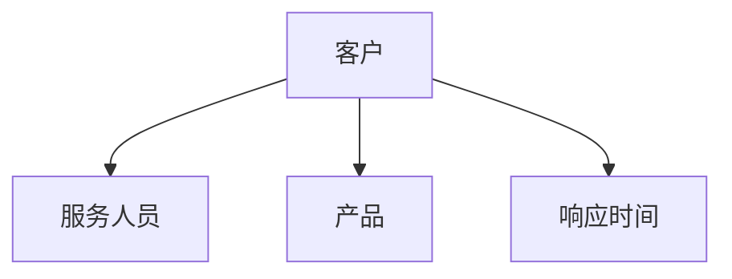
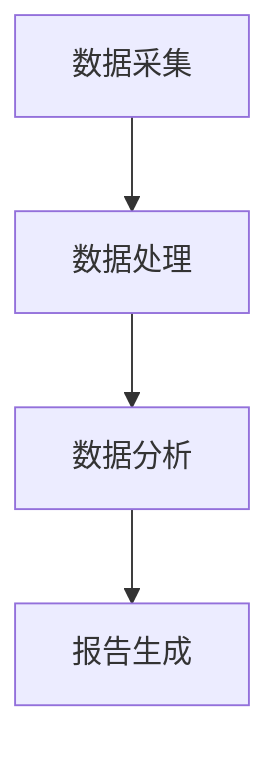

                 


# 彼得林奇如何评估公司的客户体验投资回报

## 关键词：彼得林奇，客户体验，投资回报，评估模型，客户满意度

## 摘要：彼得林奇作为投资大师，他的客户体验评估方法对投资回报有着重要影响。本文详细分析了客户体验与投资回报的关系，构建了评估模型，并通过实际案例展示了如何将客户体验转化为投资回报。

---

# 第1章：客户体验与投资回报的背景介绍

## 1.1 客户体验的核心概念

### 1.1.1 客户体验的定义

客户体验是指客户在与公司互动过程中所感受到的整体体验，包括服务质量、响应速度、产品 usability 等。



### 1.1.2 客户体验与投资回报的关系

客户体验直接影响客户忠诚度和满意度，从而影响公司的长期投资回报。

### 1.1.3 彼得林奇的投资理念

彼得林奇强调基本面分析和长期投资，客户体验是基本面分析的重要组成部分。

## 1.2 投资回报的多维度评估

### 1.2.1 财务回报指标

- 净利润增长率
- 投资回报率(ROI)

### 1.2.2 非财务回报指标

- 客户满意度(CSI)
- 客户净推荐值(NPS)

### 1.2.3 综合回报模型

结合财务和非财务指标，构建综合回报模型。

---

# 第2章：客户体验与投资回报的核心概念

## 2.1 客户体验的关键维度

### 2.1.1 服务质量

服务质量直接影响客户满意度和忠诚度。

### 2.1.2 响应速度

快速响应能够提升客户体验，降低客户流失率。

### 2.1.3 产品 usability

产品 usability 影响客户使用体验和满意度。

## 2.2 投资回报的评估维度

### 2.2.1 财务回报

- 营业收入增长
- 净利润增长

### 2.2.2 非财务回报

- 客户满意度
- 客户忠诚度

### 2.2.3 综合回报模型

结合财务和非财务指标，构建综合回报模型。

## 2.3 客户体验与投资回报的联系

### 2.3.1 客户满意度与投资回报的关系

客户满意度高，投资回报率高。

### 2.3.2 客户忠诚度与投资回报的关系

客户忠诚度高，长期投资回报稳定。

### 2.3.3 客户净推荐值与投资回报的关系

客户净推荐值高，投资回报潜力大。

---

# 第3章：客户体验评估的数学模型与算法

## 3.1 客户体验评估的指标体系

### 3.1.1 客户满意度指数(CSI)

$$ CSI = \frac{\text{满意客户数}}{\text{总客户数}} $$

### 3.1.2 客户净推荐值(NPS)

$$ NPS = \text{推荐客户数} - \text{不满客户数} $$

## 3.2 投资回报评估模型

### 3.2.1 综合回报指数(CRI)

$$ CRI = \alpha \times ROI + (1-\alpha) \times NPS $$

其中，$\alpha$ 是权重系数。

### 3.2.2 模型的验证与优化

通过历史数据验证模型，并根据实际情况进行参数调整。

---

# 第4章：系统架构与实现

## 4.1 系统功能设计

### 4.1.1 数据采集模块

- 收集客户反馈和数据
- 整理和清洗数据

### 4.1.2 数据分析模块

- 计算 CSI 和 NPS
- 构建回归模型

### 4.1.3 报告生成模块

- 生成评估报告
- 提供改进建议

## 4.2 系统架构设计

### 4.2.1 分层架构



### 4.2.2 模块化设计

每个功能模块独立开发，便于维护和扩展。

---

# 第5章：项目实战与案例分析

## 5.1 项目背景

### 5.1.1 项目目标

评估客户体验对投资回报的影响。

### 5.1.2 数据来源

客户反馈数据、财务数据。

## 5.2 核心代码实现

### 5.2.1 CSI 计算

```python
def calculate_csi(satisfied_customers, total_customers):
    return satisfied_customers / total_customers
```

### 5.2.2 NPS 计算

```python
def calculate_nps(recommended_customers, dissatisfied_customers):
    return recommended_customers - dissatisfied_customers
```

## 5.3 案例分析

### 5.3.1 案例背景

假设一家公司收集了1000客户的反馈。

### 5.3.2 数据分析

- 满意客户数：800
- 不满客户数：200

计算 CSI 和 NPS：

$$ CSI = \frac{800}{1000} = 0.8 $$
$$ NPS = 800 - 200 = 600 $$

### 5.3.3 投资回报评估

综合回报指数：

$$ CRI = 0.5 \times ROI + 0.5 \times NPS $$

假设 ROI 为 20%，NPS 为 600，计算 CRI：

$$ CRI = 0.5 \times 0.2 + 0.5 \times 600 = 0.1 + 300 = 300.1 $$

---

# 第6章：最佳实践与小结

## 6.1 最佳实践

### 6.1.1 数据准确性

确保数据来源可靠，样本具有代表性。

### 6.1.2 持续优化

定期评估和优化模型，适应市场变化。

## 6.2 小结

彼得林奇的客户体验评估方法为投资决策提供了重要依据。通过构建科学的评估模型，可以有效提升投资回报。

## 6.3 注意事项

- 数据样本要足够大
- 模型要结合实际情况
- 避免短期波动影响判断

## 6.4 拓展阅读

建议阅读彼得林奇的书籍，深入了解他的投资理念。

---

# 作者：AI天才研究院 & 禅与计算机程序设计艺术

本文由AI天才研究院撰写，转载请注明出处。

