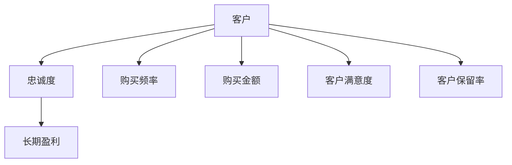
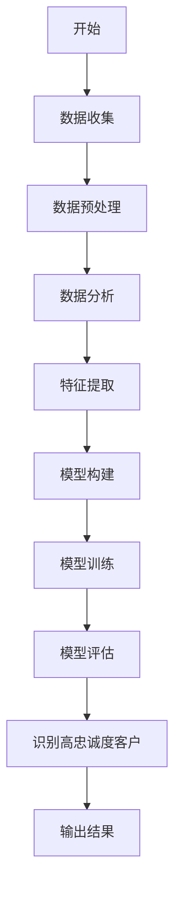

                 


# 彼得林奇如何评估公司的客户忠诚度对长期盈利的影响

> 关键词：客户忠诚度，长期盈利，彼得林奇，投资评估，企业价值

> 摘要：本文深入探讨了彼得·林奇如何通过评估客户忠诚度来预测和提升公司长期盈利能力的方法。从客户忠诚度的定义、核心概念、算法原理到系统架构设计、项目实战，再到最佳实践，本文全面解析了客户忠诚度评估对长期盈利的影响。

---

## 第一部分: 背景介绍

### 第1章: 客户忠诚度与长期盈利的关系

#### 1.1 什么是客户忠诚度
客户忠诚度是客户对企业产品或服务的持续购买意愿和行为。一个忠诚的客户不仅会反复购买，还会推荐给他人，并在企业出现问题时给予支持。

#### 1.1.1 客户忠诚度的定义
客户忠诚度是客户对企业的情感依赖和信任，表现为重复购买、推荐他人购买以及在企业遇到困难时不转移品牌忠诚度。

#### 1.1.2 客户忠诚度的核心要素
- **购买频率**：客户购买的频率越高，忠诚度越高。
- **购买金额**：高忠诚度客户通常购买金额更大。
- **客户生命周期价值（CLV）**：客户在生命周期内为企业带来的总收入。
- **客户满意度**：客户对产品或服务的满意程度直接影响忠诚度。
- **客户保留率**：客户保留率高，说明客户忠诚度高。

#### 1.1.3 客户忠诚度与长期盈利的关系
客户忠诚度高的企业通常具有更高的客户保留率和客户生命周期价值，从而实现长期盈利。

#### 1.2 彼得·林奇的投资理念
彼得·林奇是富达投资集团的传奇基金经理，他强调长期投资和深入研究企业的基本面。

#### 1.2.1 彼得·林奇的投资者身份
彼得·林奇认为，投资者应该像企业老板一样思考，深入研究企业的经营状况和行业地位。

#### 1.2.2 客户忠诚度在投资中的重要性
彼得·林奇认为，客户忠诚度是企业长期盈利能力的重要指标，高忠诚度客户能为企业带来稳定的收入和利润。

#### 1.2.3 长期盈利的核心驱动因素
彼得·林奇认为，企业的长期盈利能力取决于以下几个因素：
- 客户忠诚度
- 产品竞争力
- 管理团队
- 行业地位

### 第2章: 客户忠诚度评估的背景与问题描述

#### 2.1 为什么客户忠诚度重要
客户忠诚度高的企业通常具有更高的客户保留率和客户生命周期价值。

#### 2.1.1 客户忠诚度对企业的价值
- 高忠诚度客户为企业创造更高的收入和利润。
- 忠诚客户通常愿意为产品支付溢价。
- 忠诚客户能够为企业提供持续的现金流。

#### 2.1.2 客户忠诚度对长期盈利的影响
- 高忠诚度客户能够为企业提供稳定的收入来源。
- 忠诚客户能够为企业带来更多的市场份额。
- 忠诚客户能够帮助企业降低营销成本。

#### 2.1.3 客户忠诚度评估的必要性
- 企业需要通过客户忠诚度评估来识别高价值客户。
- 企业需要通过客户忠诚度评估来优化客户关系管理。
- 企业需要通过客户忠诚度评估来制定有效的市场策略。

#### 2.2 问题背景与边界
- **问题背景分析**：客户忠诚度是企业长期盈利能力的重要指标，但如何准确评估客户忠诚度一直是企业面临的难题。
- **问题解决的目标**：通过建立科学的客户忠诚度评估模型，帮助企业准确识别高忠诚度客户，优化客户关系管理。
- **边界与外延**：本文仅关注客户忠诚度的评估方法，不涉及其他因素对企业长期盈利的影响。
- **核心概念与组成要素**：
  - 客户忠诚度
  - 购买频率
  - 购买金额
  - 客户满意度
  - 客户保留率

---

## 第二部分: 核心概念与联系

### 第3章: 客户忠诚度评估的核心概念

#### 3.1 核心概念原理
客户忠诚度的评估需要结合多个维度进行综合分析。

#### 3.1.1 客户忠诚度的测量维度
- 购买频率
- 购买金额
- 客户满意度
- 客户保留率
- 购买决策的时间

#### 3.1.2 彼得·林奇的客户忠诚度评估方法
彼得·林奇提出的客户忠诚度评估方法包括以下几个步骤：
1. **收集客户数据**：包括购买频率、购买金额、客户满意度等。
2. **计算客户生命周期价值（CLV）**：通过分析客户在生命周期内为企业带来的收入和利润。
3. **分析客户保留率**：通过比较客户流失率和新客户获取率，评估客户忠诚度。
4. **识别高忠诚度客户**：通过客户生命周期价值和客户保留率，识别高忠诚度客户。
5. **优化客户关系管理**：通过分析客户忠诚度数据，优化客户关系管理，提升客户满意度和忠诚度。

#### 3.1.3 评估模型的数学基础
客户生命周期价值（CLV）的计算公式如下：

$$ CLV = \frac{R \times (1 - \frac{1}{(1 + d)^{n}})}{d} $$

其中：
- \( R \) 是客户每年产生的收入。
- \( d \) 是贴现率。
- \( n \) 是客户生命周期的长度。

#### 3.2 核心概念属性特征对比

| 特性       | 忠诚度高 | 忠诚度低 |
|------------|----------|----------|
| 购买频率   | 高       | 低       |
| 购买金额   | 高       | 低       |
| 客户满意度 | 高       | 低       |
| 客户保留率 | 高       | 低       |
| 购买决策时间 | 短       | 长       |

#### 3.3 实体关系图



---

## 第三部分: 算法原理讲解

### 第4章: 客户忠诚度评估算法

#### 4.1 算法原理概述
客户忠诚度评估算法通过分析客户的购买行为、满意度和保留率，计算客户生命周期价值，识别高忠诚度客户。

#### 4.1.1 数据收集与预处理
数据收集包括客户购买记录、客户满意度调查、客户投诉记录等。数据预处理包括数据清洗、数据转换和数据标准化。

#### 4.1.2 数据分析与特征提取
通过数据分析，提取客户忠诚度相关的特征，如购买频率、购买金额、客户满意度、客户保留率等。

#### 4.1.3 评估模型的构建与训练
通过机器学习算法，构建客户忠诚度评估模型，训练模型以识别高忠诚度客户。

#### 4.2 算法流程图



#### 4.3 算法实现代码

```python
import pandas as pd
from sklearn.model_selection import train_test_split
from sklearn.

