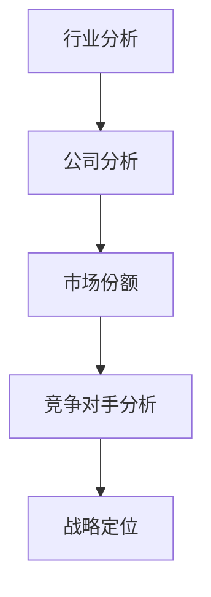

                 

# 彼得林奇如何评估公司的市场份额

## 关键词：彼得林奇，市场份额，投资分析，竞争对手分析，公司定位

## 摘要：本文将详细探讨彼得林奇如何评估公司的市场份额，从基本概念到实际应用，结合经典案例和实战技巧，帮助读者掌握这一投资分析的核心方法。

---

# 第1章: 彼得林奇投资理念概述

## 1.1 彼得林奇投资哲学

### 1.1.1 投资的定义与核心要素

**投资**是指将资金投入某个项目或企业，以期望获得超过投入资本的回报。核心要素包括资金、风险、时间和收益。彼得林奇强调长期投资和基本面分析，认为市场波动是投资机会的来源。

### 1.1.2 彼得林奇的投资风格与特点

彼得林奇以其“烟蒂投资法”闻名，专注于寻找被市场低估的公司。他的投资风格注重深入研究和长期持有，强调对公司基本面和行业环境的全面分析。

### 1.1.3 彼得林奇投资理念的核心思想

彼得林奇认为，成功的投资取决于对公司所在行业的深入了解和对竞争对手的分析。市场份额是衡量公司竞争力和未来增长潜力的关键指标。

---

# 第2章: 什么是市场份额

## 2.1 市场份额的定义与分类

### 2.1.1 市场份额的定义

市场份额是公司产品或服务在特定市场中的销售比例，反映公司在市场中的地位和竞争力。公式为：市场份额 = (公司销售额 / 行业销售额) × 100%。

### 2.1.2 市场份额的分类与特点

市场份额可分为绝对市场份额和相对市场份额。绝对市场份额是公司在整个市场中的占比，而相对市场份额是公司在某一区域或细分市场中的占比。

### 2.1.3 市场份额的核心要素与属性对比表格

| 要素         | 描述                                       |
|--------------|--------------------------------------------|
| 销售额       | 公司的销售额与行业销售额                   |
| 行业结构     | 市场集中度，寡头垄断或分散市场             |
| 竞争对手     | 主要竞争对手的市场份额                   |
| 市场增长率   | 行业整体增长趋势                         |

---

# 第3章: 彼得林奇评估市场份额的核心框架

## 3.1 彼得林奇分析框架

### 3.1.1 从行业分析到公司分析

彼得林奇的分析框架从行业入手，研究行业结构、市场趋势，进而分析公司在行业中的位置。行业分析包括市场规模、增长率、竞争结构等。

### 3.1.2 市场份额与公司竞争力的关系

公司竞争力强，市场份额高；竞争力弱，市场份额低。彼得林奇认为，市场份额的变化反映了公司的竞争力变化。

### 3.1.3 彼得林奇分析框架的逻辑结构与ER实体关系图

---

# 第4章: 彼得林奇市场份额评估方法

## 4.1 市场份额评估的基本步骤

### 4.1.1 确定行业市场规模

通过行业报告和财务数据，获取行业的总收入和市场规模。例如，使用GDP增长率预测市场规模变化。

### 4.1.2 分析公司市场份额占比

计算公司销售额占行业销售额的比例，得出市场份额。例如，公司销售额为100万，行业销售额为500万，则市场份额为20%。

### 4.1.3 评估市场份额的变化趋势

分析过去几年的市场份额变化，预测未来趋势。例如，使用时间序列分析模型预测未来市场份额。

---

# 第5章: 彼得林奇的竞争对手分析

## 5.1 竞争对手分析的核心要素

### 5.1.1 竞争对手的市场份额分析

列出主要竞争对手的市场份额，分析他们的市场策略和竞争优势。

### 5.1.2 竞争对手的财务状况分析

研究竞争对手的财务报表，评估其盈利能力、资产负债情况，判断其财务健康状况。

### 5.1.3 竞争对手的产品与战略分析

分析竞争对手的产品线、技术创新和市场策略，识别其优势和劣势。

---

# 第6章: 彼得林奇的公司定位与战略分析

## 6.1 公司定位的核心要素

### 6.1.1 公司的市场地位与竞争优势

确定公司在市场中的定位，分析其竞争优势和劣势。例如，公司是否是市场领导者、挑战者或跟随者。

### 6.1.2 公司的战略目标与发展方向

研究公司的长期战略目标，如扩大市场份额、产品创新等。

### 6.1.3 公司的市场份额提升策略

制定具体的策略，如价格调整、产品创新、市场推广等，以提升市场份额。

---

# 第7章: 彼得林奇市场份额评估的实战技巧

## 7.1 实战技巧与注意事项

### 7.1.1 数据收集与分析的关键点

确保数据的准确性和全面性，使用多种数据源进行交叉验证。例如，使用行业报告、公司财报和市场调研数据。

### 7.1.2 市场份额评估中的常见误区

避免仅依赖市场份额数据，忽视其他重要因素，如客户满意度和品牌影响力。

### 7.1.3 制定有效的市场份额提升策略

结合公司实际情况，制定切实可行的策略，如优化产品结构、拓展销售渠道等。

---

# 第8章: 彼得林奇市场份额评估的经典案例分析

## 8.1 经典案例分析

### 8.1.1 某行业的市场份额变化分析

以某行业为例，分析市场份额的变化趋势，找出影响市场份额的主要因素。

### 8.1.2 某公司的市场份额提升策略

研究某公司如何通过产品创新和市场推广提升市场份额，总结成功经验。

### 8.1.3 案例分析的启示与总结

总结案例中的经验教训，提炼出可借鉴的策略和方法，为读者提供实际指导。

---

# 第9章: 彼得林奇市场份额评估的结论与建议

## 9.1 结论

彼得林奇的市场份额评估方法为投资者提供了系统的分析框架，帮助识别投资机会和风险。通过深入分析市场份额，投资者可以更好地评估公司的竞争力和未来增长潜力。

## 9.2 建议

1. **持续学习**：关注行业动态和市场变化，不断提升分析能力。
2. **数据驱动**：依赖可靠的数据和分析工具，确保评估的准确性。
3. **长期视角**：注重长期投资，避免短期波动的干扰。

---

# 作者：AI天才研究院 & 禅与计算机程序设计艺术

感谢您的阅读！希望本文能为您提供有价值的投资分析视角，帮助您更好地理解和应用彼得林奇的市场份额评估方法。

--- 

本文旨在通过系统化的分析和实际案例，深入探讨彼得林奇如何评估公司的市场份额，为读者提供实用的分析工具和方法。

