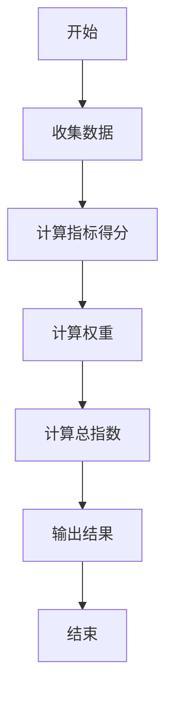
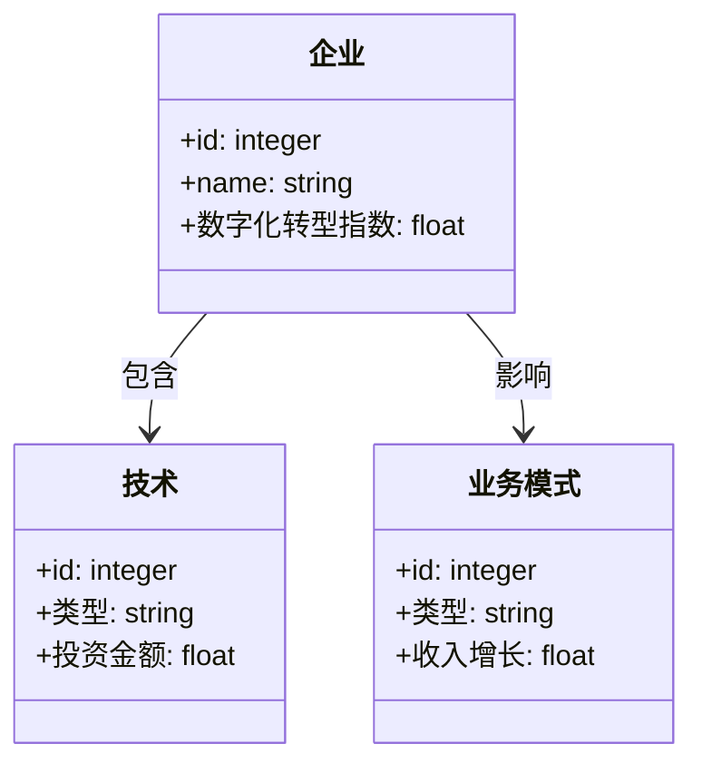

                 


# 彼得林奇如何评估公司的数字化转型速度

## 关键词
彼得林奇, 数字化转型, 评估方法, 数学模型, 企业架构, 投资分析

## 摘要
本文探讨了彼得·林奇如何从投资分析的角度评估公司的数字化转型速度。通过背景介绍、核心概念、评估模型、系统架构、项目实战和最佳实践，全面解析了数字化转型的关键要素及其对企业发展的影响。文章结合理论与实践，提供了详细的数学模型和系统架构设计，帮助读者系统地理解和应用林奇的评估方法。

---

# 第一部分: 数字化转型的背景与重要性

## 第1章: 数字化转型的背景与定义

### 1.1 数字化转型的背景

#### 1.1.1 传统企业面临的数字化挑战
在数字化浪潮的冲击下，传统企业正面临前所未有的挑战。技术的进步，如云计算、人工智能和大数据，正在改变企业的运营模式和市场格局。企业如果不及时进行数字化转型，可能会失去竞争优势，甚至面临生存危机。

#### 1.1.2 数字化转型的定义与内涵
数字化转型是指利用数字技术（如云计算、AI、大数据）对企业的产品、流程、组织结构和商业模式进行全面改造，以实现更高效、灵活和创新的运营方式。

#### 1.1.3 数字化转型的必要性与紧迫性
数字化转型不仅是企业适应市场变化的需要，更是提升竞争力和创造新价值的必经之路。它能够优化业务流程、降低成本、提高客户体验，从而为企业带来新的增长机会。

---

## 第2章: 彼得·林奇的评估框架

### 2.1 彼得·林奇的评估方法

#### 2.1.1 投资分析视角下的数字化转型
作为投资专家，彼得·林奇关注的是数字化转型对企业价值的影响。他认为，数字化转型能够提升企业的运营效率和创新能力，从而增强其投资价值。

#### 2.1.2 数字化转型对企业价值的影响
通过分析企业的数字化转型进程，林奇能够评估其未来的增长潜力和投资风险。例如，一家成功转型的企业可能在市场中占据更大的份额，从而吸引更多投资者。

#### 2.1.3 林奇评估模型的核心要素
林奇的评估模型包括以下几个核心要素：
1. **技术投入**：企业在数字化技术上的投资情况。
2. **业务模式**：数字化转型对企业商业模式的影响。
3. **组织能力**：企业的组织结构是否支持数字化转型。
4. **客户体验**：数字化转型是否提升了客户的满意度和忠诚度。

---

# 第二部分: 核心概念与联系

## 第3章: 数字化转型的核心要素

### 3.1 数字化转型的关键因素

#### 3.1.1 技术因素：云、AI、大数据
数字化转型的核心在于技术的应用。云计算提供了弹性计算资源，人工智能提升了决策能力，大数据分析帮助企业更好地洞察市场和客户。

#### 3.1.2 业务模式：创新与重构
数字化转型不仅仅是技术的变革，更是商业模式的创新。企业需要重新设计其业务流程，以更好地适应数字化时代的需求。

#### 3.1.3 组织结构：敏捷与协作
传统的层级式组织结构可能无法适应快速变化的数字化环境。企业需要转变为更加敏捷和协作的组织形式，以提高反应速度和创新能力。

### 3.2 核心概念对比表

| **核心要素** | **传统模式**         | **数字化模式**        |
|--------------|----------------------|-----------------------|
| 技术         | 离散的IT系统         | 整合的云、AI、大数据   |
| 业务模式     | 线下销售为主         | 线上与线下融合         |
| 组织结构     | 周期长、层级多        | 灵活、扁平化           |

### 3.3 实体关系图

```mermaid
erDiagram
    customer[客户] {
        id : integer
        name : string
        email : string
    }
    product[产品] {
        id : integer
        name : string
        description : string
    }
    transaction[交易] {
        id : integer
        customer_id : integer
        product_id : integer
        date : date
    }
    customer --> transaction : 进行
    product --> transaction : 购买
```

---

## 第4章: 数字化转型的关键算法

### 4.1 数学模型

#### 4.1.1 数字化转型指数公式
$$D = \sum_{i=1}^{n} w_i x_i$$
其中，$D$ 是数字化转型指数，$w_i$ 是第 $i$ 个指标的权重，$x_i$ 是第 $i$ 个指标的得分。

#### 4.1.2 指标权重分配
$$w_i = \frac{f_i}{\sum_{j=1}^{m} f_j}$$
其中，$f_i$ 是第 $i$ 个指标的重要程度，$m$ 是指标总数。

### 4.2 算法流程图



---

# 第三部分: 系统分析与架构设计

## 第5章: 数字化转型的系统架构

### 5.1 领域模型



### 5.2 系统架构图


---

# 第四部分: 项目实战

## 第6章: 项目环境与核心代码

### 6.1 环境配置

```bash
# 安装Python环境
python --version
pip install requests
pip install numpy
```

### 6.2 核心代码实现

```python
# 数字化转型指数计算
import numpy as np

def calculate_digital_transformation_index(weights, scores):
    return np.dot(weights, scores)

# 示例数据
weights = [0.3, 0.4, 0.3]
scores = [0.8, 0.6, 0.9]
index = calculate_digital_transformation_index(weights, scores)
print(f"数字化转型指数: {index}")
```

### 6.3 案例分析

#### 6.3.1 某公司的数字化转型评估
假设某公司有三个指标：技术投入（权重0.3，得分0.8）、业务模式创新（权重0.4，得分0.6）、组织能力（权重0.3，得分0.9）。计算其数字化转型指数为：
$$0.3 \times 0.8 + 0.4 \times 0.6 + 0.3 \times 0.9 = 0.24 + 0.24 + 0.27 = 0.75$$

---

## 第7章: 项目总结与最佳实践

### 7.1 总结

通过本文的分析，我们可以看到，彼得·林奇的评估方法为企业的数字化转型提供了有力的工具。企业可以根据自身的实际情况，结合技术、业务和组织因素，制定合适的数字化转型策略。

### 7.2 最佳实践

1. **数据驱动决策**：利用数据分析工具，实时监控数字化转型的进程。
2. **持续优化**：定期评估转型效果，及时调整策略。
3. **团队协作**：鼓励跨部门协作，形成敏捷的组织结构。

### 7.3 注意事项

- 数字化转型是一个长期过程，需要企业全体员工的参与。
- 在实施过程中，可能会遇到技术和组织上的挑战，需要提前做好规划。

### 7.4 未来趋势

随着技术的进步，数字化转型将更加智能化和自动化。企业需要持续关注新技术，如AI和区块链，以保持竞争力。

---

# 结语

数字化转型不仅是企业发展的必然选择，更是提升企业价值的关键。通过彼得·林奇的评估方法，企业可以更好地把握数字化转型的速度和方向，抓住市场机遇，实现可持续发展。

---

**作者：AI天才研究院 & 禅与计算机程序设计艺术**

