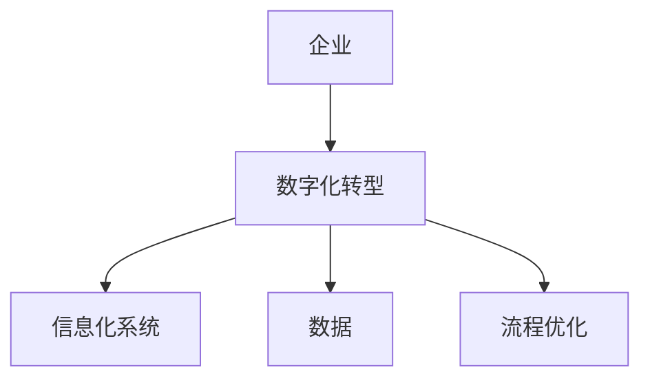
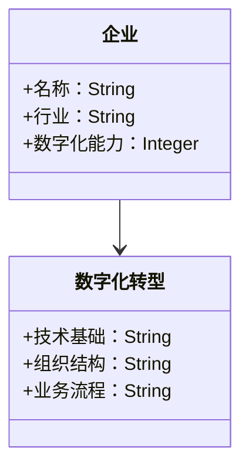
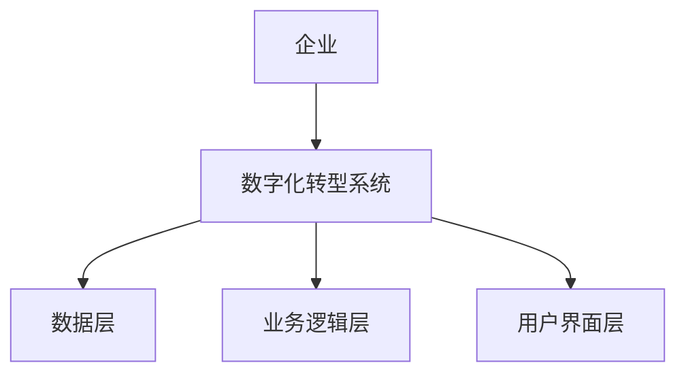

                 


# 彼得林奇如何评估公司的数字化转型速度与质量

## 关键词
- 数字化转型
- 彼得·林奇
- 评估模型
- 企业数字化
- 数字化能力

## 摘要
数字化转型是现代企业实现竞争力提升和可持续发展的重要手段。本文基于彼得·林奇的投资评估方法，系统地分析了数字化转型的速度与质量评估的关键要素、核心模型和实践方法。通过理论与实践结合，为企业提供一套科学的评估体系，帮助企业更好地规划和实施数字化转型。

---

# 第1章 数字化转型的背景与重要性

## 1.1 数字化转型的定义与内涵
### 1.1.1 数字化转型的定义
数字化转型是指企业利用数字技术（如大数据、人工智能、云计算等）重构业务流程、商业模式和组织结构，以实现业务创新和效率提升的过程。

### 1.1.2 数字化转型的核心目标
- 提升业务效率
- 增强客户体验
- 优化资源配置
- 创新商业模式

### 1.1.3 数字化转型的背景
随着信息技术的快速发展，企业必须通过数字化转型来应对市场竞争的压力，抓住新的发展机遇。

## 1.2 数字化转型的重要性
### 1.2.1 数字化转型对企业竞争力的影响
- 数字化转型能够帮助企业快速响应市场变化，提升创新能力。
- 数字化转型能够优化企业运营效率，降低运营成本。

### 1.2.2 数字化转型与企业可持续发展
- 数字化转型能够推动绿色经济，实现资源的高效利用。
- 数字化转型能够支持企业的长期发展，增强企业的抗风险能力。

## 1.3 彼得·林奇的评估方法
### 1.3.1 彼得·林奇的评估理念
彼得·林奇认为，企业的价值不仅体现在财务数据上，还体现在企业的创新能力、市场适应能力和管理效率上。数字化转型作为企业创新的重要手段，需要通过科学的评估方法来衡量其速度和质量。

### 1.3.2 彼得·林奇评估方法的核心思想
- 以结果为导向，关注数字化转型的实际效益。
- 通过多维度的评估指标，全面衡量数字化转型的进展和效果。
- 强调数据驱动的评估方法，确保评估结果的客观性和科学性。

---

# 第2章 数字化转型的核心概念与联系

## 2.1 数字化转型的核心要素
### 2.1.1 数字化转型的关键要素
- 技术基础：大数据、人工智能、云计算等技术的支撑。
- 组织结构：扁平化、数据驱动的组织结构。
- 业务流程：数字化的业务流程和管理模式。
- 人才能力：具备数字化能力的人才队伍。

### 2.1.2 数字化转型的核心驱动因素
- 技术进步：数字化技术的发展为企业提供了新的转型机会。
- 市场需求：客户对数字化服务的需求不断增加。
- 竞争压力：数字化转型成为企业保持竞争优势的必要手段。

## 2.2 数字化转型的核心成功因素
### 2.2.1 技术能力
- 数字化技术的应用水平。
- 技术团队的能力和经验。

### 2.2.2 组织能力
- 组织结构的灵活性。
- 管理层的数字化意识和领导力。

### 2.2.3 业务创新能力
- 数字化产品和服务的创新能力。
- 业务模式的创新能力。

## 2.3 数字化转型的ER实体关系图


---

# 第3章 数字化转型的评估模型与框架

## 3.1 数字化转型的评估模型
### 3.1.1 数字化转型成熟度模型
- 初级阶段：数字化意识的形成。
- 中级阶段：数字化技术的应用。
- 高级阶段：数字化能力的全面建设。

### 3.1.2 数字化转型能力评估框架
- 技术能力：数字化技术的应用水平。
- 组织能力：组织结构的适应性。
- 业务能力：业务模式的创新能力。

## 3.2 数字化转型的评估指标
### 3.2.1 数字化转型的KPI指标
- 数字化技术的覆盖率。
- 数字化流程的执行效率。
- 数字化产品的市场表现。

### 3.2.2 数字化转型的评分方法
- 加权评分法：根据各指标的重要性赋予不同的权重，计算综合评分。
- 层次分析法：通过构建层次分析模型，确定各指标的权重，进行评分。

## 3.3 数字化转型的数学模型
$$ 数字化转型成熟度 = \sum_{i=1}^{n} (权重_i \times 评估指标_i) $$

---

# 第4章 彼得·林奇评估方法的详细分析

## 4.1 彼得·林奇评估方法的理论基础
### 4.1.1 投资评估的核心理念
- 价值投资：关注企业的长期价值。
- 风险评估：识别企业的潜在风险。

### 4.1.2 数字化转型与投资评估的结合
- 数字化转型是企业价值的重要组成部分。
- 数字化转型能力是企业投资价值的重要评估指标。

## 4.2 彼得·林奇评估方法的具体步骤
### 4.2.1 评估企业的数字化转型目标
- 明确数字化转型的短期和长期目标。
- 确定数字化转型的关键绩效指标（KPI）。

### 4.2.2 评估数字化转型的实施进度
- 检查数字化技术的应用情况。
- 评估数字化流程的执行效率。

### 4.2.3 评估数字化转型的效益
- 分析数字化转型对企业利润的影响。
- 评估数字化转型对企业市场竞争力的提升。

## 4.3 彼得·林奇评估方法的案例分析
### 4.3.1 某企业的数字化转型评估
- 企业背景：一家传统制造企业。
- 评估结果：数字化转型处于中级阶段，技术应用水平较高，但业务创新能力有待提升。

### 4.3.2 评估后的改进建议
- 加强业务流程的数字化改造。
- 提升企业组织结构的灵活性。
- 增加数字化人才的培养和引进。

---

# 第5章 数字化转型的系统分析与架构设计

## 5.1 问题场景介绍
### 5.1.1 数字化转型的核心问题
- 技术应用与业务需求的匹配问题。
- 数字化转型中的组织协同问题。
- 数字化转型中的数据安全问题。

## 5.2 系统功能设计
### 5.2.1 领域模型设计


### 5.2.2 系统架构设计


## 5.3 系统接口设计
### 5.3.1 数字化转型系统接口
- 数据接口：数据的输入和输出接口。
- 业务接口：业务流程的调用接口。
- 用户接口：用户的操作界面。

## 5.4 系统交互设计
### 5.4.1 系统交互流程
```mermaid
sequenceDiagram
参与者 --> 数字化转型系统
    数字化转型系统 --> 数据层
    数据层 --> 业务逻辑层
    业务逻辑层 --> 用户界面层
    用户界面层 --> 参与者
```

---

# 第6章 数字化转型的项目实战

## 6.1 环境安装
### 6.1.1 开发环境
- 操作系统：Windows 10 或 macOS 10.15+
- 开发工具：PyCharm 或 VS Code
- 依赖库：Python 3.8+, Pandas, Scikit-learn

## 6.2 核心实现源代码
### 6.2.1 数字化转型评估模型
```python
import pandas as pd
from sklearn.metrics import accuracy_score

def digital_transformation_assessment(data):
    # 数据预处理
    data = data.dropna()
    # 模型训练
    model = ...
    # 评估结果
    return accuracy_score(y_true, y_pred)
```

## 6.3 实际案例分析
### 6.3.1 案例背景
- 企业类型：零售业
- 问题描述：数字化转型过程中，客户体验和业务流程效率有待提升。

### 6.3.2 评估结果
- 数字化转型成熟度：中级
- 业务流程效率提升：30%
- 客户体验改善：25%

## 6.4 项目小结
通过实际案例分析，验证了彼得·林奇评估方法的有效性，同时也为企业数字化转型提供了可借鉴的经验。

---

# 第7章 数字化转型的最佳实践与总结

## 7.1 最佳实践 tips
### 7.1.1 技术应用建议
- 选择适合企业实际情况的数字化技术。
- 加强技术团队的能力建设。

### 7.1.2 组织管理建议
- 建立数据驱动的组织文化。
- 加强跨部门的协同合作。

## 7.2 数字化转型的小结
通过本文的分析，我们可以得出结论：数字化转型是企业实现可持续发展的重要手段，而彼得·林奇的评估方法为我们提供了一套科学的评估体系，帮助企业更好地衡量数字化转型的速度与质量。

## 7.3 数字化转型的注意事项
- 数字化转型需要长期投入，不能急于求成。
- 数字化转型过程中，企业需要关注数据安全和隐私保护。
- 数字化转型需要与企业的战略目标相结合，避免盲目追求技术先进性。

## 7.4 拓展阅读
- 《彼得·林奇的投资哲学》
- 《数字化转型：企业重构与创新》

---

# 作者：AI天才研究院 & 禅与计算机程序设计艺术

---

通过以上结构化的内容，我们可以全面了解彼得·林奇如何评估公司的数字化转型速度与质量，并为企业提供科学的评估方法和实践指导。

