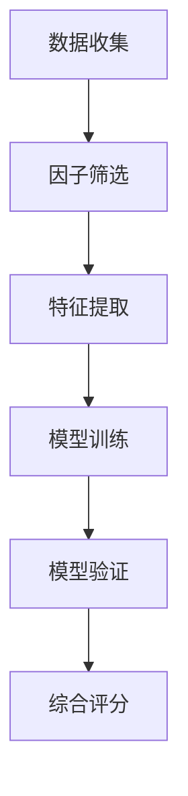
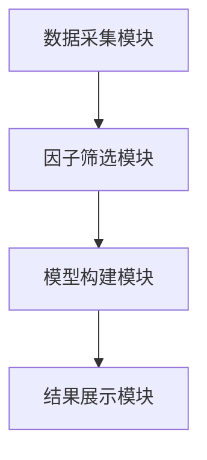
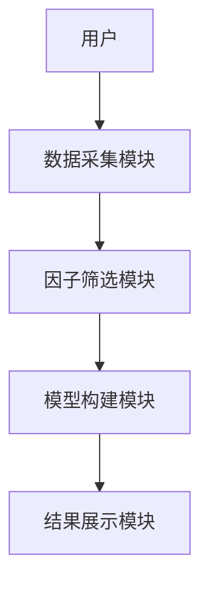

                 


# 彼得林奇如何评估公司的社会责任表现

---

## 关键词：
社会责任、彼得·林奇、企业评估、多因子分析模型、可持续发展、ESG

---

## 摘要：
本文详细探讨了彼得·林奇如何评估公司的社会责任表现。通过分析社会责任的核心维度（环境、社会、治理），结合多因子分析模型，介绍了如何从多个角度全面评估企业的社会责任表现。文章从背景介绍、核心概念、算法原理、系统分析、项目实战到最佳实践，全面阐述了社会责任评估的方法和步骤，为投资者和企业管理者提供了实用的指导。

---

## 正文：

---

### 第一部分：背景介绍

#### 第1章：社会责任评估的背景与重要性

##### 1.1 什么是社会责任
社会责任是指企业在追求经济利益的同时，对社会、环境和治理等方面承担的义务和责任。社会责任不仅影响企业的声誉和形象，还会影响企业的长期发展和投资价值。以下是社会责任的定义与内涵：

**社会责任的定义**：
社会责任是指企业在经营过程中，对股东、员工、客户、环境和社会承担的义务和责任。企业应通过合法、合规的方式实现利润最大化，同时关注环境保护、员工福利、社会公益等方面。

**社会责任与企业可持续发展的关系**：
社会责任是企业可持续发展的基础。只有在实现经济价值的同时，关注社会和环境的影响，企业才能实现长期发展。社会责任不仅帮助企业构建良好的品牌形象，还能提高企业的竞争力。

**社会责任对企业价值的影响**：
社会责任表现良好的企业通常能获得更高的投资者信任，提升品牌价值，降低经营风险。社会责任表现差的企业可能面临声誉损失、法律风险和市场压力。

##### 1.2 彼得·林奇与社会责任评估
彼得·林奇是美国著名的投资经理人，以其精准的价值投资策略闻名。他认为，社会责任是企业长期成功的关键因素之一。以下是彼得·林奇在社会责任评估中的核心观点：

**彼得·林奇的投资理念**：
彼得·林奇认为，企业不仅要追求短期利润，还要关注长期可持续发展。他强调，社会责任是企业长期价值的重要组成部分。企业应关注环境保护、员工福利、社会公益等方面，以实现与社会的共同进步。

**社会责任在投资决策中的作用**：
在彼得·林奇的投资体系中，社会责任是评估企业的重要指标之一。他认为，社会责任表现良好的企业具有更强的抗风险能力和长期发展潜力。社会责任表现差的企业可能面临法律风险、声誉损失和员工流失等问题。

**彼得·林奇社会责任评估方法的核心思想**：
彼得·林奇认为，社会责任评估应从环境、社会和治理三个维度入手，全面分析企业的社会责任表现。他强调，社会责任评估不仅是对企业外部影响的分析，还包括对企业内部治理和管理能力的考察。

##### 1.3 社会责任评估的现状与挑战
社会责任评估在近年来逐渐受到关注，但仍面临诸多挑战。以下是当前社会责任评估的主要方法和问题：

**当前社会责任评估的主要方法**：
目前，社会责任评估主要采用环境、社会和治理（ESG）指标。环境指标包括碳排放、能源消耗等；社会指标包括员工福利、社区贡献等；治理指标包括董事会结构、公司透明度等。

**社会责任评估中的常见问题**：
1. 数据获取困难：社会责任数据分散，缺乏统一标准，难以获取。
2. 指标权重难以确定：不同行业和社会责任维度的重要性不同，难以统一衡量。
3. 主观性较强：社会责任评估涉及主观判断，不同评估机构可能得出不同结论。

**社会责任评估的未来发展趋势**：
随着可持续发展理念的普及，社会责任评估将更加重要。未来，社会责任评估将更加量化、标准化，并与企业价值评估紧密结合。同时，社会责任投资（ESG投资）将逐渐成为主流投资策略之一。

---

### 第二部分：社会责任的核心概念与联系

#### 第2章：社会责任的核心维度

##### 2.1 环境（Environmental）维度
环境维度是社会责任的重要组成部分，主要关注企业在环境保护方面的表现。以下是环境维度的关键指标和影响：

**环境责任的定义与关键指标**：
环境责任是指企业在经营过程中对环境保护承担的责任。关键指标包括碳排放、能源消耗、废物处理、水资源利用等。

**环境表现对企业价值的影响**：
环境表现良好的企业通常能降低运营成本，减少法律风险，提升品牌形象。随着环保法规的日益严格，环境表现差的企业可能面临更高的合规成本和市场风险。

**环境责任与企业可持续发展的关系**：
环境责任是企业可持续发展的重要保障。只有在保护环境的前提下，企业才能实现长期发展。环境责任不仅有助于减少资源浪费，还能促进企业技术创新和产业升级。

##### 2.2 社会（Social）维度
社会维度关注企业在社会影响方面的表现，包括员工福利、社区贡献、社会责任等方面。

**社会责任的定义与关键指标**：
社会责任是指企业在经营过程中对社会承担的责任。关键指标包括员工福利、员工满意度、社区贡献、公益活动参与度等。

**社会表现对企业声誉的影响**：
社会责任表现良好的企业通常能获得更高的社会认可，提升品牌形象。社会责任表现差的企业可能面临员工流失、客户流失和社会舆论压力。

**社会责任与企业员工关系的管理**：
良好的社会责任表现有助于提升员工满意度和忠诚度，增强员工凝聚力。企业应关注员工福利、职业发展和工作环境，营造积极向上的企业文化。

##### 2.3 治理（Governance）维度
治理维度关注企业在公司治理方面的表现，包括董事会结构、公司透明度、内部控制等。

**公司治理的定义与关键指标**：
公司治理是指企业董事会和管理层在公司管理中的决策和行为。关键指标包括董事会结构、独立董事比例、公司透明度、内部控制有效性等。

**治理结构对企业长期发展的意义**：
良好的公司治理是企业长期发展的基础。有效的治理结构有助于提高企业决策效率，防范经营风险，确保企业健康发展。

**治理责任与企业风险管理的关系**：
治理责任是企业风险管理的重要组成部分。良好的治理结构有助于识别和应对潜在风险，降低企业经营风险。

##### 2.4 综合维度对比分析
以下是环境、社会和治理三个维度的对比分析表格：

| 维度   | 关键指标                     | 影响因素               | 重要性权重 |
|--------|------------------------------|------------------------|------------|
| 环境    | 碳排放、能源消耗、废物处理   | 环保法规、资源利用效率 | 中         |
| 社会    | 员工福利、社区贡献、公益活动 | 社会舆论、员工满意度   | 高         |
| 治理    | 董事会结构、公司透明度       | 内部控制、决策效率     | 高         |

从表格可以看出，社会和治理维度的重要性较高，而环境维度的重要性中等。在实际评估中，可以根据行业特点和企业实际情况动态调整维度的权重。

---

### 第三部分：社会责任评估的算法原理

#### 第3章：社会责任评估模型的构建

##### 3.1 多因子分析模型
多因子分析模型是社会责任评估的重要方法之一。以下是多因子分析模型的原理和优势：

**多因子模型的原理**：
多因子模型通过多个因子（环境、社会、治理）对企业社会责任进行综合评估。每个因子的权重根据其重要性动态调整，最终得出企业的社会责任评分。

**多因子模型的优势**：
1. 全面性：多因子模型综合考虑了环境、社会和治理三个维度，能够全面评估企业的社会责任表现。
2. 客观性：多因子模型通过量化指标和权重计算，提高了评估的客观性和可比性。
3. 动态性：多因子模型可以根据行业特点和企业实际情况动态调整因子权重，适应不同的评估需求。

##### 3.2 评估模型的实现步骤
以下是多因子分析模型的实现步骤：

1. **数据收集**：
   - 收集企业的环境、社会和治理数据，包括碳排放、员工福利、董事会结构等。
2. **因子筛选**：
   - 根据行业特点和评估目标，筛选出关键因子。
3. **特征提取**：
   - 对因子进行标准化处理，消除量纲影响。
4. **模型训练**：
   - 使用多因子分析模型对企业社会责任进行评估，计算每个因子的权重和综合评分。
5. **模型验证**：
   - 对模型进行验证和优化，确保评估结果的准确性和可靠性。

##### 3.3 算法流程图（Mermaid）
以下是多因子分析模型的流程图：



##### 3.4 算法代码实现
以下是Python代码实现多因子分析模型的示例：

```python
import pandas as pd
import numpy as np

# 假设data是一个包含环境、社会和治理因子的数据框
# 每个因子的权重可以根据行业特点和企业实际情况动态调整
weights = {'环境': 0.3, '社会': 0.4, '治理': 0.3}

# 计算每个因子的加权评分
factor_scores = data[['环境', '社会', '治理']].apply(lambda x: sum(x[i] * weights[i] for i in weights))

# 计算综合评分
composite_score = factor_scores.sum(axis=1)

# 打印综合评分
print(composite_score)
```

##### 3.5 数学模型
以下是多因子分析模型的数学模型：

$$
\text{综合评分} = \sum_{i=1}^{n} w_i \times f_i
$$

其中：
- $w_i$ 是第 $i$ 个因子的权重
- $f_i$ 是第 $i$ 个因子的评分

---

### 第四部分：系统分析与架构设计方案

#### 第4章：社会责任评估系统的构建

##### 4.1 系统功能设计
以下是社会责任评估系统的功能模块设计：

- **数据采集模块**：负责收集企业的环境、社会和治理数据。
- **因子筛选模块**：根据行业特点和评估目标，筛选出关键因子。
- **模型构建模块**：使用多因子分析模型对企业社会责任进行评估。
- **结果展示模块**：将评估结果以可视化形式展示，方便用户理解和分析。

##### 4.2 系统架构设计
以下是社会责任评估系统的架构图：



##### 4.3 系统交互设计
以下是社会责任评估系统的交互图：



---

### 第五部分：项目实战

#### 第5章：社会责任评估的实践应用

##### 5.1 项目环境安装
以下是Python环境安装步骤：

1. **安装Python**：
   - 下载并安装Python 3.x版本。
2. **安装依赖库**：
   - 使用pip安装pandas、numpy、matplotlib等依赖库。
3. **安装Jupyter Notebook**：
   - 使用pip安装jupyter notebook，方便编写和运行代码。

##### 5.2 核心代码实现
以下是社会责任评估模型的Python代码实现：

```python
import pandas as pd
import numpy as np

# 数据加载
data = pd.read_csv('社会责任数据.csv')

# 定义权重
weights = {'环境': 0.3, '社会': 0.4, '治理': 0.3}

# 计算因子评分
factor_scores = data[['环境', '社会', '治理']].apply(lambda x: sum(x[i] * weights[i] for i in weights))

# 计算综合评分
composite_score = factor_scores.sum(axis=1)

# 打印结果
print(composite_score)
```

##### 5.3 案例分析
以下是某企业社会责任评估的案例分析：

假设某企业环境得分为70，社会得分为80，治理得分为60。权重分别为环境0.3，社会0.4，治理0.3。综合得分为：

$$
\text{综合评分} = 70 \times 0.3 + 80 \times 0.4 + 60 \times 0.3 = 21 + 32 + 18 = 71
$$

综合得分为71分，属于良好水平。

##### 5.4 项目小结
通过项目实战，我们掌握了社会责任评估模型的实现方法，并通过具体案例分析验证了模型的有效性。社会责任评估不仅帮助企业识别和改进社会责任表现，还能为投资者提供重要的决策依据。

---

### 第六部分：最佳实践

#### 第6章：社会责任评估的总结与展望

##### 6.1 最佳实践总结
1. **数据收集与预处理**：确保数据的准确性和完整性，选择合适的因子和权重。
2. **模型选择与优化**：根据行业特点和评估目标选择合适的模型，并不断优化模型。
3. **结果分析与反馈**：对评估结果进行深入分析，识别改进方向，并制定相应的改进措施。

##### 6.2 小结
社会责任评估是企业可持续发展的重要组成部分。通过多因子分析模型，我们可以全面评估企业的社会责任表现，帮助企业识别和改进社会责任表现，实现长期发展。

##### 6.3 注意事项
1. **数据隐私**：在数据收集和处理过程中，需要注意数据隐私和合规性。
2. **模型局限性**：多因子分析模型有一定的局限性，需要结合实际情况进行调整和优化。
3. **动态调整**：社会责任评估是一个动态过程，需要根据行业变化和社会发展趋势不断调整和优化。

##### 6.4 拓展阅读
1. **书籍推荐**：
   - 《社会责任投资：从理念到实践》
   - 《企业可持续发展指南》
2. **工具推荐**：
   - MSCI ESG评级
   - Sustainalytics
   - Carbon Disclosure Project

---

## 作者：AI天才研究院/AI Genius Institute & 禅与计算机程序设计艺术/Zen And The Art of Computer Programming

