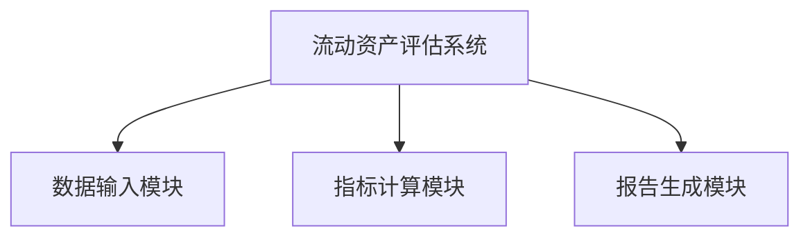

                 


# 彼得·林奇对公司流动资产效率的评估

> 关键词：流动资产，彼得·林奇，财务分析，效率评估，投资策略，现金流，流动资产周转率

> 摘要：流动资产是企业运营中的重要组成部分，其效率直接关系到企业的资金周转和盈利能力。本文通过彼得·林奇的视角，详细分析了流动资产的构成、评估方法及其对投资决策的影响。文章从理论基础、评估指标、实际案例分析、工具与技术、系统架构设计以及项目实战等方面展开，旨在帮助读者全面理解如何有效评估和优化公司流动资产效率。

---

## 第一部分: 引言

### 第1章: 流动资产效率评估的背景与重要性

#### 1.1 流动资产的基本概念

流动资产是企业资产中流动性最强的部分，主要包括现金及现金等价物、应收账款、存货和其他流动资产。它们在企业日常运营中起着至关重要的作用，直接关系到企业的资金周转能力和偿债能力。

**1.1.1 流动资产的定义与组成**

- **现金及现金等价物**：包括库存现金、银行存款、短期投资等，是企业最直接的流动性资金来源。
- **应收账款**：企业因赊销产品或服务而产生的未收回款项，是流动资产的重要组成部分。
- **存货**：企业在生产经营过程中持有的原材料、在制品和产成品，是流动资产中价值较高的部分。
- **其他流动资产**：如预付款项、应收票据等，也是流动资产的一部分。

**1.1.2 流动资产在企业运营中的作用**

流动资产是企业维持日常运营的基础，直接影响企业的资金链健康。高效的流动资产管理能够提高企业的资金周转效率，降低运营成本，并增强企业的市场竞争力。

**1.1.3 流动资产效率的重要性**

流动资产效率是指企业在一定时间内将流动资产转化为收入的能力。高效率的流动资产管理能够提升企业的盈利能力和抗风险能力，从而为企业创造更大的价值。

---

#### 1.2 彼得·林奇的投资理念

彼得·林奇是美国著名的投资经理人，以其对上市公司的深入研究和选股能力著称。他认为，流动资产效率是评估企业财务健康的重要指标，能够反映企业的运营能力和资金管理能力。

**1.2.1 彼得·林奇的投资者背景**

彼得·林奇是富达投资集团的创始人之一，曾管理着全球最大的共同基金——麦哲伦基金，取得了卓越的投资业绩。他强调，投资者需要深入分析企业的财务报表，尤其是流动资产部分，以评估企业的财务健康状况。

**1.2.2 林奇对流动资产效率的关注**

林奇认为，流动资产效率是衡量企业短期偿债能力和资金周转能力的重要指标。他常用流动资产周转率来评估企业的流动资产效率，认为周转率高的企业具有更强的市场竞争力和盈利能力。

**1.2.3 林奇的投资哲学与方法**

林奇的投资哲学强调深入研究企业的基本面，尤其是流动资产、流动负债和现金流等关键指标。他认为，只有通过全面分析企业的财务状况，才能做出明智的投资决策。

---

#### 1.3 本书的目的与结构

**1.3.1 本书的核心目标**

本文旨在通过彼得·林奇的视角，深入分析流动资产的构成、评估方法及其对投资决策的影响，帮助读者掌握流动资产效率评估的核心技能。

**1.3.2 本书的章节安排**

本文将从流动资产的理论基础、评估方法、实际案例分析、工具与技术、系统架构设计以及项目实战等方面展开，全面探讨流动资产效率评估的各个方面。

**1.3.3 如何阅读本书**

读者可以从引言开始，逐步了解流动资产的基本概念和彼得·林奇的投资理念。然后，通过理论基础和评估方法部分，掌握流动资产效率评估的核心技能。最后，结合实际案例和系统架构设计，提升实战能力。

---

## 第二部分: 流动资产效率评估的理论基础

### 第2章: 流动资产的构成与特性

#### 2.1 流动资产的主要组成部分

**2.1.1 现金及现金等价物**

现金及现金等价物是流动资产中流动性最强的部分，包括库存现金、银行存款和短期投资等。它们是企业应对突发事件和支付日常开支的重要保障。

**2.1.2 应收账款**

应收账款是企业因赊销产品或服务而产生的未收回款项，是流动资产的重要组成部分。应收账款的管理直接影响企业的资金周转效率。

**2.1.3 存货**

存货是企业在生产经营过程中持有的原材料、在制品和产成品。存货管理是流动资产管理的重要环节，直接关系到企业的生产成本和资金占用。

**2.1.4 其他流动资产**

其他流动资产包括预付款项、应收票据等，虽然价值相对较小，但也是流动资产的重要组成部分。

---

#### 2.2 流动资产的周转特性

**2.2.1 流动资产的周转速度**

流动资产的周转速度是指流动资产在一定时间内转化为销售收入的能力。周转速度越快，企业的资金利用效率越高。

**2.2.2 流动资产的流动性与收益性**

流动资产的流动性是指其转化为现金的能力，而收益性则是指其为企业创造收益的能力。两者之间的平衡是流动资产管理的核心。

**2.2.3 流动资产的风险与控制**

流动资产的风险主要来自于其流动性高但收益不稳定的特点。企业需要通过合理的库存管理和应收账款催收等手段，降低流动资产的风险。

---

## 第三部分: 流动资产效率评估的核心指标

### 第3章: 流动资产周转率

#### 3.1 流动资产周转率的定义与计算

**3.1.1 流动资产周转率的定义**

流动资产周转率是衡量流动资产在一定时间内转化为销售收入的能力，是流动资产效率的核心指标之一。

**3.1.2 流动资产周转率的计算公式**

$$ \text{流动资产周转率} = \frac{\text{营业收入}}{\text{流动资产平均余额}} $$

---

#### 3.2 存货周转率

**3.2.1 存货周转率的定义**

存货周转率是衡量存货在一定时间内转化为销售收入的能力，是流动资产效率的重要指标之一。

**3.2.2 存货周转率的计算公式**

$$ \text{存货周转率} = \frac{\text{营业成本}}{\text{存货平均余额}} $$

---

#### 3.3 应收账款周转率

**3.3.1 应收账款周转率的定义**

应收账款周转率是衡量应收账款在一定时间内转化为现金的能力，是流动资产效率的重要指标之一。

**3.3.2 应收账款周转率的计算公式**

$$ \text{应收账款周转率} = \frac{\text{营业收入}}{\text{应收账款平均余额}} $$

---

## 第四部分: 实际案例分析

### 第4章: 彼得·林奇的流动资产评估方法

#### 4.1 XYZ公司的流动资产评估

以XYZ公司为例，分析其流动资产的构成和效率。首先，计算流动资产周转率：

$$ \text{流动资产周转率} = \frac{1000万元}{(500万元 + 600万元)/2} = \frac{1000}{550} \approx 1.818 $$

---

#### 4.2 案例分析与经验总结

通过分析XYZ公司的流动资产效率，总结出以下经验：

1. **提高流动资产周转率**：优化存货管理和应收账款回收，减少资金占用。
2. **关注流动资产结构**：保持合理的流动资产结构，避免存货或应收账款比例过高。
3. **加强现金流管理**：通过有效的现金流管理，提高企业的资金利用效率。

---

## 第五部分: 工具与技术

### 第5章: 流动资产效率评估的工具与技术

#### 5.1 财务分析工具

**5.1.1 Excel的使用**

在Excel中，可以通过公式和函数快速计算流动资产周转率等指标。

#### 5.2 系统架构设计

**5.2.1 系统模块设计**

使用Mermaid图展示系统模块关系：



---

## 第六部分: 项目实战

### 第6章: 流动资产效率评估的系统实现

#### 6.1 项目介绍

开发一个流动资产效率评估系统，帮助企业管理流动资产，提高资金周转效率。

#### 6.2 系统功能设计

**6.2.1 数据输入模块**

用户输入企业的流动资产数据，包括现金、应收账款、存货等。

#### 6.3 系统实现

**6.3.1 计算流动资产周转率**

```python
# 计算流动资产周转率
revenue = 1000  # 营业收入（万元）
avg_current_assets = (500 + 600) / 2  # 流动资产平均余额（万元）
current_assets_turnover = revenue / avg_current_assets
print(f"流动资产周转率: {current_assets_turnover}")
```

---

## 第七部分: 总结与展望

### 第7章: 总结与展望

#### 7.1 总结

通过本文的分析，读者可以掌握流动资产效率评估的核心指标和方法，了解彼得·林奇的投资理念，并能够通过实际案例和系统实现，提升流动资产管理水平。

#### 7.2 展望

未来，随着大数据和人工智能技术的发展，流动资产效率评估将更加智能化和精准化。投资者可以通过先进的技术手段，进一步优化流动资产管理，提升企业的整体竞争力。

---

## 作者信息

作者：AI天才研究院/AI Genius Institute & 禅与计算机程序设计艺术 /Zen And The Art of Computer Programming

