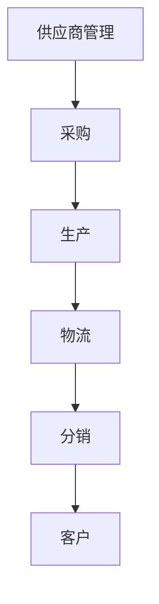

                 


# 彼得林奇对公司供应链垂直整合的评估

> 关键词：彼得·林奇，供应链，垂直整合，评估模型，投资策略，风险管理，效率优化

> 摘要：本文深入分析了彼得·林奇对公司供应链垂直整合的评估方法，探讨了垂直整合的定义、原理、优缺点，以及其对投资决策的影响。通过详细的案例分析和数学模型，本文为读者提供了如何在实际投资中评估和应用供应链垂直整合的策略。

---

## 第一部分: 供应链垂直整合的背景与概念

### 第1章: 供应链垂直整合的基本概念

#### 1.1 供应链垂直整合的定义

供应链垂直整合是指企业将供应链中的部分或全部环节（从原材料采购到产品设计、生产、分销、物流、售后等）整合到内部，以提高效率、降低成本并增强对供应链的控制力。与水平整合（通过合作或并购扩大规模）不同，垂直整合强调的是纵向一体化。

#### 1.2 供应链垂直整合的背景与问题背景

现代供应链管理的核心目标是提高效率、降低成本并确保供应链的稳定性。然而，许多企业在供应链管理中面临以下问题：
- 供应链环节分散，协调复杂
- 供应商不稳定，可能导致供应链中断
- 成本控制难度大，特别是在全球化背景下
- 缺乏对供应链的整体把控，难以应对突发事件

垂直整合通过将关键环节内部化，可以有效解决这些问题。

#### 1.3 供应链垂直整合的核心要素

垂直整合的核心要素包括：
- **战略目标**：企业需要明确整合的目的（如降低成本、提高效率、增强竞争力等）。
- **资源整合**：将供应链的各个环节整合到企业内部或通过战略合作实现。
- **风险管理**：降低供应链中断的风险，提高供应链的韧性。
- **成本与效率优化**：通过整合实现成本节约和效率提升。

---

### 第2章: 彼得·林奇的供应链垂直整合评估方法

#### 2.1 彼得·林奇的投资理念

彼得·林奇是全球著名投资专家，他强调基本面分析和对企业的深入研究。他认为，供应链垂直整合是企业提升竞争力和投资价值的重要手段。林奇特别关注企业的供应链管理能力，认为一个高效、稳定的供应链是企业长期成功的关键。

#### 2.2 供应链垂直整合的评估指标

彼得·林奇提出了以下评估供应链垂直整合的指标：
- **成本节约率**：整合后成本与整合前成本的比率。
- **供应链效率提升**：整合前后供应链的效率对比。
- **风险降低**：整合后供应链中断的风险是否降低。

#### 2.3 供应链垂直整合的评估模型

彼得·林奇的评估模型如下：

$$
\text{成本节约率} = \frac{\text{整合前成本} - \text{整合后成本}}{\text{整合前成本}} \times 100\%
$$

---

## 第二部分: 供应链垂直整合的核心概念与联系

### 第3章: 供应链垂直整合的核心原理

#### 3.1 垂直整合的原理分析

垂直整合的原理在于通过内部化关键环节，减少对外部供应商的依赖，从而提高效率、降低成本并增强企业的控制力。例如，企业可以将原材料采购、生产、物流等环节整合到内部，形成一个闭环的供应链。

#### 3.2 垂直整合的优缺点

| 优点                         | 缺点                         |
|------------------------------|------------------------------|
| 提高效率                     | 高昂的初始投资               |
| 降低成本                     | 运营复杂性增加               |
| 增强供应链稳定性             | 需要更多的资源投入           |

#### 3.3 垂直整合的数学模型

为了量化垂直整合的效果，可以使用以下公式：

$$
\text{总成本节约} = \text{整合前总成本} - \text{整合后总成本}
$$

---

## 第三部分: 系统分析与架构设计方案

### 第4章: 系统分析与架构设计

#### 4.1 问题场景介绍

假设一家制造企业希望对其供应链进行垂直整合，以降低生产成本并提高效率。我们可以通过以下步骤进行分析：
1. 确定需要整合的环节。
2. 设计整合后的供应链流程。
3. 评估整合后的成本和效率。

#### 4.2 系统功能设计

以下是整合后的供应链系统功能模块：



#### 4.3 系统架构设计

以下是整合后的供应链系统架构图：


---

## 第四部分: 项目实战

### 第5章: 项目实战

#### 5.1 项目背景

假设我们有一家制造企业XYZ公司，希望对其供应链进行垂直整合，以降低生产成本并提高效率。

#### 5.2 核心代码实现

以下是供应链垂直整合的Python代码实现：

```python
def calculate_cost_saving(pre_integration_cost, post_integration_cost):
    return (pre_integration_cost - post_integration_cost) / pre_integration_cost * 100

# 示例数据
pre_integration_cost = 100000
post_integration_cost = 80000

cost_saving = calculate_cost_saving(pre_integration_cost, post_integration_cost)
print(f"成本节约率为：{cost_saving}%")
```

#### 5.3 案例分析与结果解读

通过上述代码，我们计算出成本节约率为20%。这意味着整合后供应链的成本降低了20%，为企业带来了显著的成本节约。

---

## 第五部分: 最佳实践与总结

### 第6章: 最佳实践

#### 6.1 小结

供应链垂直整合是企业提高效率、降低成本并增强竞争力的重要手段。彼得·林奇的评估方法为我们提供了一个有效的工具，帮助我们更好地理解和应用供应链垂直整合。

#### 6.2 投资建议

投资者在评估企业供应链垂直整合时，应重点关注以下方面：
- 企业的整合目标是否明确。
- 整合后的成本节约率是否显著。
- 整合是否提高了供应链的效率和稳定性。

#### 6.3 注意事项

- 垂直整合需要大量的资源投入，需谨慎决策。
- 整合过程中可能面临风险，需制定应对策略。
- 垂直整合并非万能药，需根据企业实际情况选择合适的方式。

#### 6.4 拓展阅读

建议读者进一步阅读彼得·林奇的《投资最重要的事情》和迈克尔·波特的《竞争优势》。

---

## 作者信息

作者：AI天才研究院/AI Genius Institute & 禅与计算机程序设计艺术 /Zen And The Art of Computer Programming

