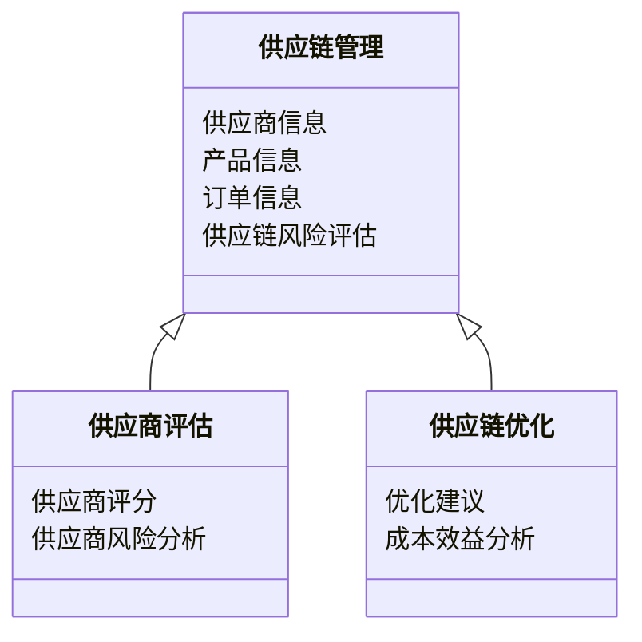
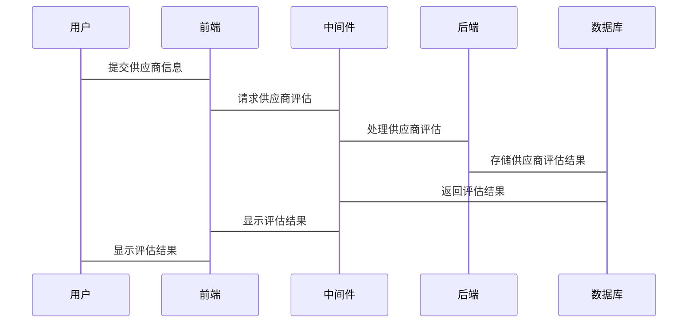

                 


---

# 彼得林奇对公司供应链多元化策略的效果评估

> 关键词：供应链多元化，彼得林奇，效果评估，投资策略，风险管理

> 摘要：本文通过分析彼得林奇的投资理念，探讨其对公司供应链多元化策略的效果评估方法。结合实际案例，从定性和定量两个方面详细阐述评估指标，并提供系统的架构设计和代码实现，帮助读者全面理解供应链多元化策略的实施与优化。

---

# 引言

在现代企业运营中，供应链管理的重要性不言而喻。供应链多元化策略作为一种降低风险、提高供应稳定性的手段，受到了广泛关注。本文以彼得林奇的投资理念为切入点，分析其对公司供应链多元化策略的效果评估方法，为企业管理者提供有价值的参考。

---

# 第一部分：供应链多元化策略的核心概念

## 第1章：供应链多元化策略的定义与背景

### 1.1 供应链多元化策略的定义

供应链多元化策略是指企业在供应链管理中采用多种供应商、多条生产线、多个生产地点等多元化方式，以降低单一供应风险，提高供应链的稳定性和响应能力。

### 1.2 供应链多元化策略的背景

随着全球化进程的加快，企业面临的市场环境日益复杂。单一的供应链结构容易受到市场波动、自然灾害等因素的影响，导致供应链中断，影响企业正常运营。因此，供应链多元化策略成为企业降低风险的重要手段。

### 1.3 彼得林奇与供应链多元化策略的关系

彼得林奇作为著名投资经理，其投资理念强调对企业的深入分析和长期价值的关注。他认为，一个企业的供应链多元化策略是其长期稳定发展的关键因素之一。通过对供应链多元化策略的评估，彼得林奇能够更好地判断企业的风险承受能力和市场竞争力。

---

## 第2章：供应链多元化策略的核心要素

### 2.1 供应商多元化

供应商多元化是指企业在选择供应商时，不依赖单一供应商，而是选择多个供应商，以分散供应风险。这包括供应商的地理位置、行业地位、生产能力等多个方面。

### 2.2 供应链的弹性与韧性

供应链的弹性是指在面对市场需求波动时，企业能够快速调整供应链结构，满足市场需求的能力。供应链的韧性是指在面对突发事件（如自然灾害、疫情等）时，企业能够迅速恢复供应的能力。

### 2.3 供应链的全球化布局

全球化布局是指企业在不同国家和地区建立供应链网络，以充分利用各地区的资源和成本优势。这不仅能够降低生产成本，还能够分散供应链风险。

---

## 第3章：供应链多元化策略与企业战略的关系

### 3.1 企业战略与供应链管理的整合

企业战略的制定需要考虑供应链管理的因素，供应链多元化策略是企业战略的重要组成部分。通过将供应链多元化策略与企业战略相结合，企业能够更好地应对市场变化和风险。

### 3.2 供应链多元化策略的实施步骤

1. **确定多元化目标**：根据企业战略和市场环境，确定供应链多元化的目标和范围。
2. **供应商选择与评估**：选择多个供应商，并对供应商的能力、可靠性等进行评估。
3. **供应链网络的构建与优化**：根据供应商分布和市场需求，构建和优化供应链网络。

---

# 第二部分：供应链多元化策略的效果评估方法

## 第4章：供应链多元化策略的定性评估方法

### 4.1 定性评估的核心指标

1. **供应链的稳定性**：评估供应链在面对突发事件时的稳定性和恢复能力。
2. **供应商的多样性**：评估供应商的数量、地理位置和行业分布的多样性。
3. **供应链的风险暴露程度**：评估供应链在不同市场环境下的风险暴露程度。

### 4.2 定性评估的案例分析

通过分析某企业的供应链多元化策略，评估其供应链的稳定性和风险暴露程度。例如，某企业通过在全球范围内选择多个供应商，降低了因某一地区供应链中断带来的风险。

---

## 第5章：供应链多元化策略的定量评估方法

### 5.1 定量评估的核心指标

1. **成本效益分析**：评估供应链多元化策略对企业成本和收益的影响。
2. **供应链效率**：评估供应链在多元化策略下的运作效率。
3. **风险量化指标**：通过数学模型量化供应链风险。

### 5.2 定量评估的数学模型

#### 5.2.1 供应链风险量化模型

$$
\text{风险值} = \sum_{i=1}^{n} w_i \times r_i
$$

其中，$w_i$ 是第 $i$ 个风险因素的权重，$r_i$ 是第 $i$ 个风险因素的风险值。

#### 5.2.2 供应链成本效益分析模型

$$
\text{成本效益比} = \frac{\text{总成本}}{\text{总收益}}
$$

---

## 第6章：彼得林奇的供应链多元化策略分析框架

### 6.1 彼得林奇的投资理念

彼得林奇强调长期投资和基本面分析，认为企业的供应链多元化策略是其长期稳定发展的关键因素之一。他通过分析企业的供应链结构和供应商关系，评估企业的风险承受能力和市场竞争力。

### 6.2 彼得林奇的分析模型

#### 6.2.1 供应商评估模型

$$
\text{供应商评分} = a \times \text{供应商能力} + b \times \text{供应商可靠性} + c \times \text{供应商成本}
$$

其中，$a$、$b$、$c$ 是不同因素的权重系数。

#### 6.2.2 供应链风险评估模型

$$
\text{风险等级} = \begin{cases}
1 & \text{低风险} \\
2 & \text{中风险} \\
3 & \text{高风险}
\end{cases}
$$

---

## 第7章：案例分析与实战应用

### 7.1 案例分析

以某制造企业为例，分析其供应链多元化策略的实施效果。通过定性和定量评估方法，评估其供应链的稳定性和成本效益。

### 7.2 实战应用

通过Python代码实现供应链多元化策略的评估模型，帮助读者理解和应用相关方法。

#### 7.2.1 环境配置

```python
import numpy as np
import pandas as pd
```

#### 7.2.2 核心代码实现

```python
def calculate_risk(supplier_scores):
    risk_scores = []
    for score in supplier_scores:
        if score < 0.6:
            risk_scores.append(3)
        elif 0.6 <= score < 0.8:
            risk_scores.append(2)
        else:
            risk_scores.append(1)
    return risk_scores

supplier_data = pd.DataFrame({
    '供应商A': [0.8, 0.7, 0.6],
    '供应商B': [0.75, 0.8, 0.7],
    '供应商C': [0.9, 0.85, 0.8]
})

risk_scores = calculate_risk(supplier_data.values)
print("风险等级：", risk_scores)
```

---

## 第8章：供应链多元化策略的系统分析与架构设计

### 8.1 系统功能设计

#### 8.1.1 领域模型（Mermaid类图）



#### 8.1.2 系统架构设计（Mermaid架构图）


#### 8.1.3 系统接口设计

1. 供应商信息接口
2. 产品信息接口
3. 订单信息接口
4. 风险评估接口
5. 成本效益分析接口

#### 8.1.4 系统交互设计（Mermaid序列图）



---

## 第9章：项目实战与总结

### 9.1 项目实战

通过具体的项目实战，展示如何应用上述方法和模型进行供应链多元化策略的评估。例如，选择一个实际企业，收集其供应商数据，应用Python代码进行风险评估和成本效益分析。

### 9.2 项目总结

总结供应链多元化策略的实施与优化的经验和教训，提出改进建议。

---

## 第10章：结论与展望

### 10.1 结论

供应链多元化策略是企业降低风险、提高竞争力的重要手段。通过彼得林奇的投资理念和分析方法，企业可以更好地评估和优化其供应链策略。

### 10.2 未来展望

未来，随着人工智能和大数据技术的发展，供应链多元化策略的评估将更加智能化和精准化。企业可以通过数据分析和预测模型，进一步优化其供应链管理。

---

# 作者：AI天才研究院/AI Genius Institute & 禅与计算机程序设计艺术 /Zen And The Art of Computer Programming

---

