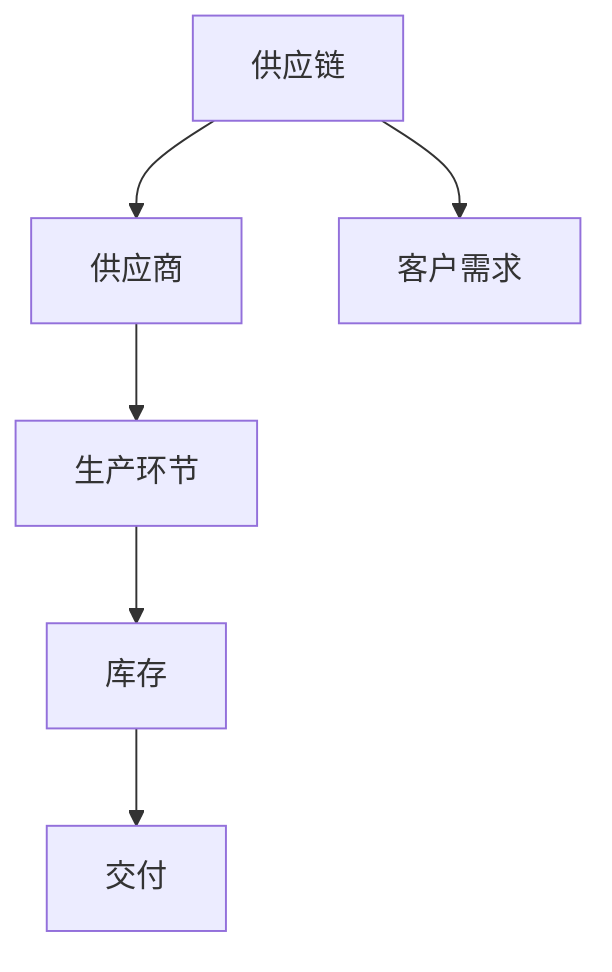
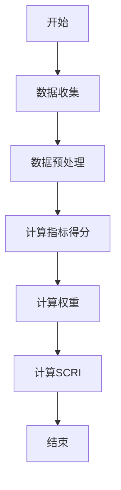
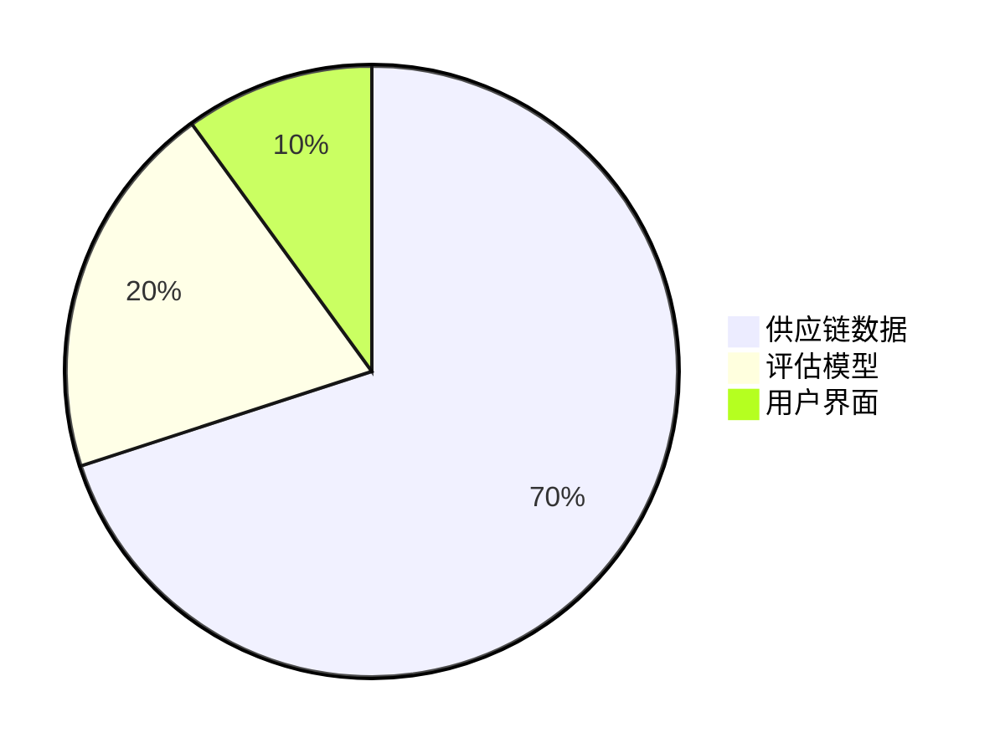

                 


# 彼得林奇对公司供应链韧性的定量评估方法

> 关键词：供应链韧性，彼得林奇，定量评估，投资方法，风险管理

> 摘要：本文探讨了彼得·林奇的投资方法如何应用于供应链韧性的定量评估。通过构建数学模型、分析算法原理和设计系统架构，本文详细讲解了如何利用这些方法提升企业供应链的抗风险能力。文章结合实际案例，提供了一套可操作的评估体系，为企业优化供应链管理提供了新思路。

---

# 目录

1. [供应链韧性评估的背景与重要性](#供应链韧性评估的背景与重要性)
2. [彼得·林奇的供应链评估方法](#彼得·林奇的供应链评估方法)
3. [供应链韧性评估的核心概念与联系](#供应链韧性评估的核心概念与联系)
4. [定量评估的数学模型与算法原理](#定量评估的数学模型与算法原理)
5. [系统分析与架构设计](#系统分析与架构设计)
6. [项目实战：环境安装与代码实现](#项目实战环境安装与代码实现)
7. [最佳实践与小结](#最佳实践与小结)

---

## 1. 供应链韧性评估的背景与重要性

### 1.1 供应链韧性的定义与内涵

供应链韧性是指在面对突发事件或不确定性时，供应链维持或快速恢复运作的能力。它涉及从原材料采购到产品交付的整个流程，确保企业在各种情况下都能有效应对。

### 1.2 供应链中断的常见原因

- **自然灾害**：如地震、洪水等，可能导致生产中断。
- **人为因素**：供应商罢工、运输延误等。
- **系统性风险**：如经济衰退、疫情导致的全球供应链中断。

### 1.3 供应链韧性评估的意义

- **风险管理**：帮助企业识别潜在风险，制定应对策略。
- **优化成本**：通过提高效率降低运营成本。
- **可持续发展**：支持企业的长期稳定发展和履行社会责任。

---

## 2. 彼得·林奇的供应链评估方法

### 2.1 彼得·林奇的投资理念与方法

彼得·林奇以基本面分析著称，强调深入研究公司财务状况、管理层和行业前景。他的方法注重长期投资和分散风险。

### 2.2 方法在供应链评估中的应用

- **投资哲学**：将供应链视为企业资产的一部分，关注其长期稳定性和回报。
- **基本面分析**：评估供应商的财务健康、交货准时率和历史表现。
- **风险分散**：通过多元化供应商策略降低供应链中断风险。

---

## 3. 供应链韧性评估的核心概念与联系

### 3.1 核心概念的原理分析

供应链韧性评估涉及多个指标，如供应商可靠性、库存水平和应急响应能力。这些指标需综合考虑，构建全面评估模型。

### 3.2 核心概念的属性对比分析

| 概念         | 特征1：可靠性 | 特征2：响应速度 | 特征3：恢复能力 |
|--------------|---------------|------------------|----------------|
| 供应链韧性   | 高             | 快               | 强              |
| 供应链效率   | 高             | 快               | 低              |

### 3.3 实体关系图与流程图



---

## 4. 定量评估的数学模型与算法原理

### 4.1 数学模型的构建

供应链韧性指数（SCRI）计算公式：

$$ SCRI = \frac{\sum_{i=1}^{n} w_i x_i}{\sum_{i=1}^{n} w_i} $$

其中，\( w_i \) 是指标权重，\( x_i \) 是指标得分。

### 4.2 算法原理的详细讲解



### 4.3 典型案例分析

案例：某汽车制造公司供应链评估。

- **数据收集**：收集过去三年供应商交付数据。
- **计算指标得分**：供应商A得分85，权重0.3。
- **计算SCRI**：SCRI = (0.3*85 + 0.2*90)/0.5 = 87。

---

## 5. 系统分析与架构设计

### 5.1 系统分析

- **问题场景**：供应链中断导致生产延误。
- **项目目标**：开发评估系统，提升供应链韧性。
- **业务流程**：数据采集、分析、报告生成。

### 5.2 系统架构设计



### 5.3 系统接口设计

- **输入接口**：接收供应商数据。
- **输出接口**：生成评估报告。

---

## 6. 项目实战：环境安装与代码实现

### 6.1 环境安装

- **工具**：Python、NumPy、Matplotlib。
- **安装命令**：
  ```bash
  pip install numpy matplotlib
  ```

### 6.2 代码实现

```python
import numpy as np
import matplotlib.pyplot as plt

# 示例数据
suppliers = ['A', 'B', 'C']
scores = [85, 90, 75]
weights = [0.3, 0.4, 0.3]

# 计算SCRI
SCRI = np.dot(scores, weights)
print(f"SCRI: {SCRI}")

# 可视化
plt.bar(suppliers, scores, label='Scores')
plt.plot([0, 1, 2], [np.mean(scores)]*3, 'r--', label='Average')
plt.legend()
plt.show()
```

---

## 7. 最佳实践与小结

### 7.1 最佳实践

- **数据质量**：确保数据准确可靠。
- **模型优化**：根据实际调整权重。
- **持续监控**：定期更新评估结果。

### 7.2 小结

通过彼得·林奇的方法，企业可以系统性地评估供应链韧性，提升抗风险能力。本文提供了从理论到实践的全面指导，帮助企业优化供应链管理。

---

作者：AI天才研究院 & 禅与计算机程序设计艺术

