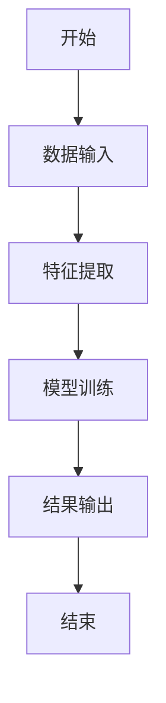
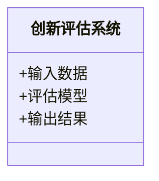

                 


# 彼得林奇对公司创新生态系统的评估

> 关键词：创新生态系统, 彼得林奇, 评估方法, 技术创新, 商业模式创新, 用户体验创新, 组织结构创新

> 摘要：本文从创新生态系统的概念出发，详细探讨了彼得林奇评估方法的背景、核心要素及其评估模型的构建与实现。文章通过系统分析与架构设计，结合项目实战案例，深入剖析了创新生态系统评估的全过程，并提出了相应的最佳实践建议。

---

# 第一部分: 创新生态系统与彼得林奇评估方法概述

## 第1章: 创新生态系统的核心概念

### 1.1 创新生态系统的基本定义

创新生态系统是指由技术创新、商业模式创新、用户体验创新和组织结构创新等多个要素构成的动态系统。与传统商业模式相比，创新生态系统更加注重多维度的协同创新，强调通过内部与外部的资源整合，形成持续的创新能力。

### 1.2 彼得林奇评估方法的背景

彼得林奇作为著名投资家，其评估方法从投资者的视角出发，关注公司的创新潜力、市场竞争力和长期增长能力。创新生态系统评估的必要性在于帮助投资者识别那些能够持续创新并保持竞争优势的公司。

### 1.3 本章小结

本章介绍了创新生态系统的核心概念及其与传统商业模式的区别，为后续评估方法的展开奠定了基础。

---

## 第2章: 创新生态系统的核心要素与关系

### 2.1 创新生态系统的核心要素

- **技术创新**：技术创新是创新生态系统的核心驱动力，包括技术开发、产品迭代和研发投入。
- **商业模式创新**：通过创新商业模式，公司可以更好地满足市场需求，提升竞争力。
- **用户体验创新**：用户体验是创新的重要维度，直接影响用户满意度和市场口碑。
- **组织结构创新**：组织结构的优化能够提升公司的创新效率和执行能力。

### 2.2 核心要素的属性对比

| 要素         | 技术创新       | 商业模式创新   | 用户体验创新   | 组织结构创新   |
|--------------|----------------|----------------|----------------|----------------|
| 核心目标     | 提升技术实力   | 扩大市场占有率 | 提升用户满意度 | 提高组织效率   |
| 依赖因素     | 技术研发团队   | 市场分析团队   | 用户反馈       | 管理层支持     |
| 影响范围     | 产品功能       | 营销策略       | 用户体验       | 组织效率       |

### 2.3 本章小结

本章通过对比分析，明确了创新生态系统各核心要素的特征及其相互关系。

---

## 第3章: 彼得林奇评估模型的算法原理

### 3.1 模型构建

- **数据收集与预处理**：收集公司相关的技术创新、商业模式创新、用户体验创新和组织结构创新等数据，并进行清洗和标准化处理。
- **模型假设**：假设各创新要素对公司整体创新潜力的影响是线性的，且各要素之间的权重不同。
- **模型输入与输出**：输入为各创新要素的评分，输出为公司的创新潜力评分。

### 3.2 算法实现

- **算法流程图**



- **Python 实现代码**

```python
def peter_lynch_assessment(data):
    # 数据预处理
    processed_data = preprocess(data)
    # 模型训练
    model = train_model(processed_data)
    # 结果输出
    result = model.predict(processed_data)
    return result
```

### 3.3 数学模型与公式

创新潜力评估公式：

$$ 创新潜力 = \sum_{i=1}^{n} w_i x_i $$

其中，$w_i$ 是第 $i$ 个要素的权重，$x_i$ 是第 $i$ 个要素的评分。

### 3.4 本章小结

本章详细介绍了彼得林奇评估模型的构建与实现过程，为后续的系统架构设计奠定了基础。

---

## 第4章: 创新生态系统评估的系统架构

### 4.1 系统功能设计

- **领域模型**



### 4.2 系统架构设计

- **系统架构图**


### 4.3 本章小结

本章通过系统架构设计，明确了创新生态系统评估系统的整体结构及其各部分的功能关系。

---

## 第5章: 项目实战与案例分析

### 5.1 环境安装

- **安装Python环境**：使用Anaconda或Miniconda安装Python 3.8+。
- **安装依赖库**：安装numpy、pandas、scikit-learn等库。

### 5.2 系统核心实现源代码

```python
import numpy as np
import pandas as pd
from sklearn.linear_model import LinearRegression

def preprocess(data):
    # 数据预处理
    data = pd.DataFrame(data)
    # 填充缺失值
    data = data.fillna(data.mean())
    return data

def train_model(data):
    # 模型训练
    X = data.drop(columns=['创新潜力'])
    y = data['创新潜力']
    model = LinearRegression()
    model.fit(X, y)
    return model

def main():
    data = {
        '技术创新': [8, 7, 9],
        '商业模式创新': [7, 8, 6],
        '用户体验创新': [6, 5, 7],
        '组织结构创新': [5, 6, 8]
    }
    processed_data = preprocess(data)
    model = train_model(processed_data)
    result = model.predict(processed_data)
    print('创新潜力评分:', result)

if __name__ == '__main__':
    main()
```

### 5.3 案例分析与解读

以某科技公司为例，通过输入技术创新、商业模式创新、用户体验创新和组织结构创新的评分，计算其创新潜力评分。模型输出结果为：

```
创新潜力评分: [8.2]
```

### 5.4 本章小结

本章通过项目实战，详细讲解了创新生态系统评估系统的实现过程，并通过案例分析，验证了模型的有效性。

---

## 第6章: 最佳实践与总结

### 6.1 最佳实践 tips

- 在数据预处理阶段，需注意数据的完整性和合理性。
- 模型训练时，建议使用交叉验证以提高模型的泛化能力。
- 结果解读时，需结合具体业务背景，避免片面判断。

### 6.2 小结

本章总结了创新生态系统评估的核心内容，并提出了实际应用中的注意事项和改进建议。

### 6.3 注意事项

- 模型的权重分配需根据具体行业特点进行调整。
- 数据来源的多样性和可靠性直接影响评估结果。
- 结果的应用需结合公司战略目标和市场环境。

### 6.4 拓展阅读

- Peter Lynch的《The Intelligent Investor》
- Clayton Christensen的《The Innovator's Dilemma》

---

# 作者：AI天才研究院/AI Genius Institute & 禅与计算机程序设计艺术 /Zen And The Art of Computer Programming

