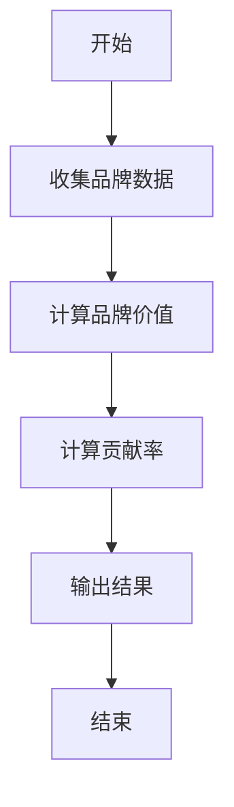
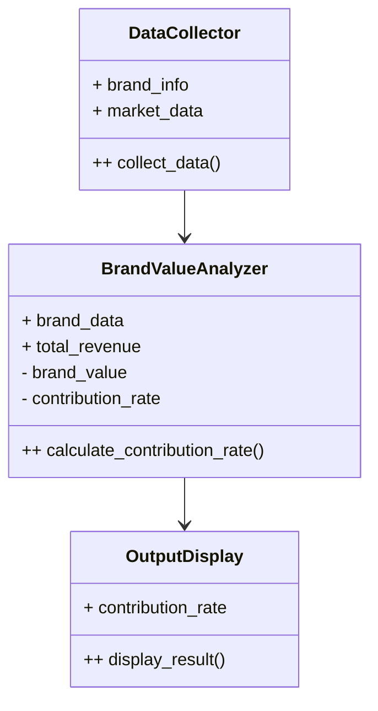
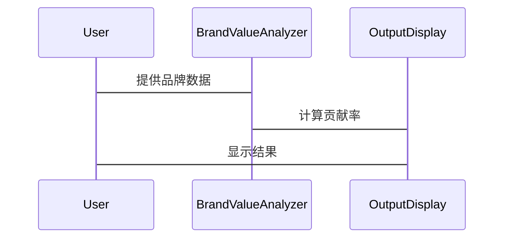

                 


```markdown
# 彼得林奇对公司品牌价值贡献率的分析

> 关键词：彼得林奇，品牌价值，贡献率，投资分析，数据分析

> 摘要：本文详细分析了彼得·林奇如何评估公司品牌价值对整体贡献率的影响。通过定义核心概念、构建数学模型、设计系统架构，结合实际案例，展示了如何量化品牌价值并计算贡献率，为投资决策提供科学依据。

---

## 第一部分: 背景介绍

### 第1章: 品牌价值与贡献率概述

#### 1.1 品牌价值的定义与重要性

- **1.1.1 品牌价值的定义**
  品牌价值是指品牌在市场中的认知度、忠诚度和影响力，反映了品牌在消费者心中的地位和价值。

- **1.1.2 品牌价值的重要性**
  品牌价值直接影响公司市场表现、客户忠诚度和长期盈利能力。高品牌价值意味着更强的市场竞争力。

- **1.1.3 品牌价值与公司整体价值的关系**
  品牌价值是公司整体价值的重要组成部分，特别是在市场竞争中，品牌价值决定了公司的溢价能力。

#### 1.2 贡献率的概念

- **1.2.1 贡献率的基本定义**
  贡献率衡量品牌对公司在市场竞争中的具体贡献，反映了品牌在公司收益中的作用。

- **1.2.2 贡献率在投资分析中的作用**
  在投资决策中，品牌贡献率帮助投资者评估品牌对整体收益的贡献，从而优化投资组合。

- **1.2.3 彼得林奇对贡献率的独特见解**
  彼得林奇强调品牌贡献率的重要性，认为高品牌价值的公司更能抵御市场波动，确保长期收益。

---

## 第二部分: 核心概念与联系

### 第2章: 品牌价值的核心要素

#### 2.1 品牌价值的核心要素

- **2.1.1 品牌知名度**
  品牌知名度是品牌被消费者认知和记忆的程度，直接影响市场进入能力和销售潜力。

- **2.1.2 品牌忠诚度**
  品牌忠诚度反映了消费者对品牌的偏好程度，高忠诚度意味着稳定的消费群体。

- **2.1.3 品牌认知度**
  品牌认知度是消费者对品牌属性、利益及价值的认知程度，影响品牌在市场中的定位和策略。

#### 2.2 品牌价值与贡献率的关系

- **2.2.1 品牌价值与贡献率的定义对比**
  品牌价值侧重于品牌在市场中的整体表现，而贡献率则关注品牌对公司的具体收益贡献。

- **2.2.2 影响贡献率的因素**
  包括品牌知名度、忠诚度、市场竞争状况和消费者行为等因素。

### 第3章: 品牌价值与贡献率的数学模型

#### 3.1 品牌价值的量化方法

- **3.1.1 品牌价值的评估指标**
  - 市场占有率
  - 品牌认知度
  - 客户忠诚度
  - 品牌联想度

- **3.1.2 品牌价值的评估公式**
  品牌价值可以通过加权评分法计算，权重基于各因素的重要性。

#### 3.2 贡献率的计算公式

- **3.2.1 贡献率的数学定义**
  贡献率 = （品牌价值的增量 / 总收益） × 100%

- **3.2.2 影响贡献率的因素**
  包括品牌在市场中的地位、竞争对手的策略、消费者偏好等。

---

## 第三部分: 算法原理与系统设计

### 第4章: 算法原理

#### 4.1 算法流程图



#### 4.2 代码实现

```python
def calculate_brand_value(brand_data):
    # 假设brand_data是品牌相关数据
    # 计算品牌价值
    return brand_value

def calculate_contribution_rate(brand_value, total_revenue):
    # 计算贡献率
    contribution_rate = (brand_value / total_revenue) * 100
    return contribution_rate

# 示例使用
brand_data = ...  # 输入品牌数据
total_revenue = ...  # 总收入
contribution_rate = calculate_contribution_rate(calculate_brand_value(brand_data), total_revenue)
print(f"品牌贡献率为：{contribution_rate}%")
```

### 第5章: 系统架构设计

#### 5.1 系统功能设计



#### 5.2 系统交互流程



---

## 第四部分: 项目实战

### 第6章: 项目实战

#### 6.1 环境安装与配置

- **安装Python环境**
- **安装必要的库**（如pandas, numpy）

#### 6.2 核心代码实现

```python
import pandas as pd
import numpy as np

def calculate_contribution_rate(brand_value, revenue):
    return (brand_value / revenue) * 100

# 示例数据
data = {
    '品牌': ['A', 'B', 'C'],
    '品牌价值': [100, 150, 200],
    '收入': [500, 600, 700]
}

df = pd.DataFrame(data)

# 计算贡献率
df['贡献率'] = df.apply(lambda x: calculate_contribution_rate(x['品牌价值'], x['收入']), axis=1)

print(df)
```

#### 6.3 实际案例分析

- **案例背景**
  某公司品牌价值为200万元，总收入为1000万元。
- **数据分析**
  贡献率 = (200 / 1000) * 100 = 20%
- **结论**
  该品牌贡献率为20%，对公司整体收益贡献显著。

---

## 第五部分: 总结与展望

### 第7章: 总结

- **最佳实践**
  - 定期评估品牌价值和贡献率
  - 考虑市场变化和消费者行为
  - 使用科学的模型和工具进行分析

- **小结**
  彼得林奇的品牌贡献率分析为投资者提供了科学的决策依据，通过量化品牌价值，优化投资组合。

- **注意事项**
  - 数据准确性是关键
  - 模型需根据实际情况调整
  - 定期更新和优化分析

- **拓展阅读**
  - 《彼得林奇的投资艺术》
  - 品牌管理与价值评估

---

作者：AI天才研究院 & 禅与计算机程序设计艺术
```

