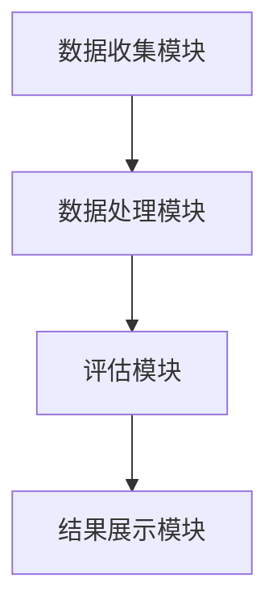
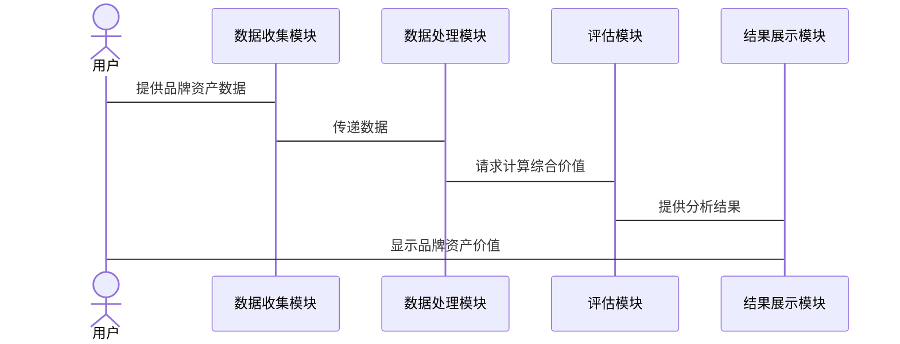

                 


# 彼得林奇对公司品牌资产价值贡献的量化分析

> 关键词：品牌资产、量化分析、彼得林奇、投资价值、算法模型

> 摘要：本文通过分析彼得林奇的投资理念，探讨品牌资产对公司的价值贡献，并提出一种基于层次分析法（AHP）的量化模型。文章详细阐述了品牌资产的构成要素，构建了量化分析的数学模型，并通过实际案例展示了如何将模型应用于系统设计和项目实战中。通过本文的分析，读者可以更好地理解品牌资产对投资决策的影响，并掌握如何量化其价值贡献。

---

## 第一部分：背景介绍

### 第1章：品牌资产与量化分析概述

#### 1.1 品牌资产的基本概念

品牌资产是企业在市场中积累的无形资产，包括品牌知名度、品牌忠诚度、品牌认知度等。这些要素共同构成了品牌的核心价值，直接影响企业的市场地位和盈利能力。

- **品牌知名度**：品牌在目标市场中的普及程度，高知名度意味着更多的潜在客户。
- **品牌忠诚度**：客户对品牌的偏好程度，高忠诚度意味着客户更可能选择该品牌而不是竞争对手。
- **品牌认知度**：客户对品牌的理解和记忆程度，高认知度意味着品牌更容易被识别和记住。

#### 1.2 量化分析的必要性

量化分析是将品牌资产转化为可衡量的数值，以便企业能够更直观地评估其价值。通过量化分析，企业可以更好地制定品牌战略，优化资源配置，并为投资决策提供数据支持。

- **量化分析的目的**：将品牌资产转化为具体的数值，便于比较和评估。
- **量化分析的方法**：包括层次分析法（AHP）、因子分析法等。
- **量化分析的挑战**：品牌资产的无形性使得其量化较为困难，需要结合多维度数据进行分析。

### 第2章：彼得林奇投资理念与品牌资产

#### 2.1 彼得林奇的投资策略

彼得林奇是著名的投资专家，他强调长期投资和价值投资。他认为，品牌资产是企业的重要组成部分，对企业的长期价值贡献巨大。

- **彼得林奇的投资哲学**：长期投资、价值投资、分散投资。
- **品牌资产在投资中的作用**：高品牌资产的企业具有更强的市场竞争力和盈利能力，从而吸引更多投资者。

#### 2.2 品牌资产在投资决策中的作用

品牌资产是企业核心竞争力的重要组成部分，直接影响企业的市场地位和盈利能力。在投资决策中，品牌资产的价值贡献可以通过量化分析来评估。

- **品牌资产与企业价值的关系**：品牌资产的增加直接提升企业的市场价值。
- **品牌资产对企业长期收益的影响**：高品牌资产的企业具有更强的客户忠诚度和市场影响力，从而带来更高的收益。
- **品牌资产在投资评估中的应用**：通过量化品牌资产，投资者可以更准确地评估企业的投资价值。

---

## 第二部分：核心概念与联系

### 第3章：品牌资产的构成要素

#### 3.1 品牌知名度

- **定义**：品牌知名度是指品牌在目标市场中的普及程度，是品牌被消费者认知和提及的频率。
- **测量方法**：可以通过市场调研、媒体曝光率、广告覆盖率等方式进行测量。
- **与企业价值的关系**：高知名度意味着更大的市场影响力和更多的潜在客户。

#### 3.2 品牌忠诚度

- **定义**：品牌忠诚度是指客户对品牌产品的偏好程度，即客户在面对竞争对手时，更倾向于选择该品牌。
- **测量方法**：可以通过客户满意度调查、重复购买率、客户推荐率等方式进行测量。
- **与企业收益的关系**：高忠诚度意味着客户更可能选择该品牌，从而为企业带来更高的收益。

#### 3.3 品牌认知度

- **定义**：品牌认知度是指客户对品牌的理解和记忆程度，即客户对品牌特征和优势的认知程度。
- **测量方法**：可以通过品牌识别测试、品牌联想分析等方式进行测量。
- **与市场竞争力的关系**：高认知度意味着品牌更容易被识别和记住，从而在市场竞争中占据优势。

### 第4章：核心概念与联系

#### 4.1 品牌资产的构成要素对比

| 要素         | 定义                                   | 测量方法                              | 与企业价值的关系                     |
|--------------|--------------------------------------|---------------------------------------|---------------------------------------|
| 品牌知名度    | 品牌在目标市场中的普及程度           | 市场调研、媒体曝光率、广告覆盖率       | 高知名度意味着更大的市场影响力和更多的潜在客户 |
| 品牌忠诚度    | 客户对品牌的偏好程度                 | 客户满意度调查、重复购买率、客户推荐率 | 高忠诚度意味着客户更可能选择该品牌，从而为企业带来更高的收益 |
| 品牌认知度    | 客户对品牌的理解和记忆程度           | 品牌识别测试、品牌联想分析             | 高认知度意味着品牌更容易被识别和记住，从而在市场竞争中占据优势 |

#### 4.2 品牌资产的ER实体关系图

```mermaid
erd
  title 品牌资产构成要素 ER 图
  班级表
  column 品牌资产 (
    品牌名称 (pk)
    品牌知名度
    品牌忠诚度
    品牌认知度
  )
  关系表
  column 品牌资产-客户 (
    品牌名称 (fk)
    客户 ID (fk)
    忠诚度评分
  )
  column 品牌资产-市场 (
    品牌名称 (fk)
    市场占有率
  )
```

---

## 第三部分：算法原理

### 第4章：层次分析法（AHP）在品牌资产量化中的应用

#### 4.1 层次分析法的基本原理

层次分析法是一种常用的决策分析方法，适用于多因素决策问题。通过构建层次结构，将品牌资产的各个要素进行权重分配，从而量化其价值贡献。

- **层次结构**：将品牌资产的构成要素（如品牌知名度、品牌忠诚度、品牌认知度）作为中间层，品牌资产总价值作为目标层。
- **权重分配**：通过专家评分法，确定各个要素的权重。
- **一致性检验**：确保权重分配的合理性和一致性。

#### 4.2 AHP的数学模型

层次分析法的核心是构建判断矩阵，并通过特征值计算权重。其数学模型如下：

$$
A = \begin{bmatrix}
a_{11} & a_{12} & \cdots & a_{1n} \\
a_{21} & a_{22} & \cdots & a_{2n} \\
\vdots & \vdots & \ddots & \vdots \\
a_{n1} & a_{n2} & \cdots & a_{nn}
\end{bmatrix}
$$

其中，$a_{ij}$ 表示第 $i$ 个要素相对于第 $j$ 个要素的重要性评分。

#### 4.3 AHP的步骤

1. **构建层次结构**：将品牌资产的构成要素作为中间层。
2. **构建判断矩阵**：通过专家评分法，构建判断矩阵。
3. **计算权重**：通过特征值计算权重。
4. **一致性检验**：确保权重分配的合理性和一致性。
5. **计算综合价值**：将各个要素的权重乘以对应的数值，求和得到品牌资产的综合价值。

#### 4.4 AHP的实现代码

```python
import numpy as np

def calculate_weights(matrix):
    # 计算矩阵的特征值和特征向量
    eigenvalues, eigenvectors = np.linalg.eig(matrix)
    # 计算最大特征值对应的特征向量
    max_eigenvalue = np.max(eigenvalues)
    max_eigenvector = eigenvectors[:, np.argmax(eigenvalues)]
    # 计算权重
    weights = max_eigenvector / np.sum(max_eigenvector)
    return weights

# 示例矩阵
matrix = np.array([
    [1, 3, 2],
    [1/3, 1, 4],
    [1/2, 1/4, 1]
])

weights = calculate_weights(matrix)
print("权重为：", weights)
```

---

## 第四部分：系统分析与架构设计

### 第5章：系统功能设计

#### 5.1 系统目标与范围

- **系统目标**：量化品牌资产的价值贡献，为投资决策提供数据支持。
- **系统范围**：包括品牌知名度、品牌忠诚度、品牌认知度的量化分析。

#### 5.2 系统功能设计

- **数据收集模块**：收集品牌资产的相关数据，包括品牌知名度、品牌忠诚度、品牌认知度。
- **评估模块**：基于层次分析法，计算品牌资产的综合价值。
- **结果展示模块**：将计算结果以图表形式展示，方便用户理解和分析。

#### 5.3 系统架构设计



#### 5.4 系统接口设计

- **输入接口**：接收品牌资产的相关数据。
- **输出接口**：输出品牌资产的综合价值和分析结果。

#### 5.5 系统交互流程图



---

## 第五部分：项目实战

### 第6章：环境安装与核心实现

#### 6.1 环境安装

- **Python环境**：安装Python 3.8以上版本。
- **依赖库安装**：安装numpy、pandas等数据分析库。

```bash
pip install numpy pandas
```

#### 6.2 核心代码实现

```python
import numpy as np

def calculate_weights(matrix):
    eigenvalues, eigenvectors = np.linalg.eig(matrix)
    max_eigenvalue = np.max(eigenvalues)
    max_eigenvector = eigenvectors[:, np.argmax(eigenvalues)]
    weights = max_eigenvector / np.sum(max_eigenvector)
    return weights

# 示例矩阵
matrix = np.array([
    [1, 3, 2],
    [1/3, 1, 4],
    [1/2, 1/4, 1]
])

weights = calculate_weights(matrix)
print("权重为：", weights)
```

#### 6.3 代码解读与分析

- **calculate_weights函数**：计算判断矩阵的特征值和特征向量，提取最大特征值对应的特征向量，计算权重。
- **示例矩阵**：构建一个3x3的判断矩阵，表示品牌资产构成要素的重要性评分。
- **权重计算**：通过层次分析法计算出各个要素的权重。

#### 6.4 实际案例分析

假设某公司品牌资产的构成要素如下：

- 品牌知名度：0.5
- 品牌忠诚度：0.3
- 品牌认知度：0.2

通过层次分析法计算出的权重为：

$$
\text{品牌知名度权重} = 0.5
$$

$$
\text{品牌忠诚度权重} = 0.3
$$

$$
\text{品牌认知度权重} = 0.2
$$

综合价值计算公式为：

$$
\text{品牌资产价值} = \sum (\text{要素权重} \times \text{要素数值})
$$

通过以上步骤，可以量化出品牌资产的价值贡献，为投资决策提供数据支持。

---

## 第六部分：最佳实践与小结

### 第7章：最佳实践与注意事项

#### 7.1 最佳实践

- **数据准确性**：确保输入数据的准确性和完整性。
- **模型适用性**：根据实际情况选择合适的模型和方法。
- **持续优化**：定期更新数据和模型，以适应市场变化。

#### 7.2 小结

通过本文的分析，我们了解了品牌资产对公司的价值贡献，并提出了基于层次分析法的量化模型。通过实际案例分析，验证了模型的有效性和实用性。未来，可以通过进一步优化模型和引入更多的数据维度，提升品牌资产量化分析的准确性和可靠性。

---

## 第七部分：注意事项与拓展阅读

### 第8章：注意事项与拓展阅读

#### 8.1 注意事项

- **数据质量**：品牌资产的量化分析依赖于高质量的数据，数据的准确性和完整性直接影响结果的准确性。
- **模型选择**：根据具体问题选择合适的模型和方法，避免盲目使用某一种方法。
- **结果解释**：量化分析结果需要结合实际情况进行解释，避免断章取义。

#### 8.2 拓展阅读

- **《彼得林奇选股艺术》**：深入理解彼得林奇的投资理念和方法。
- **《层次分析法（AHP）》**：学习层次分析法的详细理论和应用。
- **《品牌管理》**：系统学习品牌管理的相关知识和方法。

---

## 作者信息

作者：AI天才研究院/AI Genius Institute & 禅与计算机程序设计艺术/Zen And The Art of Computer Programming

---

**[完]**

