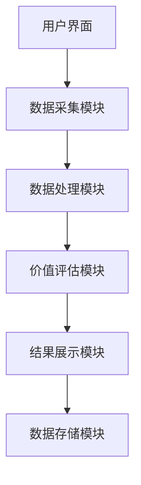

                 


# 彼得林奇对公司品牌资产价值随时间变化的追踪研究

> 关键词：彼得林奇，品牌资产，价值评估，追踪研究，投资策略

> 摘要：本文深入探讨了彼得林奇如何通过追踪研究公司品牌资产价值随时间的变化来评估企业长期投资价值。文章首先介绍品牌资产的基本概念和其对企业发展的重要性，然后分析彼得林奇的投资理念和方法。接着，详细阐述品牌资产价值评估的核心概念、算法原理、系统设计以及实际案例分析，最后总结最佳实践和未来研究方向。

---

## 第1章: 背景介绍

### 1.1 品牌资产的定义与重要性

品牌资产是企业的重要无形资产，指品牌为企业带来的额外价值，包括品牌知名度、客户忠诚度、品牌声誉等。这些因素能够直接影响企业的市场地位、盈利能力以及抗风险能力。品牌资产的核心在于其能够在长期为企业创造价值，而不仅仅是短期的财务表现。

### 1.2 彼得林奇的研究背景与方法

彼得林奇是全球著名投资经理人，以其长期投资策略和深入的价值挖掘著称。他在评估企业时，非常注重品牌资产的价值，认为品牌资产是决定企业长期盈利能力的关键因素之一。彼得林奇的方法强调对品牌资产的动态追踪，即通过长期观察品牌资产的变化，评估其对企业价值的影响。

---

## 第2章: 品牌资产的核心概念与联系

### 2.1 品牌资产的构成要素

品牌资产由多个要素构成，包括：

1. **品牌知名度**：品牌在市场上的认知度和曝光度。
2. **品牌忠诚度**：客户对品牌的忠诚程度。
3. **品牌声誉**：品牌的市场形象和客户信任度。
4. **品牌影响力**：品牌在市场中的影响力和号召力。

### 2.2 品牌资产与企业价值的关系

品牌资产通过影响企业的市场地位、客户基础和盈利能力，最终影响企业的整体价值。具体表现在：

- **市场地位**：强大的品牌资产能够帮助企业在市场竞争中占据优势。
- **客户忠诚度**：高品牌忠诚度意味着客户更愿意选择该品牌的产品或服务，从而提高企业的收入和利润。
- **抗风险能力**：品牌资产能够增强企业在市场波动中的抗风险能力。

---

## 第3章: 品牌资产价值追踪的算法原理

### 3.1 品牌价值评估的数学模型

品牌价值评估需要结合定量和定性分析，常用的方法包括：

1. **财务指标分析**：通过ROE（股东权益回报率）、ROA（资产回报率）等指标评估品牌带来的财务回报。
2. **市场表现分析**：通过股票价格波动、市场份额变化等指标评估品牌资产的市场表现。

#### 示例公式：
- **ROE（股东权益回报率）**：
  $$ROE = \frac{\text{净利润}}{\text{股东权益}}$$

- **市场份额变化**：
  $$\text{市场份额} = \frac{\text{销售额}}{\text{市场总销售额}}$$

### 3.2 算法实现与流程图

以下是一个简单的品牌价值评估流程图，展示从数据收集到最终评估的全过程：

```mermaid
graph TD
    A[开始] -> B[数据收集]
    B -> C[数据预处理]
    C -> D[选择评估方法]
    D -> E[计算品牌价值]
    E -> F[结果分析]
    F -> G[结束]
```

---

## 第4章: 系统分析与架构设计

### 4.1 系统功能设计

设计一个品牌价值追踪系统，需要考虑以下功能模块：

1. **数据采集模块**：收集品牌相关的财务数据、市场数据等。
2. **数据处理模块**：对收集到的数据进行清洗和预处理。
3. **价值评估模块**：基于算法模型计算品牌价值。
4. **结果展示模块**：将评估结果以图表形式展示。

### 4.2 系统架构设计

以下是系统的整体架构图：



---

## 第5章: 项目实战

### 5.1 项目环境安装与配置

为了实现品牌价值追踪，需要安装以下工具和库：

- **Python**：用于数据分析和编程。
- **Pandas** 和 **NumPy**：用于数据处理。
- **Matplotlib** 或 **Seaborn**：用于数据可视化。
- **Mermaid**：用于绘制流程图和架构图。

### 5.2 核心算法实现

以下是一个简单的品牌价值评估代码示例：

```python
import pandas as pd
import numpy as np
import matplotlib.pyplot as plt

# 示例数据：品牌A的财务数据
data = {
    'Revenue': [100, 120, 130, 140],
    'Net Profit': [20, 25, 30, 35],
    'Shareholder Equity': [50, 60, 70, 80]
}

df = pd.DataFrame(data)

# 计算ROE
df['ROE'] = df['Net Profit'] / df['Shareholder Equity']

print("ROE:", df['ROE'].mean())

# 可视化
plt.plot(df['Revenue'], label='Revenue')
plt.plot(df['Net Profit'], label='Net Profit')
plt.xlabel('Year')
plt.ylabel('Value')
plt.legend()
plt.show()
```

### 5.3 实际案例分析

以可口可乐为例，分析其品牌资产价值的变化：

1. **数据收集**：收集可口可乐过去5年的财务数据和市场数据。
2. **数据处理**：清洗数据，处理缺失值。
3. **价值评估**：使用ROE等指标评估品牌价值。
4. **结果分析**：观察品牌价值的变化趋势，发现其品牌资产逐年增长。

---

## 第6章: 最佳实践与总结

### 6.1 小结

品牌资产是企业长期价值的重要组成部分，彼得林奇的方法为我们提供了一个有效的追踪和评估工具。通过定量分析和定性分析相结合，可以更准确地评估品牌资产的价值。

### 6.2 注意事项

- 数据收集的准确性是关键，确保数据来源可靠。
- 在使用算法时，需结合企业的实际情况进行调整。
- 定期更新和优化评估模型，以适应市场变化。

### 6.3 拓展阅读

- 彼得林奇的《彼得林奇选股法则》
- 品牌价值评估的其他方法和工具

---

## 作者：AI天才研究院

本文由AI天才研究院撰写，转载请注明出处。

