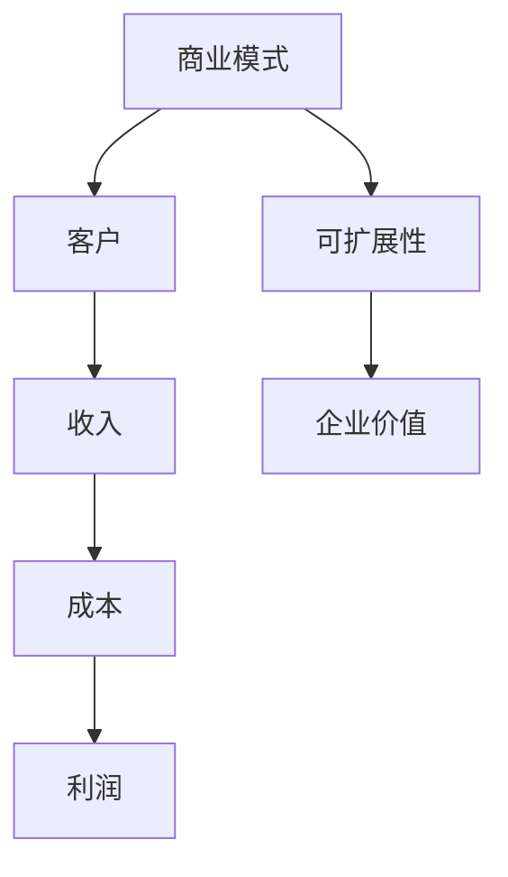
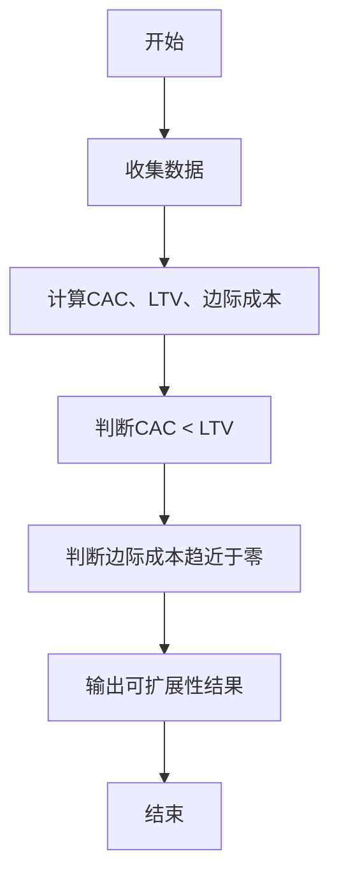

                 


# 彼得林奇对公司商业模式可扩展性的判断

## 关键词：彼得林奇、商业模式、可扩展性、投资策略、客户生命周期

## 摘要：本文探讨了彼得林奇在判断公司商业模式可扩展性方面的见解，分析了商业模式的可扩展性对投资决策的影响，并通过实例和模型展示了如何评估和优化商业模式的可扩展性。

---

## 第1章：背景介绍

### 1.1 问题背景与问题描述

商业模式的可扩展性是企业能否持续增长的关键因素。彼得林奇作为著名的基金经理，他的投资策略注重公司长期的可扩展性。本文将分析如何从商业模式的角度判断其可扩展性，进而评估企业的投资价值。

### 1.2 问题解决与边界外延

通过分析客户获取成本（CAC）、边际成本和市场容量，我们可以判断商业模式是否具备可扩展性。本文将探讨这些因素如何影响企业的增长潜力和投资价值。

### 1.3 核心要素与概念结构

商业模式的可扩展性涉及多个核心要素，包括客户获取成本、边际成本和市场容量。本文将通过案例分析彼得林奇的投资策略，展示这些要素如何影响企业的长期价值。

---

## 第2章：核心概念与联系

### 2.1 核心要素分析

客户获取成本（CAC）是衡量商业模式的重要指标。当CAC低于客户生命周期价值（LTV）时，企业能够实现可持续增长。边际成本的控制也是关键，低成本的边际收入增长是可扩展性的标志。

### 2.2 核心概念对比表格

以下表格对比了商业模式可扩展性的关键要素：

| 核心要素 | 定义 | 影响因素 | 关键指标 |
|----------|------|----------|----------|
| CAC      | 客户获取成本 | 营销费用、销售成本 | CAC < LTV |
| 边际成本 | 每新增一个客户的成本 | 规模效应、自动化程度 | 边际成本趋近于零 |
| 市场容量 | 行业市场规模 | 行业增长速度 | 市场容量是否足够大 |

### 2.3 ER实体关系图（Mermaid流程图）



---

## 第3章：算法原理与数学模型

### 3.1 算法原理

评估商业模式的可扩展性涉及数据收集、分析和判断。关键指标包括CAC、LTV和边际成本。算法步骤如下：

1. 收集数据：获取企业的CAC、LTV和边际成本。
2. 计算比率：CAC与LTV的比率，边际成本的趋势。
3. 判断可扩展性：CAC < LTV，边际成本趋近于零。

### 3.2 数学模型

商业模式可扩展性的数学模型如下：

$$ \text{可扩展性} = \text{CAC} < \text{LTV} \quad \text{且} \quad \text{边际成本趋近于零} $$

### 3.3 算法流程



### 3.4 Python代码实现

```python
def calculate_expandability(CAC, LTV, marginal_cost):
    if CAC < LTV and marginal_cost <= 0.01 * LTV:
        return "可扩展"
    else:
        return "不可扩展"

CAC = 100  # 示例数据
LTV = 200
marginal_cost = 5  # 单位：元

result = calculate_expandability(CAC, LTV, marginal_cost)
print(result)
```

---

## 第4章：系统分析与架构设计

### 4.1 系统功能设计

系统需实现以下功能：

1. 数据收集模块：收集企业的CAC、LTV和边际成本。
2. 数据分析模块：计算比率，判断可扩展性。
3. 报告生成模块：输出评估结果。

### 4.2 系统架构设计


### 4.3 系统交互设计


---

## 第5章：项目实战

### 5.1 环境配置

需要Python 3.8以上版本和必要的库（如pandas、numpy）。

### 5.2 核心代码实现

```python
import pandas as pd

def calculate_expandability(data):
    results = []
    for index, row in data.iterrows():
        CAC = row['CAC']
        LTV = row['LTV']
        marginal_cost = row['Marginal Cost']
        if CAC < LTV and marginal_cost <= 0.01 * LTV:
            results.append("可扩展")
        else:
            results.append("不可扩展")
    return pd.Series(results, index=data.index, name='Expandability')

data = pd.DataFrame({
    'CAC': [100, 150],
    'LTV': [200, 250],
    'Marginal Cost': [5, 10]
})

result = calculate_expandability(data)
print(result)
```

### 5.3 数据解读与分析

通过代码实现，我们可以判断企业在不同条件下的可扩展性。例如，当CAC=100，LTV=200，边际成本=5时，企业是可扩展的。

---

## 第6章：最佳实践与总结

### 6.1 评估关键点

- 关注CAC和LTV的比率。
- 分析边际成本的趋势。

### 6.2 注意事项

- 数据质量影响结果，确保数据准确。
- 结合行业背景进行分析，避免单一指标误导。

### 6.3 未来趋势

随着技术进步，数据驱动的可扩展性评估将更加精准，结合AI技术优化判断过程。

---

## 结论

彼得林奇的商业模式可扩展性判断为投资决策提供了重要依据。通过本文的分析和实例，读者可以掌握如何评估和优化商业模式的可扩展性，从而做出更明智的投资决策。

---

## 作者：AI天才研究院

---

