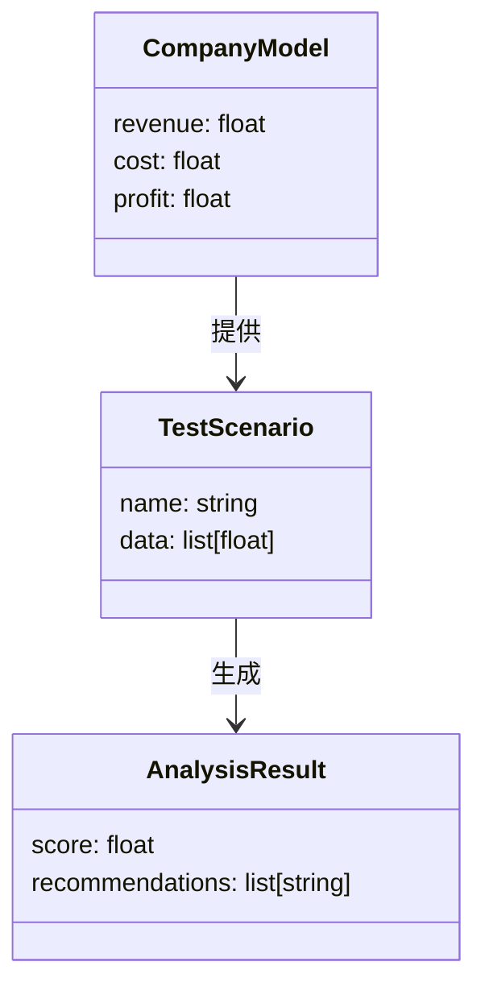
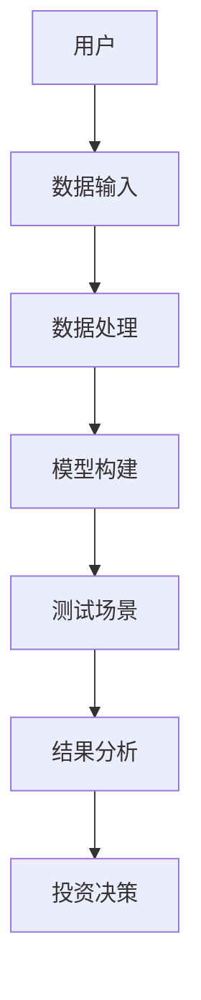

                 


# 彼得林奇对公司商业模式适应性的压力测试方法

---

## 关键词  
- 彼得林奇  
- 商业模式  
- 压力测试  
- 适应性分析  
- 投资策略  
- 风险管理  

---

## 摘要  
本文深入探讨了彼得林奇对公司商业模式适应性的压力测试方法，分析了其在投资决策中的应用价值。通过结合技术方法和实际案例，详细讲解了压力测试的核心概念、算法原理、系统设计与实现，以及在项目实战中的具体应用。文章最后总结了最佳实践，为读者提供了全面的指导。

---

## 第一部分: 背景介绍  

### 第1章: 公司商业模式适应性压力测试的背景与意义  

#### 1.1 什么是压力测试  
压力测试是一种评估系统、模型或策略在极端条件下的表现的方法。在商业领域，压力测试用于评估公司商业模式在市场波动、经济危机或其他极端情况下的适应性。  

- **1.1.1 压力测试的基本定义**  
  压力测试是一种通过模拟极端条件来评估系统或模型在压力下的表现和稳定性。  
- **1.1.2 压力测试的目的与作用**  
  压力测试的主要目的是发现潜在风险，评估系统的鲁棒性和韧性，从而为决策提供支持。  
- **1.1.3 压力测试的分类与特点**  
  压力测试可以分为静态测试和动态测试，静态测试基于历史数据，动态测试基于实时数据。  

#### 1.2 彼得林奇与公司商业模式适应性压力测试  
彼得林奇是著名的投资专家，他提出了许多创新的投资分析方法，其中公司商业模式适应性压力测试是其重要贡献之一。  

- **1.2.1 彼得林奇的背景与投资理念**  
  彼得林奇以其长期投资和价值投资理念闻名，他强调对公司基本面的深入分析。  
- **1.2.2 彼得林奇压力测试方法的提出**  
  彼得林奇提出，通过模拟极端市场条件，评估公司商业模式在压力下的适应能力。  
- **1.2.3 该方法在投资实践中的应用**  
  彼得林奇的方法被广泛应用于风险评估和投资决策中，帮助投资者识别潜在风险并优化投资组合。  

#### 1.3 压力测试在公司商业模式分析中的意义  
压力测试是评估公司商业模式在极端条件下的表现，帮助投资者制定更具前瞻性的策略。  

---

### 第2章: 公司商业模式适应性压力测试的核心概念  

#### 2.1 公司商业模式的定义与构成  
公司商业模式是描述企业如何创造价值、传递价值和获取价值的系统。  

- **2.1.1 公司商业模式的定义**  
  公司商业模式是企业实现盈利的核心路径。  
- **2.1.2 公司商业模式的构成要素**  
  包括客户、产品、渠道、成本、收入和资源等关键要素。  
- **2.1.3 公司商业模式的类型与特点**  
  包括产品型、服务型、平台型等不同类型的商业模式。  

#### 2.2 压力测试与公司商业模式适应性的关系  
压力测试通过模拟极端条件，评估公司商业模式在不同环境下的表现。  

- **2.2.1 压力测试在公司商业模式分析中的作用**  
  压力测试帮助发现商业模式的脆弱性，评估其在极端条件下的适应能力。  
- **2.2.2 公司商业模式适应性压力测试的核心目标**  
  通过模拟极端市场条件，评估商业模式的韧性和恢复能力。  
- **2.2.3 适应性压力测试与其他类型压力测试的对比**  
  适应性压力测试更关注商业模式的长期适应性，而非单纯的系统性能测试。  

---

### 第3章: 公司商业模式适应性压力测试的方法论  

#### 3.1 压力测试的基本步骤  
压力测试的实施通常包括以下步骤：  

- **3.1.1 确定测试目标**  
  明确压力测试的目标，例如评估收入稳定性或成本控制能力。  
- **3.1.2 设计测试场景**  
  根据公司商业模式的特点，设计极端市场条件下的测试场景。  
- **3.1.3 数据收集与分析**  
  收集历史数据和实时数据，分析公司在不同条件下的表现。  
- **3.1.4 结果评估与反馈**  
  根据测试结果，评估商业模式的适应性，并提出改进建议。  

#### 3.2 彼得林奇压力测试方法的独特性  
彼得林奇的压力测试方法结合了定量分析和定性分析，具有独特的优势。  

- **3.2.1 方法的核心思想**  
  彼得林奇强调通过模拟极端市场条件，评估公司商业模式的抗压能力。  
- **3.2.2 方法的具体步骤**  
  包括数据收集、模型构建、场景模拟和结果分析等步骤。  
- **3.2.3 方法的优缺点分析**  
  优点是方法简单易用，缺点是依赖历史数据，可能无法完全模拟极端情况。  

---

## 第二部分: 核心概念与联系  

### 第4章: 压力测试的原理与数学模型  

#### 4.1 压力测试的数学模型  
压力测试通常基于统计模型和概率论，常用的数学模型包括线性回归和蒙特卡洛模拟。  

- **4.1.1 线性回归模型**  
  线性回归模型用于分析变量之间的关系，适用于简单压力测试场景。  
- **4.1.2 蒙特卡洛模拟**  
  蒙特卡洛模拟是一种随机模拟方法，适用于复杂压力测试场景。  
- **4.1.3 时间序列分析**  
  时间序列分析用于预测公司商业模式在时间上的变化趋势。  

#### 4.2 公司商业模式适应性压力测试的数学公式  
以下是常用的数学公式：  

- **4.2.1 收入预测模型**  
  $$收入 = a \times 销量 + b \times 价格$$  
- **4.2.2 成本与收益的平衡模型**  
  $$利润 = 收入 - 成本$$  
- **4.2.3 风险评估公式**  
  $$风险系数 = \frac{标准差}{平均值}$$  

---

### 第5章: 核心概念对比与ER图分析  

#### 5.1 压力测试方法的对比分析  
以下是不同压力测试方法的对比表格：  

| 方法类型       | 优点                     | 缺点                     |
|----------------|--------------------------|--------------------------|
| 线性回归        | 简单易用                 | 仅适用于线性关系         |
| 蒙特卡洛模拟    | 适用于复杂场景           | 计算量大                 |
| 时间序列分析    | 适用于时间相关数据       | 需要大量历史数据         |

#### 5.2 公司商业模式与压力测试的ER图  
以下是公司商业模式与压力测试的ER图：  

```mermaid
erd
  公司
  ----> 股东: 所有者
  公司
  ----> 产品: 提供
  产品
  ----> 市场: 反映
  市场
  ----> 测试场景: 包含
  测试场景
  ----> 数据: 包含
  数据
  ----> 分析结果: 生成
  分析结果
  ----> 投资决策: 支持
```

---

## 第三部分: 算法原理  

### 第6章: 算法原理  

#### 6.1 算法原理概述  
压力测试算法的核心是通过模拟极端场景，评估公司商业模式的适应性。  

#### 6.2 算法步骤  
以下是压力测试算法的步骤：  

1. 收集历史数据和实时数据。  
2. 设计极端市场条件下的测试场景。  
3. 构建数学模型，模拟公司商业模式在不同场景下的表现。  
4. 分析测试结果，评估商业模式的适应性。  

#### 6.3 代码实现  
以下是Python代码示例：  

```python
import numpy as np
import pandas as pd

# 收集数据
data = pd.read_csv('company_data.csv')

# 设计测试场景
scenario = 'economic downturn'

# 模拟极端市场条件
data[scenario] = data['revenue'] * 0.5

# 分析结果
print(data[scenario].mean())
```

---

## 第四部分: 系统分析  

### 第7章: 系统分析与架构设计  

#### 7.1 应用场景介绍  
压力测试系统可用于评估公司商业模式在极端市场条件下的适应性。  

#### 7.2 系统功能设计  
以下是系统功能设计的领域模型类图：  



#### 7.3 系统架构设计  
以下是系统架构设计的mermaid图：  



---

## 第五部分: 项目实战  

### 第8章: 项目实战  

#### 8.1 环境安装  
需要安装Python、NumPy和Pandas库。  

#### 8.2 核心代码实现  
以下是核心代码实现：  

```python
import numpy as np
import pandas as pd

# 数据输入
data = pd.read_csv('company_data.csv')

# 数据处理
data['normalized_revenue'] = (data['revenue'] - data['revenue'].mean()) / data['revenue'].std()

# 模型构建
model = np.polyfit(data['revenue'], data['profit'], 1)

# 测试场景
scenario_data = data['revenue'] * 0.5

# 结果分析
print(f"预测的利润为: {model[0] * scenario_data + model[1]}")
```

#### 8.3 代码应用解读与分析  
上述代码通过线性回归模型，预测公司商业模式在极端市场条件下的利润表现。  

#### 8.4 实际案例分析  
以一家科技公司为例，分析其商业模式在经济衰退情况下的适应性。  

#### 8.5 详细讲解剖析  
通过对测试结果的分析，提出改进建议，优化公司商业模式。  

---

## 第六部分: 最佳实践  

### 第9章: 最佳实践  

#### 9.1 小结  
压力测试是评估公司商业模式适应性的有效方法，彼得林奇的方法具有重要的参考价值。  

#### 9.2 注意事项  
- 数据质量是压力测试的关键，需确保数据的准确性和完整性。  
- 测试场景的设计需结合公司实际情况，避免过于理想化。  
- 结果分析需结合行业背景，避免片面结论。  

#### 9.3 拓展阅读  
建议阅读彼得林奇的《投资最重要的事情》和《彼得林奇的选股标准》。  

---

## 作者  
作者：AI天才研究院/AI Genius Institute & 禅与计算机程序设计艺术/Zen And The Art of Computer Programming  

---

**文章标题**：彼得林奇对公司商业模式适应性的压力测试方法  

**摘要**：本文深入探讨了彼得林奇对公司商业模式适应性的压力测试方法，分析了其在投资决策中的应用价值。通过结合技术方法和实际案例，详细讲解了压力测试的核心概念、算法原理、系统设计与实现，以及在项目实战中的具体应用。文章最后总结了最佳实践，为读者提供了全面的指导。

