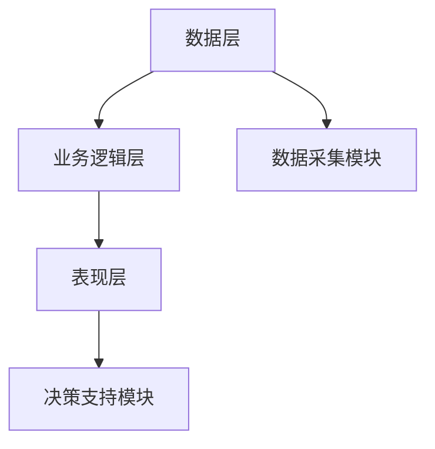
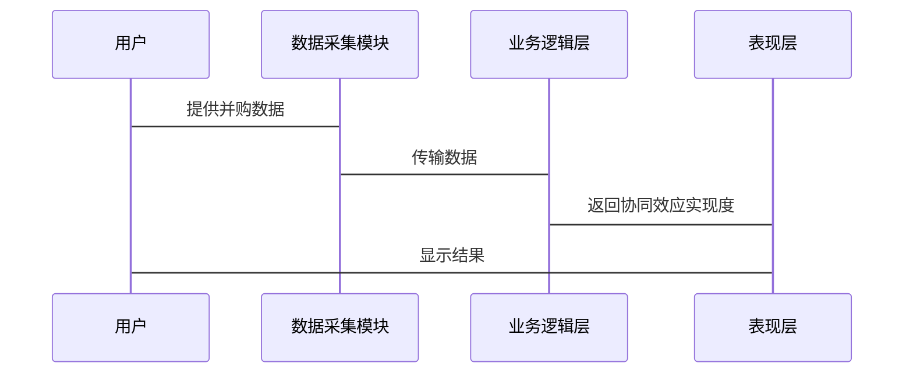

                 

# 彼得林奇对公司并购后协同效应实现度的长期跟踪研究

## 关键词
- 公司并购
- 协同效应
- 彼得·林奇
- 并购整合
- 企业战略

## 摘要
本文深入研究了彼得·林奇对公司并购后协同效应实现度的长期跟踪研究。通过分析协同效应的定义、类型、实现机制及影响因素，结合数学模型与系统架构设计，详细探讨了协同效应实现度的评估方法和实际案例。文章总结了彼得·林奇的研究成果，并提出了未来并购整合的优化建议，为企业的并购决策提供了理论支持和实践指导。

---

## 第5章 协同效应实现度的系统架构与设计方案

### 5.1 系统分析与设计

#### 5.1.1 问题场景介绍
协同效应的实现涉及企业内部多个部门的整合，包括战略、文化、管理、技术等多个方面。系统设计需要考虑这些复杂因素的相互作用。

#### 5.1.2 系统功能设计
- **协同效应评估模块**：计算协同效应实现度。
- **数据采集模块**：收集企业并购后的各项数据。
- **决策支持模块**：提供优化建议和预测结果。

#### 5.1.3 系统架构设计
使用分层架构：
- **数据层**：存储并购前后的数据。
- **业务逻辑层**：处理协同效应的计算和分析。
- **表现层**：展示评估结果和决策建议。

### 5.2 系统接口与交互设计

#### 5.2.1 系统接口设计
- 数据接口：用于数据采集模块与数据库的交互。
- 用户界面：供用户输入参数和查看结果。

#### 5.2.2 系统交互流程
1. 用户输入并购数据。
2. 数据采集模块收集并传输数据。
3. 业务逻辑层计算协同效应实现度。
4. 结果展示在表现层。

#### 5.2.3 系统安全设计
- 数据加密：保护企业敏感信息。
- 权限管理：限制访问权限，确保数据安全。

---

## 第6章 协同效应实现度的案例分析与经验总结

### 6.1 成功案例分析

#### 6.1.1 案例背景
- **公司A**与**公司B**的并购案例。
- 并购前的协同效应预测。

#### 6.1.2 协同效应实现过程
- 成本协同：减少重复部门，降低运营成本。
- 收入协同：整合市场资源，扩大客户群体。

#### 6.1.3 成功经验总结
- 企业文化的深度融合。
- 高层管理的有效沟通与协调。

### 6.2 失败案例分析

#### 6.2.1 案例背景
- **公司C**与**公司D**的并购失败。
- 并购后的整合问题。

#### 6.2.2 失败原因分析
- 战略目标不一致。
- 管理层决策失误。

#### 6.2.3 教训总结
- 并购前需进行充分的尽职调查。
- 设立合理的整合计划和时间表。

---

## 第7章 影响协同效应实现的关键因素分析

### 7.1 战略匹配度

#### 7.1.1 战略匹配的重要性
- 企业战略目标一致是协同效应实现的前提。

#### 7.1.2 战略匹配度的评估方法
- 战略一致性评分：通过对比双方的战略规划，进行评分。

### 7.2 文化整合难度

#### 7.2.1 企业文化的冲突与融合
- 不同的企业文化可能导致员工抵触情绪。

#### 7.2.2 文化整合的管理策略
- 提前制定文化整合计划。
- 培训与沟通。

### 7.3 管理层决策

#### 7.3.1 管理层决策对协同效应的影响
- 决策的及时性和正确性直接影响整合效果。

#### 7.3.2 管理层决策的优化建议
- 建立高效的决策机制。
- 引入专业的决策支持系统。

---

## 第8章 协同效应实现度的评估方法与数学模型

### 8.1 定量评估方法

#### 8.1.1 收入协同效应的计算
- 公式：$$收入协同效应 = \frac{(A + B) \times C - A \times C - B \times C}{C}$$
  - 其中，A和B是并购前的收入，C是协同后的收入。

#### 8.1.2 成本协同效应的计算
- 公式：$$成本协同效应 = \frac{A + B - C}{C}$$
  - 其中，A和B是并购前的成本，C是协同后的成本。

### 8.2 定性评估方法

#### 8.2.1 战略协同度评估
- 通过专家评分法，评估战略匹配度。

#### 8.2.2 员工满意度评估
- 通过问卷调查，评估员工对整合的满意度。

### 8.3 数学模型与公式

#### 8.3.1 协同效应实现度的综合评估模型
- 公式：$$协同效应实现度 = \alpha \times 收入协同效应 + \beta \times 成本协同效应 + \gamma \times 战略协同度$$
  - 其中，$$\alpha + \beta + \gamma = 1$$

---

## 第9章 彼得·林奇的研究成果与未来展望

### 9.1 研究成果总结

#### 9.1.1 协同效应实现度的关键影响因素
- 战略匹配度、文化整合、管理层决策。

#### 9.1.2 彼得·林奇研究的创新点
- 提出了协同效应实现度的数学模型。
- 强调了长期跟踪研究的重要性。

### 9.2 未来研究方向

#### 9.2.1 数学模型的优化
- 引入更多的变量，如市场环境、政策影响等。

#### 9.2.2 数据分析技术的创新
- 利用大数据和人工智能技术，提升预测精度。

---

## 第10章 结论与展望

### 10.1 研究结论

#### 10.1.1 协同效应实现度的核心要素
- 战略匹配、文化整合、管理层决策。

#### 10.1.2 彼得·林奇研究的贡献
- 提供了科学的评估方法和长期跟踪的研究框架。

### 10.2 未来展望

#### 10.2.1 并购整合的趋势
- 更加注重协同效应的实现。
- 数据驱动的决策越来越重要。

#### 10.2.2 研究的深化方向
- 探讨不同行业中的协同效应实现规律。
- 研究技术变革对企业并购的影响。

---

## 作者

作者：AI天才研究院/AI Genius Institute & 禅与计算机程序设计艺术 /Zen And The Art of Computer Programming

---

本文通过系统的分析和深入的研究，探讨了彼得·林奇对公司并购后协同效应实现度的长期跟踪研究。从理论到实践，从模型到案例，为企业的并购决策提供了全面的指导和优化建议。

