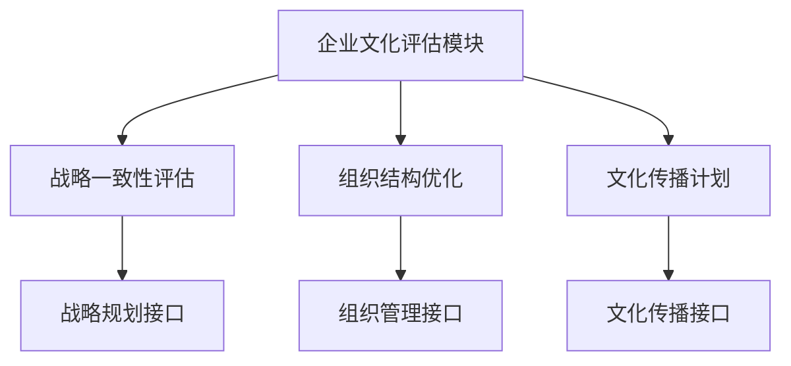
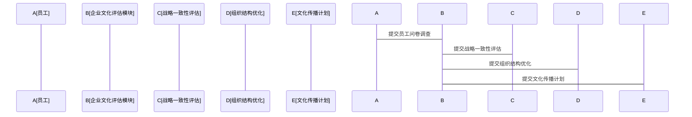

                 

# 彼得林奇对公司并购后文化整合的评估

> 关键词：公司并购，文化整合，彼得林奇，企业文化，整合评估

> 摘要：本文从彼得林奇的视角出发，深入分析了公司并购后文化整合的重要性、方法和评估策略。通过系统的方法论，结合实际案例，探讨了如何实现企业文化的无缝融合，确保并购后的持续成功。

---

## 第1章 公司并购与文化整合概述

### 1.1 公司并购的基本概念

#### 1.1.1 公司并购的定义与类型
公司并购（Mergers and Acquisitions，M&A）是指一家企业与其他企业合并或收购其资产、股权的过程。常见的并购类型包括：

- **合并（Merger）**：两家或多家企业合并成一家新企业。
- **收购（Acquisition）**：一家企业收购另一家企业的资产或股权。
- **杠杆并购**：通过 borrowed funds 购买目标企业，以目标企业的资产作为抵押。
- **善意并购**：收购方以友好态度进行并购，通常为了战略协同。

#### 1.1.2 并购的动机与目的
企业进行并购的动机多种多样，主要包括：

1. **扩大市场份额**：通过并购快速进入新市场或区域。
2. **获取技术或资源**：获得目标企业的关键技术、专利或资源。
3. **实现规模经济**：通过合并降低成本，提高效率。
4. **多元化经营**：通过并购进入新的业务领域，分散风险。

#### 1.1.3 并购的历史发展与现状
并购活动自20世纪初开始兴起，经历了多次起伏。近年来，并购活动呈现出以下趋势：

- **数字化转型驱动并购**：企业通过并购快速获取数字化能力。
- **行业整合加剧**：许多行业通过并购形成寡头垄断格局。
- **可持续性并购**：绿色经济和可持续发展成为并购的重要考量因素。

---

### 1.2 文化整合的重要性

#### 1.2.1 什么是企业文化
企业文化是指企业在长期经营过程中形成的、与企业战略目标相一致的价值观、行为规范和思维方式的总和。它包括以下几个核心要素：

- **企业愿景**：企业的长期目标和理想。
- **企业使命**：企业存在的根本目的。
- **企业价值观**：企业在经营活动中所崇尚的核心价值。
- **企业行为规范**：员工在日常工作中必须遵守的行为准则。

#### 1.2.2 并购后文化整合的必要性
并购后的企业整合不仅仅是资产和业务的整合，更重要的是文化的整合。文化整合的必要性体现在以下几个方面：

1. **确保战略一致性**：并购后的文化整合能够确保两家企业的战略目标一致，避免短期行为。
2. **提升组织协同效率**：通过文化整合，优化组织结构，提升跨部门协作效率。
3. **增强员工归属感**：文化整合能够帮助员工更快地适应新的工作环境，增强归属感。

#### 1.2.3 文化整合与企业绩效的关系
文化整合的成功与否直接影响企业的绩效表现。研究表明，文化整合良好的企业通常具有以下优势：

- **更快的并购整合速度**：文化整合能够减少整合过程中的摩擦，缩短整合周期。
- **更高的员工满意度**：员工在文化整合良好的企业中更容易适应变化，工作满意度更高。
- **更强的创新能力和竞争力**：文化整合能够激发员工的创造力，提升企业的市场竞争力。

---

### 1.3 并购失败的常见原因

#### 1.3.1 战略目标不一致
如果并购双方的战略目标不一致，可能会导致并购后的企业出现方向性问题。例如，一家企业希望通过并购进入新市场，而目标企业则希望保持独立运营，这种战略目标的不一致会导致并购失败。

#### 1.3.2 企业文化的冲突
文化冲突是并购后整合失败的主要原因之一。例如，一家以“创新”为核心价值观的企业并购了一家以“稳定”为核心价值观的企业，双方在管理风格、决策方式等方面可能存在较大的冲突，导致整合困难。

#### 1.3.3 管理整合的挑战
并购后的管理整合涉及组织结构、人员安排、决策流程等多个方面。如果管理整合不善，可能会导致权力冲突、沟通不畅等问题，进而影响企业的正常运营。

---

## 1.4 本章小结
本章从公司并购的基本概念出发，探讨了文化整合的重要性，并分析了并购失败的常见原因。通过这些分析，我们可以看到，文化整合是并购成功的关键因素之一，而并购失败的案例往往与文化冲突密切相关。下一章将深入探讨文化整合的核心要素及其对并购的影响。

---

## 第2章 文化整合的核心要素

### 2.1 企业文化的核心要素

#### 2.1.1 企业愿景与使命
企业愿景是企业长期发展的目标，而使命则是企业存在的根本目的。例如，谷歌的愿景是“组织全球信息，使其普遍可访问”，使命是“通过技术改变世界”。

#### 2.1.2 企业价值观
企业价值观是企业在经营活动中所崇尚的核心价值。例如，苹果公司的价值观包括创新、卓越、简约和客户至上。

#### 2.1.3 企业行为规范
企业行为规范是员工在日常工作中必须遵守的行为准则。例如，谷歌的行为规范包括开放性、合作性、创新性和客户至上。

---

### 2.2 文化整合的关键维度

#### 2.2.1 企业战略一致性
企业战略一致性是指并购双方在战略目标和核心价值观上的一致性。例如，两家以技术创新为核心竞争力的企业并购后，更容易形成一致的战略方向。

#### 2.2.2 企业组织结构的协调性
企业组织结构的协调性是指并购双方在组织架构、管理风格和决策流程上的协调程度。例如，一家以扁平化管理为主的企业并购了一家以层级管理为主的企业，双方在组织结构上可能存在较大的冲突。

#### 2.2.3 企业沟通机制的有效性
企业沟通机制的有效性是指并购双方在信息传递、沟通渠道和决策过程中的有效性。例如，两家企业在并购后如果没有建立有效的沟通机制，可能会导致信息传递不畅，影响整合效果。

---

### 2.3 文化整合的模型与框架

#### 2.3.1 文化整合的阶段模型
文化整合可以分为以下几个阶段：

1. **评估阶段**：对并购双方的企业文化进行全面评估。
2. **规划阶段**：制定文化整合的详细计划。
3. **实施阶段**：按照计划推进文化整合。
4. **监控阶段**：对文化整合的效果进行监控和调整。

#### 2.3.2 文化整合的矩阵分析
文化整合的矩阵分析可以通过以下维度进行：

- **企业文化的相似性**：并购双方的企业文化是否相似。
- **企业规模的差异性**：并购双方的规模差异是否显著。
- **管理风格的协调性**：并购双方的管理风格是否协调。

#### 2.3.3 文化整合的KPI指标
文化整合的KPI指标可以包括以下内容：

- **员工满意度**：员工对并购后企业文化的满意度。
- **组织协同效率**：并购后组织的协同效率是否提升。
- **企业绩效**：并购后企业的绩效表现是否优于并购前。

---

## 2.4 本章小结
本章从企业文化的核心要素出发，探讨了文化整合的关键维度和模型框架。通过这些分析，我们可以看到，文化整合的成功需要并购双方在战略目标、组织结构和沟通机制上实现协调一致。下一章将重点探讨文化整合的评估方法。

---

## 第3章 文化整合的定性评估方法

### 3.1 定性评估的核心原理

#### 3.1.1 文化评估的基本原则
文化评估的基本原则包括以下几点：

1. **全面性**：评估必须全面覆盖企业文化的核心要素。
2. **系统性**：评估必须以系统的方法进行，确保各部分的协调一致。
3. **动态性**：评估必须具有动态性，能够适应企业环境的变化。

#### 3.1.2 文化评估的维度划分
文化评估的维度划分可以包括以下几个方面：

- **企业愿景与使命**：评估并购双方的企业愿景和使命是否一致。
- **企业价值观**：评估并购双方的企业价值观是否协调。
- **企业行为规范**：评估并购双方的行为规范是否冲突。

#### 3.1.3 文化评估的工具与方法
文化评估的工具与方法可以包括以下几种：

- **问卷调查**：通过问卷调查了解员工对企业文化的认知和态度。
- **深度访谈**：通过深度访谈了解企业文化的深层次问题。
- **文化评估模型**：使用文化评估模型对并购双方的企业文化进行分析。

---

### 3.2 文化整合的评估框架

#### 3.2.1 评估框架的设计思路
文化整合的评估框架设计思路可以包括以下几点：

1. **明确评估目标**：确定评估的具体目标和范围。
2. **选择评估方法**：根据评估目标选择合适的评估方法。
3. **制定评估计划**：制定详细的评估计划，包括时间安排和人员分工。

#### 3.2.2 评估框架的组成部分
文化整合的评估框架主要包括以下部分：

- **评估指标**：包括员工满意度、组织协同效率等。
- **评估工具**：包括问卷调查、深度访谈等。
- **评估流程**：包括数据收集、分析和反馈。

#### 3.2.3 评估框架的实施步骤
文化整合的评估框架实施步骤可以包括以下几点：

1. **数据收集**：通过问卷调查、深度访谈等方式收集数据。
2. **数据分析**：对收集到的数据进行分析，识别问题和机会。
3. **结果反馈**：将评估结果反馈给相关人员，并制定改进计划。

---

### 3.3 定性评估的案例分析

#### 3.3.1 案例背景介绍
以某跨国公司并购一家本土企业为例，分析并购后文化整合的定性评估过程。

#### 3.3.2 评估过程描述
1. **数据收集**：通过问卷调查和深度访谈收集员工对企业文化的认知和态度。
2. **数据分析**：分析数据，识别文化冲突的主要问题。
3. **结果反馈**：将评估结果反馈给管理层，并制定改进计划。

#### 3.3.3 评估结果分析
通过评估发现，并购双方在企业价值观和行为规范上存在较大差异，导致整合过程中出现了一系列问题。因此，需要制定针对性的整合策略，逐步实现文化的融合。

---

## 3.4 本章小结
本章从定性评估的角度，探讨了文化整合的评估方法和案例分析。通过这些分析，我们可以看到，定性评估是文化整合的重要工具，能够帮助企业识别文化冲突并制定有效的整合策略。下一章将重点探讨文化整合的系统分析与架构设计。

---

## 第4章 文化整合的系统分析与架构设计

### 4.1 系统功能设计

#### 4.1.1 企业战略一致性评估
企业战略一致性评估是文化整合的重要内容。通过评估并购双方的战略目标和核心价值观是否一致，可以为整合提供依据。

#### 4.1.2 企业组织结构优化
企业组织结构优化是文化整合的重要环节。通过优化组织结构，可以实现并购双方在组织架构和管理风格上的协调一致。

#### 4.1.3 企业文化传播机制
企业文化传播机制是文化整合的重要手段。通过建立有效的文化传播机制，可以确保并购双方的企业文化得到充分传播和融合。

---

### 4.2 系统架构设计

#### 4.2.1 分层架构设计
文化整合的系统架构可以采用分层架构设计，包括数据层、业务层和应用层。

- **数据层**：负责数据的采集、存储和管理。
- **业务层**：负责文化整合的核心业务逻辑。
- **应用层**：负责用户界面和功能实现。

#### 4.2.2 模块化设计
文化整合的系统架构可以采用模块化设计，包括以下几个模块：

- **文化评估模块**：负责对企业文化进行全面评估。
- **整合规划模块**：负责制定文化整合的详细计划。
- **监控优化模块**：负责对文化整合的效果进行监控和优化。

#### 4.2.3 整合后的系统流程
文化整合的系统流程可以包括以下步骤：

1. **数据采集**：通过问卷调查、深度访谈等方式采集数据。
2. **数据分析**：对采集到的数据进行分析，识别问题和机会。
3. **整合规划**：根据分析结果制定文化整合的详细计划。
4. **实施优化**：按照计划推进整合，并根据实际情况进行优化。

---

### 4.3 系统接口设计

#### 4.3.1 数据接口
文化整合的系统需要与企业现有的信息管理系统进行对接，主要包括以下接口：

- **员工信息接口**：员工的基本信息和绩效数据。
- **组织结构接口**：企业的组织架构和岗位信息。
- **文化评估接口**：文化评估的数据接口。

#### 4.3.2 业务接口
文化整合的系统需要与企业的核心业务系统进行对接，主要包括以下接口：

- **战略规划接口**：企业的战略目标和核心价值观。
- **组织管理接口**：组织结构和人员安排。
- **文化传播接口**：企业文化传播的渠道和方式。

---

## 4.4 本章小结
本章从系统分析与架构设计的角度，探讨了文化整合的实现方式。通过分层架构设计和模块化设计，我们可以实现文化整合的系统化和规范化。下一章将通过实际案例，进一步探讨文化整合的项目实战。

---

## 第5章 项目实战：文化整合的案例分析

### 5.1 项目背景介绍

#### 5.1.1 案例背景
以某跨国公司并购一家本土企业为例，分析并购后文化整合的实现过程。

#### 5.1.2 项目目标
通过文化整合，实现并购双方的企业文化融合，确保并购后的企业战略一致性、组织协同性和员工归属感。

---

### 5.2 系统功能设计

#### 5.2.1 企业文化评估模块
1. **员工问卷调查**：通过问卷调查了解员工对企业文化的认知和态度。
2. **深度访谈**：通过深度访谈识别文化冲突的主要问题。

#### 5.2.2 整合规划模块
1. **战略一致性评估**：评估并购双方的战略目标和核心价值观是否一致。
2. **组织结构优化**：优化并购后的组织结构，确保管理风格的协调一致。
3. **文化传播计划**：制定企业文化传播的具体计划和实施方案。

---

### 5.3 系统架构设计

#### 5.3.1 系统架构图
以下是一个简化的系统架构图，展示了文化整合的主要模块和接口：

#### 5.3.2 关键接口设计
1. **战略规划接口**：与企业的战略规划系统对接，获取战略目标和核心价值观。
2. **组织管理接口**：与企业的人力资源管理系统对接，获取组织结构和人员信息。
3. **文化传播接口**：与企业的内部沟通系统对接，实现企业文化的有效传播。

---

### 5.4 系统交互设计

#### 5.4.1 交互流程图
以下是一个简化的系统交互流程图，展示了文化整合的主要流程：

---

## 5.5 本章小结
本章通过实际案例，探讨了文化整合的项目实战。通过系统功能设计、架构设计和交互设计，我们可以实现并购后的企业文化整合。案例分析表明，文化整合的成功需要并购双方在战略目标、组织结构和沟通机制上实现协调一致。

---

## 第6章 最佳实践与小结

### 6.1 最佳实践

#### 6.1.1 企业文化评估
1. **全面性**：评估必须全面覆盖企业文化的核心要素。
2. **系统性**：评估必须以系统的方法进行，确保各部分的协调一致。
3. **动态性**：评估必须具有动态性，能够适应企业环境的变化。

#### 6.1.2 整合策略
1. **战略一致性**：确保并购双方在战略目标和核心价值观上的一致性。
2. **组织协调性**：优化组织结构，确保管理风格的协调一致。
3. **有效沟通**：建立有效的沟通机制，确保信息传递的畅通。

---

### 6.2 小结

通过本文的分析，我们可以看到，文化整合是公司并购成功的关键因素之一。并购后的企业文化整合需要从战略、组织和沟通等多个方面进行系统规划和实施。通过最佳实践，我们可以实现并购后的企业文化融合，确保并购后的持续成功。

---

## 6.3 注意事项

1. **文化整合的复杂性**：文化整合是一个复杂的过程，需要时间和资源的投入。
2. **员工参与的重要性**：员工的积极参与是文化整合成功的重要保障。
3. **持续监控与优化**：文化整合是一个动态过程，需要持续监控和优化。

---

## 6.4 拓展阅读

1. **彼得林奇的并购策略**：彼得林奇作为著名的并购专家，提出了许多成功的并购策略，值得深入研究。
2. **企业文化管理**：企业文化管理是企业并购后整合的重要内容，值得进一步探讨。
3. **文化整合的数学模型**：通过数学模型分析文化整合的效果，为决策提供科学依据。

---

## 作者：AI天才研究院/AI Genius Institute & 禅与计算机程序设计艺术/Zen And The Art of Computer Programming

---

以上是《彼得林奇对公司并购后文化整合的评估》的技术博客文章的完整目录大纲和部分章节内容。希望这篇博客能够为读者提供深入的见解和实用的指导。

