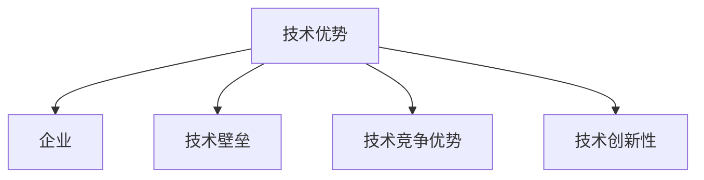
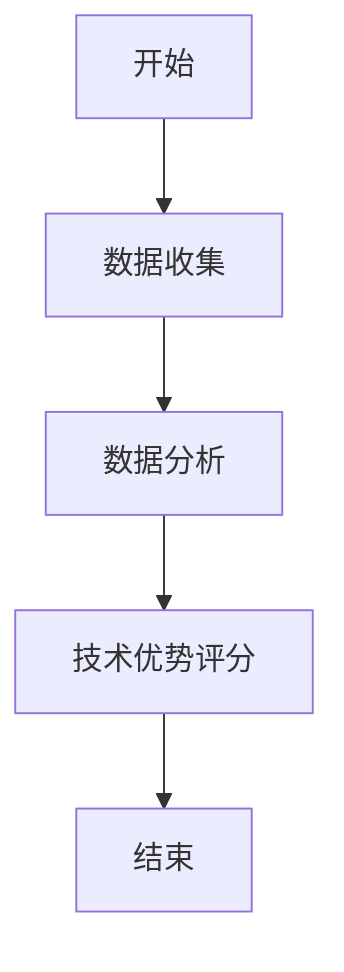
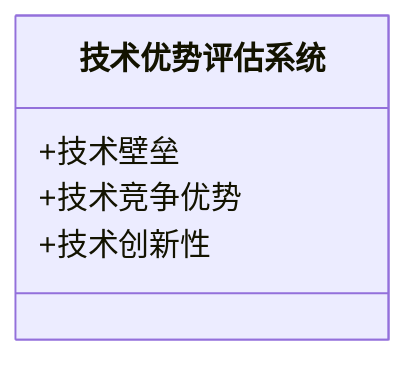
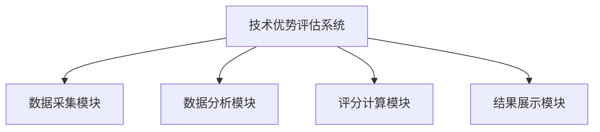
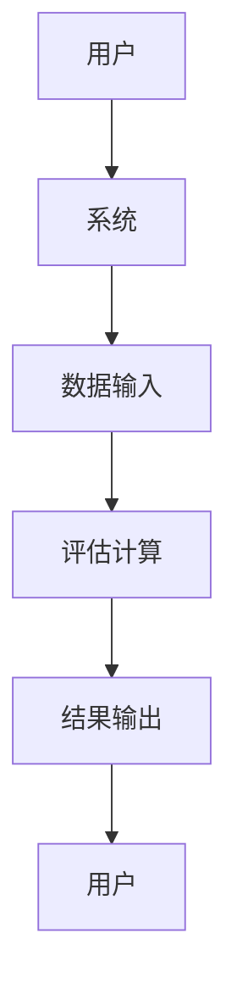

                 


# 彼得林奇对公司技术优势的评估方法

> 关键词：彼得·林奇，技术优势，投资评估，企业竞争力，技术壁垒

> 摘要：本文深入探讨了彼得·林奇在评估公司技术优势方面的方法，结合技术分析的核心概念、评估模型和系统架构，提供了详细的分析和实际案例。通过构建加权评分模型和系统架构设计，文章展示了如何有效评估企业技术优势，为投资者提供科学决策支持。

---

## 第1章：技术优势评估的背景与意义

### 1.1 技术优势评估的重要性

1.1.1 技术优势在企业竞争中的核心地位  
在现代商业环境中，技术优势是企业核心竞争力的关键因素。它决定了企业在市场中的地位、盈利能力和发展潜力。彼得·林奇认为，拥有强大技术优势的企业能够在竞争中占据优势，为投资者带来超额收益。

1.1.2 技术优势与企业长期价值的关系  
技术优势不仅影响企业的短期表现，还决定了其长期发展潜力。例如，一家公司通过技术创新降低了生产成本，不仅提升了短期利润，还增强了市场竞争力，提升了长期价值。

1.1.3 技术优势评估对投资者的价值  
对于投资者而言，准确评估企业的技术优势可以帮助识别高潜力投资标的，降低投资风险。彼得·林奇的方法提供了一套系统化的评估框架，帮助投资者做出更明智的决策。

---

### 1.2 彼得·林奇的技术优势评估方法

1.2.1 彼得·林奇投资方法的核心理念  
彼得·林奇以其基本面分析著称，注重企业的基本面和技术优势。他认为，技术优势是企业长期增长的关键驱动力。他的评估方法注重企业的技术壁垒、竞争优势和创新能力。

1.2.2 技术优势评估在彼得·林奇方法中的作用  
技术优势评估是彼得·林奇投资决策中的重要环节。他通过分析企业的技术壁垒、竞争优势和创新能力，识别出具有长期增长潜力的企业。

1.2.3 技术优势评估的边界与外延  
技术优势评估不仅关注企业的技术能力，还包括其市场应用潜力、商业化能力等。彼得·林奇的方法强调技术优势与企业实际经营的结合，确保评估结果的实用性。

---

## 第2章：技术优势评估的核心概念

### 2.1 技术优势的核心原理

2.1.1 技术优势的构成要素  
技术优势由技术壁垒、竞争优势和技术创新性三个核心要素构成。这些要素相互作用，共同决定了企业的技术优势。

2.1.2 技术优势的动态变化规律  
技术优势并非一成不变，随着市场竞争和技术进步，企业需要不断优化和创新。彼得·林奇的方法强调动态评估，关注企业在变化中的技术优势。

2.1.3 技术优势与企业盈利能力的关系  
技术优势直接影响企业的盈利能力。具有强大技术优势的企业能够在市场中占据领先地位，获得更高的利润率。

---

### 2.2 核心概念的属性特征对比

2.2.1 技术壁垒与市场进入障碍的对比分析  
技术壁垒是市场进入障碍的重要组成部分。企业通过技术壁垒建立市场进入障碍，保护自身竞争优势。

2.2.2 技术竞争优势与成本优势的对比  
技术竞争优势和成本优势相辅相成。技术优势可能带来成本优势，而成本优势也能够增强技术竞争优势。

2.2.3 技术创新性与技术成熟度的对比  
技术创新性代表企业的创新能力，而技术成熟度反映技术的实际应用能力。彼得·林奇的方法注重两者的平衡，确保技术优势的实用性和前瞻性。

---

### 2.3 ER实体关系图架构



---

## 第3章：技术优势评估的算法原理

### 3.1 技术优势评估的数学模型

3.1.1 技术优势评分模型的构建  
技术优势评分模型是一个加权评分系统，考虑技术壁垒、竞争优势和技术创新性三个要素。每个要素的权重根据其重要性确定。

3.1.2 技术优势的加权评分公式  
$$总评分 = w1 \times 评分1 + w2 \times 评分2 + w3 \times 评分3$$  
其中，$w1, w2, w3$分别为三个要素的权重，$w1 + w2 + w3 = 1$。

3.1.3 技术优势评分的数学表达式  
例如，权重分别为0.4、0.3、0.3，评分分别为90、85、90，则总评分为：  
$$总评分 = 0.4 \times 90 + 0.3 \times 85 + 0.3 \times 90 = 87.5$$

---

### 3.2 技术优势评估的流程图



---

## 第4章：技术优势评估的系统分析与架构设计

### 4.1 系统功能设计

4.1.1 领域模型  


4.1.2 系统架构设计  


4.1.3 系统接口设计  
系统提供API接口，供外部调用技术优势评估结果。

4.1.4 系统交互流程图  


---

## 第5章：技术优势评估的项目实战

### 5.1 项目环境安装

项目需要以下环境：
- Python 3.8+
- Mermaid工具
- 数据分析库（Pandas, NumPy）

### 5.2 核心代码实现

以下是技术优势评估的核心代码示例：

```python
def calculate_technical_advantage(scores, weights):
    return sum(score * weight for score, weight in zip(scores, weights))

# 示例
scores = [90, 85, 90]
weights = [0.4, 0.3, 0.3]
total = calculate_technical_advantage(scores, weights)
print(f"技术优势总评分为: {total}")
```

### 5.3 案例分析

以某科技公司为例，评估其技术优势：

1. 数据收集：收集公司的技术壁垒、竞争优势和技术创新性评分。
2. 数据分析：计算各要素的评分和权重。
3. 结果展示：生成技术优势总评分，评估公司的技术优势。

---

## 第6章：技术优势评估的最佳实践与小结

### 6.1 最佳实践

1. 定期更新评估模型，适应市场变化。
2. 结合其他评估指标，全面分析企业价值。
3. 选择合适的权重，根据行业特点调整评估重点。

### 6.2 投资策略建议

1. 优先投资具有强大技术优势的企业。
2. 关注企业的技术壁垒和创新能力。
3. 结合财务指标，全面评估企业价值。

### 6.3 注意事项

1. 技术优势评估具有一定的主观性，需结合实际情况调整。
2. 注意技术优势的动态变化，及时更新评估结果。

---

## 第7章：总结与拓展阅读

### 7.1 总结

本文详细探讨了彼得·林奇的技术优势评估方法，从核心概念到系统架构，提供了全面的分析和实际案例。通过构建加权评分模型和系统架构设计，帮助投资者科学评估企业技术优势。

### 7.2 拓展阅读

1. 《彼得·林奇的投资策略》
2. 技术优势评估的其他方法
3. 数据驱动的投资分析

---

## 作者

作者：AI天才研究院/AI Genius Institute & 禅与计算机程序设计艺术 /Zen And The Art of Computer Programming

