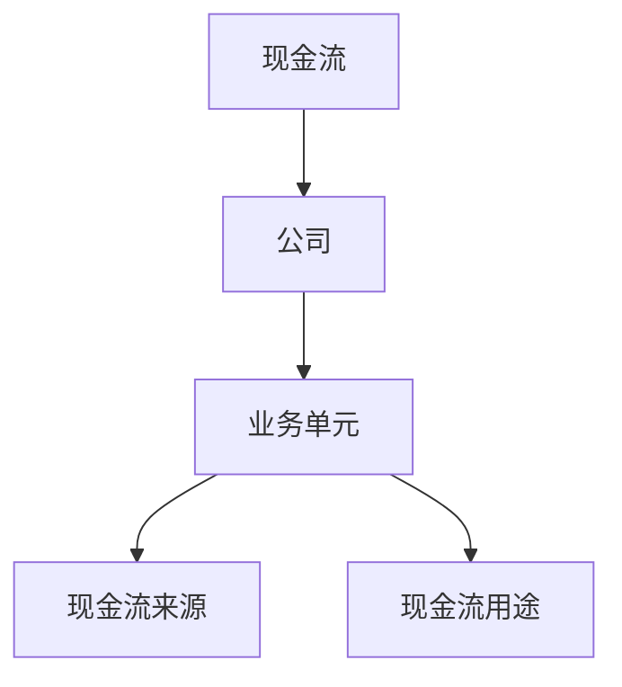
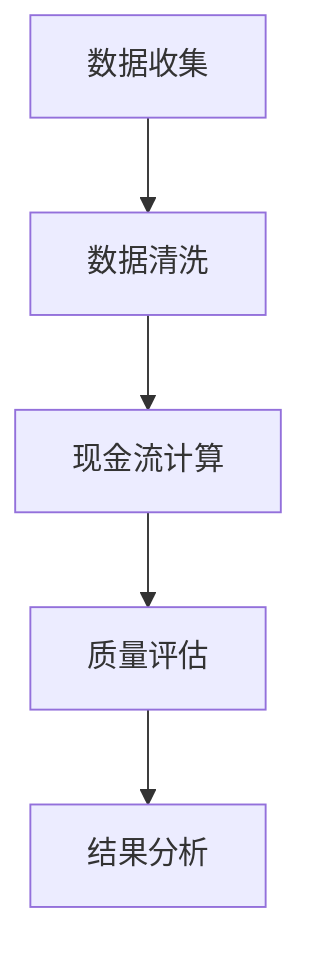
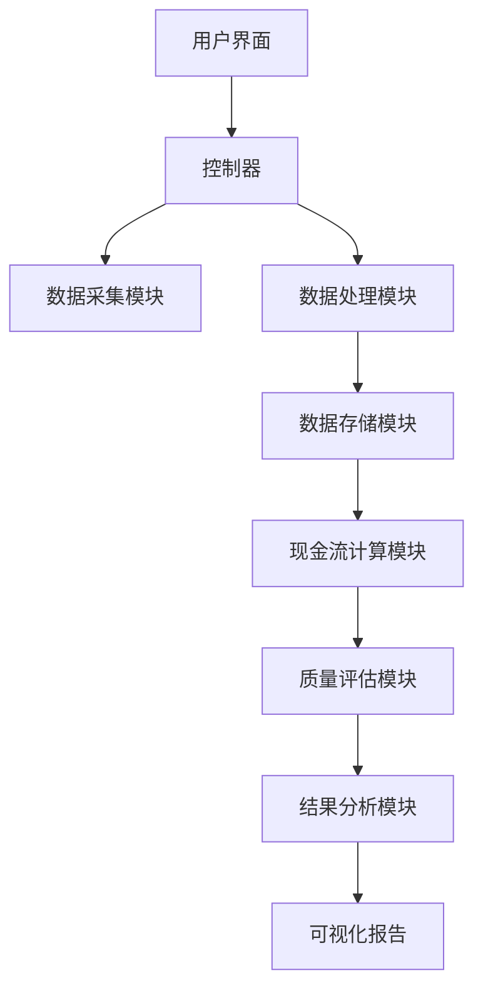

                 


# 彼得林奇对公司现金流质量的跨周期分析

## 关键词：现金流质量，跨周期分析，彼得·林奇，投资分析，公司财务

## 摘要：本文深入探讨了彼得·林奇在分析公司现金流质量时采用的跨周期方法。通过分析现金流的质量和稳定性，结合经济周期波动，帮助投资者做出更明智的投资决策。文章从理论基础、分析方法、数学模型到实际案例，全面解析了现金流质量的评估过程，为投资决策提供了有力支持。

---

## 第一部分：背景与基础

### 第1章：现金流质量的定义与重要性

#### 1.1 现金流质量的定义
- 现金流的基本概念
- 现金流质量的核心要素：稳定性、可持续性、增长性
- 现金流质量与企业价值的关系：现金流是企业“血液”，质量决定企业健康

#### 1.2 跨周期分析的必要性
- 经济周期波动对企业现金流的影响：衰退期现金流萎缩，扩张期现金流扩张
- 现金流质量在不同周期的表现：衰退期现金流质量下降，扩张期现金流质量提升
- 跨周期分析对企业投资决策的意义：避免短期波动干扰，识别长期优质企业

### 第2章：彼得·林奇的投资理念与方法

#### 2.1 彼得·林奇的投资风格
- 价值投资的核心思想：寻找被市场低估的企业
- 现金流分析在林奇投资中的地位：现金流是判断企业健康的核心指标
- 林奇的选股标准：现金流稳定、盈利可持续、估值合理

#### 2.2 林奇的现金流质量分析方法
- 现金流质量的三要素：来源稳定性、用途合理性、波动可控性
- 现金流与收益的匹配性分析：现金流与收入同步增长，避免过度依赖关联方或一次性收入
- 班氏模型与现金流质量评估：通过现金流质量指数（Q值）判断企业现金流健康度

---

## 第二部分：核心概念与联系

### 第3章：现金流质量的核心要素

#### 3.1 现金流质量的属性特征对比
| 属性       | 稳定性 | 可持续性 | 增长性 |
|------------|--------|----------|--------|
| 现金流来源 | 高     | 高       | 中     |
| 现金流用途 | 高     | 高       | 中     |
| 经济周期   | 低波动 | 高       | 中     |

#### 3.2 现金流质量的ER实体关系图


---

## 第三部分：算法原理讲解

### 第4章：现金流质量分析的算法原理

#### 4.1 班氏模型的现金流质量评估
- 班氏模型的基本原理：通过现金流质量指数（Q值）量化企业现金流健康度
- 现金流质量指数的计算公式：
  $$ Q = \frac{FCF}{\text{营业收入}} \times 100 $$
  其中，FCF为自由现金流，营业收入为企业当期收入。

#### 4.2 现金流质量分析的步骤


---

## 第四部分：系统分析与架构设计

### 第5章：现金流质量分析系统的设计

#### 5.1 系统功能设计
- 数据采集模块：从财务报表中提取现金流数据
- 数据处理模块：清洗、转换和标准化处理
- 现金流计算模块：计算自由现金流、经营活动现金流等指标
- 质量评估模块：应用班氏模型计算现金流质量指数
- 结果分析模块：生成可视化报告和投资建议

#### 5.2 系统架构设计


---

## 第五部分：项目实战与案例分析

### 第6章：现金流质量分析的项目实战

#### 6.1 环境安装
- 安装Python、Pandas、Matplotlib等工具
- 数据来源：企业财务报表数据（如营业收入、净利润、现金流等）

#### 6.2 核心实现源代码
```python
import pandas as pd
import matplotlib.pyplot as plt

# 示例数据
data = {
    '年份': [2018, 2019, 2020, 2021, 2022],
    '营业收入': [100, 120, 110, 130, 140],
    '净利润': [20, 25, 18, 28, 32],
    '经营活动现金流': [15, 20, 16, 22, 24]
}

df = pd.DataFrame(data)

# 计算自由现金流（假设净利润=经营活动现金流+非现金费用）
df['自由现金流'] = df['净利润'] + df['经营活动现金流']

# 计算现金流质量指数
df['现金流质量指数'] = (df['自由现金流'] / df['营业收入']) * 100

print(df)
```

#### 6.3 案例分析与解读
- 以某公司为例，分析其现金流质量指数的变化趋势
- 确定公司在不同经济周期中的现金流质量表现
- 给出投资建议：现金流质量稳定且指数较高的企业适合长期投资

---

## 第六部分：总结与展望

### 第7章：现金流质量分析的总结与展望

#### 7.1 小结
- 现金流质量是企业财务健康的核心指标
- 跨周期分析帮助投资者识别真正优质的企业
- 班氏模型提供了一种有效的现金流质量评估方法

#### 7.2 注意事项
- 数据的准确性和完整性对分析结果影响重大
- 需结合其他财务指标（如ROE、毛利率）综合判断
- 经济周期波动可能影响现金流质量分析的结果

#### 7.3 拓展阅读
- 《彼得·林奇的投资之道》
- 《班氏模型的理论与实践》
- 《财务报表分析与企业价值评估》

---

## 作者：AI天才研究院 & 禅与计算机程序设计艺术

