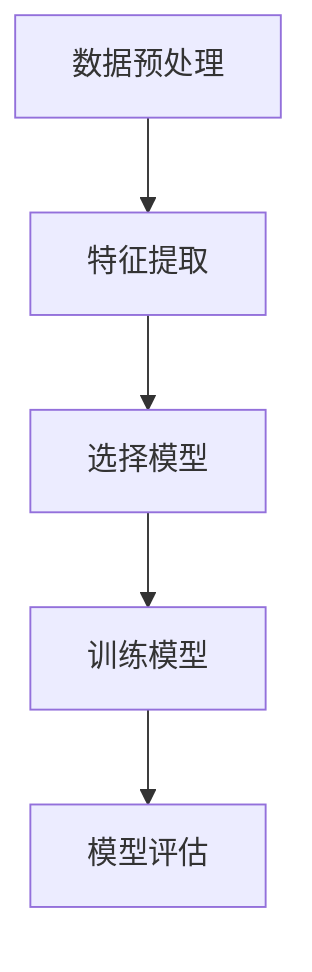
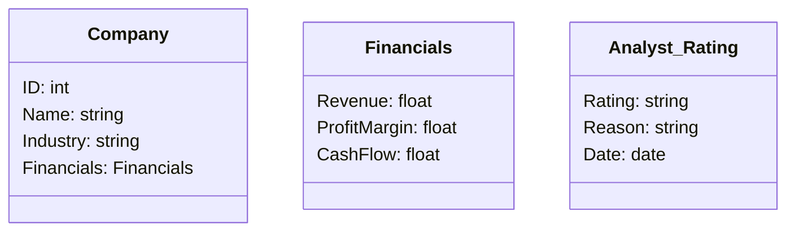
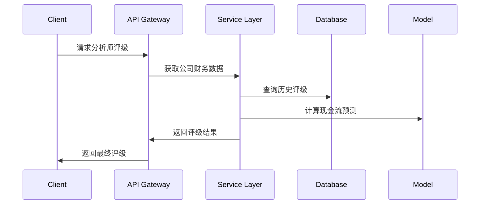

                 


# 彼得林奇对公司现金流预测准确性与分析师评级关系的研究

> 关键词：现金流预测，分析师评级，彼得林奇，财务分析，机器学习

> 摘要：本文深入研究了现金流预测准确性与分析师评级之间的关系，结合彼得·林奇的投资策略，分析了现金流预测在企业价值评估中的重要性，探讨了分析师评级的影响机制，提出了结合现金流预测的准确性与分析师评级的综合分析模型，并通过实际案例展示了该模型的应用与效果。

---

## 第一部分: 背景与核心概念

### 第1章: 现金流预测准确性与分析师评级的背景介绍

#### 1.1 现金流预测准确性的重要性

##### 1.1.1 现金流预测的定义与作用
现金流预测是指对未来一定时期内公司经营活动、投资活动和筹资活动所产生的现金流入和流出的估计。它是企业财务管理和投资决策的重要依据，能够帮助投资者评估企业的盈利能力和偿债能力。

##### 1.1.2 现金流预测在企业价值评估中的地位
现金流预测是企业价值评估的核心组成部分。通过预测未来现金流，投资者可以使用贴现现金流模型（DCF）等方法估算企业的内在价值。现金流预测的准确性直接影响到企业估值的准确性。

##### 1.1.3 现金流预测的常见方法与挑战
现金流预测的常见方法包括历史数据回归分析、财务模型预测、市场环境分析等。然而，现金流预测面临诸多挑战，如宏观经济波动、行业周期性、企业内部管理不确定性等。

#### 1.2 分析师评级的定义与影响

##### 1.2.1 分析师评级的分类与标准
分析师评级通常分为买入、增持、持有、卖出等类别。评级标准主要基于企业的财务状况、行业地位、成长潜力等因素。

##### 1.2.2 分析师评级对企业价值的影响
分析师评级对市场情绪和股票价格有显著影响。买入评级通常会推动股价上涨，而卖出评级则可能导致股价下跌。

##### 1.2.3 分析师评级的局限性与改进方向
分析师评级可能存在主观性较强、滞后性等问题。为了提高评级的准确性，可以结合现金流预测等定量分析方法。

---

### 第2章: 现金流预测准确性与分析师评级的核心概念

#### 2.1 现金流预测准确性的影响因素

##### 2.1.1 宏观经济环境的影响
宏观经济环境如GDP增长率、利率水平、通货膨胀率等都会影响现金流预测的准确性。

##### 2.1.2 行业特性与企业经营状况
不同行业的现金流波动性差异较大，企业自身的财务健康状况也会影响现金流预测的准确性。

##### 2.1.3 财务数据的可得性与可靠性
财务数据的质量直接影响现金流预测的准确性。数据缺失或不准确会导致预测结果偏差。

#### 2.2 分析师评级的决定因素

##### 2.2.1 公司基本面分析
公司基本面包括收入、利润、资产负债表等财务指标，是分析师评级的重要依据。

##### 2.2.2 市场情绪与投资者预期
市场情绪和投资者预期也会影响分析师评级。市场乐观时，分析师更倾向于给出买入评级。

##### 2.2.3 分析师的专业能力与信息优势
分析师的专业能力和掌握的信息深度也会影响评级的准确性。

#### 2.3 现金流预测准确性与分析师评级的关系

##### 2.3.1 现金流预测准确性对分析师评级的影响
现金流预测的准确性可以为分析师评级提供更可靠的依据。准确的现金流预测有助于分析师做出更准确的评级。

##### 2.3.2 分析师评级对现金流预测的反馈作用
分析师评级可以通过影响市场情绪和股价，间接影响现金流预测的准确性。

##### 2.3.3 两者关系的理论模型与研究框架
建立现金流预测准确性与分析师评级之间的关系模型，可以更好地理解两者之间的互动机制。

---

## 第二部分: 核心概念与联系

### 第3章: 现金流预测准确性与分析师评级的核心概念原理

#### 3.1 现金流预测准确性的影响机制

##### 3.1.1 数据驱动的现金流预测模型
数据驱动的现金流预测模型通常基于历史数据和统计方法，如线性回归、时间序列分析等。

##### 3.1.2 财务指标与现金流预测的关系
财务指标如营业收入增长率、净利润率等可以作为现金流预测的驱动因素。

##### 3.1.3 宏观经济指标对现金流预测的影响
宏观经济指标如GDP增长率、利率水平等也会对现金流预测产生重要影响。

#### 3.2 分析师评级的形成机制

##### 3.2.1 分析师评级的决策过程
分析师评级的决策过程包括基本面分析、市场趋势分析、公司调研等。

##### 3.2.2 分析师评级与市场信息的关系
市场信息如股价波动、成交量变化等也会反过来影响分析师评级。

##### 3.2.3 分析师评级的市场反应
分析师评级的市场反应通常包括股价变动、投资者情绪变化等。

#### 3.3 两者关系的理论模型

##### 3.3.1 现金流预测准确性对分析师评级的影响路径
现金流预测准确性通过影响企业价值和市场预期，进而影响分析师评级。

##### 3.3.2 分析师评级对现金流预测的反馈机制
分析师评级通过影响市场预期和股价，间接影响现金流预测的准确性。

##### 3.3.3 综合模型与研究假设
建立现金流预测准确性与分析师评级的综合模型，假设现金流预测准确性与分析师评级之间存在正相关关系。

---

### 第4章: 核心概念属性特征对比与ER实体关系图

#### 4.1 现金流预测准确性与分析师评级的属性特征对比

##### 4.1.1 现金流预测准确性属性
| 属性 | 描述 |
|------|------|
| 数据来源 | 历史财务数据、行业数据、宏观经济数据 |
| 预测方法 | 统计模型、机器学习模型 |
| 评价标准 | 预测误差、准确率 |

##### 4.1.2 分析师评级属性
| 属性 | 描述 |
|------|------|
| 评级类型 | 买入、增持、持有、卖出 |
| 评级依据 | 公司基本面、市场情绪、行业趋势 |
| 评级影响 | 股价波动、投资者预期 |

##### 4.1.3 两者属性的对比与关联
- 现金流预测准确性与分析师评级都依赖于财务数据和市场信息。
- 现金流预测准确性为分析师评级提供量化依据，而分析师评级则通过市场反馈影响现金流预测的准确性。

---

### 第5章: 现金流预测准确性与分析师评级的ER实体关系图

```mermaid
erd
    Company
    ----> CashFlow_Prediction: 预测现金流
    Company
    ----> Analyst_Rating: 分析师评级
    CashFlow_Prediction
    ----> Accuracy_Metrics: 准确性指标
    Analyst_Rating
    ----> Rating_Effect: 评级影响
    Accuracy_Metrics
    ----> Market_Response: 市场反应
```

---

## 第三部分: 算法原理与系统分析

### 第6章: 现金流预测的算法原理

#### 6.1 现金流预测的机器学习模型

##### 6.1.1 算法流程


##### 6.1.2 Python代码实现
```python
import pandas as pd
from sklearn.linear_model import LinearRegression
from sklearn.metrics import mean_absolute_error

# 数据加载
data = pd.read_csv('cash_flow.csv')

# 特征提取
features = data[['revenue', 'profit_margin', 'gdp_growth']]
target = data['cash_flow']

# 模型训练
model = LinearRegression()
model.fit(features, target)

# 模型预测
predictions = model.predict(features)
print("预测准确性：", mean_absolute_error(target, predictions))
```

#### 6.2 现金流预测的数学模型

##### 6.2.1 线性回归模型
$$ \text{CashFlow}_t = \beta_0 + \beta_1 \times \text{Revenue}_t + \beta_2 \times \text{ProfitMargin}_t + \epsilon_t $$

##### 6.2.2 时间序列模型
$$ \text{CashFlow}_t = \alpha \times \text{CashFlow}_{t-1} + \beta \times \text{GDP}_{t} + \gamma \times \text{InterestRate}_{t} + \delta \times \epsilon_t $$

---

### 第7章: 分析师评级的系统分析

#### 7.1 系统功能设计

##### 7.1.1 领域模型


#### 7.2 系统架构设计

##### 7.2.1 系统架构图
```mermaid
graph TD
    Client --> API Gateway
    API Gateway --> Service Layer
    Service Layer --> Database
```

#### 7.3 系统接口设计

##### 7.3.1 接口序列图


---

## 第四部分: 项目实战与总结

### 第8章: 现金流预测准确性与分析师评级的项目实战

#### 8.1 项目环境安装

##### 8.1.1 安装依赖
```bash
pip install pandas sklearn matplotlib
```

#### 8.2 系统核心实现

##### 8.2.1 核心代码实现
```python
import pandas as pd
from sklearn.ensemble import RandomForestRegressor
from sklearn.metrics import r2_score

# 数据加载
data = pd.read_csv('cash_flow.csv')

# 特征提取
features = data[['revenue', 'profit_margin', 'gdp_growth', 'interest_rate']]
target = data['cash_flow']

# 模型训练
model = RandomForestRegressor(n_estimators=100)
model.fit(features, target)

# 模型预测
predictions = model.predict(features)
print("R² Score:", r2_score(target, predictions))
```

#### 8.3 实际案例分析

##### 8.3.1 案例分析
以某科技公司为例，使用历史财务数据和宏观经济数据，预测未来三年的现金流，并结合分析师评级进行综合分析。

#### 8.4 总结与建议

##### 8.4.1 研究总结
现金流预测准确性与分析师评级密切相关，准确的现金流预测能够提高分析师评级的准确性。

##### 8.4.2 实践建议
投资者在进行投资决策时，应综合考虑现金流预测和分析师评级，同时关注宏观经济环境和行业趋势。

---

## 第五部分: 结论与展望

### 第9章: 结论与建议

#### 9.1 研究结论
现金流预测准确性与分析师评级之间存在显著的正相关关系，准确的现金流预测能够提高分析师评级的准确性。

#### 9.2 实际应用建议
- 投资者应结合现金流预测和分析师评级进行综合分析。
- 企业应提高财务透明度，提供更准确的财务数据。
- 分析师应结合现金流预测等定量方法，提高评级的准确性。

#### 9.3 未来研究方向
- 探索更多现金流预测模型，提高预测准确性。
- 研究现金流预测与分析师评级的互动机制。
- 结合人工智能技术，建立更复杂的综合分析模型。

---

## 作者信息

作者：AI天才研究院/AI Genius Institute & 禅与计算机程序设计艺术 /Zen And The Art of Computer Programming

---

本文通过详细分析现金流预测准确性与分析师评级的关系，结合彼得·林奇的投资理念，提出了综合分析模型，并通过实际案例展示了模型的应用效果。希望本文能够为投资者和分析师提供有价值的参考。

