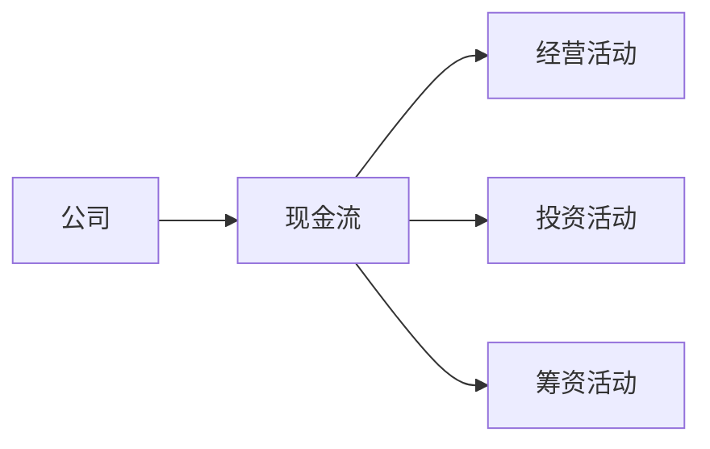

                 


# 彼得林奇对公司现金流预测的技巧

## 关键词：现金流预测、投资策略、彼得林奇、财务分析、机器学习

## 摘要：  
现金流预测是投资决策中的关键环节，彼得·林奇以其独特的现金流预测技巧闻名。本文将详细分析现金流预测的核心概念、算法原理、系统架构，并结合实际案例，讲解如何在现代投资中应用这些技巧。文章还提供了Python代码实现和数学模型，帮助读者深入理解现金流预测的实践应用。

---

## 目录

1. [背景介绍与核心概念](#背景介绍与核心概念)
2. [现金流预测的核心概念与联系](#现金流预测的核心概念与联系)
3. [现金流预测的算法原理](#现金流预测的算法原理)
4. [系统分析与架构设计](#系统分析与架构设计)
5. [项目实战](#项目实战)
6. [最佳实践](#最佳实践)

---

## 第一部分: 背景介绍与核心概念

### 第1章: 公司现金流预测的背景与重要性

#### 1.1 现金流预测的定义与意义

- **1.1.1 什么是现金流预测**  
  现金流预测是指对公司未来一定时期内的现金流进行估计和预测的过程，是企业财务管理中的重要组成部分。现金流预测可以帮助企业规划资金使用、评估投资项目、优化资本结构等。

- **1.1.2 现金流预测的重要性**  
  现金流预测是投资决策的核心依据之一，尤其是在股票投资中，现金流预测可以帮助投资者评估公司的财务健康状况、盈利能力以及未来增长潜力。

- **1.1.3 现金流预测的边界与外延**  
  现金流预测的边界包括公司内部的经营、投资和筹资活动，而外延则涉及宏观经济环境、行业趋势等外部因素。

#### 1.2 彼得·林奇的现金流预测方法

- **1.2.1 彼得·林奇的投资者背景**  
  彼得·林奇是美国著名的投资经理，以其在共同基金领域的卓越表现闻名。他强调基本面分析和对公司现金流的关注，认为现金流是衡量公司价值的重要指标。

- **1.2.2 他独特的现金流预测技巧**  
  彼得·林奇通过分析公司的历史现金流数据、行业地位、竞争优势等因素，预测未来现金流的变化趋势，并据此评估公司的内在价值。

- **1.2.3 现金流预测在投资决策中的作用**  
  现金流预测帮助投资者识别高增长公司，评估公司的盈利能力和偿债能力，从而做出更明智的投资决策。

### 第2章: 现金流预测的核心概念与联系

#### 2.1 现金流预测的核心原理

- **2.1.1 现金流预测的基本原理**  
  现金流预测基于公司过去的财务数据和行业趋势，结合财务模型和算法，预测未来现金流的变化。

- **2.1.2 现金流预测的关键要素**  
  - 经营活动现金流：包括销售收入、成本、税费等。
  - 投资活动现金流：包括资本支出、投资收益等。
  - 筹资活动现金流：包括融资、偿还债务等。

- **2.1.3 现金流预测的数学模型**  
  现金流预测可以采用多种模型，如线性回归、时间序列分析等，以数学公式为基础，对现金流进行建模和预测。

#### 2.2 现金流预测的核心概念对比

- **2.2.1 现金流预测与其他财务预测的对比**  
  现金流预测关注的是现金的流入和流出，而利润预测关注的是收入和支出的匹配。两者的区别在于现金流预测更关注实际的现金流动情况，而利润预测关注的是会计利润。

- **2.2.2 现金流预测的类型与特征**  
  现金流预测可以分为短期预测和长期预测，短期预测用于日常资金管理，长期预测用于战略规划。

- **2.2.3 现金流预测的优缺点分析**  
  - 优点：帮助公司优化资金管理，降低财务风险。
  - 缺点：预测结果受到外部环境和市场波动的影响，具有一定的不确定性。

#### 2.3 现金流预测的ER实体关系图



---

## 第二部分: 现金流预测的算法原理

### 第3章: 现金流预测的算法原理

#### 3.1 现金流预测的常用算法

- **3.1.1 线性回归模型**  
  线性回归是一种简单而有效的预测方法，适用于现金流与某些自变量（如收入、成本）之间存在线性关系的情况。

- **3.1.2 时间序列分析**  
  时间序列分析适用于现金流具有趋势和周期性的情况，可以通过ARIMA等模型进行预测。

- **3.1.3 机器学习算法**  
  机器学习算法（如随机森林、神经网络）可以捕捉复杂的非线性关系，适用于数据量大、特征丰富的场景。

#### 3.2 线性回归模型的现金流预测流程


#### 3.3 线性回归模型的数学公式

$$ y = \beta_0 + \beta_1x + \epsilon $$

其中：
- $y$ 是预测的现金流。
- $x$ 是自变量（如收入）。
- $\beta_0$ 是截距。
- $\beta_1$ 是回归系数。
- $\epsilon$ 是误差项。

#### 3.4 现金流预测的Python实现

```python
import pandas as pd
import numpy as np
from sklearn.linear_model import LinearRegression

# 数据加载与预处理
data = pd.read_csv('cash_flow.csv')
X = data[['revenue', 'expenses']]
y = data['cash_flow']

# 模型训练
model = LinearRegression()
model.fit(X, y)

# 模型预测
predictions = model.predict(X)
print(predictions)
```

---

## 第三部分: 系统分析与架构设计

### 第4章: 系统分析与架构设计

#### 4.1 问题场景介绍

- 现金流预测系统需要处理大量的财务数据，提供实时预测结果，帮助投资者和企业管理者做出决策。

#### 4.2 系统功能设计

- 数据采集模块：从数据库或外部数据源获取现金流数据。
- 数据预处理模块：清洗数据、处理缺失值、标准化数据。
- 预测模型模块：选择合适的算法，训练模型，进行预测。
- 结果展示模块：将预测结果以图表或报告的形式展示。

#### 4.3 系统架构设计


#### 4.4 接口设计与交互流程


---

## 第四部分: 项目实战

### 第5章: 项目实战

#### 5.1 环境安装与配置

- 安装Python和相关库（pandas、numpy、scikit-learn）。
- 数据集获取：可以从公开数据源获取公司财务数据。

#### 5.2 系统核心实现源代码

```python
import pandas as pd
from sklearn.linear_model import LinearRegression
from sklearn.metrics import mean_squared_error

# 数据加载
data = pd.read_csv('company_cash_flow.csv')

# 数据预处理
X = data[['revenue', 'expenses']]
y = data['cash_flow']

# 模型训练
model = LinearRegression()
model.fit(X, y)

# 预测与评估
predictions = model.predict(X)
print('均方误差:', mean_squared_error(y, predictions))
```

#### 5.3 实际案例分析与解读

- 以某公司为例，使用上述代码进行现金流预测，分析预测结果与实际现金流的差异，调整模型参数，优化预测精度。

---

## 第五部分: 最佳实践

### 第6章: 最佳实践

#### 6.1 小结

- 现金流预测是投资决策中的重要工具，彼得·林奇的技巧结合了基本面分析和数学模型的优势。
- 在实际应用中，应结合多种算法和数据特征，优化预测模型，提高预测准确性。

#### 6.2 注意事项

- 数据质量是预测结果的关键，需重视数据清洗和预处理。
- 模型的选择应基于实际业务需求和数据特征，避免盲目使用复杂算法。
- 定期更新模型，适应市场变化和公司经营状况的变化。

#### 6.3 拓展阅读

- 推荐阅读《彼得·林奇的投资哲学》、《财务报表分析》等书籍，深入了解现金流预测的理论与实践。

---

## 作者：AI天才研究院/AI Genius Institute & 禅与计算机程序设计艺术 /Zen And The Art of Computer Programming

