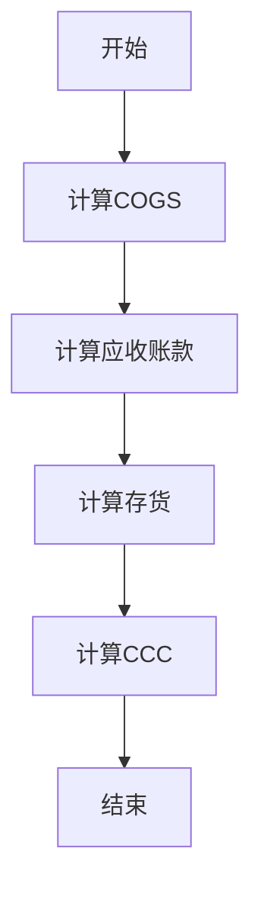
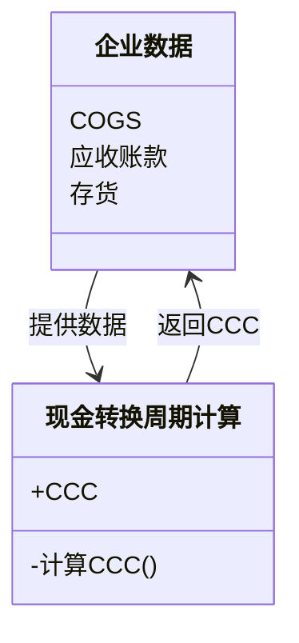
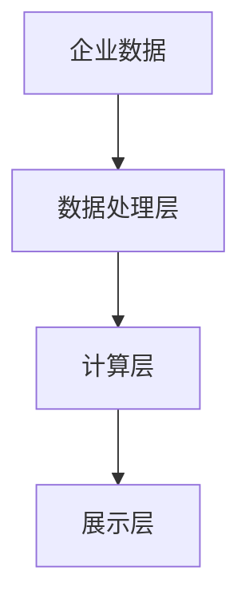

                 


# 彼得林奇对公司现金转换周期的跨行业比较研究

## 关键词：
- 彼得林奇
- 现金转换周期（CCC）
- 跨行业比较
- 投资分析
- 现金流管理

## 摘要：
本文深入探讨了彼得林奇对公司现金转换周期（Cash Conversion Cycle，简称CCC）的分析方法，并结合不同行业的特点，进行了跨行业比较研究。通过分析CCC的核心概念、计算方法及其在各行业中的应用，本文揭示了如何利用CCC评估企业的运营效率和财务健康状况，为投资者提供了跨行业的比较分析框架和实战案例。

---

# 第一部分：背景介绍

## 第1章：现金转换周期（CCC）的基本概念

### 1.1 现金转换周期的定义
现金转换周期（Cash Conversion Cycle，CCC）是彼得林奇提出的一个关键财务指标，用于衡量企业从购买原材料到最终收到现金的时间跨度。CCC越短，说明企业资金周转效率越高，运营能力越强。

### 1.2 彼得林奇与现金转换周期
彼得林奇是美国著名投资专家，曾管理富达麦哲伦基金，创造了辉煌的投资业绩。他在投资分析中引入了CCC的概念，认为CCC是评估企业运营效率的重要指标，能够帮助投资者识别企业的潜在问题和竞争优势。

### 1.3 跨行业比较的意义
跨行业比较可以帮助投资者理解不同行业在CCC上的差异，从而更准确地评估企业的财务健康状况。例如，零售业和制造业在库存管理和应收账款回收上的差异，会影响CCC的表现。

---

## 第2章：现金转换周期的计算方法

### 2.1 现金转换周期的公式
CCC的公式为：  
$$CCC = \text{COGS} + \text{应收账款} + \text{存货}$$  
其中，COGS是企业销售商品的成本，应收账款是企业尚未收回的货款，存货是企业的库存。

### 2.2 影响CCC的因素
- **销售周期**：从发货到收到货款的时间。
- **库存周转周期**：库存的销售速度。
- **应收账款回收周期**：客户支付货款的时间。

### 2.3 CCC与企业财务健康的关系
CCC短的企业通常具有更强的现金流管理能力，能够更快地将投入转化为现金收益，从而提高企业的抗风险能力。

---

# 第二部分：核心概念与联系

## 第3章：现金转换周期的核心要素

### 3.1 核心概念原理
CCC的核心在于衡量企业将原材料转化为最终现金流入的能力。通过分析销售、库存和应收账款的周期，可以评估企业的运营效率。

### 3.2 不同行业的特征对比
以下表格展示了不同行业在CCC上的关键差异：

| 行业     | 特征                 | CCC表现       |
|----------|----------------------|---------------|
| 零售业   | 库存周转快，应收账款少 | 较短           |
| 制造业   | 库存周转慢，应收账款多 | 较长           |
| 技术业   | 应收账款回收快，库存低 | 中等           |

---

# 第三部分：算法原理

## 第4章：现金转换周期的计算流程

### 4.1 算法流程图


### 4.2 Python代码实现
```python
def calculate_ccc(cogs, accounts_receivable, inventory):
    return cogs + accounts_receivable + inventory

# 示例数据
cogs = 500000
accounts_receivable = 100000
inventory = 200000

ccc = calculate_ccc(cogs, accounts_receivable, inventory)
print(f"现金转换周期(CCC)：{ccc}")
```

---

## 第5章：数学模型与公式

### 5.1 现金转换周期的数学模型
$$CCC = COGS + \text{应收账款} + \text{存货}$$

### 5.2 示例计算
假设某公司COGS为500,000美元，应收账款为100,000美元，存货为200,000美元，则：
$$CCC = 500,000 + 100,000 + 200,000 = 800,000 \text{美元}$$

---

# 第四部分：系统分析与架构设计

## 第6章：系统分析与架构设计

### 6.1 系统功能设计
以下是系统功能的领域模型：


### 6.2 系统架构设计
以下是系统的架构图：


---

# 第五部分：项目实战

## 第7章：项目实战

### 7.1 环境安装
需要安装Python和Pandas库：
```bash
pip install pandas
```

### 7.2 核心代码实现
```python
import pandas as pd

# 数据加载
data = pd.DataFrame({
    '公司': ['零售业A', '制造业B', '技术业C'],
    'COGS': [500000, 600000, 450000],
    '应收账款': [80000, 120000, 90000],
    '存货': [150000, 200000, 100000]
})

# 计算CCC
data['CCC'] = data['COGS'] + data['应收账款'] + data['存货']

print(data)
```

### 7.3 案例分析
通过上述代码，可以得到不同行业公司在CCC上的表现，从而进行跨行业比较。

---

## 第8章：最佳实践

### 8.1 总结与经验
- **数据质量**：确保数据准确无误。
- **行业差异**：考虑行业特点，灵活调整分析方法。
- **持续监控**：定期更新数据，跟踪CCC变化。

### 8.2 小结
本文通过详细分析彼得林奇的现金转换周期，结合跨行业比较，为投资者提供了实用的分析工具和方法。

### 8.3 注意事项
- 确保数据来源可靠。
- 结合其他财务指标综合分析。
- 定期更新分析结果。

### 8.4 拓展阅读
- 《彼得林奇的成功投资》
- 《财务报表分析》

---

# 作者
作者：AI天才研究院  
联系邮箱：[contact@aimaster.ai](mailto:contact@aimaster.ai)  
更多内容请访问：[aimaster.ai](https://aimaster.ai)

