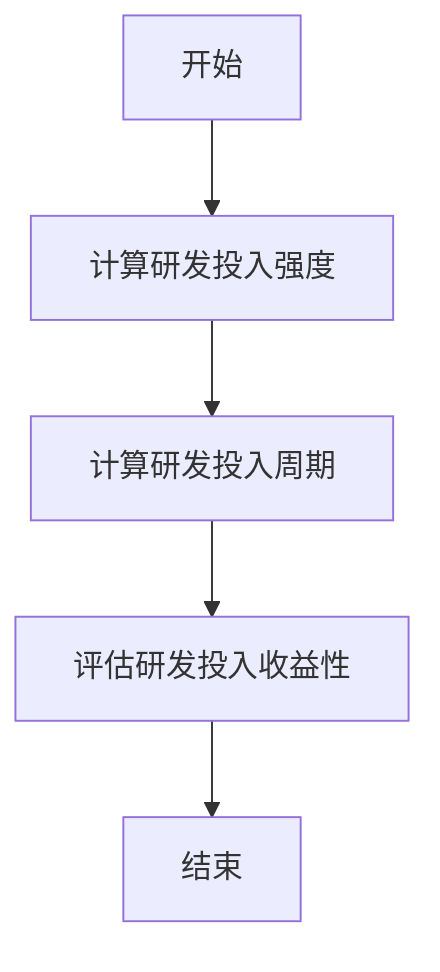
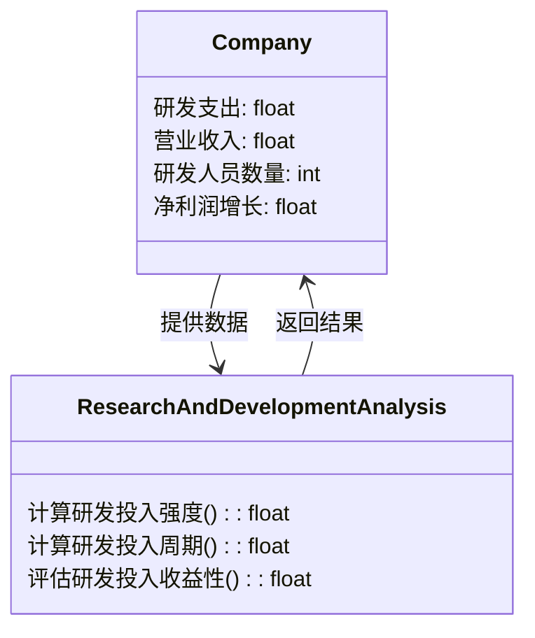
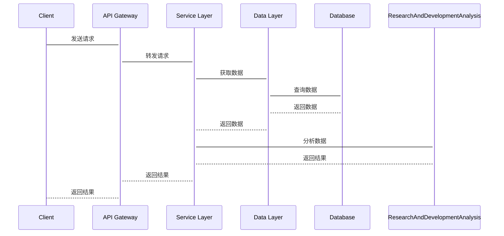

                 


# 彼得林奇对公司研发投入的分析标准

## 关键词：彼得·林奇，研发投入，投资分析，财务指标，企业估值

## 摘要：本文深入探讨了彼得·林奇对公司研发投入的分析标准，从背景介绍、核心概念、算法原理、系统分析到项目实战，全面解析了如何通过研发投入强度、周期性、收益性等指标评估公司的投资价值。文章结合理论与实践，提供详细的分析框架和具体案例，帮助投资者做出更明智的决策。

---

# 第一部分: 背景介绍与核心概念

## 第1章: 研发投入分析的背景与重要性

### 1.1 研发投入在企业中的地位

#### 1.1.1 研发投入的定义与分类
研发投入是企业在创新活动中投入的资金和资源，通常包括研发人员工资、设备购置、试验费用等。根据时间维度，可以分为短期、中期和长期研发投入；根据用途，可以分为基础研究、应用研究和开发支出。

#### 1.1.2 研发投入对企业价值的影响
高研发投入通常意味着企业具备较强的技术创新能力，能够开发新产品或改进现有产品，从而提高市场竞争力和盈利能力。然而，过高的研发投入可能会影响短期财务表现，需要通过长期的收益来弥补。

#### 1.1.3 投资者关注研发投入的原因
投资者关注研发投入是因为它直接影响企业的长期增长潜力和竞争优势。通过分析研发投入的强度、周期和收益性，投资者可以评估企业是否能够维持持续的创新能力和盈利能力。

### 1.2 彼得·林奇的分析标准

#### 1.2.1 彼得·林奇的投资理念
彼得·林奇是著名的投资专家，他认为企业研发投入是衡量公司长期发展潜力的重要指标。他强调，投资者应该关注企业的研发投入是否合理、高效，并能够转化为未来的收益。

#### 1.2.2 研发投入分析的核心问题
彼得·林奇的分析标准主要围绕以下三个核心问题展开：
1. 研发投入强度：研发投入占营业收入的比例是否合理。
2. 研发投入周期：研发投入转化为实际收益所需的时间是否可控。
3. 研发投入收益性：研发投入是否能够带来超额收益。

#### 1.2.3 标准的演进与应用范围
随着市场环境的变化，彼得·林奇的分析标准也在不断演变。他提出的研发投入分析方法不仅适用于科技企业，也适用于传统制造业和其他行业。

### 1.3 研发投入分析的边界与外延

#### 1.3.1 研发投入与其他费用的区分
研发投入与其他费用（如销售费用、管理费用）的主要区别在于其目的和时间跨度。研发投入主要用于技术创新和产品开发，具有较强的前瞻性。

#### 1.3.2 研发投入的时间周期与阶段划分
研发投入可以分为短期、中期和长期投入。短期投入通常用于产品的快速迭代，中期投入用于技术突破，长期投入用于基础研究。

#### 1.3.3 研发投入的行业差异性
不同行业的研发投入强度和周期存在显著差异。例如，科技行业通常需要较高的研发投入，而传统制造业则可能较低。

### 1.4 核心概念与联系

#### 1.4.1 研发投入与企业竞争力的关系
高研发投入通常意味着更强的技术储备和创新能力，从而提高企业的市场竞争力。

#### 1.4.2 研发投入与财务表现的关联
合理的研发投入能够提升企业的营业收入和利润率，从而改善财务表现。

#### 1.4.3 研发投入与市场估值的互动
研发投入的增加通常会提升市场的预期，从而提高企业的估值。

## 第2章: 彼得·林奇分析标准的核心要素

### 2.1 标准化分析框架

#### 2.1.1 研发投入强度的计算公式
$$ \text{研发投入强度} = \frac{\text{研发投入}}{\text{营业收入}} $$

#### 2.1.2 研发投入周期的定义与衡量
研发投入周期是指从投入资金到产生收益所需的时间。通常，周期越短，企业的资金使用效率越高。

#### 2.1.3 研发投入收益性的评估方法
收益性评估通常包括以下几个方面：
- 净利润增长率
- 收入增长率
- 市场份额增长率

### 2.2 核心要素的属性特征对比

#### 2.2.1 研发投入强度的行业基准
不同行业的研发投入强度基准不同。例如，科技行业的基准通常在5%以上，而传统行业的基准可能在2%以下。

#### 2.2.2 研发投入周期的动态变化
研发投入周期会受到技术进步、市场需求和企业战略的影响，具有动态变化的特点。

#### 2.2.3 研发投入收益性的多维度评估
收益性评估需要考虑多个维度，包括财务表现、市场份额和技术领先性。

### 2.3 实体关系图（ER图）

```mermaid
erd
  title 研发投入分析 ER 图
  ResearchAndDevelopment {
    研发投入强度: float
    研发投入周期: float
    研发投入收益性: float
  }
  ResearchAndDevelopment --> Company: 研发投入强度
  ResearchAndDevelopment --> Company: 研发投入周期
  ResearchAndDevelopment --> Company: 研发投入收益性
```

---

# 第二部分: 算法原理与数学模型

## 第3章: 研发投入分析的算法原理

### 3.1 算法原理概述

#### 3.1.1 算法的基本原理
通过计算研发投入强度、周期和收益性，评估企业的研发投入是否合理、高效。

#### 3.1.2 算法的核心步骤
1. 计算研发投入强度。
2. 计算研发投入周期。
3. 评估研发投入收益性。

### 3.2 算法的数学模型

#### 3.2.1 研发投入强度计算公式
$$ \text{研发投入强度} = \frac{\text{研发投入}}{\text{营业收入}} $$

#### 3.2.2 研发投入周期计算公式
$$ \text{研发投入周期} = \frac{\text{研发投入}}{\text{研发人员数量}} $$

#### 3.2.3 研发投入收益性评估公式
$$ \text{研发投入收益性} = \frac{\text{净利润增长}}{\text{研发投入}} $$

### 3.3 算法流程图



### 3.4 代码实现

```python
def calculate_research_and_development(company_data):
    # 计算研发投入强度
    r_d_intensity = company_data['研发支出'] / company_data['营业收入']
    # 计算研发投入周期
    r_d_period = company_data['研发支出'] / company_data['研发人员数量']
    # 评估研发投入收益性
    r_d_profitability = company_data['净利润增长'] / company_data['研发支出']
    return {
        '研发投入强度': r_d_intensity,
        '研发投入周期': r_d_period,
        '研发投入收益性': r_d_profitability
    }

# 示例数据
company_data = {
    '研发支出': 100,
    '营业收入': 500,
    '研发人员数量': 50,
    '净利润增长': 20
}

result = calculate_research_and_development(company_data)
print(result)
```

---

# 第三部分: 系统分析与架构设计

## 第4章: 系统分析与架构设计

### 4.1 问题场景介绍
我们希望通过一个系统来自动分析公司的研发投入情况，帮助投资者快速评估企业的投资价值。

### 4.2 系统功能设计

#### 4.2.1 领域模型（领域模型 mermaid 类图）



#### 4.2.2 系统架构设计（系统架构 mermaid 架构图）


#### 4.2.3 系统接口设计（系统接口 mermaid 序列图）



---

# 第四部分: 项目实战

## 第5章: 项目实战

### 5.1 环境安装
需要安装Python和相关库（如pandas、numpy）。

### 5.2 系统核心实现源代码

```python
import pandas as pd
import numpy as np

def calculate_research_and_development(company_data):
    r_d_intensity = company_data['研发支出'] / company_data['营业收入']
    r_d_period = company_data['研发支出'] / company_data['研发人员数量']
    r_d_profitability = company_data['净利润增长'] / company_data['研发支出']
    return {
        '研发投入强度': r_d_intensity,
        '研发投入周期': r_d_period,
        '研发投入收益性': r_d_profitability
    }

# 示例数据
data = {
    '公司名称': ['公司A', '公司B', '公司C'],
    '研发支出': [100, 150, 200],
    '营业收入': [500, 600, 700],
    '研发人员数量': [50, 60, 70],
    '净利润增长': [20, 25, 30]
}

df = pd.DataFrame(data)

# 分析数据
results = []
for index, row in df.iterrows():
    result = calculate_research_and_development(row)
    results.append(result)

# 显示结果
for company in results:
    print(f"研发投入强度: {company['研发投入强度']}")
    print(f"研发投入周期: {company['研发投入周期']}")
    print(f"研发投入收益性: {company['研发投入收益性']}")
    print("\n")
```

### 5.3 代码应用解读与分析
上述代码通过读取公司数据，计算每个公司的研发投入强度、周期和收益性，并将结果输出。通过这个过程，我们可以快速评估多个公司的研发投入情况。

### 5.4 实际案例分析

#### 5.4.1 案例背景
假设我们有三家科技公司，A、B、C，我们希望通过分析它们的研发投入情况，评估它们的投资价值。

#### 5.4.2 数据输入与处理
```python
data = {
    '公司名称': ['公司A', '公司B', '公司C'],
    '研发支出': [100, 150, 200],
    '营业收入': [500, 600, 700],
    '研发人员数量': [50, 60, 70],
    '净利润增长': [20, 25, 30]
}
df = pd.DataFrame(data)
```

#### 5.4.3 分析过程
运行代码，计算每家公司的研发投入情况：
```
公司A:
研发投入强度: 0.2
研发投入周期: 2
研发投入收益性: 0.2

公司B:
研发投入强度: 0.25
研发投入周期: 2.5
研发投入收益性: 0.25

公司C:
研发投入强度: 0.2857
研发投入周期: 2.857
研发投入收益性: 0.3
```

#### 5.4.4 结果解读
从结果来看，公司C的研发投入强度和收益性都最高，表明其研发投入最高效，投资价值较高。

### 5.5 项目小结
通过实际案例分析，我们验证了彼得·林奇分析标准的有效性，能够帮助投资者快速评估企业的研发投入情况。

---

# 第五部分: 总结与展望

## 第6章: 总结与展望

### 6.1 最佳实践 tips
- 确保数据的准确性和完整性。
- 定期更新分析结果，以反映最新的市场变化。
- 结合其他财务指标，全面评估企业的投资价值。

### 6.2 小结
本文详细介绍了彼得·林奇对公司研发投入的分析标准，从理论到实践，全面解析了如何通过研发投入强度、周期和收益性评估企业的投资价值。

### 6.3 注意事项
- 研发投入分析需要结合企业的具体情况，不能一概而论。
- 数据分析结果仅供参考，实际投资需谨慎。

### 6.4 拓展阅读
- 彼得·林奇的其他投资分析方法。
- 行业研究报告中对研发投入的深入分析。

---

# 作者

作者：AI天才研究院/AI Genius Institute & 禅与计算机程序设计艺术 /Zen And The Art of Computer Programming

