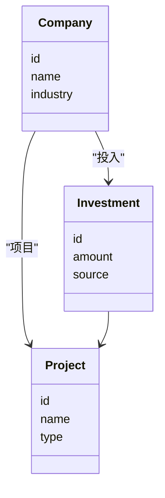
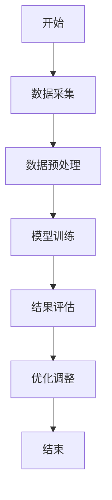
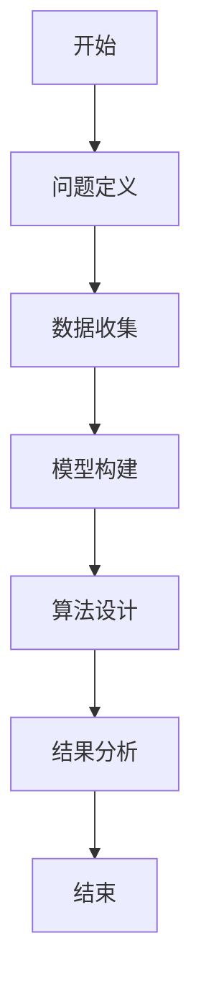

                 


# 彼得林奇对公司研发投入结构的深度分析

## 关键词：彼得林奇，研发投入结构，企业竞争力，投资分析，ER实体关系图，算法流程图，Python代码实现，系统架构设计

## 摘要：本文从投资分析的角度，深度剖析了彼得林奇对公司研发投入结构的分析方法。通过定义研发投入结构的核心概念，构建分析框架，结合系统架构设计和实际案例分析，揭示了研发投入对企业竞争力的影响，并提供了投资策略和最佳实践。

---

# 第一部分: 彼得林奇对公司研发投入结构的背景与核心概念

## 第1章: 研发投入结构的核心概念与问题背景

### 1.1 研发投入结构的定义与背景

#### 1.1.1 研发投入的定义
研发投入（R&D expenditure）是企业在研究与开发活动上的资金投入，旨在通过创新提升产品竞争力和企业价值。企业研发投入的主体通常是公司内部的研发部门或外部合作机构。

#### 1.1.2 研发投入结构的背景与重要性
在现代商业环境中，研发投入是企业保持竞争优势的关键因素。随着技术进步的加速，研发投入结构的优化变得尤为重要。企业需要通过科学的研发投入结构，确保资金的有效利用和技术创新的持续推进。

#### 1.1.3 研发投入结构与企业竞争力的关系
研发投入结构直接影响企业的创新能力。合理的研发投入结构能够优化资源配置，提高研发效率，从而增强企业的市场竞争力。企业通过科学的研发投入结构，可以更好地应对市场变化和技术挑战。

### 1.2 彼得林奇的分析视角

#### 1.2.1 彼得林奇的投资理念
彼得·林奇（Peter Lynch）是全球著名投资专家，以其对股票市场的深入分析和长期投资策略闻名。他强调长期投资和基本面分析，注重企业的内在价值和成长潜力。

#### 1.2.2 彼得林奇对研发投入的关注点
彼得林奇认为，企业的研发投入是评估其长期增长潜力的重要指标。他关注企业研发投入的结构合理性、资金分配效率以及研发成果的转化能力。

#### 1.2.3 彼得林奇分析方法的适用性
彼得林奇的分析方法适用于不同行业的企业，尤其在科技和制造行业表现突出。他通过分析企业的研发投入结构，评估其未来的市场表现和投资价值。

## 第2章: 研发投入结构的核心概念与联系

### 2.1 研发投入结构的核心要素

#### 2.1.1 研发投入的主体
- 公司内部研发部门
- 外部合作机构（如高校、研究机构）

#### 2.1.2 研发投入的资金来源
- 公司自有资金
- 银行贷款
- 风险投资

#### 2.1.3 研发投入的项目类型
- 基础研究
- 应用研究
- 开发阶段

### 2.2 研发投入结构与企业战略的关系

#### 2.2.1 研发投入与企业长期战略
企业将研发投入视为长期战略的一部分，通过持续的技术创新巩固市场地位。合理的研发投入结构能够支持企业的长期发展目标。

#### 2.2.2 研发投入与企业短期目标
短期内，企业需要平衡研发投入与利润的关系，确保资金的高效利用。短期目标通常包括产品的快速迭代和市场竞争力的提升。

#### 2.2.3 研发投入与企业核心竞争力的关联
研发投入直接关系到企业的核心竞争力。通过优化研发投入结构，企业可以提高技术创新能力，增强市场竞争力。

### 2.3 研发投入结构的ER实体关系图

```mermaid
erDiagram
    company {
        id
        name
        industry
    }
    project {
        id
        name
        type
    }
    investment {
        id
        amount
        source
    }
    company -- investment : "投入"
    company -- project : "项目"
```

## 第3章: 研发投入结构的分析方法与工具

### 3.1 研发投入结构的分析框架

#### 3.1.1 问题场景介绍
企业需要优化研发投入结构，提高研发效率和创新能力。通过构建合理的分析框架，可以有效评估研发投入的合理性和效率。

#### 3.1.2 分析框架的构建
分析框架包括数据采集、数据处理、分析评估和结果反馈等步骤，帮助企业在研发投入结构中找到优化点。

#### 3.1.3 分析框架的验证与优化
通过实际案例验证分析框架的有效性，并根据反馈不断优化，确保分析框架能够适应不同企业的具体需求。

### 3.2 研发投入结构的系统分析与架构设计

#### 3.2.1 问题场景介绍
企业需要一个系统化的分析框架，全面评估研发投入结构的合理性。系统分析包括数据收集、分析模型构建和结果评估等环节。

#### 3.2.2 系统功能设计（领域模型）



#### 3.2.3 系统架构设计


## 第4章: 研发投入结构的算法实现与数学模型

### 4.1 研发投入结构的评估算法

#### 4.1.1 算法流程图



#### 4.1.2 Python代码实现

```python
def calculate_r_d_efficiency(company_data):
    # 计算研发投入效率
    roe = company_data['net_income'] / company_data['total_assets']
    roa = company_data['net_income'] / company_data['total_revenue']
    return roe * roa

# 示例数据
data = {
    'net_income': 100,
    'total_assets': 500,
    'total_revenue': 200
}

print(calculate_r_d_efficiency(data))
```

#### 4.1.3 算法的数学模型与公式

$$ \text{ROE} = \frac{\text{净利润}}{\text{总资产}} $$

$$ \text{ROA} = \frac{\text{净利润}}{\text{总收入}} $$

$$ \text{研发投入效率} = \text{ROE} \times \text{ROA} $$

### 4.2 研发投入结构的优化算法

#### 4.2.1 算法流程图



#### 4.2.2 Python代码实现

```python
import pandas as pd

def optimize_r_d_structure(dataframe):
    # 优化研发投入结构
    dataframe['研发效率'] = dataframe['研发投入'] / dataframe['总收入']
    return dataframe

# 示例数据
df = pd.DataFrame({
    '公司': ['A', 'B', 'C'],
    '研发投入': [100, 150, 200],
    '总收入': [500, 600, 700]
})

optimized_df = optimize_r_d_structure(df)
print(optimized_df)
```

---

# 结语

通过系统的分析和优化，企业可以更好地管理研发投入结构，提升创新能力，增强市场竞争力。彼得林奇的投资理念为我们提供了宝贵的分析视角，结合系统的架构设计和实际案例分析，帮助企业优化研发资源配置，实现长期稳健发展。

---

**作者：AI天才研究院/AI Genius Institute & 禅与计算机程序设计艺术 /Zen And The Art of Computer Programming**

