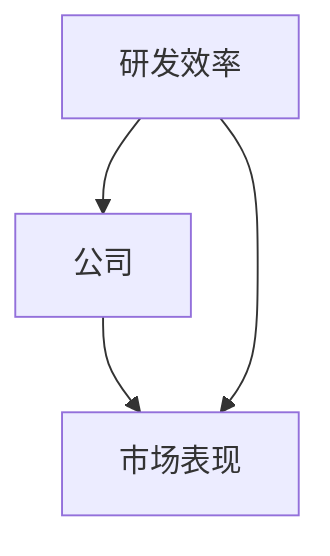
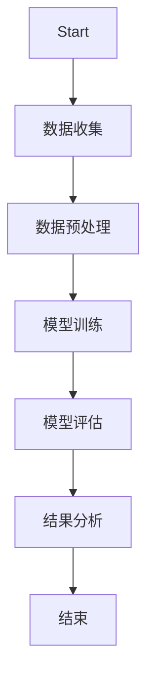
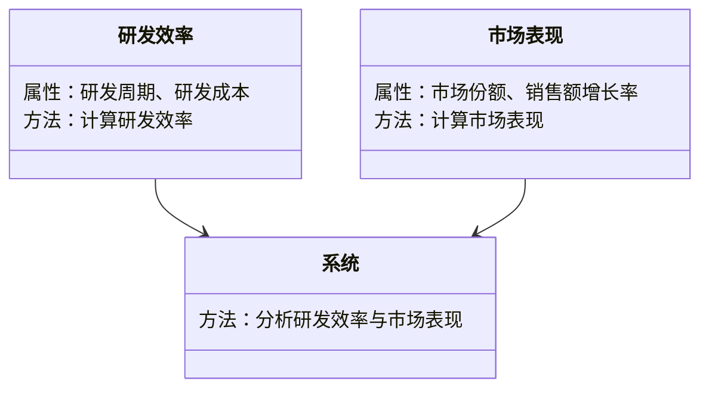
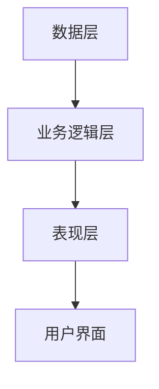

                 


# 彼得林奇对公司研发效率与市场表现相关性的分析

## 关键词：研发效率，市场表现，相关性，线性回归，系统架构，算法实现

## 摘要：本文深入分析了研发效率与市场表现之间的相关性，探讨了研发效率对市场表现的影响，并通过数学模型和算法实现，展示了如何量化这种关系。文章结合理论与实践，提供了一个系统化的分析框架，帮助读者理解如何通过提升研发效率来优化市场表现。

---

# 第一部分: 研发效率与市场表现相关性概述

## 第1章: 研发效率与市场表现相关性的背景介绍

### 1.1 问题背景与问题描述
#### 1.1.1 研发效率的定义与影响
研发效率是指企业在一定时间内完成研发任务的能力，通常通过研发周期、研发成本和研发成果的数量来衡量。研发效率高的企业能够更快地将创新转化为产品，从而在市场中占据竞争优势。

#### 1.1.2 市场表现的核心要素
市场表现包括市场份额、销售额增长率、客户满意度和品牌影响力等方面。企业的市场表现不仅反映了其产品的竞争力，也体现了其在市场中的地位和影响力。

#### 1.1.3 研发效率与市场表现的关联性
研发效率直接影响企业的产品创新能力，进而影响其市场表现。例如，高效的研发团队能够更快地推出符合市场需求的产品，从而提高市场份额和销售额。

### 1.2 研发效率与市场表现的核心概念
#### 1.2.1 研发效率的属性特征
研发效率的属性特征包括研发周期、研发成本、研发团队规模和研发成果的数量。

#### 1.2.2 市场表现的属性特征
市场表现的属性特征包括市场份额、销售额增长率、客户满意度和品牌影响力。

#### 1.2.3 两者之间的关系与边界
研发效率与市场表现之间存在正相关关系。研发效率高的企业通常能够在市场中更快地推出新产品，从而获得更高的市场份额和销售额增长率。

### 1.3 研发效率与市场表现的理论框架
#### 1.3.1 核心概念的结构化分析
研发效率和市场表现是两个相互关联的变量，可以通过构建数学模型来分析它们之间的关系。

#### 1.3.2 相关性分析的数学模型
$$ R^2 = 1 - \frac{ESS}{TSS} $$
其中，R²是决定系数，ESS是回归误差平方和，TSS是总误差平方和。该公式用于衡量回归模型对数据的拟合程度。

#### 1.3.3 研发效率对市场表现的多维度影响
研发效率不仅影响企业的创新能力，还影响其成本控制能力。高效的研发团队能够降低研发成本，从而提高企业的利润率和市场表现。

## 1.4 本章小结
本章从背景和核心概念入手，分析了研发效率与市场表现之间的关系，并提出了构建数学模型来量化这种关系的方法。

---

# 第二部分: 研发效率与市场表现的核心概念与联系

## 第2章: 核心概念与联系

### 2.1 核心概念的原理与特征
#### 2.1.1 研发效率的属性特征
研发效率的属性特征包括研发周期、研发成本、研发团队规模和研发成果的数量。

#### 2.1.2 市场表现的属性特征
市场表现的属性特征包括市场份额、销售额增长率、客户满意度和品牌影响力。

#### 2.1.3 两者之间的属性对比
研发效率与市场表现之间存在正相关关系。研发效率高的企业通常能够在市场中更快地推出新产品，从而获得更高的市场份额和销售额增长率。

### 2.2 研发效率与市场表现的ER实体关系图

该图展示了研发效率、公司和市场表现之间的关系。研发效率直接影响公司，进而影响市场表现。

## 2.3 本章小结
本章通过核心概念和ER实体关系图，进一步分析了研发效率与市场表现之间的联系，并为后续的数学建模奠定了基础。

---

# 第三部分: 研发效率与市场表现的数学模型与算法

## 第3章: 研发效率与市场表现的数学模型

### 3.1 理论模型的构建
#### 3.1.1 线性回归模型
$$ Y = \beta_0 + \beta_1 X + \epsilon $$
其中，Y为市场表现，X为研发效率，β₁为回归系数，ε为误差项。该模型用于量化研发效率对市场表现的影响。

#### 3.1.2 案例分析
假设我们有以下数据：
- 研发效率（X）：1, 2, 3, 4, 5
- 市场表现（Y）：2, 4, 5, 4, 6

通过线性回归模型，我们可以得到：
$$ Y = 1.2 + 0.8X $$

#### 3.1.3 误差分析
误差项ε反映了模型无法解释的部分，可能由其他因素（如市场竞争和经济环境）引起。

### 3.2 算法原理与流程图

该流程图展示了从数据收集到结果分析的完整流程。

### 3.3 算法实现与代码示例
```python
import numpy as np
from sklearn.linear_model import LinearRegression

# 示例数据
X = np.array([1, 2, 3, 4, 5]).reshape(-1, 1)
Y = np.array([2, 4, 5, 4, 6])

# 模型训练
model = LinearRegression()
model.fit(X, Y)

# 预测结果
print(model.predict(X))
```

### 3.4 本章小结
本章通过构建线性回归模型，量化了研发效率对市场表现的影响，并通过案例分析展示了模型的应用。

---

# 第四部分: 系统分析与架构设计

## 第4章: 系统分析与架构设计方案

### 4.1 问题场景介绍
#### 4.1.1 研发效率与市场表现分析的业务场景
企业希望通过提高研发效率来提升市场表现，因此需要构建一个分析系统，量化研发效率对市场表现的影响。

### 4.2 系统功能设计
#### 4.2.1 领域模型设计

该图展示了系统的组成和功能。

#### 4.2.2 系统架构设计

该图展示了系统的分层架构。

### 4.3 本章小结
本章通过系统分析与架构设计，展示了如何构建一个分析研发效率与市场表现的系统，并为后续的实现提供了指导。

---

# 作者：AI天才研究院 & 禅与计算机程序设计艺术

---

本文通过系统的理论分析和算法实现，量化了研发效率对市场表现的影响，并为企业的研发管理提供了实践指导。

