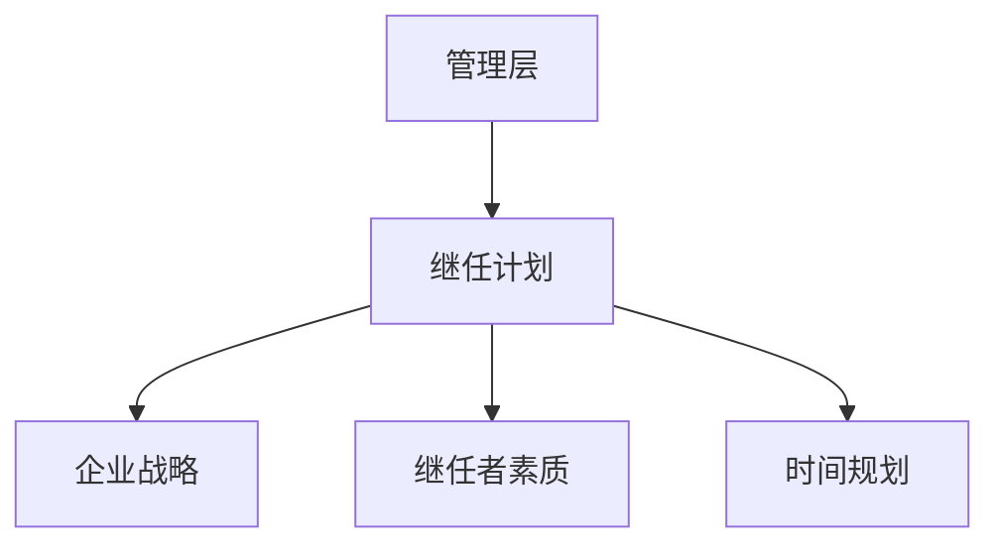
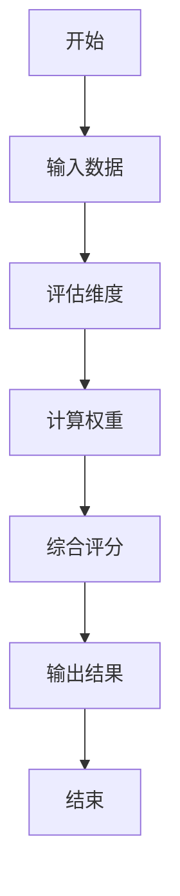
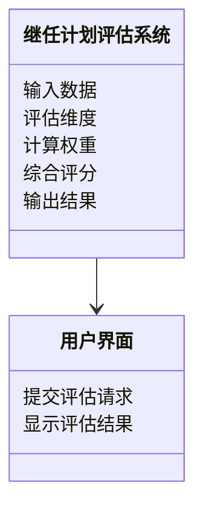
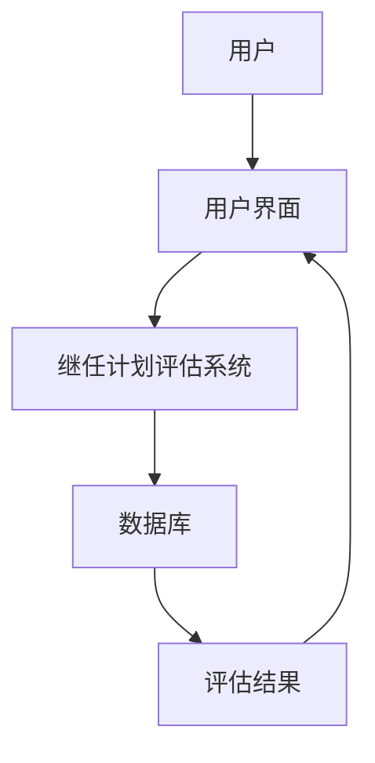
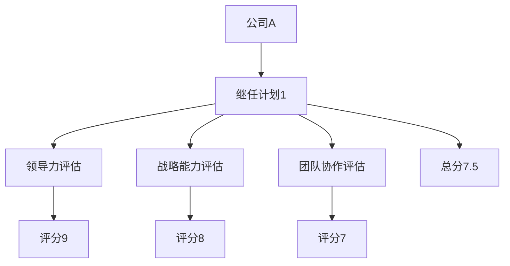

                 


# 彼得林奇对公司管理层继任计划的质量评估

---

## 关键词：彼得·林奇，管理层继任计划，质量评估，投资分析，领导力

---

## 摘要：  
本文深入探讨了彼得·林奇对公司管理层继任计划的质量评估方法。通过分析管理层继任计划的核心要素、评估标准和实施策略，本文为投资者和企业管理者提供了实用的指导和建议。文章结合理论与实际案例，详细阐述了如何从领导力、战略规划和团队协作等多个维度对继任计划进行评估，以确保企业长期稳定发展。

---

# 第一部分: 引言

## 第1章: 彼得·林奇与管理层继任计划评估的背景

### 1.1 彼得·林奇的背景与投资理念
彼得·林奇是全球著名的职业经理人和投资专家，以其在富达投资集团（Fidelity）的卓越表现而闻名。他不仅是《财富》杂志的封面人物，还著有多本畅销书，如《彼得·林奇的成功投资法则》。林奇的投资理念强调对管理层的深入分析，他认为，管理层的能力和继任计划是企业长期成功的关键因素。

### 1.2 管理层继任计划的重要性
管理层继任计划是企业在领导层发生变化时，确保业务连续性和稳定性的关键机制。无论是内部提拔还是外部招聘，继任计划都需要经过严格的评估和规划。林奇认为，继任计划的质量直接关系到企业的未来发展。

### 1.3 本书的目的与结构
本文旨在通过彼得·林奇的视角，系统地分析和评估管理层继任计划的质量。文章结构清晰，从理论到实践，帮助读者理解如何制定和优化继任计划。

---

# 第二部分: 背景介绍

## 第2章: 管理层继任计划的核心概念

### 2.1 继任计划的定义与分类
- **定义**：继任计划是企业在管理层职位空缺时，通过内部培养或外部招聘来填补职位的过程。
- **分类**：包括内部培养和外部招聘两种方式，各有优缺点。

### 2.2 继任计划的重要性与挑战
- **重要性**：确保企业战略目标的延续性，避免因管理层变动导致的业务中断。
- **挑战**：包括时间规划、人才储备和评估标准的制定。

### 2.3 彼得·林奇的评估标准
- **领导力**：继任者是否具备领导团队的能力。
- **战略能力**：继任者是否能够制定和执行有效的战略。
- **团队协作**：继任者是否能够与现有团队良好合作。

---

# 第三部分: 核心概念与联系

## 第3章: 管理层继任计划的核心要素

### 3.1 继任计划的核心要素
- **企业战略目标**：继任计划必须与企业战略目标一致。
- **继任者素质**：继任者的能力和经验是关键。
- **时间规划**：继任计划需要合理的时间安排。

### 3.2 核心要素的对比分析
以下是一个对比表格，展示了内部培养和外部招聘的优缺点：

| 评估维度       | 内部培养 | 外部招聘 |
|----------------|----------|----------|
| 成本           | 较低     | 较高     |
| 风险           | 较低     | 较高     |
| 文化适应性     | 较好     | 较差     |
| 时间           | 较长     | 较短     |

### 3.3 实体关系图
以下是管理层继任计划的核心要素之间的关系图：



---

# 第四部分: 算法原理讲解

## 第4章: 继任计划质量评估模型

### 4.1 评估模型的概述
- **模型目标**：量化评估继任计划的质量。
- **输入**：继任者的素质、企业战略目标、时间规划。
- **输出**：继任计划的质量评分（0-10分）。

### 4.2 算法流程图
以下是一个继任计划质量评估模型的流程图：



---

# 第五部分: 系统分析与架构设计

## 第5章: 管理层继任计划评估系统的架构

### 5.1 问题场景介绍
- **问题场景**：企业需要评估多个管理层继任计划的质量，确保选择最优方案。
- **项目介绍**：开发一个基于彼得·林奇评估标准的继任计划质量评估系统。

### 5.2 系统功能设计
以下是系统功能模块的类图：



### 5.3 系统架构设计
以下是系统架构的简单设计图：



---

# 第六部分: 项目实战

## 第6章: 继任计划质量评估系统的实现

### 6.1 环境安装
- **工具**：Python、Mermaid、Markdown。
- **步骤**：安装所需的开发环境和工具。

### 6.2 核心实现代码
以下是继任计划质量评估模型的核心代码：

```python
def calculate_score(factors):
    score = 0
    for factor in factors:
        score += factor.weight * factor.value
    return score

# 示例输入
class Factor:
    def __init__(self, name, weight, value):
        self.name = name
        self.weight = weight
        self.value = value

leadership = Factor("领导力", 0.4, 9)
strategy = Factor("战略能力", 0.3, 8)
teamwork = Factor("团队协作", 0.3, 7)

score = calculate_score([leadership, strategy, teamwork])
print(f"继任计划质量评分为: {score}")
```

### 6.3 案例分析
以下是某公司继任计划的评估案例：



---

# 第七部分: 总结与拓展

## 第7章: 最佳实践与小结

### 7.1 最佳实践
- **定期评估**：企业应定期评估继任计划的质量。
- **多元化评估**：结合内部和外部评估方法。
- **持续优化**：根据评估结果不断优化继任计划。

### 7.2 小结
本文通过彼得·林奇的视角，系统地分析了管理层继任计划的质量评估方法。通过理论分析、算法设计和系统实现，为读者提供了全面的指导。

---

## 作者：AI天才研究院 & 禅与计算机程序设计艺术

---

希望这篇文章能为您提供有价值的信息和启发！

