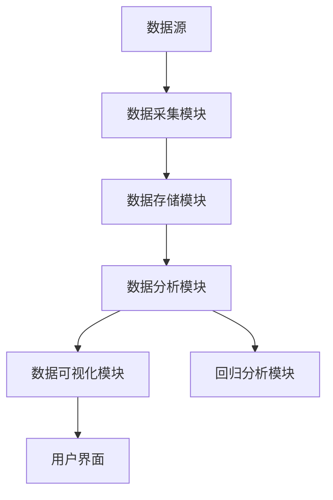

                 


# 彼得林奇对公司自由现金流与股价相关性的动态分析

## 关键词：自由现金流，股价，相关性，动态分析，彼得林奇，投资策略，数学模型

## 摘要：  
本文系统地探讨了自由现金流与股价之间的相关性动态，结合彼得林奇的投资理念，深入分析了自由现金流在企业估值与股价波动中的作用。通过数学模型和实际案例，揭示了自由现金流与股价的相关性如何在不同市场环境下变化，并提出了基于自由现金流的动态投资策略。文章内容涵盖背景介绍、核心概念、算法原理、系统设计、项目实战及最佳实践，为投资者和研究者提供了全面的理论与实践指导。

---

## 第五章: 自由现金流与股价相关性的原理

### 5.1 自由现金流与股价的相关性基础

自由现金流（Free Cash Flow，FCF）是企业在扣除所有运营成本、税费以及再投资支出后的剩余现金，反映了企业真实的盈利能力和财务健康状况。股价（Stock Price）则是市场对企业价值的体现，受多种因素影响，包括企业基本面、市场情绪、宏观经济环境等。自由现金流与股价之间的相关性分析，旨在揭示两者之间的动态关系，为企业估值和投资决策提供依据。

#### 5.1.1 自由现金流与股价的相关性基础

- **自由现金流的定义**：自由现金流 = 经营活动现金流 - 资本 expenditures（资本支出）。
- **股价的定义**：股价是市场对企业未来现金流的折现值，反映市场对企业的价值评估。
- **相关性基础**：自由现金流是企业价值的核心驱动因素，而股价是对企业价值的市场反映，因此两者之间存在内在联系。

#### 5.1.2 自由现金流与股价相关性的动态特征

- **时间维度**：自由现金流与股价的相关性可能随时间变化，尤其是在市场波动加剧时，相关性可能显著增强或减弱。
- **市场环境**：在牛市中，市场情绪主导股价波动，自由现金流对股价的影响可能被放大；在熊市中，股价更多受市场整体影响，自由现金流的作用可能相对减弱。
- **企业特异性**：不同行业的企业自由现金流与股价的相关性可能差异显著，例如现金流稳定的公用事业企业与高增长的科技企业。

### 5.2 自由现金流与股价相关性的数学模型

为了量化自由现金流与股价的相关性，我们可以使用统计学中的协方差和相关系数公式。

#### 5.2.1 协方差公式

协方差衡量了两个变量之间的变动方向及其强度：

$$\text{协方差}(FCF, Price) = E[(FCF - \bar{FCF})(Price - \bar{Price})]$$

其中，$\bar{FCF}$ 和 $\bar{Price}$ 分别是自由现金流和股价的平均值。

#### 5.2.2 相关系数公式

相关系数标准化了协方差，用于衡量两个变量之间的线性关系强度：

$$\rho_{FCF, Price} = \frac{\text{协方差}(FCF, Price)}{\sigma_{FCF} \cdot \sigma_{Price}}$$

其中，$\sigma_{FCF}$ 和 $\sigma_{Price}$ 分别是自由现金流和股价的标准差。

### 5.3 自由现金流与股价相关性的动态变化

#### 5.3.1 时间序列分析

通过分析自由现金流和股价的时间序列数据，我们可以观察两者相关性的动态变化。例如，使用移动窗口法计算不同时间段内的相关系数。

#### 5.3.2 事件驱动分析

某些企业特定事件（如并购、重组）可能会影响自由现金流和股价的相关性。例如，并购后企业自由现金流可能大幅波动，而股价的反应可能因市场预期而异。

#### 5.3.3 市场周期分析

在不同的经济周期（如扩张期、衰退期）中，自由现金流与股价的相关性可能表现出不同的特征。例如，在衰退期，企业自由现金流可能下降，而股价可能因政策刺激而上涨，导致相关性减弱。

---

## 第6章: 自由现金流与股价相关性的算法实现

### 6.1 相关性计算的算法步骤

为了计算自由现金流与股价的相关性，我们可以按照以下步骤进行：

1. **数据获取**：收集企业的自由现金流和股价数据。
2. **数据预处理**：计算平均值、标准差等统计量。
3. **协方差计算**：计算自由现金流与股价的协方差。
4. **相关系数计算**：使用协方差和标准差计算相关系数。
5. **可视化分析**：绘制散点图或相关性热图，直观展示相关性。

### 6.2 Python实现代码

以下是使用Python计算自由现金流与股价相关性的代码示例：

```python
import numpy as np
import pandas as pd
import matplotlib.pyplot as plt

# 假设我们有一个包含自由现金流和股价的数据框 df
# df 包含两列：'free_cash_flow' 和 'price'

# 计算平均值
mean_fcf = df['free_cash_flow'].mean()
mean_price = df['price'].mean()

# 计算标准差
std_fcf = df['free_cash_flow'].std()
std_price = df['price'].std()

# 计算协方差
covariance = np.cov(df['free_cash_flow'], df['price'])[0, 1]

# 计算相关系数
correlation = covariance / (std_fcf * std_price)

print(f"相关系数为：{correlation}")

# 可视化分析
plt.scatter(df['free_cash_flow'], df['price'])
plt.xlabel('Free Cash Flow')
plt.ylabel('Price')
plt.title('Free Cash Flow vs Price Scatter Plot')
plt.show()
```

---

## 第7章: 自由现金流与股价相关性的数学模型

### 7.1 自由现金流与股价的回归模型

为了进一步分析自由现金流对股价的影响，我们可以建立回归模型：

$$Price = \beta_0 + \beta_1 \cdot FCF + \epsilon$$

其中，$\beta_1$ 表示自由现金流对股价的回归系数，$\epsilon$ 是误差项。

#### 7.1.1 回归系数计算

回归系数 $\beta_1$ 的计算公式为：

$$\beta_1 = \frac{\text{协方差}(FCF, Price)}{\text{方差}(FCF)}$$

---

## 第8章: 系统分析与架构设计

### 8.1 问题场景介绍

为了动态分析自由现金流与股价的相关性，我们可以构建一个系统，实现数据采集、分析和可视化。

### 8.2 系统功能设计

- **数据采集模块**：采集企业的自由现金流和股价数据。
- **数据分析模块**：计算相关性指标，建立回归模型。
- **可视化模块**：生成相关性热图、散点图等。

### 8.3 系统架构设计

以下是一个简单的系统架构图：



---

## 第9章: 项目实战

### 9.1 环境安装

需要安装以下工具和库：

- Python
- NumPy、Pandas、Matplotlib
- 数据获取工具（如Yahoo Finance API）

### 9.2 核心代码实现

以下是核心代码示例：

```python
import yfinance as yf
import numpy as np
import pandas as pd
import matplotlib.pyplot as plt

# 获取数据
ticker = 'AAPL'
df = yf.download(ticker, start='2020-01-01', end='2023-12-31')

# 计算自由现金流（假设财务数据已获取）
# 这里简化处理，使用经营活动现金流代替自由现金流
free_cash_flow = df['Operate Cash Flow'].values
price = df['Adj Close'].values

# 计算相关性
mean_fcf = np.mean(free_cash_flow)
mean_price = np.mean(price)
covariance = np.cov(free_cash_flow, price)[0, 1]
std_fcf = np.std(free_cash_flow)
std_price = np.std(price)
correlation = covariance / (std_fcf * std_price)

print(f"{ticker}的相关系数为：{correlation}")

# 可视化
plt.scatter(free_cash_flow, price)
plt.xlabel('Free Cash Flow')
plt.ylabel('Price')
plt.title(f'{ticker} Free Cash Flow vs Price Scatter Plot')
plt.show()
```

---

## 第10章: 最佳实践与总结

### 10.1 投资策略

- **长期投资**：关注企业的自由现金流，选择现金流稳定且增长的企业。
- **动态调整**：根据市场环境和企业情况，动态调整投资组合。
- **风险管理**：分散投资，避免过度依赖单一股票或行业。

### 10.2 注意事项

- 数据质量：确保数据准确性和完整性。
- 市场环境：考虑宏观经济和市场情绪对相关性的影响。
- 模型局限性：相关性分析不能完全解释股价波动，需结合其他分析方法。

### 10.3 拓展阅读

- 彼得林奇的《股票投资的成功秘诀》
- 哈佛大学的《金融学基础》课程
- 格雷厄姆的价值投资理论

---

## 作者信息

作者：AI天才研究院/AI Genius Institute & 禅与计算机程序设计艺术/Zen And The Art of Computer Programming

---

通过本文的系统分析与实践，我们深入探讨了自由现金流与股价的相关性动态，结合彼得林奇的投资理念，为投资者和研究者提供了理论与实践的双重指导。希望本文能帮助读者更好地理解自由现金流与股价的关系，并在实际投资中灵活运用这些知识。

