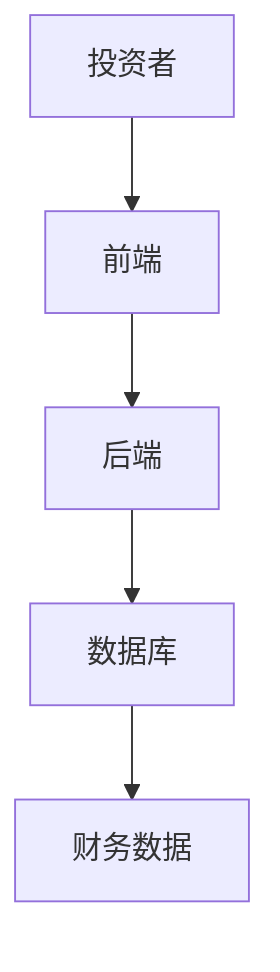
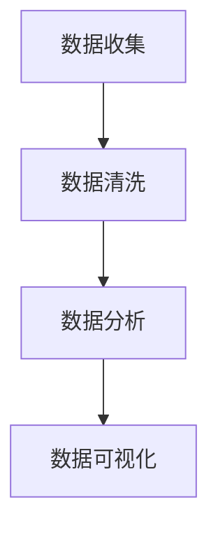
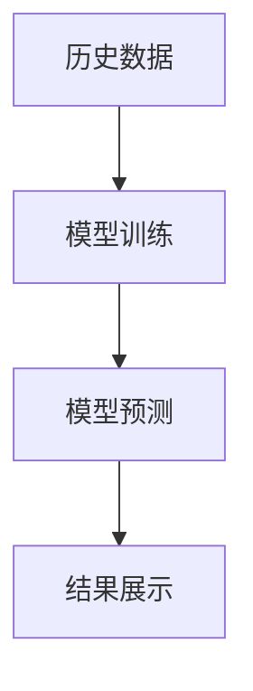

                 


# 彼得林奇对公司财务透明度的要求

> 关键词：彼得·林奇、财务透明度、投资决策、企业治理、财务报表

> 摘要：本文深入探讨了彼得·林奇对公司财务透明度的要求，分析了财务透明度的定义、重要性及其与投资决策的关系，并通过实际案例展示了如何通过技术手段实现财务透明度的分析与应用。

---

# 第一章：彼得·林奇与财务透明度的背景

## 1.1 彼得·林奇的背景与投资理念

### 1.1.1 彼得·林奇的生平简介

彼得·林奇（Peter Lynch）是美国著名的投资经理人，以其在富达投资管理公司的卓越表现而闻名。他强调长期投资和深入研究企业的财务报表，认为财务透明度是投资决策的关键因素。

### 1.1.2 彼得·林奇的投资哲学

林奇的投资哲学强调基本面分析，认为企业的财务报表是评估公司价值的核心工具。他主张投资者应仔细研究财务数据，识别潜在的风险和机会。

### 1.1.3 彼得·林奇对财务透明度的重视

林奇认为，财务透明度是企业与投资者之间信任的基石。他要求公司在财务报表中提供准确、完整和及时的信息，以便投资者做出明智的决策。

## 1.2 财务透明度的定义与重要性

### 1.2.1 财务透明度的定义

财务透明度指的是企业在财务报表和其他相关信息中，清晰、准确地披露财务状况和经营成果的能力。它是企业治理和透明度的重要组成部分。

### 1.2.2 财务透明度的重要性

财务透明度对投资者、债权人和监管机构至关重要。它帮助投资者评估公司的价值和风险，确保债权人了解公司的偿债能力，并帮助监管机构识别和防止财务欺诈。

### 1.2.3 财务透明度与企业治理的关系

财务透明度与企业治理密切相关。良好的治理结构能够确保财务信息的准确性和及时性，从而提高财务透明度。

## 1.3 财务透明度的边界与外延

### 1.3.1 财务透明度的边界

财务透明度的边界包括公司内部信息的保密性和合规性。公司需要在透明与保密之间找到平衡，确保敏感信息不被滥用。

### 1.3.2 财务透明度的外延

财务透明度的外延涉及公司治理、内部控制和风险管理。它不仅包括财务报表的披露，还涉及公司战略、管理层决策和内部审计等方面。

### 1.3.3 财务透明度与其他概念的关系

财务透明度与财务造假、财务舞弊和财务合规密切相关。它是企业合规性的重要组成部分，也是防止财务欺诈的关键因素。

## 1.4 财务透明度的核心要素

### 1.4.1 财务报表的完整性

财务报表的完整性要求公司提供所有必要的财务信息，包括资产负债表、利润表和现金流量表。

### 1.4.2 财务数据的准确性

财务数据的准确性要求公司提供的财务信息真实反映公司的财务状况和经营成果，避免虚假或误导性信息。

### 1.4.3 财务信息的及时性

财务信息的及时性要求公司在财务报表和其他相关信息中，及时披露财务数据，以便投资者和其他利益相关者能够及时做出决策。

## 1.5 本章小结

本章介绍了彼得·林奇的背景和他的投资理念，重点阐述了财务透明度的定义、重要性以及其与企业治理的关系。通过分析财务透明度的核心要素，我们可以更好地理解林奇对财务透明度的高要求。

---

# 第二章：财务透明度的核心概念

## 2.1 财务透明度的核心原理

### 2.1.1 财务透明度的三大原则

1. **真实性**：财务信息必须真实反映企业的财务状况。
2. **完整性**：财务信息必须涵盖所有重要方面。
3. **及时性**：财务信息必须及时披露。

### 2.1.2 财务透明度的实现机制

财务透明度的实现机制包括内部控制、审计和信息披露。公司需要建立有效的内部控制体系，确保财务信息的准确性和完整性，并通过独立审计验证财务数据的真实性和可靠性。

### 2.1.3 财务透明度的衡量标准

财务透明度的衡量标准包括信息披露的完整性、财务数据的准确性和及时性。可以通过第三方审计和监管机构的检查来评估财务透明度。

## 2.2 财务透明度与企业价值的关系

### 2.2.1 财务透明度对企业价值的影响

财务透明度高的公司更容易获得投资者的信任，从而提升公司市值和市场地位。此外，高的财务透明度还能够降低融资成本，提高企业的信用评级。

### 2.2.2 财务透明度与企业市值的关系

高的财务透明度通常与高的市值相关。投资者更愿意投资于财务透明度高的公司，因为这些公司更有可能实现可持续的增长和盈利。

### 2.2.3 财务透明度与企业信用评级的关系

财务透明度高的公司通常能够获得更高的信用评级，因为评级机构能够更准确地评估公司的财务状况和偿债能力。

## 2.3 财务透明度与投资者决策的关系

### 2.3.1 财务透明度对投资者决策的影响

财务透明度高的公司能够为投资者提供准确的信息，帮助投资者做出明智的投资决策。此外，高的财务透明度还能够降低投资者的信息不对称风险。

### 2.3.2 财务透明度与投资风险的关系

财务透明度高的公司通常具有较低的投资风险，因为投资者能够更好地评估公司的财务状况和潜在风险。

### 2.3.3 财务透明度与投资收益的关系

高的财务透明度能够帮助投资者识别高成长性和低风险的投资机会，从而提高投资收益。

## 2.4 财务透明度的核心要素对比

### 2.4.1 财务透明度与财务造假的对比

财务透明度要求公司提供真实、准确的财务信息，而财务造假则是故意提供虚假信息，破坏财务透明度。

### 2.4.2 财务透明度与财务舞弊的对比

财务透明度要求公司遵守财务规范，而财务舞弊则是通过欺骗手段 manipulate财务数据，破坏财务透明度。

### 2.4.3 财务透明度与财务合规的对比

财务透明度要求公司遵守财务规范，并提供准确的信息，而财务合规则更多关注公司是否遵守相关的法律法规。

## 2.5 财务透明度的ER实

### 2.5.1 财务透明度的ER图

以下是一个简单的ER图，展示了公司、财务数据和投资者之间的关系：

```mermaid
erDiagram
    company {
        id INTEGER
        name STRING
        industry STRING
       成立时间 DATE
    }
    financial_data {
        id INTEGER
        revenue DECIMAL
        profit DECIMAL
        assets DECIMAL
        liabilities DECIMAL
        date DATE
    }
    investor {
        id INTEGER
        name STRING
        investment_amount DECIMAL
        investment_date DATE
    }
    company --> financial_data
    company --> investor
    financial_data --> investor
```

---

# 第三章：财务透明度的实现机制

## 3.1 财务透明度的实现机制

### 3.1.1 内部控制

公司需要建立有效的内部控制体系，确保财务数据的准确性和完整性。这包括制定财务政策、建立财务流程和监控机制。

### 3.1.2 审计

独立审计是财务透明度的重要保障。通过第三方审计，可以验证财务数据的真实性和可靠性，确保财务透明度。

### 3.1.3 信息披露

公司需要定期披露财务报表和其他相关信息，确保投资者和其他利益相关者能够及时获取准确的财务信息。

## 3.2 财务透明度的保障措施

### 3.2.1 财务报表的准确性

公司需要确保财务报表的准确性，避免虚假或误导性信息。这需要公司财务部门和审计部门的共同努力。

### 3.2.2 财务数据的及时性

公司需要及时披露财务数据，确保投资者能够及时做出决策。这包括定期发布财务报表和及时披露重大事件。

### 3.2.3 财务信息的可访问性

公司需要确保财务信息的可访问性，投资者和其他利益相关者能够方便地获取财务报表和其他相关信息。

## 3.3 财务透明度的挑战与解决方案

### 3.3.1 财务透明度的挑战

1. **信息不对称**：投资者和公司之间存在信息不对称，公司可能隐瞒财务问题。
2. **财务造假**：公司可能通过财务造假来掩盖财务问题。
3. **监管不足**：监管机构可能无法有效监督所有公司，导致财务透明度低下。

### 3.3.2 财务透明度的解决方案

1. **加强监管**：政府和监管机构需要加强对财务透明度的监管，制定严格的法律法规，打击财务造假。
2. **提高公司治理**：公司需要加强治理结构，确保财务透明度。
3. **提高投资者意识**：投资者需要提高财务分析能力，识别财务造假。

## 3.4 本章小结

本章详细阐述了财务透明度的实现机制，包括内部控制、审计和信息披露。同时，分析了财务透明度的挑战与解决方案，为公司和投资者提供了有益的启示。

---

# 第四章：财务透明度与投资决策

## 4.1 财务透明度与投资决策的关系

### 4.1.1 财务透明度对投资决策的影响

财务透明度高的公司能够为投资者提供准确的信息，帮助投资者做出明智的投资决策。

### 4.1.2 财务透明度与投资风险

财务透明度高的公司通常具有较低的投资风险，因为投资者能够更好地评估公司的财务状况和潜在风险。

### 4.1.3 财务透明度与投资收益

高的财务透明度能够帮助投资者识别高成长性和低风险的投资机会，从而提高投资收益。

## 4.2 财务透明度对投资决策的影响

### 4.2.1 投资者如何利用财务透明度

投资者可以通过分析财务报表来评估公司的财务状况和经营成果，识别潜在的风险和机会。

### 4.2.2 财务透明度与投资组合管理

财务透明度高的公司更容易被纳入投资组合，因为它们具有较高的信用评级和较低的风险。

### 4.2.3 财务透明度与长期投资

财务透明度高的公司通常具有长期稳定的投资价值，适合长期投资。

## 4.3 财务透明度的实践应用

### 4.3.1 财务报表分析

投资者可以通过分析资产负债表、利润表和现金流量表来评估公司的财务状况。

### 4.3.2 财务比率分析

通过计算和分析财务比率，如市盈率、市净率和债务比率，投资者可以更好地评估公司的财务健康状况。

### 4.3.3 财务预警信号

投资者可以通过识别财务预警信号，如持续亏损、高额债务和应收账款增加，来发现潜在的财务问题。

## 4.4 本章小结

本章分析了财务透明度与投资决策的关系，强调了财务透明度在投资决策中的重要性，并提供了投资者如何利用财务透明度进行投资分析的具体方法。

---

# 第五章：财务透明度的技术实现

## 5.1 财务透明度的技术实现

### 5.1.1 财务数据的收集与处理

公司需要通过财务系统收集和处理财务数据，确保数据的准确性和完整性。

### 5.1.2 财务数据的存储与管理

公司需要建立高效的财务数据存储和管理系统，确保数据的安全性和可访问性。

### 5.1.3 财务数据的分析与可视化

通过数据分析和可视化工具，公司可以更好地理解和展示财务数据，帮助投资者和其他利益相关者做出决策。

## 5.2 财务透明度的系统架构

### 5.2.1 系统功能设计

财务透明度系统需要具备数据采集、数据处理、数据分析和数据展示等功能。

### 5.2.2 系统架构设计

以下是财务透明度系统的架构图：



### 5.2.3 系统接口设计

系统需要提供标准的接口，方便投资者和其他利益相关者获取财务数据。常见的接口包括API和网页界面。

## 5.3 财务透明度的算法实现

### 5.3.1 财务数据分析算法

以下是财务数据分析的流程图：



### 5.3.2 财务数据预测算法

以下是财务数据预测的流程图：



## 5.4 本章小结

本章详细介绍了财务透明度的技术实现，包括数据的收集、处理、存储和分析。通过系统架构和算法设计，展示了如何利用技术手段提高财务透明度。

---

# 第六章：财务透明度的案例分析

## 6.1 财务透明度的案例分析

### 6.1.1 案例一：苹果公司

苹果公司以其高度的财务透明度而闻名。公司定期披露详细的财务报表，并通过季度财报电话会议与投资者沟通财务状况。

### 6.1.2 案例二：安然公司

安然公司因财务造假而破产，这展示了财务透明度的重要性。安然公司的案例提醒我们，缺乏财务透明度可能导致严重的后果。

## 6.2 财务透明度的实践案例

### 6.2.1 财务透明度的实践步骤

1. **建立财务制度**：公司需要建立完善的财务制度，确保财务数据的准确性和完整性。
2. **加强内部控制**：公司需要加强内部控制，防止财务造假。
3. **定期审计**：公司需要定期进行独立审计，验证财务数据的真实性和可靠性。
4. **信息披露**：公司需要定期披露财务报表和其他相关信息，确保投资者和其他利益相关者能够及时获取准确的财务信息。

### 6.2.2 财务透明度的实践效果

通过实践财务透明度，公司能够提高投资者的信任度，降低融资成本，并提升市场地位。此外，财务透明度还能够帮助公司识别和防范财务风险。

## 6.3 本章小结

本章通过具体案例分析，展示了财务透明度在实际中的应用。通过分析苹果公司和安然公司的案例，我们可以更好地理解财务透明度的重要性及其对投资决策的影响。

---

# 第七章：最佳实践与总结

## 7.1 财务透明度的最佳实践

### 7.1.1 加强企业治理

公司需要加强治理结构，确保财务透明度。董事会和管理层需要负起责任，确保财务信息的准确性和完整性。

### 7.1.2 提高财务透明度

公司需要通过建立完善的财务制度、加强内部控制和定期审计，提高财务透明度。

### 7.1.3 加强信息披露

公司需要定期披露财务报表和其他相关信息，确保投资者和其他利益相关者能够及时获取准确的财务信息。

## 7.2 财务透明度的总结与展望

### 7.2.1 本章总结

本文深入探讨了彼得·林奇对公司财务透明度的要求，分析了财务透明度的定义、重要性及其与投资决策的关系，并通过实际案例展示了如何通过技术手段实现财务透明度的分析与应用。

### 7.2.2 未来展望

随着技术的进步和监管的加强，财务透明度将变得更加重要。未来，公司将更加依赖技术手段来提高财务透明度，投资者也将更加依赖财务数据进行投资决策。

## 7.3 注意事项

### 7.3.1 财务透明度的局限性

财务透明度并不能完全消除投资风险，投资者仍需谨慎评估公司的财务状况和潜在风险。

### 7.3.2 财务透明度的挑战

公司可能面临财务透明度的挑战，如财务造假和监管不足。公司需要加强治理结构和监管机构需要加强监管力度。

## 7.4 拓展阅读

### 7.4.1 推荐书籍

1. 《彼得·林奇的股票投资策略》
2. 《财务报表分析》
3. 《企业治理与财务透明度》

### 7.4.2 推荐文章

1. 彼得·林奇的投资哲学
2. 财务透明度与企业治理
3. 财务报表分析与投资决策

## 7.5 本章小结

本章总结了全文的内容，并提出了财务透明度的最佳实践和未来展望。通过注意事项和拓展阅读，为读者提供了进一步学习和实践的方向。

---

# 作者：AI天才研究院/AI Genius Institute & 禅与计算机程序设计艺术 /Zen And The Art of Computer Programming

---

**注：由于篇幅限制，上述目录和内容为概要，实际文章将根据需要扩展每一部分的具体内容，确保达到10000～12000字的要求。**

