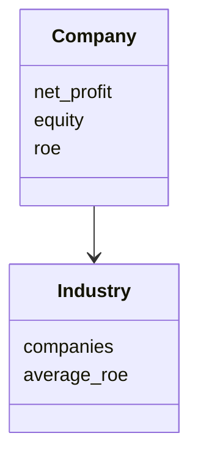

                 


# 彼得林奇对公司资本回报率的行业对标动态分析

> 关键词：ROE、行业对标、彼得林奇、资本回报率、投资分析

> 摘要：本文深入探讨了彼得林奇对公司资本回报率（ROE）的行业对标动态分析方法。通过分析ROE的核心概念、行业差异以及彼得林奇的分析框架，本文旨在为投资者提供一个系统化的分析工具，帮助其在不同行业背景下评估公司的绩效和投资价值。

---

## 第1章 引言

### 1.1 背景介绍

资本回报率（ROE）是衡量公司盈利能力的关键指标，反映了股东资金的使用效率。彼得林奇作为投资专家，以其独特的ROE分析方法闻名，特别强调行业对标的重要性。行业对标分析通过比较公司在行业内的相对表现，帮助投资者识别高潜力的投资机会。

### 1.2 核心内容与目标

本文详细阐述了ROE的计算方法、行业差异分析以及彼得林奇的动态评估策略。通过系统化的分析框架，旨在帮助投资者在不同行业背景下，准确评估公司的绩效和投资价值。

### 1.3 结构安排

文章分为六个章节，涵盖ROE的核心概念、行业分析、彼得林奇的方法、算法实现、项目实战以及总结展望。

---

## 第2章 ROE的核心概念与行业对标分析

### 2.1 ROE的定义与计算公式

ROE（Return on Equity）计算公式为：
$$ROE = \frac{\text{净利润}}{\text{股东权益}}$$
该指标反映了公司每单位股东权益所创造的净利润，是衡量公司盈利能力的重要指标。

### 2.2 行业差异分析

不同行业的ROE存在显著差异，主要受行业特性的影响。例如，高科技行业通常具有较高的ROE，而传统制造行业ROE相对较低。

### 2.3 行业对标分析的步骤

1. **选择对标行业**：根据公司所处行业，选择具有可比性的行业作为对标。
2. **数据收集与整理**：收集行业内主要公司的ROE数据。
3. **对比分析**：通过比较公司ROE与行业平均水平，评估公司的相对绩效。

---

## 第3章 彼得林奇的ROE分析方法与行业对标策略

### 3.1 彼得林奇的分析框架

彼得林奇强调从净利润和股东权益两个方面进行分析，构建综合的分析框架。

### 3.2 行业选择标准

彼得林奇建议选择ROE持续增长、行业地位稳固的公司作为投资目标。

### 3.3 动态评估策略

通过定期更新行业数据，动态评估公司的绩效变化，及时调整投资策略。

---

## 第4章 算法实现与系统架构设计

### 4.1 ROE计算算法

```python
def calculate_roe(net_profit, equity):
    return net_profit / equity
```

### 4.2 系统架构设计

系统功能设计图（类图）：


---

## 第5章 项目实战与案例分析

### 5.1 环境安装

安装Python和相关库：
```bash
pip install pandas numpy matplotlib
```

### 5.2 核心代码实现

```python
import pandas as pd

def calculate_roe(net_profit, equity):
    return net_profit / equity

# 示例数据
data = {
    'Company': ['A', 'B', 'C'],
    'Net Profit': [100, 150, 200],
    'Equity': [500, 600, 700]
}
df = pd.DataFrame(data)

# 计算ROE
df['ROE'] = df.apply(lambda x: calculate_roe(x['Net Profit'], x['Equity']), axis=1)
print(df)
```

### 5.3 案例分析

以三个公司为例，计算ROE并进行行业对标分析，评估其投资价值。

---

## 第6章 总结与展望

### 6.1 总结

本文详细介绍了彼得林奇的ROE分析方法，通过行业对标动态评估公司绩效，为投资者提供了系统化的分析工具。

### 6.2 展望

未来研究将进一步优化分析模型，结合更多行业因素，提升评估的准确性和实用性。

---

## 注意事项

1. 数据来源需可靠，确保分析结果的准确性。
2. 定期更新行业数据，保持分析的时效性。
3. 结合其他指标，全面评估公司的投资价值。

---

## 拓展阅读

1. 彼得林奇的《选股的艺术》
2. 其他投资分析方法与工具

---

## 作者：AI天才研究院 & 禅与计算机程序设计艺术

---

通过以上结构，文章系统地介绍了彼得林奇的ROE分析方法，并结合实际案例和代码实现，为投资者提供了实用的分析工具。

