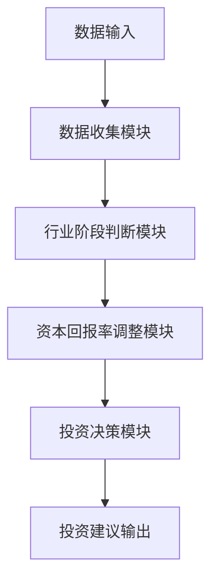

                 


# 彼得林奇对公司资本回报率的行业生命周期调整分析

**关键词：** 彼得·林奇，资本回报率（ROE），行业生命周期，投资分析，股票筛选

**摘要：** 本文深入探讨了彼得·林奇如何通过调整资本回报率（ROE）分析来适应不同行业生命周期阶段的特点。我们首先介绍资本回报率的基本概念和行业生命周期的定义，然后分析两者之间的关系。接下来，我们详细讲解彼得·林奇的资本回报率行业生命周期调整模型，包括其算法原理和数学模型。最后，我们通过一个实际案例展示如何将该模型应用于投资分析，并总结最佳实践和注意事项。

---

## 第一部分: 背景介绍与核心概念

### 第1章: 资本回报率与行业生命周期概述

#### 1.1 资本回报率的基本概念

##### 1.1.1 资本回报率（ROE）的定义
资本回报率（Return on Equity，ROE）是衡量企业盈利能力的重要指标，表示净利润与股东权益的比率。ROE的计算公式为：
$$
ROE = \frac{\text{净利润}}{\text{平均股东权益}}
$$

##### 1.1.2 资本回报率的计算公式
资本回报率的计算公式如下：
$$
ROE = \frac{\text{净利润}}{\text{平均股东权益}} \times 100\%
$$
其中，净利润为企业在一定时期内的净利润，平均股东权益为该时期初和期末股东权益的平均值。

##### 1.1.3 资本回报率在投资分析中的重要性
资本回报率是投资者评估企业盈利能力的重要工具。高ROE意味着企业能够高效地利用股东资金创造利润。然而，仅看ROE是不够的，还需要结合行业生命周期阶段进行分析。

#### 1.2 行业生命周期的定义与特征

##### 1.2.1 行业生命周期的四个阶段
行业生命周期通常分为四个阶段：
1. **幼稚期**：行业刚刚起步，市场增长率高，竞争者少。
2. **成长期**：行业增长迅速，竞争加剧。
3. **成熟期**：行业增长稳定，竞争饱和。
4. **衰退期**：行业增长放缓，市场份额稳定。

##### 1.2.2 不同行业阶段的特征对比
以下是不同行业阶段的特征对比：

| 阶段 | 市场增长率 | 竞争状况 | 利润率 | 投资需求 |
|------|-----------|----------|--------|----------|
| 幼稚期 | 高       | 少       | 低     | 高       |
| 成长期 | 高       | 增加     | 中     | 高       |
| 成熟期 | 低       | 饱和     | 高     | 低       |
| 衰退期 | 负       | 稳定     | 低     | 低       |

##### 1.2.3 行业生命周期对企业资本回报率的影响
不同行业阶段的企业资本回报率存在显著差异。例如，在幼稚期，企业可能需要大量投资，导致ROE较低；而在成熟期，企业利润稳定，ROE较高。

#### 1.3 彼得·林奇的资本回报率分析方法

##### 1.3.1 彼得·林奇的投资理念
彼得·林奇强调基本面分析和长期投资，他认为资本回报率是评估企业盈利能力的重要指标。

##### 1.3.2 行业生命周期对资本回报率分析的调整
林奇认为，资本回报率的分析需要结合行业生命周期阶段。例如，在成熟期，高ROE企业更具投资价值；而在衰退期，ROE可能较低，需谨慎选择。

##### 1.3.3 资本回报率与行业生命周期结合的必要性
通过结合行业生命周期，投资者可以更好地理解资本回报率的变化趋势，从而做出更明智的投资决策。

---

## 第二部分: 资本回报率的行业生命周期调整模型

### 第2章: 资本回报率与行业生命周期的关系

#### 2.1 行业生命周期对资本回报率的影响

##### 2.1.1 幼稚期行业的资本回报率特征
幼稚期行业通常处于高增长阶段，但企业可能需要大量投资，导致ROE较低。例如，一家科技初创公司可能需要大量研发投入，导致净利润较低，但股东权益增长迅速。

##### 2.1.2 成长期行业的资本回报率特征
成长期行业增长迅速，竞争加剧，企业可能通过提高效率或扩大市场份额来提高ROE。例如，一家快速扩张的互联网公司可能通过优化成本结构来提高ROE。

##### 2.1.3 成熟期行业的资本回报率特征
成熟期行业增长稳定，企业可以通过提高利润率或优化资本结构来提高ROE。例如，一家成熟的制药公司可能通过专利保护和成本控制来提高ROE。

##### 2.1.4 衰退期行业的资本回报率特征
衰退期行业增长放缓，企业可能通过出售资产或减少成本来维持ROE，但通常效果有限。例如，一家衰退期的传统制造公司可能面临利润率下降和市场份额流失，导致ROE下降。

#### 2.2 不同行业阶段的资本回报率调整策略

##### 2.2.1 幼稚期行业的资本回报率调整
在幼稚期行业，投资者应关注企业的成长潜力和ROE的未来增长空间。例如，可以选择那些具有高增长潜力且ROE逐步提高的企业。

##### 2.2.2 成长期行业的资本回报率调整
在成长期行业，投资者应关注企业的ROE是否能够持续增长。例如，可以选择那些ROE逐步提高且市场份额扩大的企业。

##### 2.2.3 成熟期行业的资本回报率调整
在成熟期行业，投资者应关注企业的ROE是否稳定且具有较高的分红能力。例如，可以选择那些ROE稳定且股息率高的企业。

##### 2.2.4 衰退期行业的资本回报率调整
在衰退期行业，投资者应谨慎选择，避免投资ROE持续下降的企业。例如，可以选择那些ROE虽低但可能通过转型实现复苏的企业。

#### 2.3 行业生命周期与资本回报率的互动关系

##### 2.3.1 行业生命周期对企业资本回报率的影响
行业生命周期的不同阶段会影响企业的盈利能力和资本回报率。例如，成熟期行业通常具有较高的ROE，而衰退期行业ROE可能较低。

##### 2.3.2 资本回报率变化对行业生命周期的反馈作用
资本回报率的变化会反向影响行业生命周期。例如，如果某行业的ROE持续下降，可能导致企业减少投资，从而加速行业进入衰退期。

---

## 第三部分: 资本回报率的行业生命周期调整模型

### 第3章: 资本回报率的行业生命周期调整模型

#### 3.1 行业生命周期阶段划分的数学模型

##### 3.1.1 行业生命周期阶段的划分标准
行业生命周期阶段的划分可以通过市场增长率、竞争状况和利润率等指标来确定。例如，市场增长率下降可能表明行业进入成熟期。

##### 3.1.2 行业生命周期阶段划分的数学公式
行业生命周期阶段的划分可以通过以下公式进行：
$$
\text{阶段} = 
\begin{cases}
\text{幼稚期} & \text{如果市场增长率} > 20\% \text{且竞争者数量} < 5 \\
\text{成长期} & \text{如果市场增长率} > 10\% \text{且竞争者数量} \in [5, 10] \\
\text{成熟期} & \text{如果市场增长率} \leq 5\% \text{且竞争者数量} > 10 \\
\text{衰退期} & \text{如果市场增长率} < 0\% \text{且竞争者数量} \text{稳定}
\end{cases}
$$

#### 3.2 资本回报率的行业生命周期调整公式

##### 3.2.1 资本回报率的行业生命周期调整模型
彼得·林奇的资本回报率调整模型如下：
$$
\text{调整后的ROE} = 
\begin{cases}
\text{ROE} \times 0.5 & \text{如果行业处于幼稚期} \\
\text{ROE} \times 0.8 & \text{如果行业处于成长期} \\
\text{ROE} \times 1.0 & \text{如果行业处于成熟期} \\
\text{ROE} \times 0.3 & \text{如果行业处于衰退期}
\end{cases}
$$

##### 3.2.2 调整模型的适用条件与限制
该模型适用于大多数行业，但在某些特殊情况下可能需要调整。例如，某些幼稚期行业可能具有较高的ROE，可能需要根据具体情况调整系数。

---

## 第四部分: 系统架构与项目实战

### 第4章: 资本回报率的行业生命周期调整系统架构

#### 4.1 系统功能设计

##### 4.1.1 数据收集模块
- 收集行业数据，包括市场增长率、竞争者数量、利润率等。
- 数据来源：公开财报、行业报告、市场分析报告。

##### 4.1.2 行业阶段判断模块
- 根据市场增长率、竞争者数量等指标判断行业生命周期阶段。

##### 4.1.3 资本回报率调整模块
- 根据行业阶段调整资本回报率，计算调整后的ROE。

##### 4.1.4 投资决策模块
- 根据调整后的ROE和行业生命周期阶段，生成投资建议。

#### 4.2 系统架构设计
以下是系统架构的Mermaid图：



---

## 第五部分: 项目实战

### 第5章: 项目实战与案例分析

#### 5.1 项目环境配置

##### 5.1.1 系统环境
- 操作系统：Windows 10 或 macOS 12.0
- Python版本：Python 3.8 或更高
- 工具：Jupyter Notebook，Pandas，Matplotlib

##### 5.1.2 数据来源
- 公开财报数据：Yahoo Finance
- 行业报告：Industry Report Database

#### 5.2 核心实现代码

##### 5.2.1 数据收集模块

```python
import pandas as pd
import requests

def get_financial_data(ticker):
    url = f"https://query1.finance.yahoo.com/v7/finance/quote/{ticker}"
    response = requests.get(url)
    data = response.json()
    return {
        '净利润': data['quoteResponse']['result'][0]['regularMarketNetIncome'],
        '股东权益': data['quoteResponse']['result'][0]['totalStockholderEquity']
    }
```

##### 5.2.2 行业阶段判断模块

```python
def determine_stage(growth_rate, competitors):
    if growth_rate > 20 and competitors < 5:
        return '幼稚期'
    elif growth_rate > 10 and competitors >= 5 and competitors <= 10:
        return '成长期'
    elif growth_rate <= 5 and competitors > 10:
        return '成熟期'
    else:
        return '衰退期'
```

##### 5.2.3 资本回报率调整模块

```python
def adjust_roe(roe, stage):
    if stage == '幼稚期':
        return roe * 0.5
    elif stage == '成长期':
        return roe * 0.8
    elif stage == '成熟期':
        return roe * 1.0
    else:
        return roe * 0.3
```

##### 5.2.4 投资决策模块

```python
def investment_decision(roe, stage):
    if stage == '幼稚期' and roe > 15:
        return '买入'
    elif stage == '成长期' and roe > 12:
        return '增持'
    elif stage == '成熟期' and roe > 10:
        return '持有'
    else:
        return '卖出'
```

#### 5.3 案例分析

##### 5.3.1 案例背景
假设我们分析一家科技公司（Ticker：AAPL），行业为科技行业。

##### 5.3.2 数据收集与处理
```python
data = get_financial_data('AAPL')
growth_rate = 8  # 假设市场增长率为8%
competitors = 15  # 假设竞争者数量为15
stage = determine_stage(growth_rate, competitors)  # 成熟期
roe = data['净利润'] / (data['股东权益'] / 2)  # 计算ROE
adjusted_roe = adjust_roe(roe, stage)  # 调整后的ROE
decision = investment_decision(adjusted_roe, stage)  # 投资决策
```

##### 5.3.3 结果展示
- 阶段：成熟期
- ROE：假设为15%
- 调整后的ROE：15% * 1.0 = 15%
- 投资决策：持有

---

## 第六部分: 最佳实践与小结

### 第6章: 最佳实践与小结

#### 6.1 小结
本文详细探讨了彼得·林奇的资本回报率分析方法，并结合行业生命周期阶段进行了调整。我们通过数学模型和实际案例展示了如何将这些方法应用于投资分析。

#### 6.2 注意事项
- 数据准确性：确保数据来源可靠，避免因数据错误导致分析偏差。
- 模型适用性：不同行业可能需要调整模型参数。
- 风险控制：投资决策应结合其他因素，如行业风险、宏观经济环境等。

#### 6.3 拓展阅读
- 彼得·林奇的《彼得·林奇的投资哲学》
- 行业分析相关书籍：《行业分析实战》

---

**作者：AI天才研究院/AI Genius Institute & 禅与计算机程序设计艺术 /Zen And The Art of Computer Programming**

