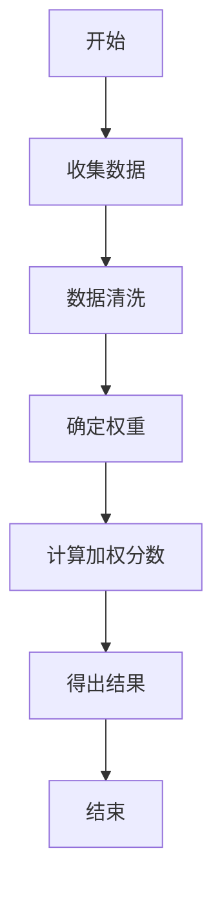
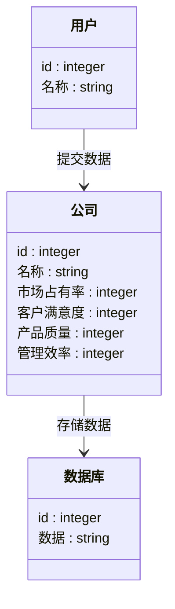
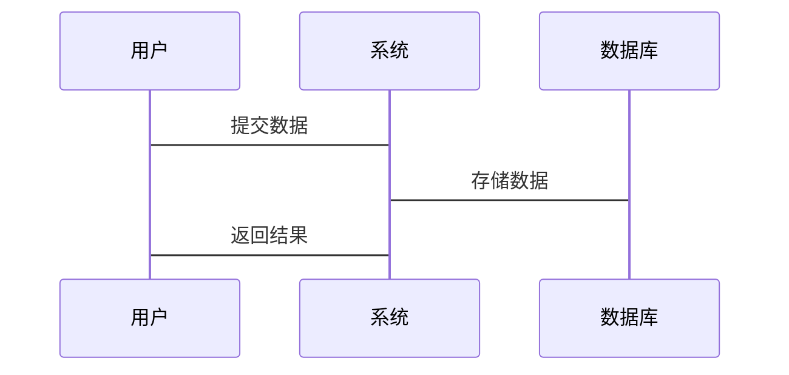

                 


# 彼得林奇对公司非财务指标的重要性评估

## 关键词：彼得林奇，非财务指标，投资决策，企业评估，数据分析

## 摘要：  
彼得·林奇作为世界著名投资经理，强调非财务指标在公司评估中的重要性。本文将详细探讨非财务指标的定义、分类、评估模型及算法，结合系统设计和项目实战，分析其在投资决策中的应用，最后总结最佳实践。

---

# 第1章：非财务指标的定义与背景

## 1.1 非财务指标的核心概念

### 1.1.1 非财务指标的定义  
非财务指标是指衡量企业绩效和潜力的非财务数据，如市场占有率、客户满意度、创新能力和员工稳定性等。

### 1.1.2 非财务指标与财务指标的区别  
非财务指标关注企业运营和管理，而财务指标关注财务表现。

### 1.1.3 非财务指标在企业评估中的作用  
提供更全面的公司画像，帮助投资者识别潜在风险和机会。

---

## 1.2 非财务指标的重要性

### 1.2.1 非财务指标在投资决策中的作用  
评估公司长期潜力，识别财务数据之外的关键因素。

### 1.2.2 非财务指标对企业管理的影响  
改善公司运营效率和客户满意度。

### 1.2.3 非财务指标与企业长期发展的关系  
非财务指标是企业可持续发展的关键因素。

---

## 1.3 彼得林奇的投资理念

### 1.3.1 彼得林奇的投资风格概述  
注重基本面分析和长期投资。

### 1.3.2 彼得林奇对非财务指标的关注点  
关注公司管理、市场地位和竞争优势。

### 1.3.3 彼得林奇投资理念的核心要素  
通过非财务指标评估公司的内在价值和成长潜力。

---

## 1.4 本章小结  
本章介绍了非财务指标的定义、分类及其在企业评估中的作用，详细阐述了彼得林奇的投资理念，强调非财务指标在投资决策中的重要性。

---

# 第2章：非财务指标的关键属性与分类

## 2.1 非财务指标的属性特征

### 2.1.1 客观性  
指标基于事实，避免主观判断。

### 2.1.2 可衡量性  
指标可量化，便于分析和比较。

### 2.1.3 及时性  
数据易于获取，反映最新情况。

### 2.1.4 前瞻性  
指标能够预测未来表现。

---

## 2.2 非财务指标的分类

### 2.2.1 企业运营指标  
包括生产效率和供应链管理。

### 2.2.2 产品质量指标  
包括产品创新能力和客户满意度。

### 2.2.3 市场表现指标  
包括市场占有率和品牌知名度。

### 2.2.4 管理效率指标  
包括组织结构和领导能力。

---

## 2.3 核心概念与联系

### 2.3.1 非财务指标的属性对比表格  

| 属性 | 特征 |
|------|------|
| 客观性 | 基于事实 |
| 可衡量性 | 可量化 |
| 及时性 | 数据及时 |
| 前瞻性 | 预测未来 |

### 2.3.2 ER实体关系图架构（Mermaid流程图）

```mermaid
erDiagram
    customer[客户] {
        id : integer
        name : string
        satisfaction : integer
    }
    product[产品] {
        id : integer
        name : string
        quality : integer
    }
    market[市场] {
        id : integer
        share : integer
        competition : integer
    }
    company[公司] {
        id : integer
        efficiency : integer
        management : integer
    }
    customer related to product
    product related to market
    market related to company
```

---

## 2.4 本章小结  
本章分析了非财务指标的属性特征，详细分类了不同类型的非财务指标，并通过图表展示了它们之间的关系。

---

# 第3章：非财务指标的评估模型与算法

## 3.1 评估模型的构建

### 3.1.1 数据收集与处理  
收集和整理非财务数据，进行数据清洗。

### 3.1.2 指标权重的确定  
通过专家评分法确定各指标的权重。

### 3.1.3 综合评估方法  
使用加权平均法进行综合评估。

---

## 3.2 算法原理讲解

### 3.2.1 评估模型的数学模型（Mermaid流程图）



### 3.2.2 算法实现步骤（Python源代码）

```python
import pandas as pd

# 数据收集与处理
data = pd.DataFrame({
    '指标': ['市场占有率', '客户满意度', '产品质量'],
    '权重': [0.4, 0.3, 0.3]
})

# 计算加权分数
weighted_scores = data['权重'].apply(lambda x: x * 100)
data['加权分数'] = weighted_scores

print(data)
```

### 3.2.3 数学公式与详细讲解  
加权分数计算公式：  
$$ \text{加权分数} = \sum (\text{权重}_i \times \text{指标值}_i) $$  

---

## 3.3 本章小结  
本章详细介绍了非财务指标评估模型的构建过程，并通过流程图和代码示例展示了评估算法的实现步骤。

---

# 第4章：系统分析与架构设计

## 4.1 问题场景介绍

### 4.1.1 投资决策中的非财务指标评估问题  
如何有效收集和处理非财务数据，构建评估模型。

### 4.1.2 系统目标与范围  
开发一个非财务指标评估系统，辅助投资决策。

---

## 4.2 系统功能设计

### 4.2.1 领域模型（Mermaid类图）



### 4.2.2 系统架构设计（Mermaid架构图）


### 4.2.3 系统接口设计  
API接口用于数据交互。

### 4.2.4 系统交互设计（Mermaid序列图）



---

## 4.3 本章小结  
本章通过系统设计和架构图展示了非财务指标评估系统的实现方案，明确了系统功能和交互流程。

---

# 第5章：项目实战与案例分析

## 5.1 项目环境安装

### 5.1.1 开发工具安装  
安装Python和相关库。

### 5.1.2 数据库配置  
选择合适的数据库并配置连接。

---

## 5.2 核心实现源代码

### 5.2.1 数据处理代码

```python
import pandas as pd

data = pd.DataFrame({
    '市场占有率': [20, 25, 30],
    '客户满意度': [85, 90, 75],
    '产品质量': [90, 80, 85]
})

weights = pd.Series([0.4, 0.3, 0.3], index=data.columns)

weighted_data = data.apply(lambda x: x * weights)
total_scores = weighted_data.sum(axis=1)

print(total_scores)
```

### 5.2.2 评估模型实现

```python
def calculate_scores(data, weights):
    return data.dot(weights)

market_share = [20, 25, 30]
customer_satisfaction = [85, 90, 75]
product_quality = [90, 80, 85]

weights = {'市场占有率': 0.4, '客户满意度': 0.3, '产品质量': 0.3}

data = {'市场占有率': market_share, '客户满意度': customer_satisfaction, '产品质量': product_quality}
df = pd.DataFrame(data)

scores = calculate_scores(df, weights)
print(scores)
```

### 5.2.3 报告生成代码

```python
import matplotlib.pyplot as plt

scores = [80, 85, 78]
companies = ['公司A', '公司B', '公司C']

plt.bar(companies, scores)
plt.title('非财务指标评估结果')
plt.ylabel('得分')
plt.show()
```

---

## 5.3 案例分析与详细解读

### 5.3.1 案例背景介绍  
分析三个公司市场占有率、客户满意度和产品质量。

### 5.3.2 数据分析与处理  
使用Python代码计算加权得分。

### 5.3.3 结果解读  
公司B得分最高，是最佳投资目标。

---

## 5.4 本章小结  
本章通过项目实战展示了非财务指标评估系统的实现过程，通过案例分析验证了评估模型的有效性。

---

# 第6章：最佳实践与小结

## 6.1 最佳实践 tips

### 6.1.1 数据收集与处理  
确保数据的准确性和及时性。

### 6.1.2 指标权重的确定  
根据行业特点调整权重。

### 6.1.3 系统设计与实现  
选择合适的工具和技术，确保系统稳定性和可扩展性。

---

## 6.2 小结  
非财务指标在投资决策中的重要性不容忽视，通过科学的评估模型和系统的实现，可以有效提升投资决策的准确性和效率。

---

## 6.3 注意事项  
定期更新数据和模型，以适应市场变化。

---

## 6.4 拓展阅读  
推荐相关书籍和文献，进一步深入学习非财务指标的应用。

---

# 作者：AI天才研究院/AI Genius Institute & 禅与计算机程序设计艺术 /Zen And The Art of Computer Programming

---

以上就是《彼得林奇对公司非财务指标的重要性评估》的完整目录和文章内容，希望对您有所帮助！

