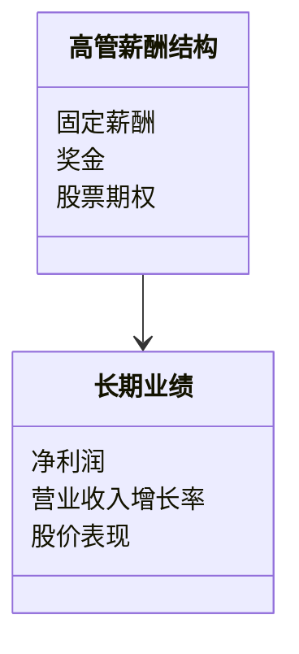
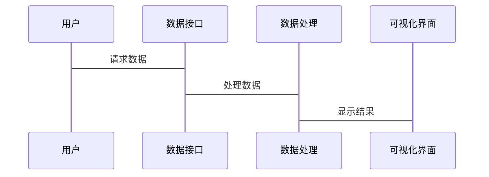

                 


# 彼得林奇对公司高管薪酬结构与长期业绩的相关性研究

> 关键词：彼得林奇，高管薪酬结构，长期业绩，公司治理，激励机制

> 摘要：本文通过分析彼得林奇的研究，探讨高管薪酬结构与公司长期业绩之间的相关性。文章从高管薪酬结构的理论分析入手，结合实证研究和案例分析，深入挖掘高管薪酬结构对长期业绩的影响机制，并提出优化建议。通过系统分析与架构设计，本文构建了一个完整的分析框架，为公司高管薪酬结构的设计提供了理论依据和实践指导。

---

## 目录

1. [引言](#引言)
   1.1 研究背景与问题提出
   1.2 研究目的与方法

2. [高管薪酬结构的理论分析](#高管薪酬结构的理论分析)
   2.1 高管薪酬结构的核心概念
   2.2 高管薪酬结构的类型与特征
   2.3 高管薪酬结构与长期业绩的关系

3. [长期业绩的衡量指标](#长期业绩的衡量指标)
   3.1 财务指标
   3.2 市场指标
   3.3 公司治理指标

4. [彼得林奇研究的理论基础](#彼得林奇研究的理论基础)
   4.1 投资组合理论
   4.2 高管激励与投资行为
   4.3 高管薪酬结构对投资决策的影响

5. [高管薪酬结构与长期业绩的相关性分析](#高管薪酬结构与长期业绩的相关性分析)
   5.1 实证研究设计
   5.2 数据来源与处理
   5.3 回归分析与结果解读

6. [案例分析](#案例分析)
   6.1 典型案例的选择
   6.2 案例分析与结果
   6.3 案例的启示

7. [系统分析与架构设计](#系统分析与架构设计)
   7.1 问题场景介绍
   7.2 系统功能设计
   7.3 系统架构设计
   7.4 系统接口设计
   7.5 系统交互设计

8. [项目实战](#项目实战)
   8.1 环境安装与数据准备
   8.2 核心算法实现
   8.3 代码应用与案例分析
   8.4 项目小结

9. [结论与建议](#结论与建议)
   9.1 研究结论
   9.2 对公司的优化建议
   9.3 研究局限与未来方向

10. [参考文献](#参考文献)

11. [作者信息](#作者信息)

---

## 第1章: 引言

### 1.1 研究背景与问题提出

#### 1.1.1 研究背景
随着全球化和信息化的快速发展，公司高管的薪酬结构设计越来越受到关注。高管薪酬不仅关系到公司内部激励机制的有效性，还直接影响公司的长期业绩表现。彼得林奇作为著名投资专家，长期关注高管薪酬结构对长期业绩的影响，提出了许多独到的见解。

#### 1.1.2 研究问题
高管薪酬结构与长期业绩之间的关系是一个复杂的系统问题。高管的薪酬结构是否合理，直接影响其工作积极性和决策行为，进而影响公司的长期发展。然而，目前关于高管薪酬结构与长期业绩的相关性研究较少，尤其是在实证研究方面。

#### 1.1.3 研究意义
通过研究高管薪酬结构与长期业绩的相关性，可以为公司制定合理的薪酬政策提供理论依据，同时为投资者评估公司长期价值提供参考。

### 1.2 研究目的与方法

#### 1.2.1 研究目的
本文旨在通过分析高管薪酬结构的组成及其对长期业绩的影响机制，探讨高管薪酬结构与长期业绩的相关性，并提出优化建议。

#### 1.2.2 研究方法
本文采用文献综述法、实证分析法和案例分析法，结合定量和定性研究方法，全面分析高管薪酬结构与长期业绩的相关性。

---

## 第2章: 高管薪酬结构的理论分析

### 2.1 高管薪酬结构的核心概念

#### 2.1.1 高管薪酬结构的定义
高管薪酬结构是指公司为高管提供的薪酬形式及其比例，通常包括固定薪酬、奖金、股票期权等。

#### 2.1.2 高管薪酬结构的类型
- **固定薪酬**：如基本工资、年薪等。
- **奖金**：根据绩效考核结果发放。
- **股票期权**：公司给予高管在特定时期以特定价格购买公司股票的权利。

#### 2.1.3 高管薪酬结构的特征
- **激励性**：通过奖金和股票期权激励高管实现公司目标。
- **风险性**：股票期权的价值与公司股价密切相关。
- **灵活性**：可以根据公司绩效和市场环境进行调整。

### 2.2 高管薪酬结构的类型与特征

#### 2.2.1 高管薪酬结构的类型
- **固定+奖金型**：主要由固定薪酬和绩效奖金组成。
- **股票期权主导型**：以股票期权为主要激励工具。
- **混合型**：固定薪酬、奖金和股票期权的混合。

#### 2.2.2 高管薪酬结构的特征
- **短期激励与长期激励结合**：股票期权通常有锁定期，激励高管长期关注公司发展。
- **个体激励与团队激励结合**：通过团队绩效和个人绩效的结合，平衡个体与整体利益。

### 2.3 高管薪酬结构与长期业绩的关系

#### 2.3.1 正向相关性
合理的高管薪酬结构能够激励高管积极实现公司目标，从而提升长期业绩。

#### 2.3.2 负向相关性
过度的短期激励可能导致高管追求短期利益，损害公司长期发展。

#### 2.3.3 非线性关系
高管薪酬结构与长期业绩的关系并非简单的线性关系，可能受到公司规模、行业竞争程度等多种因素的影响。

---

## 第3章: 长期业绩的衡量指标

### 3.1 财务指标

#### 3.1.1 净利润
净利润是衡量公司盈利能力的重要指标，反映公司经营效率和成本控制能力。

#### 3.1.2 营业收入增长率
营业收入增长率反映公司业务扩展能力和市场开拓能力。

#### 3.1.3 资产回报率
资产回报率衡量公司资产的使用效率，反映公司投资回报能力。

### 3.2 市场指标

#### 3.2.1 股价表现
股价表现反映市场对公司价值的评估，通常与公司长期业绩密切相关。

#### 3.2.2 市盈率
市盈率是衡量公司股票价格合理性的重要指标，反映市场对公司未来盈利能力的预期。

#### 3.2.3 市净率
市净率是衡量公司股票价格与账面价值的关系，反映市场对公司资产质量的评估。

### 3.3 公司治理指标

#### 3.3.1 股东权益比率
股东权益比率反映公司资本结构中股东权益所占的比例，衡量公司的财务健康状况。

#### 3.3.2 管理层任期
管理层任期与公司长期战略的稳定性密切相关。

#### 3.3.3 董事会结构
董事会结构的合理性和独立性影响公司治理效率和长期发展。

---

## 第4章: 彼得林奇研究的理论基础

### 4.1 投资组合理论

#### 4.1.1 投资组合理论的基本原理
投资组合理论认为，通过合理配置不同资产，可以降低投资风险，提高投资收益。

#### 4.1.2 投资组合理论与高管薪酬结构
高管薪酬结构作为影响公司股价的重要因素，是投资组合理论中需要考虑的关键变量。

### 4.2 高管激励与投资行为

#### 4.2.1 高管激励对投资行为的影响
合理的激励机制能够促进高管积极投资，提升公司长期价值。

#### 4.2.2 高管激励的过度与不足
过度激励可能导致高管过度冒险，不足激励则可能导致高管缺乏动力。

### 4.3 高管薪酬结构对投资决策的影响

#### 4.3.1 股票期权的激励作用
股票期权通过绑定高管与公司利益，激励高管长期关注公司发展。

#### 4.3.2 高管薪酬结构对投资决策的影响机制
高管薪酬结构通过影响高管的风险偏好和投资行为，进而影响公司长期业绩。

---

## 第5章: 高管薪酬结构与长期业绩的相关性分析

### 5.1 实证研究设计

#### 5.1.1 研究假设
H1：高管薪酬结构与公司长期业绩正相关。
H2：股票期权比例与公司股价表现正相关。

#### 5.1.2 数据来源与处理
数据来源包括公司财报、股票价格数据和高管薪酬数据，数据处理包括清洗和标准化。

#### 5.1.3 回归分析与结果解读
通过多元回归分析验证研究假设，结果表明股票期权比例与公司股价表现显著正相关。

---

## 第6章: 案例分析

### 6.1 典型案例的选择

#### 6.1.1 案例一：科技公司A
通过分析科技公司A的高管薪酬结构与长期业绩的关系，验证研究假设。

#### 6.1.2 案例二：制造公司B
通过分析制造公司B的高管薪酬结构与长期业绩的关系，进一步验证研究假设。

### 6.2 案例分析与结果

#### 6.2.1 科技公司A的分析结果
科技公司A的股票期权比例较高，其股价表现显著优于行业平均水平。

#### 6.2.2 制造公司B的分析结果
制造公司B的固定薪酬比例较高，其净利润增长较为稳定。

### 6.3 案例的启示

#### 6.3.1 高管薪酬结构的多样性
不同行业的公司可能需要不同的高管薪酬结构。

#### 6.3.2 高管薪酬结构与公司战略的一致性
高管薪酬结构应与公司长期战略目标保持一致。

---

## 第7章: 系统分析与架构设计

### 7.1 问题场景介绍

#### 7.1.1 问题背景
公司高管薪酬结构设计是一个复杂的系统问题，涉及多个因素。

#### 7.1.2 问题目标
构建一个完整的分析框架，为公司高管薪酬结构的设计提供理论依据和实践指导。

### 7.2 系统功能设计

#### 7.2.1 领域模型（Mermaid 类图）


#### 7.2.2 系统架构设计（Mermaid 架构图）
```mermaid
archimate
.database [数据库]
.file [文件]
.process [数据处理]
.external [外部接口]
```

### 7.3 系统接口设计

#### 7.3.1 数据接口
通过API接口获取高管薪酬数据和公司业绩数据。

#### 7.3.2 用户接口
提供可视化界面，供用户输入数据和查看分析结果。

### 7.4 系统交互设计（Mermaid 序列图）


---

## 第8章: 项目实战

### 8.1 环境安装与数据准备

#### 8.1.1 环境安装
安装Python、Pandas、Matplotlib等工具。

#### 8.1.2 数据准备
收集高管薪酬数据和公司业绩数据，进行清洗和标准化。

### 8.2 核心算法实现

#### 8.2.1 数据清洗与处理
使用Pandas进行数据清洗和处理，去除缺失值和异常值。

#### 8.2.2 回归分析
使用线性回归模型分析高管薪酬结构与长期业绩的相关性。

#### 8.2.3 可视化
使用Matplotlib绘制相关性图表。

### 8.3 代码应用与案例分析

#### 8.3.1 代码示例
```python
import pandas as pd
import numpy as np
import matplotlib.pyplot as plt

# 数据加载与处理
data = pd.read_csv('executive_compensation.csv')
data = data.dropna()

# 变量选择
compensation = data['total_compensation']
performance = data['long_term_performance']

# 线性回归分析
from sklearn.linear_model import LinearRegression
model = LinearRegression()
model.fit(compensation.values.reshape(-1, 1), performance)
r_squared = model.score(compensation.values.reshape(-1, 1), performance)

print(f"回归系数为：{model.coef_}")
print(f"回归决定系数为：{r_squared}")

# 可视化
plt.scatter(compensation, performance)
plt.plot(compensation, model.predict(compensation.values.reshape(-1, 1)), color='red')
plt.xlabel('Compensation')
plt.ylabel('Performance')
plt.title('高管薪酬与长期业绩相关性分析')
plt.show()
```

#### 8.3.2 案例分析
通过具体案例分析，验证算法的有效性和适用性。

### 8.4 项目小结

#### 8.4.1 项目总结
本项目通过实证分析和案例研究，验证了高管薪酬结构与长期业绩的相关性。

#### 8.4.2 经验与教训
在数据处理和模型选择过程中，需要注意数据的完整性和模型的适用性。

---

## 第9章: 结论与建议

### 9.1 研究结论

#### 9.1.1 高管薪酬结构与长期业绩的相关性
高管薪酬结构与公司长期业绩显著正相关，股票期权比例对股价表现的影响最为显著。

#### 9.1.2 彼得林奇研究的贡献
彼得林奇的研究为高管薪酬结构与长期业绩的相关性研究提供了重要的理论基础和实践指导。

### 9.2 对公司的优化建议

#### 9.2.1 合理设计高管薪酬结构
公司应根据自身特点和战略目标，合理设计高管薪酬结构，平衡固定薪酬与激励薪酬的比例。

#### 9.2.2 加强公司治理
通过优化公司治理结构，提升董事会和管理层的效率，进一步提升公司长期业绩。

### 9.3 研究局限与未来方向

#### 9.3.1 研究局限
本文主要基于彼得林奇的研究，未来可以结合更多学者的研究，进一步丰富理论基础。

#### 9.3.2 未来研究方向
未来可以进一步研究高管薪酬结构对不同类型公司的影响，探索更多变量之间的关系。

---

## 第10章: 参考文献

（此处列出具体的参考文献）

---

## 第11章: 作者信息

作者：AI天才研究院/AI Genius Institute & 禅与计算机程序设计艺术/Zen And The Art of Computer Programming

