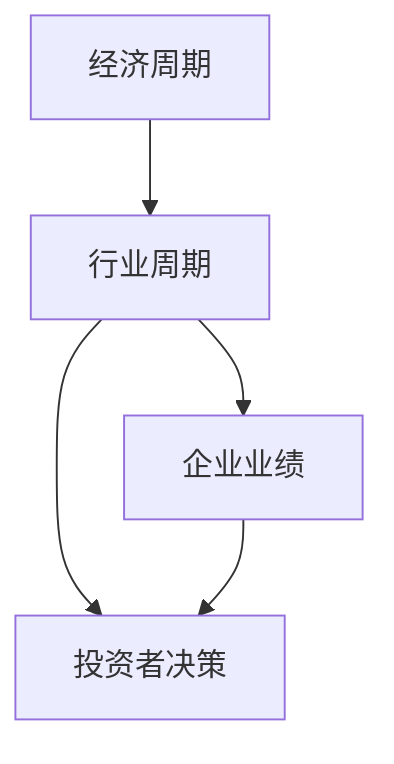
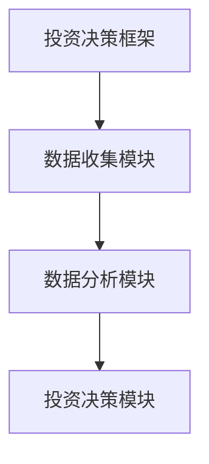
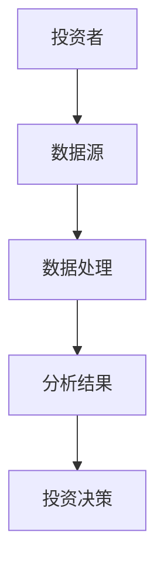

                 

# 彼得林奇对周期性行业的投资策略

> 关键词：彼得·林奇，周期性行业，投资策略，行业周期，基本面分析

> 摘要：本文详细分析了彼得·林奇对周期性行业的投资策略，从行业周期性、企业基本面、市场情绪等多方面展开，结合实际案例和数学模型，深入探讨了周期性行业的投资机会与风险。

---

# 第一部分: 背景介绍

## 第1章: 周期性行业的定义与特点

### 1.1 周期性行业的定义
周期性行业是指那些需求和供给受到经济周期波动显著影响的行业。这些行业的业绩表现往往与整体经济的扩张或收缩密切相关。

- **周期性行业的基本概念**：周期性行业的收入和利润会随着经济周期的变化而波动。例如，建筑、汽车制造、钢铁等行业都属于典型的周期性行业。

- **周期性行业的分类**：
  - **强周期性行业**：如建筑材料、机械设备制造等，其需求与经济周期高度相关。
  - **弱周期性行业**：如部分消费品行业，需求受经济波动影响较小。

- **周期性行业的波动特征**：周期性行业的股票价格通常表现出较大的波动性，往往在经济繁荣时上涨，而在衰退时下跌。

### 1.2 彼得·林奇的投资风格
彼得·林奇是全球知名的价值投资者，以其长期投资和基本面分析著称。

- **彼得·林奇的投资理念**：林奇主张投资于那些具有持续增长潜力的公司，并注重企业的财务状况和管理层质量。

- **彼得·林奇的投资策略**：他倾向于寻找那些被市场低估的公司，尤其是那些在行业周期低谷时表现不佳，但在周期高峰时能够迅速恢复的企业。

- **彼得·林奇对周期性行业的关注点**：林奇关注周期性行业的拐点，即行业从衰退到复苏的转折点，这通常是投资的最佳时机。

### 1.3 彼得·林奇与周期性行业的关联
- **周期性行业的投资机会**：周期性行业在经济复苏或繁荣时期往往能够带来超额收益。

- **彼得·林奇对周期性行业的研究方法**：林奇通过分析行业周期、企业基本面和市场情绪，寻找周期性行业的投资机会。

- **彼得·林奇在周期性行业投资中的成功案例**：例如，他在20世纪80年代投资于一些周期性股票，如ITT公司和西屋电器，取得了显著的收益。

---

## 第2章: 周期性行业的核心概念与联系

### 2.1 周期性行业的核心概念
- **行业周期性**：行业周期性是指行业随着经济周期的波动而呈现出的扩张和收缩的周期性特征。

- **行业波动性**：行业波动性是指行业在不同经济周期中的表现波动程度。

- **行业拐点**：行业拐点是指行业从一个周期阶段转向另一个周期阶段的关键转折点。

### 2.2 核心概念的对比分析
- **周期性行业与非周期性行业的对比**：
  | 特性 | 周期性行业 | 非周期性行业 |
  |------|------------|--------------|
  | 需求波动 | 高         | 低           |
  | 收益波动 | 高         | 低           |
  | 投资风险 | 高         | 中/低        |

- **不同周期性行业的对比**：
  | 特性         | 建筑材料行业 | 汽车制造行业 | 机械设备行业 |
  |--------------|--------------|--------------|--------------|
  | 周期性强度   | 高           | 高           | 中           |
  | 典型企业     | 钢铁公司     | 汽车制造公司 | 重型机械公司 |

- **彼得·林奇对周期性行业的独特见解**：林奇认为，周期性行业的投资机会在于行业拐点的判断，即在行业低谷时买入，在行业高峰时卖出。

### 2.3 实体关系图

---

## 第3章: 彼得·林奇的周期性行业投资策略

### 3.1 投资策略的核心原理
- **基于周期性行业的投资逻辑**：林奇认为，周期性行业的投资机会在于行业周期的波动性，投资者需要在行业低谷时买入，在行业高峰时卖出。

- **彼得·林奇的选股标准**：
  1. 企业的财务状况健康，尤其是负债率低。
  2. 企业的管理层能力强，能够应对行业波动。
  3. 企业的估值被市场低估。

- **周期性行业的估值方法**：
  - **市盈率（P/E）**：市盈率 = 股价 / 每股收益。
  - **市净率（P/B）**：市净率 = 股价 / 每股净资产。

### 3.2 算法原理
- **行业周期分析算法**：
  1. 确定行业的周期性特征。
  2. 分析行业所处的周期阶段。
  3. 判断行业拐点。

- **企业基本面分析算法**：
  1. 分析企业的财务报表。
  2. 评估企业的盈利能力。
  3. 判断企业的成长潜力。

- **市场情绪分析算法**：
  1. 调查投资者情绪。
  2. 分析市场情绪对行业的影响。
  3. 判断市场情绪拐点。

### 3.3 数学模型与公式
- **行业周期模型**：
  $$ P = \frac{E}{GDP} $$
  其中，\( P \) 是行业的平均市盈率，\( E \) 是行业的净利润，\( GDP \) 是国内生产总值。

- **企业估值模型**：
  $$ V = \frac{E}{P} $$
  其中，\( V \) 是企业的估值，\( E \) 是企业的净利润，\( P \) 是行业的平均市盈率。

- **市场情绪指标**：
  $$ S = \frac{M}{V} $$
  其中，\( S \) 是市场情绪指标，\( M \) 是市场的成交量，\( V \) 是市场的总市值。

### 3.4 实例分析
- **某周期性行业的周期性分析**：以建筑材料行业为例，分析其周期性特征。
- **某企业的基本面分析**：以某钢铁公司为例，分析其财务状况和成长潜力。
- **市场情绪对投资决策的影响**：分析市场情绪如何影响投资者对周期性行业的投资决策。

---

## 第4章: 系统分析与架构设计方案

### 4.1 系统架构设计
- **投资决策框架**：包括数据收集、数据分析和投资决策三个模块。
- **数据收集模块**：收集行业的财务数据、市场数据和经济指标。
- **数据分析模块**：分析行业周期、企业基本面和市场情绪。
- **投资决策模块**：根据分析结果，制定投资策略。

### 4.2 系统架构图

### 4.3 数据流图

---

## 第5章: 项目实战

### 5.1 项目介绍
以建筑材料行业为例，分析周期性行业的投资策略。

### 5.2 核心实现
- **数据收集**：收集建筑材料行业的历史数据。
- **数据分析**：分析行业周期和企业基本面。
- **投资策略**：制定基于周期性行业的投资策略。

### 5.3 案例分析
以某建筑材料公司为例，分析其周期性特征和投资价值。

### 5.4 项目总结
总结周期性行业的投资策略，并提出改进建议。

---

## 第6章: 总结与展望

### 6.1 总结
- 彼得·林奇对周期性行业的投资策略强调了行业周期、企业基本面和市场情绪的分析。
- 投资者需要在行业低谷时买入，在行业高峰时卖出。

### 6.2 未来展望
- 进一步研究周期性行业的数学模型。
- 探索周期性行业的投资组合优化方法。

### 6.3 最佳实践 tips
- **投资建议**：投资者应关注行业周期和企业基本面，避免盲目跟风。
- **注意事项**：投资者应警惕市场情绪的波动，避免在市场高估时投资。

### 6.4 小结
周期性行业的投资机会与风险并存，投资者需要具备敏锐的行业洞察力和扎实的基本面分析能力。

---

# 作者：AI天才研究院/AI Genius Institute & 禅与计算机程序设计艺术 /Zen And The Art of Computer Programming

