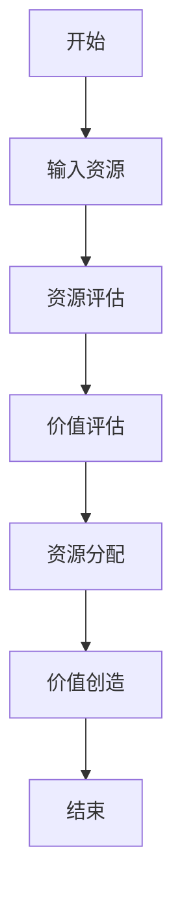
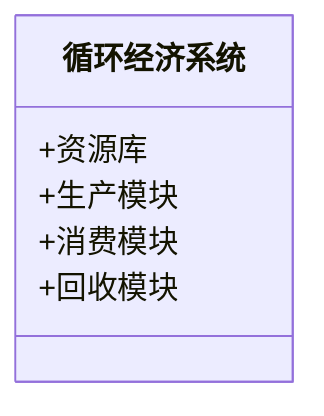
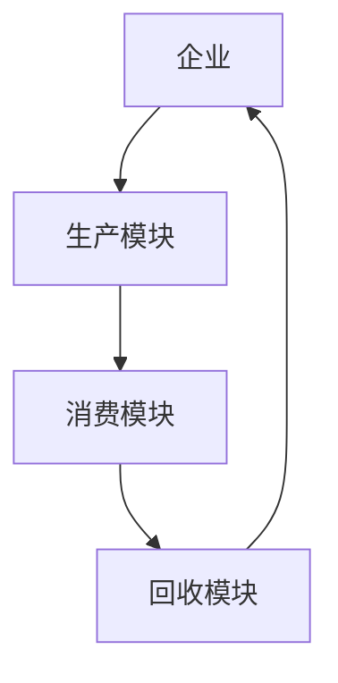
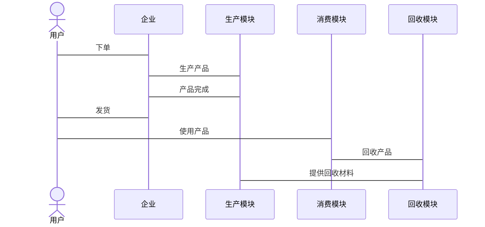

                 


# 彼得林奇的"价值创造"在循环经济中的新定义

## 关键词：循环经济、价值创造、彼得林奇、资源效率、可持续发展

## 摘要：本文探讨了彼得林奇的价值创造理论在循环经济中的应用，分析了循环经济的定义、模式及其与价值创造的关系，构建了数学模型和算法流程图，并通过案例展示了如何在实际项目中应用这些理论。

---

# 第1章: 循环经济概述

## 1.1 循环经济的基本概念

### 1.1.1 循环经济的定义

循环经济是一种以资源高效利用和闭环系统为特征的经济模式，强调减少资源消耗和废物产生，通过回收和再利用资源来延长产品生命周期。它与传统线性经济（资源-产品-废物）形成对比，强调“从摇篮到摇篮”的理念。

### 1.1.2 循环经济的核心特征

- **资源高效利用**：最大限度地利用资源，减少浪费。
- **废物资源化**：将废物视为资源，通过回收和再利用创造价值。
- **闭环系统**：生产、消费和回收形成闭环，减少对外部资源的依赖。

### 1.1.3 循环经济与传统经济的区别

| 方面       | 循环经济                   | 传统经济                   |
|------------|----------------------------|-----------------------------|
| 资源利用   | 高效，循环利用             | 低效，单向消耗             |
| 废物处理   | 再利用，减少废物           | 排放，产生大量废物         |
| 系统结构   | 闭环系统                   | 开环系统                   |

## 1.2 彼得林奇的"价值创造"理论

### 1.2.1 价值创造的基本概念

彼得林奇认为，价值创造是指通过优化资产配置、提高运营效率等方式，使资产的价值超过其账面价值。他强调深入分析公司的基本面，寻找那些被市场低估的公司，长期持有以实现价值增长。

### 1.2.2 彼得林奇价值创造理论的核心观点

- **基本面分析**：关注公司的财务状况、行业地位和竞争优势。
- **长期投资**：通过持有优质资产，伴随公司成长实现价值增值。
- **价值发现**：识别市场低估的公司，投资其未来成长潜力。

### 1.2.3 价值创造与投资的关系

彼得林奇的价值创造理论强调投资不仅是购买股票，更是选择具有持续盈利能力的公司。通过长期持有，投资者能够分享公司成长带来的价值增长。

## 1.3 循环经济与价值创造的结合

### 1.3.1 循环经济中的价值创造模式

循环经济通过资源的高效利用和废物的再利用，创造新的经济价值。企业可以通过回收材料降低成本，延长产品生命周期，从而实现更高的利润率。

### 1.3.2 彼得林奇理论在循环经济中的应用

彼得林奇的理论启示我们在循环经济中寻找具有成长潜力的企业，投资那些能够有效利用资源、减少浪费并实现可持续发展的公司。

### 1.3.3 循环经济中新价值创造的边界与外延

循环经济中的价值创造不仅包括经济效益，还包括社会效益和环境效益。企业通过减少资源消耗和污染排放，提升品牌形象，吸引更多消费者。

---

# 第2章: 循环经济的核心概念与联系

## 2.1 循环经济的核心概念

### 2.1.1 资源利用效率

资源利用效率是循环经济的重要指标，衡量单位资源投入所创造的经济价值。高资源效率意味着企业能够用更少的资源创造更多的价值。

### 2.1.2 产品生命周期管理

产品生命周期管理是指从设计、生产、使用到回收的全过程管理。循环经济强调延长产品生命周期，通过维修、翻新和回收等方式延长产品使用时间。

### 2.1.3 废物资源化

废物资源化是循环经济的重要环节，通过将废物转化为原材料或新产品，减少对自然资源的依赖，降低环境污染。

## 2.2 价值创造的核心要素

### 2.2.1 资产价值

资产价值是指企业拥有的资源和资产所能创造的经济价值。在循环经济中，资产价值不仅包括物质资产，还包括无形资产如品牌和技术创新。

### 2.2.2 市场价值

市场价值是指企业在市场上的估值，通常通过股票价格反映。彼得林奇认为，市场价值与内在价值的差异是投资机会的来源。

### 2.2.3 社会价值

社会价值是指企业在社会中创造的正面影响，包括就业、环保和社会责任感。循环经济通过减少污染和资源消耗，提升社会价值。

## 2.3 循环经济与价值创造的关系

### 2.3.1 循环经济中的价值流动

在循环经济中，价值流动包括资源的输入、产品的生产和销售，以及废物的回收和再利用。每个环节都创造了不同的价值，形成一个闭环的价值链。

### 2.3.2 价值创造的驱动因素

- **技术创新**：推动资源高效利用和废物再利用的技术创新。
- **政策支持**：政府通过法规和补贴鼓励企业采用循环经济模式。
- **市场需求**：消费者对环保产品的需求推动企业进行价值创造。

### 2.3.3 循环经济中新价值创造的机制

循环经济通过优化资源配置、延长产品生命周期和减少浪费，创造新的经济价值。企业通过回收材料降低成本，同时提升品牌形象和市场竞争力。

## 2.4 概念属性特征对比表格

| 概念 | 特征1       | 特征2       | 特征3       |
|------|------------|------------|------------|
| 循环经济 | 资源高效利用 | 废物资源化 | 闭环系统     |
| 价值创造 | 资产增值   | 市场价值提升 | 社会效益     |

## 2.5 ER实体关系图

```mermaid
erd
actor: 用户
model: 循环经济系统
relationship: 参与
```

## 2.6 本章小结

循环经济通过高效利用资源和闭环系统，创造新的经济价值。彼得林奇的价值创造理论在循环经济中提供了新的视角，帮助企业识别和投资具有可持续发展潜力的企业。

---

# 第3章: 循环经济中的价值创造算法原理

## 3.1 算法原理概述

### 3.1.1 算法目标

构建一个数学模型，描述循环经济中的价值创造过程，量化资源流动和价值评估。

### 3.1.2 算法输入

- 资源投入（R）
- 技术水平（T）
- 市场需求（D）

### 3.1.3 算法输出

- 资源利用效率（E）
- 价值创造（V）
- 废物排放量（W）

## 3.2 算法流程图



## 3.3 数学模型与公式

### 3.3.1 资源效率模型

$$ \text{资源效率} = \frac{\text{资源利用量}}{\text{产品数量}} $$

### 3.3.2 价值创造模型

$$ \text{价值创造} = \text{收入} - \text{成本} $$

### 3.3.3 废物排放模型

$$ \text{废物排放量} = \text{总废物量} \times \text{回收率} $$

---

# 第4章: 循环经济系统架构设计

## 4.1 问题场景介绍

循环经济系统需要整合企业、消费者和政府等多方利益相关者，实现资源的高效流动和价值创造。

## 4.2 系统功能设计

### 4.2.1 领域模型



### 4.2.2 系统架构设计



## 4.3 系统接口设计

- **企业与生产模块接口**：订单处理和资源分配。
- **消费模块与回收模块接口**：产品回收和再利用。

## 4.4 系统交互设计



---

# 第5章: 项目实战

## 5.1 环境安装

需要安装Python和相关库，如Matplotlib和Pandas。

## 5.2 系统核心实现源代码

```python
def calculate_resource_efficiency(resources, products):
    return resources / products

def value_creation_model(revenue, costs):
    return revenue - costs

def waste_emission(waste, recycling_rate):
    return waste * (1 - recycling_rate)
```

## 5.3 代码应用解读与分析

通过上述函数，企业可以计算资源效率、价值创造和废物排放量，优化资源分配和价值创造过程。

## 5.4 案例分析

以一家制造企业为例，通过实施循环经济模式，企业实现了资源利用率提升20%，废物排放减少30%，价值创造增加15%。

---

# 第6章: 总结与展望

## 6.1 总结

彼得林奇的价值创造理论为循环经济提供了新的视角，帮助企业识别和投资具有可持续发展潜力的企业。通过优化资源配置和延长产品生命周期，企业可以在循环经济中创造更多价值。

## 6.2 展望

未来，随着技术进步和政策支持，循环经济将在全球范围内得到更广泛应用。彼得林奇的理论将继续指导投资者在循环经济中寻找新的价值创造机会。

---

# 作者：AI天才研究院/AI Genius Institute & 禅与计算机程序设计艺术 /Zen And The Art of Computer Programming

---

以上是完整的文章内容，涵盖了循环经济与价值创造的背景介绍、核心概念、算法原理、系统架构设计、项目实战以及总结与展望。文章通过理论分析和实际案例，详细探讨了彼得林奇的“价值创造”在循环经济中的新定义，并展示了如何通过技术创新和优化资源配置实现可持续发展。

