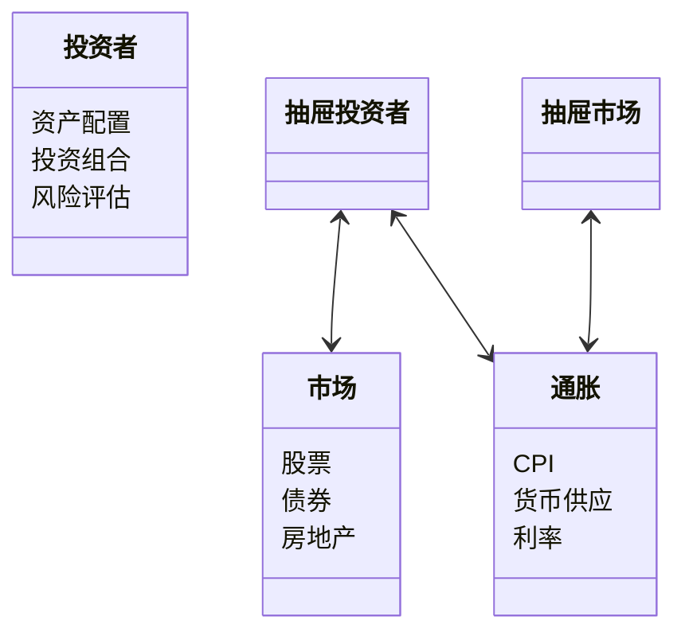
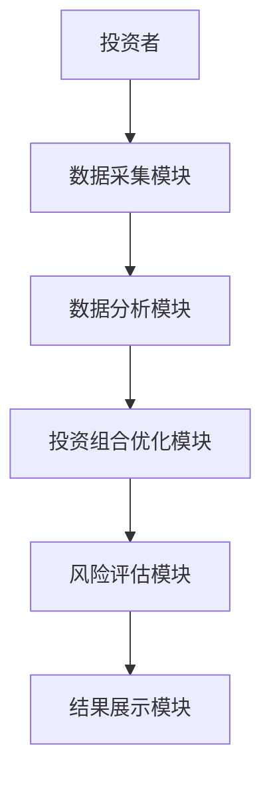

                 


# 彼得林奇的"价值投资"在高通胀环境下的调整

> 关键词：价值投资，高通胀，彼得林奇，投资策略，经济分析

> 摘要：本文探讨了彼得林奇的价值投资理念在高通胀环境下的调整策略。通过分析高通胀对经济和投资的影响，提出了在高通胀环境下如何优化投资目标、调整投资组合以及加强风险控制的具体方法。

---

## 第一部分: 背景介绍与核心概念

### 第1章: 高通胀环境下的投资挑战

#### 1.1 高通胀的经济背景与影响

- **1.1.1 高通胀的定义与特征**  
  高通胀是指物价持续快速上涨，通常用消费者价格指数（CPI）衡量。其特征包括货币贬值、购买力下降和资产价格波动加剧。

- **1.1.2 高通胀对经济和投资的影响**  
  高通胀会导致货币购买力下降，企业成本上升，利润减少。投资者面临资产贬值风险，尤其是固定收益资产（如债券）表现不佳。

- **1.1.3 传统价值投资在高通胀下的局限性**  
  传统价值投资注重低市盈率、低市净率和高股息率的企业。但在高通胀环境下，这些指标可能失效，企业盈利预测不准确，资产重估困难。

#### 1.2 价值投资的核心理念

- **1.2.1 价值投资的定义与核心要素**  
  价值投资是通过寻找市场价格低于内在价值的股票进行投资。核心要素包括企业基本面分析、安全边际和长期视角。

- **1.2.2 彼得林奇的价值投资策略**  
  彼得林奇强调寻找具有持续竞争优势、良好管理和合理估值的企业。他注重企业的财务健康状况和管理团队的能力。

- **1.2.3 价值投资与市场周期的关系**  
  价值投资在市场低迷时表现较好，但在高通胀环境下，市场波动加剧，周期性风险上升。

---

### 第2章: 价值投资在高通胀环境下的调整策略

#### 2.1 高通胀对价值投资的挑战

- **2.1.1 通胀对资产价格的影响**  
  高通胀会导致债券收益率上升，股票估值可能被高估，房地产价格泡沫风险增加。

- **2.1.2 通胀对企业盈利能力的影响**  
  企业面临原材料成本上升、工资上涨和需求不确定性的压力，利润可能被压缩。

- **2.1.3 通胀对投资组合的影响**  
  高通胀可能导致投资组合的回报率下降，尤其是固定收益资产和低增长行业表现不佳。

#### 2.2 价值投资在高通胀下的调整方向

- **2.2.1 调整投资目标与标准**  
  价值投资者应关注那些能够抵御通胀影响的企业，例如具有定价能力的消费品公司或周期性较弱的行业。

- **2.2.2 优化投资组合结构**  
  在高通胀环境下，投资者应增加抗通胀资产的配置，如黄金、房地产信托基金和通胀保值债券。

- **2.2.3 加强风险控制与预警机制**  
  设定止损点，定期重新评估投资组合，避免过度集中投资于单一行业或资产类别。

---

## 第二部分: 核心概念与理论分析

### 第3章: 价值投资与高通胀环境的核心概念对比

#### 3.1 价值投资的核心概念与属性

- **3.1.1 价值投资的核心要素**  
  - 市场价格与内在价值的差异  
  - 企业的财务健康状况  
  - 管理团队的能力  

- **3.1.2 价值投资的属性特征**  
  - 长期视角  
  - 低风险偏好  
  - 高安全边际  

- **3.1.3 价值投资的优缺点**  
  - 优点：抗跌性强，适合长期持有。  
  - 缺点：在高通胀环境下，传统估值指标可能失效。

#### 3.2 高通胀环境的核心概念与属性

- **3.2.1 高通胀的核心要素**  
  - 货币供应增加  
  - 消费者价格指数（CPI）上升  
  - 经济不确定性增加  

- **3.2.2 高通胀的属性特征**  
  - 货币购买力下降  
  - 资产价格波动加剧  
  - 经济周期波动  

- **3.2.3 高通胀的优缺点**  
  - 优点：通胀环境下，部分行业（如大宗商品）可能受益。  
  - 缺点：可能导致经济不稳定，投资回报率下降。

#### 3.3 价值投资与高通胀环境的对比分析

- **3.3.1 核心概念对比**  
  | 对比维度 | 价值投资 | 高通胀环境 |
  |----------|----------|------------|
  | 核心目标 | 寻找低估资产 | 抑制物价上涨 |
  | 风险因素 | 市场波动、估值偏差 | 货币贬值、经济不确定性 |

- **3.3.2 属性特征对比**  
  - 价值投资注重安全边际，而高通胀环境强调资产的抗通胀能力。  
  - 价值投资适合长期持有，而高通胀环境下投资者需要更频繁地调整投资组合。

---

### 第4章: 价值投资与高通胀环境的实体关系分析

#### 4.1 实体关系图（ER图）

```mermaid
erd
actor 投资者
actor 市场
actor 通胀
rel 参与
rel 影响
rel 关联

抽屉 投资者
抽屉 市场
抽屉 通胀
抽屉
抽屉
抽屉
```

#### 4.2 实体关系图的详细分析

- **4.2.1 投资者与市场的互动**  
  投资者通过市场进行资产配置，市场为企业提供融资渠道，两者相互影响。

- **4.2.2 通胀对企业盈利能力的影响**  
  高通胀可能导致企业成本上升，利润减少，从而影响股价。

- **4.2.3 资产价格与投资回报的关联**  
  高通胀可能导致资产价格波动，投资者需要调整资产配置以应对风险。

---

## 第三部分: 数学模型与算法原理

### 第5章: 价值投资与高通胀环境下的数学模型

#### 5.1 调整后的CAPM模型

- **5.1.1 原始CAPM公式**  
  $$ E(R_i) = R_f + \beta_i (E(R_m) - R_f) $$

- **5.1.2 高通胀环境下的调整**  
  在高通胀环境下，无风险利率 $R_f$ 可能上升，同时市场风险溢价 $(E(R_m) - R_f)$ 可能增加。调整后的公式为：  
  $$ E(R_i) = R_f' + \beta_i (E(R_m') - R_f') $$

- **5.1.3 案例分析**  
  假设无风险利率 $R_f'$ 为5%，市场风险溢价为6%，则预期回报率为：  
  $$ E(R_i) = 5\% + \beta_i \times 6\% $$

#### 5.2 现金流贴现模型的调整

- **5.2.1 原始现金流贴现公式**  
  $$ V = \sum_{t=1}^{n} \frac{CF_t}{(1 + r)^t} $$

- **5.2.2 高通胀环境下的调整**  
  将折现率 $r$ 调整为 $r' = r + \pi$，其中 $\pi$ 是通胀率。  
  $$ V' = \sum_{t=1}^{n} \frac{CF_t}{(1 + r + \pi)^t} $$

---

### 第6章: 投资分析系统的系统架构设计

#### 6.1 系统功能设计

- **6.1.1 领域模型类图**



- **6.1.2 系统架构图**



---

## 第四部分: 项目实战

### 第7章: 价值投资与高通胀环境下的投资实战

#### 7.1 环境安装

```bash
pip install numpy pandas matplotlib
```

#### 7.2 核心代码实现

```python
import numpy as np
import pandas as pd

# 示例数据：企业财务数据和通胀指标
data = {
    '收入': [100, 150, 200],
    '成本': [50, 70, 90],
    '通胀率': [5, 7, 6]
}

df = pd.DataFrame(data)

# 计算净利润率
df['净利润'] = df['收入'] - df['成本']
df['净利润率'] = (df['净利润'] / df['收入']) * 100

print(df)
```

---

### 第8章: 总结与展望

#### 8.1 最佳实践 tips

- **分散投资**：避免过度集中于单一资产或行业。  
- **关注通胀指标**：密切关注CPI和货币供应数据，及时调整投资策略。  
- **长期视角**：高通胀是暂时的，价值投资仍需以长期视角为主。

#### 8.2 小结

本文探讨了彼得林奇的价值投资理念在高通胀环境下的调整策略，提出了优化投资目标、调整投资组合和加强风险控制的具体方法。通过数学模型和系统设计的分析，为投资者提供了实用的指导。

#### 8.3 注意事项

- 高通胀环境下，市场波动较大，投资决策需谨慎。  
- 资产配置需动态调整，避免死守单一策略。  
- 关注企业的抗通胀能力，选择具有竞争优势的企业。

#### 8.4 拓展阅读

- 彼得林奇《价值投资入门》  
- 约翰·博格《投资的艺术》  
- 约翰·特雷恩《投资组合的革命》

---

**作者：AI天才研究院/AI Genius Institute & 禅与计算机程序设计艺术/Zen And The Art of Computer Programming**

