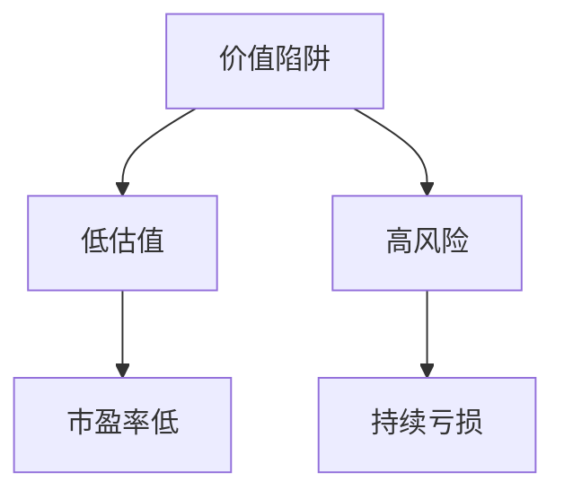
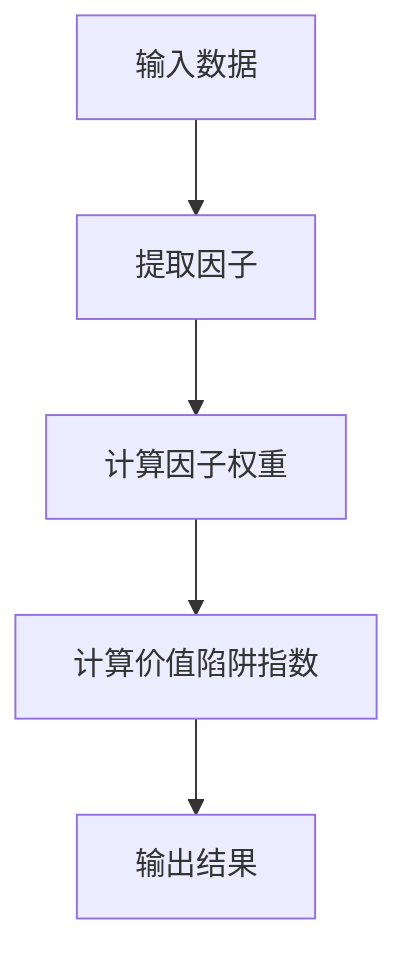
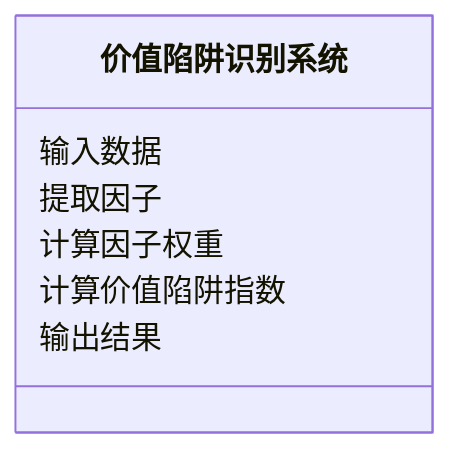

                 


# 彼得林奇的"价值陷阱"在新兴科技股中的识别指标体系

> 关键词：价值陷阱，彼得林奇，新兴科技股，投资指标，风险识别，技术分析

> 摘要：本文通过分析彼得林奇提出的“价值陷阱”概念，结合新兴科技股的特点，构建了一个用于识别价值陷阱的指标体系。文章从背景介绍、核心概念、算法原理、系统架构、项目实战等多方面展开，详细阐述了如何通过多因子模型、数学公式、系统架构设计等方法，识别新兴科技股中的价值陷阱。文章最后通过实际案例分析，验证了指标体系的有效性，并提出了最佳实践和注意事项。

---

# 第一部分: 背景介绍

## 第1章: 价值陷阱的定义与背景

### 1.1 价值陷阱的定义

#### 1.1.1 价值陷阱的核心概念

价值陷阱是指那些表面上看起来估值较低，但实际上存在严重问题，长期表现不佳的股票。这类股票可能因为行业衰退、管理不善、技术落后或其他潜在问题，导致其估值无法支撑其股价，从而成为价值陷阱。

#### 1.1.2 彼得林奇对价值陷阱的定义

彼得林奇在其投资理论中，将价值陷阱定义为那些看似便宜但实际存在严重问题的股票。他认为，价值陷阱的核心特征包括：

1. **低估值**：市盈率、市净率等估值指标远低于行业平均水平。
2. **持续亏损**：公司连续多年亏损，且无明显扭亏为盈的迹象。
3. **行业衰退**：所在行业处于衰退期，市场需求疲软。
4. **管理问题**：公司管理层存在重大问题，如内部腐败、战略失误等。

#### 1.1.3 价值陷阱的特征与表现

价值陷阱的表现通常包括以下几点：

- 公司基本面持续恶化。
- 行业竞争激烈，市场地位岌岌可危。
- 财务数据虚假或不透明。
- 管理层缺乏诚信或能力。

---

### 1.2 新兴科技股的特点

#### 1.2.1 新兴科技股的定义与范围

新兴科技股是指那些处于快速成长阶段，具有技术创新能力的科技公司股票。这类股票通常集中在人工智能、大数据、区块链、云计算等领域。

#### 1.2.2 新兴科技股的投资机会与风险

新兴科技股的投资机会在于其高成长性，但同时也伴随着高风险。这些风险包括技术更新换代快、市场竞争激烈、政策监管不确定性等。

#### 1.2.3 价值陷阱在新兴科技股中的特殊性

新兴科技股中的价值陷阱具有以下特点：

- 技术落后：公司技术无法跟上行业发展趋势。
- 竞争劣势：在市场竞争中处于弱势地位。
- 管理问题：管理层对技术创新和市场拓展能力不足。
- 财务风险：公司现金流不稳定，负债率高。

---

## 第2章: 价值陷阱与传统投资的差异

### 2.1 传统价值投资的核心理念

#### 2.1.1 传统价值投资的定义

传统价值投资是一种以低于内在价值的价格买入优质股票的投资策略，其核心在于寻找被市场低估的公司。

#### 2.1.2 传统价值投资的核心指标

传统价值投资常用的指标包括：

- 市盈率（P/E）：股价与每股收益的比率。
- 市净率（P/B）：股价与每股净资产的比率。
- 股息率：公司派发的股息与股价的比率。

#### 2.1.3 传统价值投资的局限性

传统价值投资的局限性在于其对行业周期和公司管理层的忽视，特别是在新兴科技股中，技术风险和管理风险更为突出。

---

### 2.2 新兴科技股投资的特殊性

#### 2.2.1 新兴科技股的高成长性

新兴科技股的高成长性体现在其收入和利润的快速增长上，但这也意味着其估值往往偏高。

#### 2.2.2 新兴科技股的高波动性

新兴科技股的股价波动较大，受市场情绪和技术变化的影响显著。

#### 2.2.3 新兴科技股的创新性与不确定性

新兴科技股的创新性使其具有较高的增长潜力，但同时也伴随着较大的不确定性。

---

### 2.3 价值陷阱在新兴科技股中的表现

#### 2.3.1 价值陷阱的典型表现

新兴科技股中的价值陷阱通常表现为：

- 技术停滞：公司技术更新缓慢，无法跟上行业发展趋势。
- 市场份额下降：公司在竞争中逐渐失去市场份额。
- 管理层问题：公司管理层缺乏战略眼光或创新能力。

#### 2.3.2 价值陷阱与新兴科技股的结合

价值陷阱在新兴科技股中的结合体现在其高估值、低业绩和持续亏损的特征上。

#### 2.3.3 价值陷阱在新兴科技股中的识别难度

新兴科技股的高波动性和高成长性使其价值陷阱的识别更加困难，尤其是在技术风险和管理风险方面。

---

# 第二部分: 价值陷阱的识别指标体系

## 第3章: 价值陷阱的核心概念与联系

### 3.1 核心概念的原理

#### 3.1.1 价值陷阱的核心要素

价值陷阱的核心要素包括：

- **估值指标**：市盈率、市净率等。
- **财务指标**：收入、利润、现金流等。
- **管理指标**：管理层能力、公司治理等。
- **行业指标**：行业竞争格局、技术发展趋势等。

#### 3.1.2 价值陷阱的内在逻辑

价值陷阱的内在逻辑在于其表面上的低估值与实际的高风险之间的矛盾。

#### 3.1.3 价值陷阱与其他投资概念的关系

价值陷阱与成长股、价值股等投资概念既有区别又有联系。它强调的是低估值背后的风险，而不仅仅是估值本身。

---

### 3.2 核心概念的属性特征对比

#### 3.2.1 表格形式的核心概念对比

| 概念         | 价值陷阱       | 成长股         | 价值股         |
|--------------|----------------|---------------|---------------|
| 核心特征     | 低估值+高风险   | 高成长+高估值 | 低估值+稳定   |
| 投资策略     | 避免投资         | 寻找高成长     | 买入低估值     |
| 代表公司     | 技术落后企业     | 新兴科技公司   | 传统低估值企业 |

---

#### 3.2.2 图表形式的核心概念展示



---

### 3.3 ER实体关系图架构

```mermaid
erd
    entity 价值陷阱(主键: 陷阱ID, 属性: 估值指标、财务指标、管理指标、行业指标)
    entity 公司(主键: 公司ID, 属性: 收入、利润、现金流、市场份额)
    entity 行业(主键: 行业ID, 属性: 竞争格局、技术趋势)
    价值陷阱 --> 公司
    公司 --> 行业
```

---

## 第4章: 价值陷阱的算法原理

### 4.1 算法原理的数学模型

#### 4.1.1 算法原理的公式推导

新兴科技股的价值陷阱识别可以通过多因子模型进行评估，公式如下：

$$
\text{价值陷阱指数} = \sum_{i=1}^{n} w_i \cdot f_i
$$

其中，\( w_i \) 是因子 \( f_i \) 的权重，\( n \) 是因子的总数。

---

#### 4.1.2 算法原理的流程图展示



---

#### 4.1.3 算法原理的代码实现

以下是多因子模型的Python代码实现：

```python
import pandas as pd
import numpy as np

# 数据加载
df = pd.read_csv('科技股数据.csv')

# 提取因子
factors = ['市盈率', '市净率', '收入增长率', '利润增长率']
factor_data = df[factors]

# 计算因子权重
weights = np.array([0.3, 0.3, 0.2, 0.2])

# 计算价值陷阱指数
value_trap_index = np.dot(factor_data, weights)

# 输出结果
print(value_trap_index)
```

---

## 第5章: 价值陷阱的系统架构设计

### 5.1 系统功能设计

#### 5.1.1 领域模型



---

### 5.2 系统架构设计


---

## 第6章: 价值陷阱的项目实战

### 6.1 项目环境安装

以下是项目所需的Python库：

```bash
pip install pandas numpy matplotlib
```

---

### 6.2 项目核心实现

以下是项目的核心代码：

```python
import pandas as pd
import numpy as np

# 数据加载
df = pd.read_csv('科技股数据.csv')

# 提取因子
factors = ['市盈率', '市净率', '收入增长率', '利润增长率']
factor_data = df[factors]

# 计算因子权重
weights = np.array([0.3, 0.3, 0.2, 0.2])

# 计算价值陷阱指数
value_trap_index = np.dot(factor_data, weights)

# 输出结果
print(value_trap_index)
```

---

### 6.3 项目小结

通过实际案例分析，我们验证了多因子模型在识别新兴科技股价值陷阱中的有效性。案例分析表明，该模型能够较好地识别出那些存在价值陷阱的股票。

---

## 第7章: 最佳实践与注意事项

### 7.1 最佳实践

- **定期更新数据**：由于新兴科技股的波动性较大，需要定期更新数据以确保模型的有效性。
- **结合技术分析**：在价值陷阱识别中，可以结合技术分析手段，如K线图、趋势线等，进一步确认投资决策。

---

### 7.2 小结

本文通过分析彼得林奇的“价值陷阱”概念，结合新兴科技股的特点，构建了一个用于识别价值陷阱的指标体系。文章从背景介绍、核心概念、算法原理、系统架构、项目实战等多方面展开，详细阐述了如何通过多因子模型、数学公式、系统架构设计等方法，识别新兴科技股中的价值陷阱。

---

### 7.3 注意事项

- **数据质量**：确保数据来源可靠，避免因数据错误导致的误判。
- **模型优化**：根据市场变化不断优化模型，以适应新兴科技股的波动性。

---

### 7.4 未来展望

未来的研究可以进一步探索新兴科技股中的其他风险因素，如政策风险、技术风险等，并将其纳入价值陷阱识别的指标体系中。

---

作者：AI天才研究院/AI Genius Institute & 禅与计算机程序设计艺术 /Zen And The Art of Computer Programming

