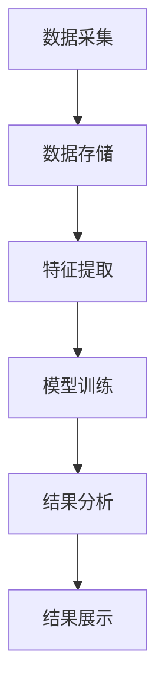

                 


# 彼得林奇的"价值陷阱"在新能源行业中的识别方法

> 关键词：彼得林奇，价值陷阱，新能源行业，投资分析，算法识别

> 摘要：本文详细探讨了彼得林奇的“价值陷阱”概念在新能源行业中的应用，通过系统分析和算法识别，帮助投资者识别潜在的价值陷阱，避免投资失误。

---

## 第一部分：背景介绍

### 第1章：价值陷阱的基本概念

#### 1.1 价值陷阱的定义
- 价值陷阱是投资者在选择投资标的时容易误判价值的现象。
- 彼得林奇强调，价值陷阱通常表现为低市盈率，但背后隐藏着企业经营问题或行业风险。

#### 1.2 新能源行业的特点
- 新能源行业具有高成长性和技术驱动性。
- 市场波动大，政策影响显著，企业间竞争激烈。

#### 1.3 价值陷阱在新能源行业的特殊性
- 技术更新快，企业可能因技术落后陷入困境。
- 政策变化影响企业盈利能力，投资者需警惕政策性陷阱。

---

## 第二部分：价值陷阱的识别方法

### 第2章：价值陷阱的识别原理

#### 2.1 价值陷阱的识别方法
- **财务指标分析法**：通过市盈率、市净率等指标识别低估值陷阱。
- **市场趋势分析法**：分析行业周期，识别逆周期陷阱。
- **竞争分析法**：评估企业市场地位，识别竞争力陷阱。

#### 2.2 新能源行业的价值陷阱识别
- **技术落后陷阱**：企业技术更新慢，难以持续发展。
- **政策依赖陷阱**：过度依赖政府补贴，政策变化影响盈利能力。
- **市场饱和陷阱**：行业竞争激烈，市场饱和导致企业难以扩张。

---

## 第三部分：算法原理

### 第3章：价值陷阱识别的算法模型

#### 3.1 数据收集与处理
- 从财务数据、市场数据和行业报告中提取关键指标。

#### 3.2 特征提取与选择
- 使用Lasso回归选择重要特征，如市盈率、市净率、研发投入比例等。

#### 3.3 模型训练
- 使用逻辑回归或随机森林分类器，训练价值陷阱分类模型。

#### 3.4 结果分析
- 通过混淆矩阵和ROC曲线评估模型性能，调整参数优化分类效果。

---

## 第四部分：系统分析与架构设计

### 第4章：系统分析

#### 4.1 系统架构设计
- **数据采集模块**：实时采集企业财务数据和市场信息。
- **分析模块**：应用算法模型进行价值陷阱识别。
- **结果展示模块**：以可视化方式呈现分析结果。

#### 4.2 系统架构图


---

## 第五部分：项目实战

### 第5章：项目实现

#### 5.1 环境安装
- 安装Python、pandas、scikit-learn、matplotlib等库。

#### 5.2 核心代码实现
```python
import pandas as pd
from sklearn.model_selection import train_test_split
from sklearn.linear_model import LogisticRegression
from sklearn.metrics import accuracy_score

# 数据加载与预处理
data = pd.read_csv('new_energy_data.csv')
X = data.drop('is_trap', axis=1)
y = data['is_trap']

# 数据划分
X_train, X_test, y_train, y_test = train_test_split(X, y, test_size=0.2)

# 模型训练
model = LogisticRegression()
model.fit(X_train, y_train)

# 模型评估
predictions = model.predict(X_test)
print("准确率:", accuracy_score(y_test, predictions))
```

#### 5.3 案例分析
- 以某新能源公司为例，分析其财务数据和市场表现，验证算法识别结果。

---

## 第六部分：最佳实践与总结

### 第6章：最佳实践

#### 6.1 投资建议
- 多关注企业技术研发投入和市场竞争力。
- 分散投资，避免过度集中于单一企业或行业。

#### 6.2 注意事项
- 定期更新数据和模型，适应市场变化。
- 结合行业专家意见，全面评估企业价值。

#### 6.3 拓展阅读
- 推荐阅读彼得林奇的《股市信徒》和《投资的智慧》。

---

## 第七部分：结论

通过系统分析和算法识别，投资者可以有效识别新能源行业中的价值陷阱，避免投资失误，实现稳健投资回报。

---

作者：AI天才研究院 & 禅与计算机程序设计艺术

