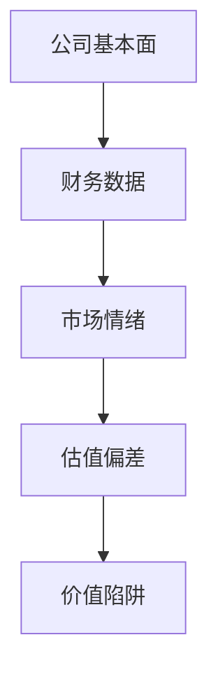
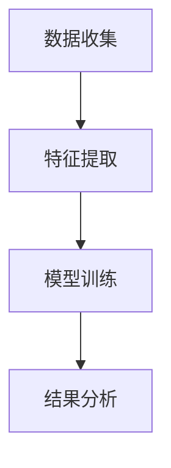

                 


# 彼得林奇的"价值陷阱"避免方法

> 关键词：彼得林奇，价值陷阱，投资策略，风险管理，价值投资，股票分析

> 摘要：本文通过分析彼得林奇的价值陷阱理论，结合技术分析方法，系统性地介绍如何识别和规避价值陷阱。通过实际案例分析、数学模型构建和项目实战，帮助投资者在股票分析中避免价值陷阱，提升投资决策的科学性和准确性。

---

## 第一章：引言

### 1.1 价值陷阱的核心概念
彼得林奇作为全球最著名的投资经理之一，提出了“价值陷阱”的概念。价值陷阱是指那些看似估值低廉，但实际上存在严重问题的股票。这些股票可能会让投资者陷入长期亏损的境地。本文将从理论和实践两个角度，详细分析如何识别和规避价值陷阱。

### 1.2 价值陷阱的背景与意义
价值陷阱的识别是投资决策中的关键环节。本文将结合技术分析方法，构建一套系统化的价值陷阱识别框架，帮助投资者在股票分析中规避潜在风险。

---

## 第二章：价值陷阱的背景与概念

### 2.1 价值陷阱的定义与背景
价值陷阱是指那些表面上估值低廉，但实际上存在严重问题的股票。这些股票可能因为公司基本面恶化、行业环境变化或市场情绪影响，导致其估值偏离实际价值。

### 2.2 价值陷阱的典型案例
彼得林奇在《彼得林奇的投资艺术》中提到过许多价值陷阱的典型案例。例如，一些看似估值低廉的周期性行业股票可能因为行业低迷而难以复苏，导致投资者陷入长期亏损。

### 2.3 价值陷阱的形成机制
价值陷阱的形成通常与市场情绪、行业周期和公司基本面密切相关。本文将从这三个维度分析价值陷阱的形成机制。

---

## 第三章：价值陷阱的核心概念与联系

### 3.1 价值陷阱的核心要素
价值陷阱的核心要素包括公司基本面、财务数据和市场情绪。本文将通过表格和图表的方式，对比不同类型的陷阱，帮助投资者更好地理解价值陷阱的本质。

### 3.2 价值陷阱的属性特征对比
通过对比分析，我们可以更清晰地理解价值陷阱与其他投资陷阱的区别。例如，价值陷阱与成长型投资的主要区别在于对公司未来增长的预期。

### 3.3 价值陷阱的ER实体关系图
以下是价值陷阱的ER实体关系图：



---

## 第四章：价值陷阱的识别与分析

### 4.1 价值陷阱的识别流程
价值陷阱的识别流程通常包括以下几个步骤：
1. 初步筛选：通过低估值指标筛选出潜在的低估值股票。
2. 深度分析：对公司基本面和财务数据进行详细分析。
3. 风险评估：结合市场情绪和行业环境进行综合评估。

### 4.2 价值陷阱的分析框架
价值陷阱的分析框架包括以下几个维度：
- 盈利能力分析
- 财务健康分析
- 管理能力分析
- 行业地位分析
- 市场前景分析

### 4.3 价值陷阱的数学模型
以下是价值陷阱识别的数学模型：

$$价值陷阱识别指数 = \frac{市盈率}{行业平均市盈率} \times \frac{ROE}{行业平均ROE}$$

---

## 第五章：价值陷阱的规避策略

### 5.1 价值陷阱的规避方法
价值陷阱的规避方法包括：
1. 严格筛选低估值股票。
2. 深入分析公司基本面。
3. 结合市场情绪进行综合评估。

### 5.2 价值陷阱的数学模型实现
以下是价值陷阱识别的Python代码实现：

```python
import pandas as pd
import numpy as np

# 示例数据：假设我们有股票数据和行业平均数据
def calculate_value_traps_risk(stock_data, industry_avg_data):
    # 计算市盈率和ROE的比值
    pe_ratio = stock_data['市盈率'] / industry_avg_data['市盈率']
    roe_ratio = stock_data['ROE'] / industry_avg_data['ROE']
    
    # 计算价值陷阱识别指数
    value_traps_risk = pe_ratio * roe_ratio
    
    return value_traps_risk

# 示例数据处理
stock_data = {
    '市盈率': [15, 20, 25],
    'ROE': [8, 10, 12]
}
industry_avg_data = {
    '市盈率': [18, 22, 20],
    'ROE': [6, 8, 7]
}

# 计算价值陷阱识别指数
value_traps_risk = calculate_value_traps_risk(stock_data, industry_avg_data)
print("价值陷阱识别指数：", value_traps_risk)
```

---

## 第六章：项目实战

### 6.1 价值陷阱识别系统设计
价值陷阱识别系统的功能设计包括：
1. 数据收集：收集股票数据和行业平均数据。
2. 特征提取：提取市盈率、ROE等关键指标。
3. 模型训练：基于数学模型进行风险评估。
4. 结果分析：输出价值陷阱识别指数。

### 6.2 系统架构设计
以下是价值陷阱识别系统的架构图：



---

## 第七章：总结与展望

### 7.1 总结
本文通过分析彼得林奇的价值陷阱理论，结合技术分析方法，系统性地介绍了如何识别和规避价值陷阱。

### 7.2 展望
未来的研究可以进一步结合机器学习算法，构建更复杂的模型来识别价值陷阱。

---

## 注意事项

1. 价值陷阱的识别需要结合市场环境和公司基本面，不能单独依赖数学模型。
2. 投资者在实际操作中应保持谨慎，避免过度依赖单一指标。

---

## 作者：AI天才研究院/AI Genius Institute & 禅与计算机程序设计艺术 /Zen And The Art of Computer Programming

