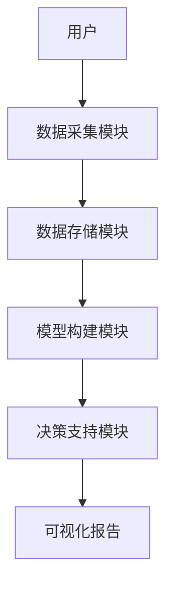
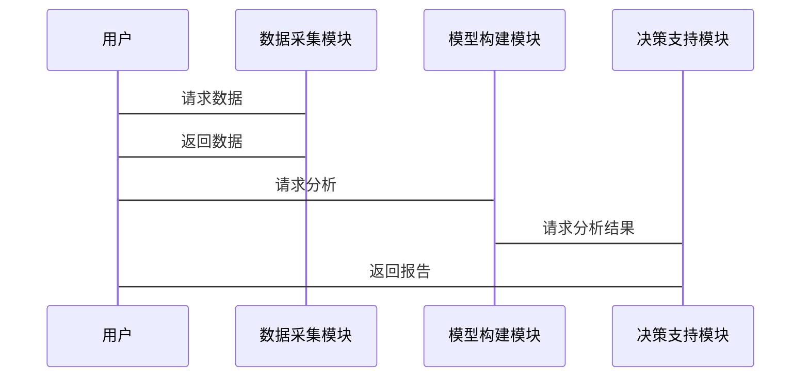

                 


# 彼得林奇的"反向思维"在宏观经济政策解读中的应用

---

## 关键词：
- 宏观经济政策、反向思维、彼得林奇、投资策略、政策解读

---

## 摘要：
本文通过分析彼得林奇的反向思维策略，探讨其在宏观经济政策解读中的应用。文章从宏观经济政策的基本概念、反向思维的核心理念入手，结合实际案例，详细阐述了反向思维在政策解读中的具体应用方法和优势。通过构建数学模型和系统架构，本文提出了一个基于反向思维的宏观经济政策分析框架，并通过实战案例展示了如何利用该框架进行政策解读和投资决策。文章最后总结了反向思维在宏观经济政策解读中的重要性，并提出了未来研究的方向。

---

# 第一部分: 引言

## 第1章: 宏观经济政策与反向思维概述

### 1.1 宏观经济政策的基本概念

#### 1.1.1 宏观经济政策的定义
宏观经济政策是指政府或中央银行为了实现特定的经济目标（如充分就业、价格稳定、经济增长和国际收支平衡）而采取的措施。这些政策主要包括货币政策、财政政策、产业政策等。

#### 1.1.2 宏观经济政策的主要工具
- **货币政策**：通过调节货币供应量、利率等手段影响经济活动。主要工具包括央行的存款准备金率、基准利率、公开市场操作等。
- **财政政策**：通过政府的支出和税收政策来调节经济。主要工具包括政府预算、税收优惠、转移支付等。
- **产业政策**：通过政府干预特定产业的发展，促进经济结构优化。

#### 1.1.3 宏观经济政策的目标与作用
宏观经济政策的主要目标是实现经济稳定和可持续发展。其作用包括调节经济波动、促进就业、控制通货膨胀、平衡国际收支等。

---

### 1.2 彼得林奇的反向思维策略

#### 1.2.1 反向思维的定义
反向思维是一种与传统思维方式相反的思考方式，即在大多数人在做某件事时，反向思维者则选择相反的方向。在投资领域，彼得林奇的反向思维策略是指在市场恐慌时买入，在市场狂热时卖出。

#### 1.2.2 反向思维在投资中的应用
彼得林奇的反向思维策略主要体现在以下几个方面：
1. **逆市场情绪操作**：当市场恐慌时，投资者往往抛售资产，而彼得林奇则选择买入优质资产。
2. **寻找被市场低估的公司**：通过深入分析公司的基本面，寻找那些被市场忽视或低估的企业。
3. **长期投资与价值发现**：彼得林奇主张长期投资，寻找具有持续增长潜力的企业。

#### 1.2.3 反向思维的核心理念与原则
1. **避免从众心理**：不随大流，独立思考。
2. **关注长期价值**：注重企业的基本面，而非短期市场波动。
3. **逆周期操作**：在经济周期的低谷时买入，在高峰期卖出。

---

### 1.3 宏观经济政策解读中的反向思维应用

#### 1.3.1 反向思维在宏观经济政策解读中的价值
反向思维可以帮助投资者更好地理解宏观经济政策的潜在影响，尤其是在政策变化时，能够提前做出反应。

#### 1.3.2 反向思维与宏观经济政策的结合点
1. **货币政策解读**：在利率上升时，寻找利率敏感型资产的投资机会。
2. **财政政策解读**：在政府增加支出时，关注相关产业的投资机会。
3. **产业政策解读**：在政府支持特定产业时，提前布局相关企业。

#### 1.3.3 反向思维在政策解读中的优势与挑战
1. **优势**：
   - 提高投资决策的前瞻性。
   - 减少市场波动对投资决策的影响。
2. **挑战**：
   - 宏观经济政策的复杂性。
   - 市场情绪的不确定性。

---

## 第2章: 宏观经济政策分析的背景与现状

### 2.1 宏观经济政策分析的背景

#### 2.1.1 当前全球经济环境的复杂性
全球经济的不确定性增加，如地缘政治冲突、新冠疫情等，使得宏观经济政策的制定和解读更加复杂。

#### 2.1.2 宏观经济政策的多变性
各国政府根据经济形势不断调整政策，导致政策解读的难度加大。

#### 2.1.3 政策解读的难度与不确定性
政策的滞后效应、政策执行的偏差等因素增加了政策解读的难度。

---

### 2.2 反向思维在政策解读中的必要性

#### 2.2.1 传统政策解读的局限性
传统政策解读往往基于市场共识，而忽视了市场情绪的波动。

#### 2.2.2 反向思维在政策解读中的独特视角
通过反向思维，投资者可以提前发现政策变化的潜在影响。

#### 2.2.3 反向思维在应对政策变化中的优势
在政策变化时，反向思维可以帮助投资者做出更明智的投资决策。

---

## 第3章: 宏观经济政策解读的核心概念与框架

### 3.1 宏观经济政策的核心概念

#### 3.1.1 宏观经济政策的定义与分类
- **货币政策**：由中央银行制定，主要工具包括利率、货币供应量等。
- **财政政策**：由政府制定，主要工具包括政府支出、税收等。

#### 3.1.2 政策目标与政策效果的关系
政策目标是政府希望通过政策实现的目标，而政策效果是政策实施后的实际结果。

#### 3.1.3 政策解读的关键要素
- **政策内容**：政策的具体措施和目标。
- **政策背景**：政策制定的背景和原因。
- **政策影响**：政策对经济和社会的具体影响。

---

### 3.2 反向思维在政策解读中的应用框架

#### 3.2.1 反向思维的基本框架
1. **识别市场情绪**：通过分析市场情绪，判断政策的潜在影响。
2. **分析政策内容**：深入解读政策的具体措施和目标。
3. **评估政策效果**：预测政策实施后的效果，并制定相应的投资策略。

#### 3.2.2 反向思维在政策解读中的具体步骤
1. **数据收集**：收集宏观经济数据和政策信息。
2. **数据分析**：分析数据，识别市场情绪和政策趋势。
3. **制定策略**：根据分析结果，制定投资策略。

#### 3.2.3 反向思维框架的优缺点
1. **优点**：
   - 提高投资决策的前瞻性。
   - 减少市场波动对投资决策的影响。
2. **缺点**：
   - 需要大量的数据支持和分析。
   - 市场情绪的不确定性可能影响策略的有效性。

---

## 第4章: 宏观经济政策解读的核心概念与联系

### 4.1 宏观经济政策的核心概念

#### 4.1.1 宏观经济政策的定义与分类
- **货币政策**：由中央银行制定，主要工具包括利率、货币供应量等。
- **财政政策**：由政府制定，主要工具包括政府支出、税收等。

#### 4.1.2 宏观经济政策的主要目标
- 充分就业
- 价格稳定
- 经济增长
- 国际收支平衡

---

### 4.2 反向思维在政策解读中的核心概念

#### 4.2.1 反向思维的基本原理
反向思维是指在市场情绪与传统思维相反的方向上进行投资。例如，在市场恐慌时买入，在市场狂热时卖出。

#### 4.2.2 反向思维在政策解读中的具体应用
1. **货币政策解读**：当央行加息时，寻找利率敏感型资产的投资机会。
2. **财政政策解读**：当政府增加支出时，关注相关产业的投资机会。
3. **产业政策解读**：当政府支持特定产业时，提前布局相关企业。

---

### 4.3 宏观经济政策解读的核心概念与联系

#### 4.3.1 宏观经济政策与反向思维的联系
反向思维可以帮助投资者更好地理解宏观经济政策的潜在影响，尤其是在政策变化时，能够提前做出反应。

#### 4.3.2 宏观经济政策解读的复杂性
政策的滞后效应、政策执行的偏差等因素增加了政策解读的难度。

---

## 第5章: 宏观经济政策解读的核心概念与联系

### 5.1 宏观经济政策的核心概念

#### 5.1.1 宏观经济政策的定义与分类
- **货币政策**：由中央银行制定，主要工具包括利率、货币供应量等。
- **财政政策**：由政府制定，主要工具包括政府支出、税收等。

#### 5.1.2 宏观经济政策的主要目标
- 充分就业
- 价格稳定
- 经济增长
- 国际收支平衡

---

### 5.2 反向思维在政策解读中的核心概念

#### 5.2.1 反向思维的基本原理
反向思维是指在市场情绪与传统思维相反的方向上进行投资。例如，在市场恐慌时买入，在市场狂热时卖出。

#### 5.2.2 反向思维在政策解读中的具体应用
1. **货币政策解读**：当央行加息时，寻找利率敏感型资产的投资机会。
2. **财政政策解读**：当政府增加支出时，关注相关产业的投资机会。
3. **产业政策解读**：当政府支持特定产业时，提前布局相关企业。

---

## 第6章: 算法原理

### 6.1 反向思维在宏观经济政策解读中的算法原理

#### 6.1.1 数据收集
- 收集宏观经济数据，如GDP、失业率、通胀率等。
- 收集政策信息，如央行的货币政策、政府的财政政策等。

#### 6.1.2 数据分析
- 使用统计方法分析数据，识别市场情绪和政策趋势。
- 使用时间序列分析模型预测政策效果。

#### 6.1.3 投资策略制定
- 根据分析结果，制定投资策略，如在市场恐慌时买入，在市场狂热时卖出。

---

### 6.2 数学模型与公式

#### 6.2.1 时间序列分析模型
时间序列分析模型可以用来预测政策实施后的经济指标变化。

$$
\text{ARIMA模型：} \quad y_t = \phi_1 y_{t-1} + \phi_2 y_{t-2} + \epsilon_t
$$

#### 6.2.2 回归模型
回归模型可以用来分析政策变量与经济指标之间的关系。

$$
\text{回归模型：} \quad y = \beta_0 + \beta_1 x + \epsilon
$$

---

## 第7章: 系统分析与架构设计

### 7.1 系统功能设计

#### 7.1.1 数据采集模块
- 收集宏观经济数据和政策信息。
- 数据清洗和预处理。

#### 7.1.2 模型构建模块
- 构建时间序列分析模型和回归模型。
- 模型训练与优化。

#### 7.1.3 决策支持模块
- 根据模型分析结果，生成投资策略。
- 提供可视化报告和建议。

---

### 7.2 系统架构设计

#### 7.2.1 系统架构图


#### 7.2.2 系统交互图


---

## 第8章: 项目实战

### 8.1 实战环境与工具

#### 8.1.1 环境安装
- 安装Python、Jupyter Notebook、Pandas、NumPy、Matplotlib、Scikit-learn等工具。

#### 8.1.2 数据来源
- 使用公开的宏观经济数据和政策信息。

---

### 8.2 核心实现代码

#### 8.2.1 数据采集与预处理
```python
import pandas as pd
import numpy as np

# 数据采集
data = pd.read_csv('macroeconomic_data.csv')

# 数据清洗
data.dropna(inplace=True)
data = data[~data['policy'].isnull()]
```

#### 8.2.2 模型构建与分析
```python
from sklearn.linear_model import LinearRegression
from sklearn.metrics import mean_squared_error

# 回归模型构建
model = LinearRegression()
model.fit(X_train, y_train)

# 模型预测
y_pred = model.predict(X_test)
print(mean_squared_error(y_test, y_pred))
```

---

## 第9章: 总结与展望

### 9.1 总结
本文通过分析彼得林奇的反向思维策略，探讨了其在宏观经济政策解读中的应用。通过构建数学模型和系统架构，提出了一个基于反向思维的宏观经济政策分析框架，并通过实战案例展示了如何利用该框架进行政策解读和投资决策。

---

### 9.2 展望
未来的研究可以进一步完善反向思维在宏观经济政策解读中的应用，探索更多基于反向思维的投资策略，并结合人工智能技术，提高政策解读的准确性和效率。

---

## 作者：AI天才研究院/AI Genius Institute & 禅与计算机程序设计艺术/Zen And The Art of Computer Programming

