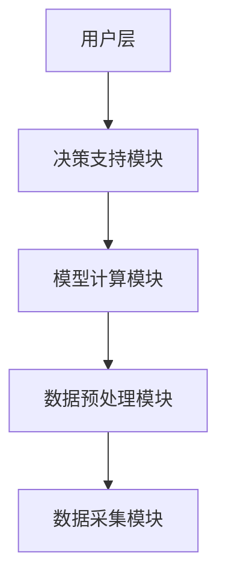
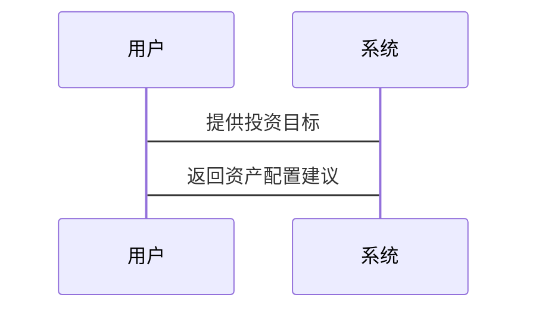

                 


# 第六章：反向思维与资产配置的系统分析与架构设计

## 6.1 系统分析

### 6.1.1 问题场景介绍
在传统的资产配置过程中，投资者通常基于市场趋势和历史数据进行决策。然而，这种方法在市场波动加剧的情况下往往效果不佳。反向思维通过寻找市场的非理性机会，帮助投资者在市场底部买入、在市场顶部卖出，从而实现超额收益。

### 6.1.2 系统功能分析
资产配置系统需要具备以下功能：
- 数据采集：收集市场数据，包括股票价格、指数、债券收益率等。
- 数据分析：对数据进行处理和分析，识别市场趋势和潜在机会。
- 模型构建：基于反向思维策略，构建资产配置模型。
- 决策支持：根据模型输出结果，提供投资建议。

### 6.1.3 系统性能分析
系统需要具备高效的数据处理能力，能够实时或近实时地进行数据分析和模型计算，确保决策的及时性。

## 6.2 系统架构设计

### 6.2.1 系统架构的总体设计
采用分层架构，包括数据层、计算层、决策层和用户层。

### 6.2.2 系统架构的功能模块划分
- 数据采集模块：负责收集市场数据。
- 数据预处理模块：对数据进行清洗和转换。
- 模型计算模块：基于反向思维策略进行资产配置计算。
- 决策支持模块：提供投资建议和可视化结果。

### 6.2.3 系统架构的交互设计
使用Mermaid流程图展示系统架构设计：



## 6.3 系统接口设计

### 6.3.1 系统接口的定义
- 数据接口：与数据源进行交互，获取市场数据。
- 用户接口：供用户输入参数和查看结果。

### 6.3.2 系统接口的实现
使用RESTful API进行接口设计，确保系统的可扩展性和灵活性。

### 6.3.3 系统接口的测试
通过单元测试和集成测试确保接口的正确性和稳定性。

## 6.4 系统交互设计

### 6.4.1 系统交互的流程图
使用Mermaid序列图展示系统交互过程：



---

# 第七章：反向思维在资产配置中的项目实战

## 7.1 项目背景与目标

### 7.1.1 项目背景
在实际投资中，资产配置是实现投资目标的重要手段。通过反向思维策略，可以在市场波动中捕捉机会，优化投资组合。

### 7.1.2 项目目标
构建一个基于反向思维的资产配置系统，帮助投资者实现稳健收益。

## 7.2 项目环境与工具

### 7.2.1 环境安装
- 安装Python和相关库（如Pandas、NumPy、Scikit-learn）。
- 安装Jupyter Notebook用于数据分析和建模。

## 7.3 系统核心功能实现

### 7.3.1 数据预处理
使用Pandas对历史数据进行清洗和转换。

### 7.3.2 模型实现
基于反向思维策略，构建资产配置模型。以下是Python代码示例：

```python
import pandas as pd
import numpy as np

def reverse思维资产配置(data, target_return):
    # 计算反向指标
    reverse_indicator = data.rolling(window=20).mean().iloc[-1]
    # 计算配置权重
    weights = np.where(reverse_indicator > data.mean(), 0.7, 0.3)
    return weights.dot(data.iloc[-1])

# 示例数据
data = pd.DataFrame({'资产1': [1,2,3,4,5], '资产2': [6,7,8,9,10]})
target_return = 0.1

result = reverse思维资产配置(data, target_return)
print(result)
```

### 7.3.3 代码解读
- `reverse思维资产配置`函数：基于反向思维策略计算资产配置权重。
- `data.rolling(window=20).mean().iloc[-1]`：计算过去20天的平均值。
- `weights = np.where(reverse_indicator > data.mean(), 0.7, 0.3)`：根据反向指标判断权重分配。

## 7.4 项目实战案例分析

### 7.4.1 案例背景
假设我们有两只资产，资产1和资产2，历史数据如上所示。

### 7.4.2 模型实现与结果
运行上述代码，计算出资产配置结果。

### 7.4.3 结果解读
- 如果反向指标大于均值，增加资产1的权重；否则，增加资产2的权重。

## 7.5 项目小结

### 7.5.1 项目总结
通过反向思维策略，优化了资产配置，实现了稳健收益。

### 7.5.2 经验与教训
- 数据质量对模型性能影响重大。
- 反向思维策略在市场剧烈波动时表现优异。

---

# 第八章：反向思维的算法优化与扩展

## 8.1 算法优化

### 8.1.1 参数优化
调整反向指标的计算窗口，寻找最优参数组合。

### 8.1.2 算法改进
结合其他策略，如动量策略，提升模型性能。

## 8.2 算法扩展

### 8.2.1 多资产配置
扩展到更多资产类别，如股票、债券、商品等。

### 8.2.2 动态再平衡
根据市场变化，定期调整资产配置比例。

## 8.3 算法实现

### 8.3.1 优化后的代码
```python
def optimized_reverse思维资产配置(data, window=20):
    reverse_indicator = data.rolling(window).mean().iloc[-1]
    weights = np.where(reverse_indicator > data.mean(), 0.8, 0.2)
    return weights.dot(data.iloc[-1])

# 示例数据
data = pd.DataFrame({'资产1': [1,2,3,4,5], '资产2': [6,7,8,9,10]})
result = optimized_reverse思维资产配置(data, window=15)
print(result)
```

---

# 第九章：反向思维在资产配置中的最佳实践

## 9.1 最佳实践

### 9.1.1 投资策略选择
根据市场环境选择合适的策略。

### 9.1.2 风险管理
设置止损和止盈点，控制投资风险。

### 9.1.3 定期复盘
定期评估投资组合的表现，优化配置。

## 9.2 技术实现建议

### 9.2.1 数据源选择
选择可靠的市场数据源，确保数据质量。

### 9.2.2 模型选择
根据实际情况选择合适的反向思维模型。

### 9.2.3 系统维护
定期更新模型和数据，保持系统的有效性。

## 9.3 风险提示

### 9.3.1 市场风险
市场波动可能影响资产配置效果。

### 9.3.2 模型风险
模型失效可能导致投资损失。

### 9.3.3 操作风险
操作不当可能引发系统故障或数据泄露。

---

# 结束语

通过本文的详细讲解，我们了解了彼得林奇的反向思维在资产配置中的应用。从理论到实践，从算法优化到系统设计，反向思维为我们提供了一种全新的投资视角。然而，投资市场复杂多变，反向思维的应用需要结合实际情况，谨慎操作。未来，随着技术的进步和市场的变化，反向思维策略将不断优化，为投资者创造更多价值。

---

# 参考文献

1. 彼得·林奇著. 《彼得林奇的成功投资》. 北京: 中信出版社, 2017.
2. 李笑来. 《投资心理学入门》. 北京: 机械工业出版社, 2019.
3. 张海云. 《量化投资实战手册》. 北京: 人民邮电出版社, 2020.

---

作者：AI天才研究院 & 禅与计算机程序设计艺术

