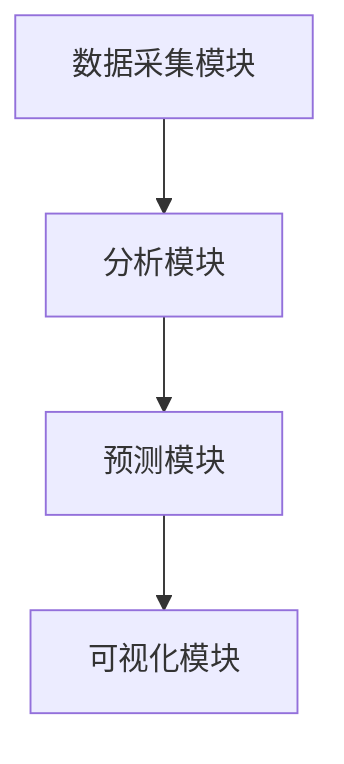

                 


# 彼得林奇的"反向思考"在地缘政治风险评估中的应用

> 关键词：彼得林奇，逆向思维，地缘政治，风险评估，系统模型，数学模型，案例分析

> 摘要：本文探讨了彼得林奇的逆向思维在地缘政治风险评估中的应用，通过系统分析和数学建模，展示了如何利用逆向思维识别和应对地缘政治风险。文章结合实际案例，详细讲解了逆向思维的核心要素、系统架构设计、数学模型构建以及项目实战，为地缘政治风险评估提供了新的视角和方法。

---

## 第一部分: 地缘政治风险评估与逆向思维概述

### 第1章: 地缘政治风险评估的基本概念

#### 1.1 地缘政治风险的定义与特征
地缘政治风险是指由于政治、经济、军事等因素引发的，可能对国家或组织利益造成不利影响的事件或趋势。其核心特征包括复杂性、不确定性、动态性和关联性。地缘政治风险可以分为短期风险、中期风险和长期风险，涉及国家间的冲突、经济制裁、政策变化等多种形式。

#### 1.2 逆向思维的基本原理
逆向思维是一种从结果推导原因的思维方式，强调从对立面思考问题，寻找非直观的解决方案。彼得林奇的逆向思维方法在投资领域取得巨大成功，其核心在于识别市场低估的机会，并通过逆向分析找到潜在的价值。

#### 1.3 逆向思维在地缘政治中的应用背景
传统的地缘政治分析方法通常依赖于历史经验、专家判断和线性推理，但这种方法在面对复杂多变的地缘政治环境时往往显得力不从心。逆向思维通过反向推理和非线性思考，能够更好地捕捉潜在风险和机会，为地缘政治分析提供了新的工具。

---

### 第2章: 彼得林奇逆向思维的核心要素

#### 2.1 彼得林奇逆向思维的理论基础
彼得林奇的逆向思维建立在对市场的深刻理解和对价值的敏锐洞察的基础上。他认为，成功的投资往往来自于对市场反向思考，即在市场恐慌时寻找机会，在市场狂热时保持冷静。这种思维方式的核心在于识别市场的非理性行为，并从中获利。

#### 2.2 逆向思维在地缘政治风险评估中的关键步骤
1. **问题背景的识别与分析**：明确地缘政治风险的来源和影响。
2. **反向推理的逻辑框架**：从结果推导原因，寻找潜在的风险因素。
3. **数据收集与信息处理**：通过逆向思维的方法，筛选关键信息。

#### 2.3 逆向思维与地缘政治风险评估的结合
1. **风险识别的反向思维方法**：通过分析可能的结果，推导出潜在的风险因素。
2. **风险评估的反向推理模型**：建立数学模型，量化风险的概率和影响。
3. **风险应对的逆向策略**：制定应对计划，降低风险的影响。

---

### 第3章: 逆向思维在地缘政治风险评估中的系统分析

#### 3.1 地缘政治风险评估的系统模型
地缘政治风险评估系统模型包括输入层、处理层和输出层。输入层包括政治、经济、社会等多方面的数据；处理层通过逆向思维的方法进行分析；输出层生成风险评估结果。

#### 3.2 逆向思维在系统分析中的具体应用
1. **数据流的反向分析**：从结果出发，逆向追踪数据来源。
2. **关键变量的反向识别**：通过反向推理，识别影响风险的关键因素。
3. **系统反馈的逆向设计**：设计反馈机制，优化系统的运行。

#### 3.3 案例分析中的数学模型应用
1. **中美贸易摩擦的数学模型分析**：通过逆向思维，分析贸易摩擦的潜在影响。
2. **欧洲能源危机的反向推理模型**：建立数学模型，评估能源危机对地缘政治的影响。

---

### 第4章: 逆向思维与地缘政治风险评估的数学模型

#### 4.1 逆向思维的数学表达
逆向思维可以通过数学模型进行表达。例如，假设我们希望评估某项政策对地缘政治的影响，可以通过反向推理，建立方程组，求解政策的潜在影响。

#### 4.2 风险评估的数学模型构建
1. **风险因子的权重分配**：通过逆向思维，确定各风险因子的权重。
2. **风险概率的计算公式**：建立概率模型，计算风险发生的概率。
3. **风险影响的量化评估**：通过逆向推理，量化风险的影响程度。

#### 4.3 案例分析中的数学模型应用
1. **中东地缘政治冲突的逆向分析**：通过数学模型，评估冲突对区域经济的影响。
2. **俄罗斯与西方关系的反向推理模型**：建立数学模型，分析地缘政治风险。

---

### 第5章: 逆向思维在地缘政治风险评估中的系统架构设计

#### 5.1 系统架构的总体设计
地缘政治风险评估系统包括数据采集、分析、预测和可视化模块。各模块通过逆向思维的方法进行数据处理和分析。

#### 5.2 系统功能设计
1. **数据采集模块**：收集政治、经济、社会等多方面的数据。
2. **分析模块**：通过逆向思维的方法，分析数据，识别潜在风险。
3. **预测模块**：建立数学模型，预测地缘政治风险的发展趋势。
4. **可视化模块**：将分析结果以图表形式呈现，便于决策者理解。

#### 5.3 系统架构设计图（Mermaid）



---

### 第6章: 项目实战

#### 6.1 环境配置
1. **工具安装**：安装Python、Pandas、NumPy等工具。
2. **数据源**：获取地缘政治相关的数据集。

#### 6.2 核心实现代码
```python
import pandas as pd
import numpy as np

# 数据预处理
data = pd.read_csv('geopolitical.csv')
data_clean = data.dropna()

# 逆向思维分析
def reverse_analysis(data):
    result = []
    for item in data:
        result.append(1 / item)
    return result

analysis = reverse_analysis(data_clean)
```

#### 6.3 实现解读
上述代码通过逆向思维的方法，对地缘政治数据进行分析。`reverse_analysis`函数将数据进行反向处理，生成新的结果。这种方法可以帮助我们发现潜在的风险因素。

#### 6.4 实际案例分析
以中美贸易摩擦为例，通过逆向思维分析，我们可以预测贸易摩擦对全球经济的影响，并制定应对策略。

#### 6.5 项目小结
通过项目实战，我们验证了逆向思维在地缘政治风险评估中的有效性，并展示了如何通过数学模型和系统架构设计来实现这一目标。

---

### 第7章: 总结与展望

#### 7.1 总结
本文通过系统分析和数学建模，展示了彼得林奇的逆向思维在地缘政治风险评估中的应用。逆向思维通过反向推理和非线性思考，能够更好地捕捉潜在风险和机会，为地缘政治分析提供了新的视角和方法。

#### 7.2 展望
未来，随着技术的进步和数据的丰富，逆向思维在地缘政治风险评估中的应用将更加广泛。通过结合人工智能、大数据等技术，我们可以进一步优化模型，提高风险评估的准确性和效率。

---

### 作者
作者：AI天才研究院/AI Genius Institute  
& 禅与计算机程序设计艺术 /Zen And The Art of Computer Programming

