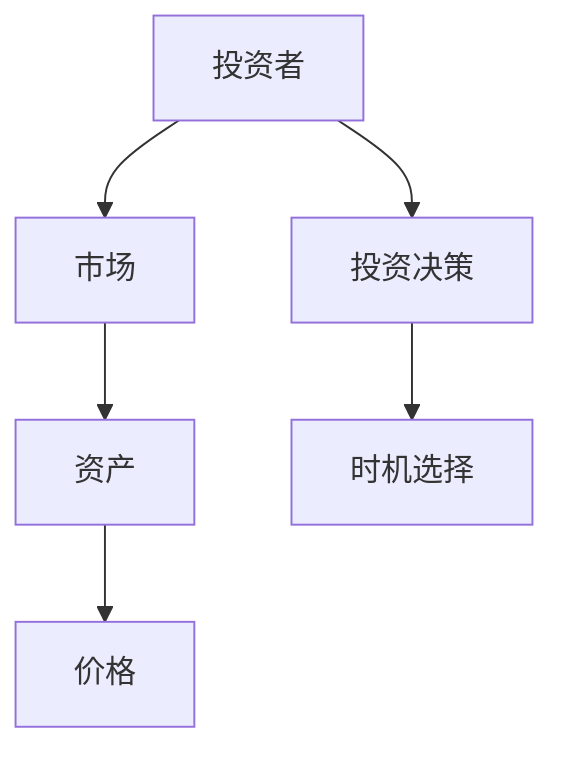
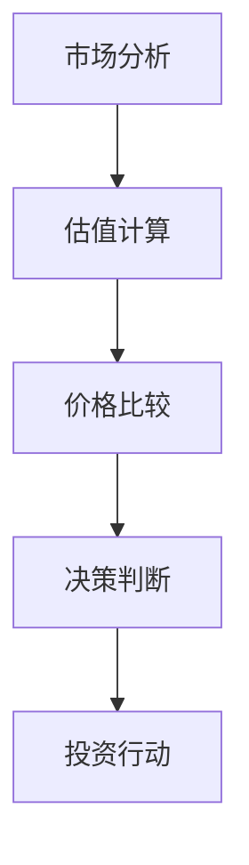
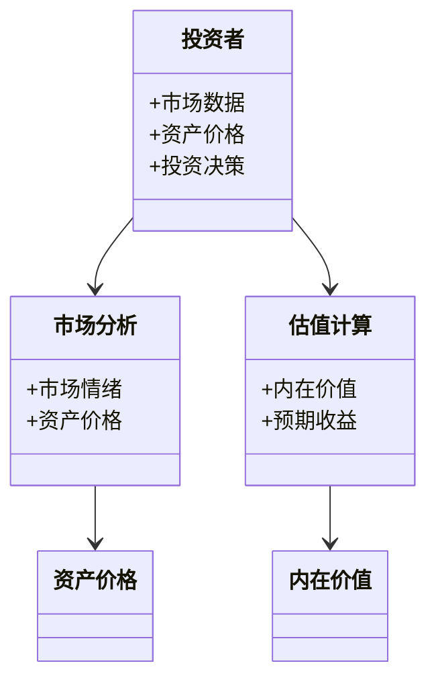

                 


# 彼得林奇的"反向投资"时机选择

> 关键词：反向投资、时机选择、彼得林奇、投资策略、市场分析

> 摘要：本文深入探讨了彼得林奇的反向投资理念及其时机选择策略，分析了其核心概念、数学模型、系统架构，并通过实际案例展示了如何在投资中应用这些策略。

---

## 第一部分：反向投资的背景与基础

### 第1章：反向投资的定义与背景

#### 1.1 投资界的传奇彼得林奇

##### 1.1.1 彼得林奇的生平简介
彼得·林奇（Peter Lynch）是美国著名投资家，曾任富达投资集团麦哲伦基金的经理。他以卓越的投资业绩和独特的投资理念闻名，被誉为“投资界的传奇”。

##### 1.1.2 彼得林奇的投资哲学
彼得林奇主张“逆向投资”，即在市场低迷时买入优质资产，在市场繁荣时卖出。他认为，投资者应关注市场情绪的变化，并在市场恐慌时寻找机会。

##### 1.1.3 彼得林奇与反向投资的渊源
彼得林奇的成功部分归功于他对市场趋势的敏锐洞察和反向投资策略的应用。他强调，投资的关键在于找到市场的“非理性”点，并在这些点上做出决策。

#### 1.2 反向投资的核心概念

##### 1.2.1 反向投资的定义
反向投资是一种投资策略，通过分析市场趋势和情绪，选择在市场低迷时买入，在市场繁荣时卖出。

##### 1.2.2 反向投资的背景与问题背景
在市场繁荣时，投资者情绪高涨；而在市场低迷时，投资者情绪低落。反向投资利用这种情绪波动，寻找投资机会。

##### 1.2.3 反向投资的目标与边界
反向投资的目标是通过市场波动赚取超额收益。其边界在于避免过度依赖市场情绪，同时结合基本面分析。

### 第2章：反向投资的核心概念与联系

#### 2.1 反向投资的核心原理

##### 2.1.1 反向投资的原理概述
反向投资通过分析市场情绪和趋势，寻找价格与价值的偏离点。

##### 2.1.2 反向投资的核心要素
- 市场情绪分析
- 资产价格波动
- 估值与基本面分析

##### 2.1.3 反向投资的概念结构


#### 2.2 核心概念对比分析

##### 2.2.1 反向投资与顺势投资的对比
| 对比维度 | 反向投资 | 顺势投资 |
|----------|----------|----------|
| 投资时机 | 市场低迷时 | 市场繁荣时 |
| 投资策略 | 买入低估资产 | 买入高估资产 |

##### 2.2.2 反向投资与价值投资的对比
| 对比维度 | 反向投资 | 价值投资 |
|----------|----------|----------|
| 投资逻辑 | 基于市场情绪 | 基于内在价值 |
| 投资时机 | 不确定 | 确定 |

##### 2.2.3 反向投资与趋势投资的对比
| 对比维度 | 反向投资 | 趋势投资 |
|----------|----------|----------|
| 投资逻辑 | 基于市场情绪 | 基于价格趋势 |
| 投资时机 | 不确定 | 确定 |

#### 2.3 实体关系图（ER图）


---

## 第二部分：反向投资的时机选择策略

### 第3章：反向投资的时机选择原理

#### 3.1 反向投资的时机选择模型

##### 3.1.1 时机选择的核心步骤
1. 市场分析
2. 估值计算
3. 价格比较
4. 决策判断
5. 投资行动

##### 3.1.2 时机选择的关键因素
- 市场情绪
- 资产价格
- 估值与基本面

##### 3.1.3 时机选择的数学模型
$$ V = \frac{E}{P} $$
其中，\( V \) 表示内在价值，\( E \) 表示预期收益，\( P \) 表示当前价格。

#### 3.2 反向投资的时机选择算法


---

### 第4章：反向投资的数学模型与公式

#### 4.1 反向投资的核心公式
$$ V = \frac{E}{P} $$
其中，\( V \) 表示内在价值，\( E \) 表示预期收益，\( P \) 表示当前价格。

---

## 第三部分：反向投资的系统分析与架构设计

### 第4章：反向投资的系统分析与架构设计

#### 4.1 问题场景介绍
反向投资系统需要分析市场数据，计算资产价值，并根据市场情绪做出投资决策。

#### 4.2 项目介绍
反向投资系统是一个基于彼得林奇投资理念的投资决策支持系统。

#### 4.3 系统功能设计（领域模型）



#### 4.4 系统架构设计


#### 4.5 系统交互设计


---

## 第四部分：反向投资的项目实战

### 第5章：反向投资的项目实战

#### 5.1 环境安装
安装必要的投资分析工具和数据源。

#### 5.2 核心代码实现

##### 5.2.1 代码实现
```python
def calculate_intrinsic_value(expected_yield, price):
    return expected_yield / price

market_data = get_market_data()
intrinsic_value = calculate_intrinsic_value(market_data['E'], market_data['P'])
investment_decision = intrinsic_value < market_data['P']
```

##### 5.2.2 代码解读
- `calculate_intrinsic_value` 函数计算资产的内在价值。
- `market_data` 包含市场数据，包括预期收益率和当前价格。
- `investment_decision` 根据内在价值和当前价格做出投资决策。

#### 5.3 案例分析
分析一个具体的投资案例，展示反向投资策略的应用。

---

## 第五部分：反向投资的最佳实践

### 第6章：反向投资的最佳实践

#### 6.1 最佳实践 tips
- 保持对市场的敏感性
- 结合基本面分析
- 控制风险

#### 6.2 小结
反向投资是一种有效的投资策略，但需要结合市场情绪和基本面分析。

#### 6.3 注意事项
- 避免过度依赖市场情绪
- 结合多种投资策略
- 控制投资风险

#### 6.4 拓展阅读
推荐相关书籍和文章，进一步深入学习反向投资策略。

---

## 结语

彼得林奇的反向投资策略为投资者提供了一种独特的投资思路。通过分析市场情绪和价格波动，投资者可以在市场低迷时找到机会，在市场繁荣时规避风险。然而，反向投资需要结合具体情况，灵活应用。

---

作者：AI天才研究院/AI Genius Institute & 禅与计算机程序设计艺术 /Zen And The Art of Computer Programming

