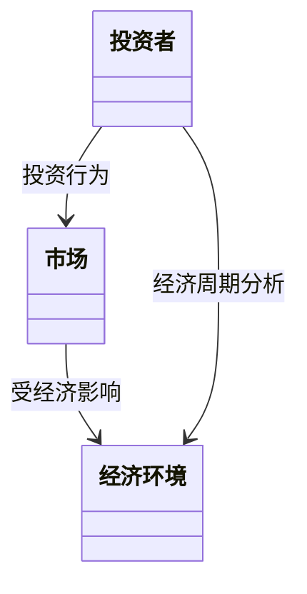

                 


---

# 彼得林奇的"反周期"投资在不同地域市场的应用

> 关键词：反周期投资，彼得·林奇，投资策略，经济周期，市场波动

> 摘要：本文系统地探讨了彼得·林奇提出的“反周期”投资策略在不同地域市场的应用。通过分析经济周期与市场波动的关系，结合数学模型与实际案例，本文详细阐述了反周期投资的核心原理、系统架构与实战应用。文章最后总结了反周期投资的优缺点，并提出了未来研究方向。

---

## 第一部分：反周期投资的背景与理论基础

### 第1章：反周期投资的核心概念

#### 1.1 什么是反周期投资

反周期投资是一种与传统周期性投资相反的投资策略，其核心思想是通过逆向思维，在市场低谷时投资，以期在市场复苏时获得超额收益。与传统周期性投资（顺势而为）不同，反周期投资强调“逆势而为”，在市场低迷时寻找投资机会。

反周期投资的核心理念可以总结为：在市场底部买入，在市场顶部卖出。这种策略要求投资者具备极强的市场敏感性，能够在市场恐慌时保持冷静，抓住低估资产的投资机会。

彼得·林奇是反周期投资的倡导者之一，他认为市场的波动性为投资者提供了低吸高抛的机会。反周期投资的理论基础包括以下几个方面：

1. **市场波动性**：市场的波动性为投资者提供了周期性机会。
2. **逆向思维**：在市场恐慌时寻找低估资产，在市场狂热时寻找高估资产。
3. **长期视角**：反周期投资强调长期视角，关注资产的内在价值。

---

#### 1.2 投资周期与市场波动

市场的波动性是反周期投资的核心关注点。经济周期与市场周期密切相关，但并非完全同步。通常，经济周期包括以下几个阶段：

1. **衰退期**：经济活动放缓，企业盈利下降，市场估值处于低位。
2. **复苏期**：经济逐渐复苏，企业盈利开始回升，市场估值逐步修复。
3. **扩张期**：经济繁荣，企业盈利达到高位，市场估值趋于高位。
4. **衰退期**：经济再次衰退，企业盈利下降，市场估值回归低位。

反周期投资的核心是通过识别市场周期的不同阶段，制定相应的投资策略。例如，在衰退期寻找低估资产，在扩张期寻找高估资产。

---

#### 1.3 反周期投资的边界与外延

反周期投资的适用场景包括以下几种：

1. **市场恐慌阶段**：投资者恐慌性抛售资产，市场估值大幅低于资产内在价值。
2. **市场狂热阶段**：投资者盲目追涨，市场估值大幅高于资产内在价值。
3. **经济周期转折点**：经济周期的拐点通常伴随着市场波动性加剧。

需要注意的是，反周期投资并非适用于所有市场环境。在市场稳定或经济周期处于扩张期时，反周期投资可能并不适用，甚至可能带来风险。

---

## 第二部分：彼得·林奇反周期投资的核心原理

### 第2章：反周期投资的核心原理

#### 2.1 反周期投资的数学模型与公式

反周期投资的核心原理可以用以下数学模型表示：

$$
V(t) = \frac{1}{P(t)}
$$

其中，\( V(t) \) 表示资产的内在价值，\( P(t) \) 表示资产的市场价格。该公式表明，当市场价格 \( P(t) \) 下降时，内在价值 \( V(t) \) 上升，反之亦然。

反周期投资的收益可以用以下公式表示：

$$
R(t) = \frac{V(t+1) - V(t)}{V(t)}
$$

其中，\( R(t) \) 表示收益。当 \( R(t) > 0 \) 时，资产的内在价值上升，反之亦然。

---

#### 2.2 反周期投资的核心要素与ER实体关系图

反周期投资的核心要素包括投资者、市场和经济环境。以下是 ER 实体关系图：

```mermaid
er
  actor(投资者)
  actor(市场)
  actor(经济环境)
  relation(投资行为)
  relation(市场波动)
  relation(经济周期)
```

该图表明，投资者通过投资行为影响市场波动，而市场波动又受到经济周期的影响。

---

#### 2.3 反周期投资的原理与机制

反周期投资的核心机制包括以下几点：

1. **投资者行为分析**：投资者在市场恐慌时倾向于卖出资产，在市场狂热时倾向于买入资产。
2. **市场波动与投资机会的关系**：市场波动越大，投资机会越多。
3. **反周期投资的实施机制**：通过识别市场周期的不同阶段，制定相应的投资策略。

---

## 第三部分：反周期投资在不同地域市场的应用

### 第3章：美国市场中的反周期投资

#### 3.1 美国市场的经济周期特点

美国市场的经济周期具有以下特点：

1. **周期性显著**：美国市场的波动性较高，经济周期较为明显。
2. **市场深度大**：美国市场拥有全球最深的市场，投资者可以选择的资产种类丰富。
3. **政策影响大**：美联储的货币政策对市场波动影响显著。

#### 3.2 彼得·林奇在美国市场的投资策略

彼得·林奇在美国市场的投资策略包括以下几点：

1. **逆向投资**：在市场恐慌时买入低估资产，在市场狂热时卖出高估资产。
2. **分散投资**：通过分散投资降低市场波动风险。
3. **长期视角**：关注资产的长期价值，而非短期波动。

#### 3.3 美国市场的系统分析与架构设计

以下是美国市场的系统分析与架构设计：



该图表明，投资者通过投资行为影响市场，而市场又受到经济环境的影响。

---

## 总结与展望

反周期投资是一种有效的投资策略，尤其适用于市场波动较大的环境。通过分析不同地域市场的特点，我们可以更好地理解反周期投资的应用场景。然而，反周期投资也存在一定的风险，例如市场周期难以预测、投资时机的选择难度较大等。

未来的研究方向可以包括以下几个方面：

1. **数学模型的优化**：进一步完善反周期投资的数学模型，提高模型的预测精度。
2. **算法优化**：探索更高效的算法，以应对复杂的市场环境。
3. **多市场比较研究**：进一步研究不同地域市场的反周期投资策略。

---

## 附录

### 附录1：术语表

1. 反周期投资：一种与传统周期性投资相反的投资策略，强调逆向思维。
2. 经济周期：经济活动的波动性变化，包括衰退期、复苏期、扩张期和衰退期。
3. 市场波动：市场价格的短期波动，通常由投资者情绪和市场供需变化引起。

---

### 附录2：数据来源

1. 美联储货币政策数据
2. 美国市场历史数据
3. 彼得·林奇的投资策略研究

---

### 附录3：参考文献

1. 彼得·林奇《彼得·林奇的投资策略》
2. 经济周期理论相关文献
3. 市场波动性研究相关文献

---

## 作者

作者：AI天才研究院/AI Genius Institute & 禅与计算机程序设计艺术 /Zen And The Art of Computer Programming

---

本文系统地探讨了彼得·林奇的反周期投资策略在不同地域市场的应用，通过理论分析与实际案例相结合，为投资者提供了有价值的参考。

