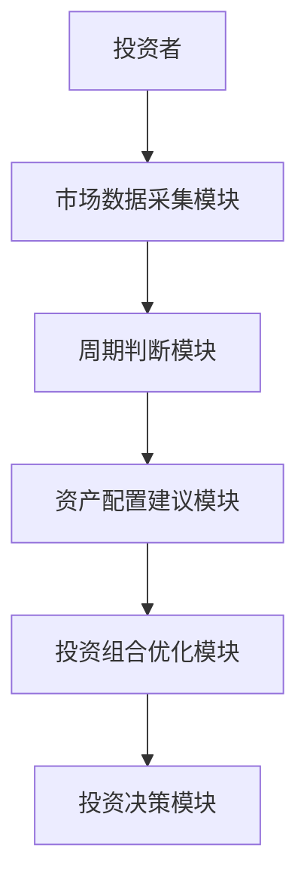
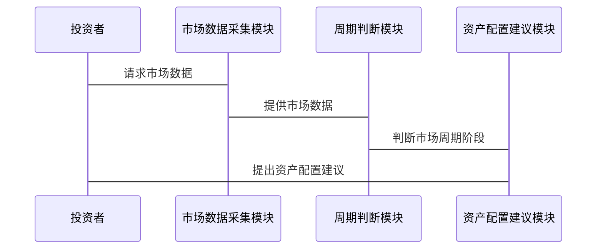

                 


# 彼得林奇的"反周期"投资在不同资产类别间的轮动

## 关键词：反周期投资，彼得林奇，资产轮动，投资策略，资产配置

## 摘要：本文深入分析了彼得林奇的反周期投资理念，并探讨了如何将其应用于不同资产类别间的轮动策略。通过市场周期分析、技术指标判断、资产配置模型构建以及系统设计，本文为投资者提供了在不同经济环境下优化投资组合的实用方法。

---

# 第1章：反周期投资的核心概念与背景

## 1.1 反周期投资的定义与特点

### 1.1.1 反周期投资的定义
反周期投资是一种投资策略，强调在市场周期性波动中，逆市场趋势进行资产配置。与顺势而为的顺势投资不同，反周期投资的核心在于在市场低谷时加仓，在市场高点时减仓，从而在周期性波动中实现超额收益。

### 1.1.2 反周期投资的核心特点
- **逆向思维**：在市场恐慌时买入，在市场疯狂时卖出。
- **周期性波动**：关注经济周期、市场周期对资产价格的影响。
- **长期视角**：反周期投资注重长期收益，而非短期波动。

### 1.1.3 反周期投资与传统投资的区别
| 特性         | 反周期投资                 | 传统投资                 |
|--------------|---------------------------|---------------------------|
| 投资时机     | 逆市场周期                 | 顺势而为                 |
| 风险管理     | 通过逆向配置降低风险       | 通过分散化降低风险       |
| 收益来源     | 市场周期性波动中的超额收益 | 市场上涨时的收益          |

## 1.2 彼得·林奇的投资理念

### 1.2.1 彼得·林奇的生平简介
彼得·林奇（Peter Lynch）是美国著名的基金经理，曾管理富达麦哲伦基金（Fidelity Magellan Fund），创造了年化29%的回报率。他的投资理念以“反周期”和“逆向思维”著称。

### 1.2.2 林奇的反周期投资策略
- **买入被市场忽视的股票**：关注基本面良好但被市场低估的公司。
- **卖出高位泡沫**：当市场出现非理性上涨时，及时减仓。
- **资产轮动**：根据市场周期，在股票、债券等资产之间切换。

### 1.2.3 林奇的经典投资案例
例如，林奇在20世纪80年代初买入当时被市场忽视的垃圾股，后来这些公司成长为行业龙头，带来了丰厚的回报。

## 1.3 资产类别间的轮动机制

### 1.3.1 股票、债券、商品等资产的基本特性
- **股票**：高风险、高收益，周期性较强。
- **债券**：相对稳定，受利率影响较大。
- **商品**：抗通胀能力强，周期性波动显著。

### 1.3.2 不同资产类别间的轮动逻辑
- **经济衰退期**：债券和黄金表现较好。
- **经济复苏期**：股票和周期性行业股票表现较好。
- **经济过热期**：卖出股票，转向债券或现金。
- **经济滞胀期**：持有抗通胀资产（如商品）。

### 1.3.3 资产轮动的周期性特征
通过分析经济周期和市场周期，投资者可以更好地把握不同资产的轮动机会。

## 1.4 本章小结
本章介绍了反周期投资的核心概念、彼得·林奇的投资理念以及资产类别间的轮动机制，为后续分析奠定了基础。

---

# 第2章：市场周期与资产轮动分析

## 2.1 市场周期的定义与划分

### 2.1.1 市场周期的四个阶段
- **底部阶段**：市场估值低，投资机会多。
- **上升阶段**：市场逐步复苏，资产价格上涨。
- **顶部阶段**：市场出现泡沫，风险积累。
- **下跌阶段**：市场恐慌，资产价格大幅调整。

### 2.1.2 每个阶段的资产表现特征
- **底部阶段**：股票、债券等资产价格被低估。
- **上升阶段**：股票表现优于债券。
- **顶部阶段**：债券、现金等防御性资产更安全。
- **下跌阶段**：商品、黄金等避险资产表现较好。

### 2.1.3 市场周期的判断方法
- **技术指标**：如MACD、RSI等。
- **估值指标**：如市盈率、市净率等。
- **宏观经济指标**：如GDP增速、通胀率等。

## 2.2 资产轮动的驱动因素

### 2.2.1 经济周期对资产轮动的影响
- **经济衰退**：债券和现金更安全。
- **经济复苏**：股票和周期性行业股票表现较好。
- **经济过热**：商品和抗通胀资产需求上升。

### 2.2.2 利率、通胀等宏观经济因素
- **低利率环境**：股票和风险资产表现较好。
- **高通胀环境**：商品和黄金表现较好。

### 2.2.3 市场情绪与投资者行为
- **贪婪与恐惧**：市场顶部和底部的形成与投资者情绪密切相关。

## 2.3 技术分析在反周期投资中的应用

### 2.3.1 技术分析的基本原理
技术分析通过研究历史价格和成交量数据，预测未来的价格走势。

### 2.3.2 市场拐点的技术指标判断
- **MACD指标**：用于判断趋势的强度和方向。
- **RSI指标**：用于判断超买超卖状态。
- **支撑位和阻力位**：用于判断价格的支撑和阻力。

### 2.3.3 资产轮动的技术分析策略
通过技术指标，投资者可以更好地判断资产轮动的时机。

## 2.4 本章小结
本章分析了市场周期与资产轮动的关系，并探讨了技术分析在反周期投资中的应用。

---

# 第3章：股票与债券间的轮动策略

## 3.1 股票投资的反周期策略

### 3.1.1 股票市场的周期性特征
股票市场的波动性较大，周期性明显。

### 3.1.2 林奇的选股方法
- **基本面分析**：关注公司财务状况和盈利能力。
- **估值分析**：寻找被低估的股票。
- **行业分析**：关注周期性行业。

### 3.1.3 股票投资的时机选择
在市场底部阶段买入，在市场顶部阶段卖出。

## 3.2 债券投资的反周期策略

### 3.2.1 债券市场的周期性特征
债券市场的波动性较小，受利率影响较大。

### 3.2.2 债券投资的时机选择
在市场顶部阶段买入，在市场底部阶段卖出。

### 3.2.3 债券与股票的跷跷板效应
股票上涨时债券下跌，股票下跌时债券上涨。

## 3.3 股票与债券间的资产配置模型

### 3.3.1 资产配置的基本原理
根据市场周期，动态调整股票和债券的配置比例。

### 3.3.2 林奇的资产配置策略
- **经济衰退期**：增加债券配置，减少股票配置。
- **经济复苏期**：增加股票配置，减少债券配置。

### 3.3.3 不同经济周期下的配置比例
- **衰退期**：债券60%，股票40%。
- **复苏期**：债券30%，股票70%。
- **过热期**：债券50%，股票50%。
- **滞胀期**：债券70%，股票30%。

## 3.4 本章小结
本章探讨了股票与债券间的轮动策略，并提出了动态资产配置模型。

---

# 第4章：反周期投资的系统架构与实现

## 4.1 系统功能设计

### 4.1.1 问题场景介绍
投资者需要根据市场周期和资产轮动规律，动态调整投资组合。

### 4.1.2 项目介绍
构建一个反周期投资系统，帮助投资者实现资产的动态配置。

### 4.1.3 系统功能设计
- **市场数据采集**：获取股票、债券等资产的市场数据。
- **周期判断**：判断当前市场所处的周期阶段。
- **资产配置建议**：根据周期阶段，提出资产配置建议。

### 4.1.4 系统架构设计


### 4.1.5 系统接口设计
- **市场数据接口**：从数据源获取市场数据。
- **周期判断接口**：判断当前市场周期阶段。
- **资产配置接口**：根据周期阶段，提出资产配置建议。

### 4.1.6 系统交互设计


## 4.2 系统功能实现

### 4.2.1 环境安装
需要安装Python、Pandas、Matplotlib等工具。

### 4.2.2 核心代码实现
```python
import pandas as pd
import numpy as np

# 定义市场周期判断函数
def determine_cycle(data):
    # data为市场指数数据
    # 返回当前周期阶段：0-底部，1-上升，2-顶部，3-下跌
    # 示例代码，实际应用中需要更复杂的算法
    pass

# 定义资产配置函数
def asset Allocation(cycle):
    if cycle == 0:
        return {'股票': 40%, '债券': 60%}
    elif cycle == 1:
        return {'股票': 70%, '债券': 30%}
    elif cycle == 2:
        return {'股票': 30%, '债券': 70%}
    else:
        return {'股票': 40%, '债券': 60%}
```

### 4.2.3 案例分析
假设当前市场处于底部阶段，系统会建议投资者增加股票配置，减少债券配置。

## 4.3 本章小结
本章通过系统设计和实现，为投资者提供了一个动态调整资产配置的工具。

---

# 第5章：反周期投资的实战应用

## 5.1 环境安装
安装必要的Python库和工具。

## 5.2 核心代码实现
```python
import pandas as pd
import numpy as np

# 示例代码：市场周期判断
def determine_cycle(data):
    # 示例算法，实际应用中需要更复杂的逻辑
    return 0  # 0表示底部阶段

# 示例代码：资产配置
def asset Allocation(cycle):
    if cycle == 0:
        return {'股票': 40%, '债券': 60%}
    elif cycle == 1:
        return {'股票': 70%, '债券': 30%}
    elif cycle == 2:
        return {'股票': 30%, '债券': 70%}
    else:
        return {'股票': 40%, '债券': 60%}
```

## 5.3 案例分析
假设当前市场处于底部阶段，系统会建议投资者增加股票配置。

## 5.4 本章小结
本章通过实战案例，展示了反周期投资策略的应用。

---

# 第6章：反周期投资的最佳实践与小结

## 6.1 最佳实践
- 定期审视投资组合，根据市场周期调整配置。
- 结合技术分析和基本面分析，提高判断准确性。
- 保持耐心，避免频繁交易。

## 6.2 小结
反周期投资是一种有效的投资策略，通过动态调整资产配置，可以在市场周期波动中实现超额收益。

## 6.3 注意事项
- 投资者需具备一定的市场分析能力。
- 系统设计需结合实际情况，避免过于复杂。

## 6.4 拓展阅读
推荐阅读彼得·林奇的《彼得·林奇的投资艺术》。

---

# 作者：AI天才研究院/AI Genius Institute & 禅与计算机程序设计艺术 /Zen And The Art of Computer Programming

