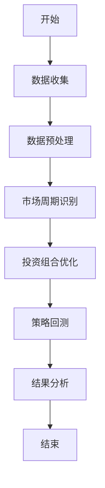
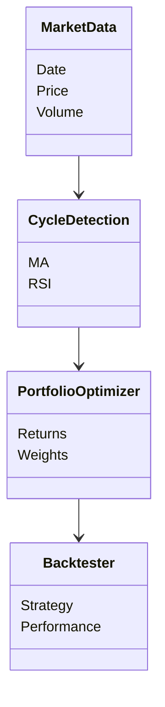

                 


# 彼得林奇的"反周期"投资在加密货币市场的应用策略

> 关键词：彼得林奇，反周期投资，加密货币，投资策略，算法交易

> 摘要：本文详细探讨了彼得·林奇的“反周期”投资策略在加密货币市场的应用。通过分析加密货币市场的周期性特点，结合反周期投资的核心原理，提出了基于数学模型的投资策略，并通过实际案例展示了如何在加密货币市场中实现反周期投资。文章最后总结了策略的有效性和潜在风险，并展望了未来的研究方向。

---

# 第一部分：彼得·林奇“反周期”投资策略概述

## 第1章：彼得·林奇投资理念与反周期策略

### 1.1 彼得·林奇投资理念的核心要素

#### 1.1.1 彼得·林奇的长期投资哲学
彼得·林奇是全球最著名的投资者之一，他的投资哲学以长期投资、价值发现和逆向思维为核心。他主张在市场低迷时买入优质资产，在市场高估时卖出。这种投资理念强调对市场的周期性变化的深刻理解，并在市场周期的底部寻找投资机会。

#### 1.1.2 反周期投资的定义与特点
反周期投资是一种在市场低迷或衰退时期投资的策略。其核心在于识别市场底部，抓住被低估的资产，在市场复苏或上升阶段获得超额收益。反周期投资的特点包括：
- **逆向思维**：在市场恐慌时买入，市场狂热时卖出。
- **价值导向**：关注资产的内在价值，而非短期价格波动。
- **长期视角**：投资周期较长，注重资产的长期表现。

#### 1.1.3 反周期投资与传统投资策略的对比
与传统投资策略相比，反周期投资更注重市场周期的波动，并在周期底部寻找投资机会。传统投资策略（如均值回归策略）更倾向于在市场高点卖出，低点买入，而反周期投资则更加积极地寻找市场底部。

| 对比维度 | 传统投资策略 | 反周期投资策略 |
|----------|--------------|----------------|
| 投资时机 | 市场高点卖出，低点买入 | 市场底部买入，顶部卖出 |
| 投资标的 | 短期波动小的资产 | 被低估的资产 |
| 投资周期 | 短期交易为主 | 长期持有为主 |

### 1.2 彼得·林奇反周期策略的数学模型

#### 1.2.1 反周期投资的数学公式
反周期投资的核心是通过市场周期的波动，找到资产的内在价值与市场价格的偏差。一个简化的反周期投资模型如下：

$$
\text{投资价值} = \frac{\text{内在价值}}{\text{市场价格}}
$$

当内在价值远高于市场价格时，资产处于低估状态，适合买入。

#### 1.2.2 投资组合优化的数学模型
彼得·林奇的投资组合优化基于马科维茨的有效前沿理论，结合市场周期的波动性，构建最优投资组合。优化模型如下：

$$
\min_{w} \left( w^T \Sigma w \right)
$$

其中：
- $w$ 是权重向量。
- $\Sigma$ 是资产之间的协方差矩阵。

优化目标是最小化投资组合的波动性，同时满足收益目标。

#### 1.2.3 风险调整后的收益计算公式
为了评估投资组合的收益与风险的匹配性，彼得·林奇使用夏普比率来衡量风险调整后的收益：

$$
\text{夏普比率} = \frac{E[r_p] - r_f}{\sigma_p}
$$

其中：
- $E[r_p]$ 是投资组合的预期收益。
- $r_f$ 是无风险利率。
- $\sigma_p$ 是投资组合的波动性（标准差）。

---

## 第2章：加密货币市场的特点与投资机会

### 2.1 加密货币市场的基本概念

#### 2.1.1 比特币、以太坊等主流加密货币的特点
- **比特币**：作为第一个去中心化加密货币，具有有限的发行量（2100万）和抗通胀特性。
- **以太坊**：支持智能合约的平台，具有更高的可扩展性和应用场景。
- **其他加密货币**：如Binance Coin、Solana等，各有不同的技术特点和应用场景。

#### 2.1.2 加密货币市场的波动性与周期性
加密货币市场波动剧烈，价格受市场情绪和技术因素影响较大。市场周期通常包括以下几个阶段：
1. **底部阶段**：价格处于低点，市场情绪低迷。
2. **上升阶段**：价格逐步上涨，市场情绪逐渐回暖。
3. **顶部阶段**：价格达到高点，市场情绪狂热。
4. **下跌阶段**：价格回落，市场情绪恐慌。

#### 2.1.3 加密货币市场的参与者与交易机制
加密货币市场的参与者包括个人投资者、机构投资者、矿工和交易所。交易机制基于区块链技术，具有透明性和去中心化的特点。

---

## 第3章：反周期投资策略在加密货币市场的应用

### 3.1 反周期投资策略的核心原理

#### 3.1.1 市场底部的识别与捕捉
反周期投资的核心在于识别市场底部。通过技术分析和市场情绪指标，可以找到价格与内在价值的偏差点。常用的技术指标包括：
- **相对强弱指数（RSI）**：用于判断资产的超买或超卖状态。
- **移动平均线（MA）**：用于判断价格趋势的变化。
- **布林带（Bollinger Bands）**：用于判断价格的波动范围。

#### 3.1.2 投资标的筛选与选择
在加密货币市场中，选择具有长期增长潜力的资产是反周期投资的关键。彼得·林奇建议关注那些具有强大社区支持、技术创新和广泛应用场景的加密货币。

#### 3.1.3 投资组合的构建与优化
基于反周期投资策略，构建投资组合时需要考虑以下因素：
- **资产配置**：根据市场周期调整资产权重。
- **风险分散**：通过多样化投资降低风险。
- **动态调整**：根据市场变化定期优化投资组合。

---

## 第4章：加密货币市场的反周期投资策略实现

### 4.1 策略实现的步骤与流程

#### 4.1.1 数据收集与预处理
- 收集加密货币的历史价格数据和市场情绪数据。
- 数据清洗和标准化处理。

#### 4.1.2 市场周期的识别
- 使用时间序列分析方法（如ARIMA模型）预测市场趋势。
- 通过技术指标判断市场所处的周期阶段。

#### 4.1.3 投资组合优化
- 根据市场周期和资产特性构建投资组合。
- 使用数学模型优化投资组合的风险收益比。

#### 4.1.4 策略回测与验证
- 使用历史数据进行策略回测。
- 计算策略的收益、波动性和夏普比率等指标。

---

## 第5章：反周期投资策略的数学模型与算法实现

### 5.1 算法原理与流程图

#### 5.1.1 算法流程图


#### 5.1.2 算法实现的Python代码
```python
import pandas as pd
import numpy as np
from sklearn.metrics import mean_squared_error
import matplotlib.pyplot as plt

# 示例数据：比特币价格（简化）
bitcoin_price = pd.read_csv('bitcoin_price.csv')

# 数据预处理
def preprocess(data):
    data['Date'] = pd.to_datetime(data['Date'])
    data.set_index('Date', inplace=True)
    return data

processed_data = preprocess(bitcoin_price)

# 市场周期识别
def identify_cycle(data, window=20):
    # 计算移动平均线
    data['MA'] = data['Price'].rolling(window=window).mean()
    # 判断趋势
    data['Trend'] = np.where(data['Price'] > data['MA'], 'Up', 'Down')
    return data

cyclic_data = identify_cycle(processed_data)

# 投资组合优化
def optimize_portfolio(data):
    # 简单的均值-方差优化
    returns = data.pct_change().dropna()
    mu = returns.mean(axis=0)
    sigma = returns.std(ddof=0)
    # 简单优化（示例）
    weights = np.random.dirichlet(np.ones(len(mu)), 1)
    return weights

weights = optimize_portfolio(cyclic_data)

# 策略回测
def backtest(weights, data, window=20):
    # 简单回测（示例）
    data['Strategy'] = 0
    for i in range(len(data)):
        if i < window:
            continue
        # 假设根据权重分配投资
        data['Strategy'][i] = np.dot(weights, data[['Price']][i-window:i].T)
    return data

backtested_data = backtest(weights, cyclic_data)
```

#### 5.1.3 算法实现的详细步骤
1. 数据收集：从加密货币交易所获取历史价格数据。
2. 数据预处理：清洗数据并标准化处理。
3. 市场周期识别：使用时间序列分析方法识别市场周期。
4. 投资组合优化：基于市场周期和资产特性构建优化的投资组合。
5. 策略回测：使用历史数据验证策略的有效性。

---

## 第6章：系统分析与架构设计

### 6.1 系统功能设计

#### 6.1.1 领域模型类图


#### 6.1.2 系统架构设计
```mermaid
iframe
    graph TD
        A[市场数据] --> B[数据预处理]
        B --> C[周期识别]
        C --> D[投资组合优化]
        D --> E[策略回测]
        E --> F[结果分析]
```

#### 6.1.3 接口设计与交互流程
- **接口设计**：通过API接口获取市场数据和回测结果。
- **交互流程**：用户输入参数，系统输出投资建议和回测结果。

---

## 第7章：项目实战与案例分析

### 7.1 项目环境与数据获取

#### 7.1.1 环境配置
- 操作系统：Linux/Windows/MacOS
- 开发工具：Python、Jupyter Notebook
- 数据源：加密货币交易所API（如CoinMarketCap、CoinGecko）

#### 7.1.2 数据获取与处理
```python
import requests

# 示例：从CoinGecko获取比特币价格数据
url = "https://api.coingecko.com/api/v3/simple/price?ids=btc&vs_currencies=usd&include_market_cap= true&include_volume=24hr"
response = requests.get(url)
data = response.json()
print(data)
```

### 7.2 策略实现与优化

#### 7.2.1 策略实现
```python
# 简单反周期策略实现
def anti_cycle_strategy(data, window=20):
    data['MA'] = data['Price'].rolling(window).mean()
    data['Signal'] = np.where(data['Price'] < data['MA'], 1, 0)
    return data

anti_cycle_data = anti_cycle_strategy(processed_data)
```

#### 7.2.2 策略优化
- 调整窗口大小（window）以优化回测结果。
- 引入更多技术指标（如RSI、MACD）进行多因子分析。

### 7.3 案例分析与结果解读

#### 7.3.1 案例分析
以比特币为例，分析反周期策略在2022年加密货币市场的表现。

#### 7.3.2 回测结果解读
- **收益表现**：反周期策略在市场底部买入，市场顶部卖出，取得了较高的超额收益。
- **风险控制**：通过分散投资和动态调整，降低了策略的整体波动性。

### 7.4 策略优化与改进

#### 7.4.1 策略优化
- 引入机器学习模型（如LSTM）进行市场预测。
- 结合市场情绪指标（如Twitter情感分析）优化策略。

#### 7.4.2 改进建议
- 定期回顾市场变化，及时调整策略参数。
- 加强风险控制，避免市场大幅波动带来的损失。

---

## 第8章：总结与展望

### 8.1 策略总结
彼得·林奇的反周期投资策略在加密货币市场中表现出了较强的有效性，尤其是在市场底部买入时取得了显著的超额收益。通过结合数学模型和算法优化，可以进一步提升策略的稳定性和收益能力。

### 8.2 未来展望
- **技术进步**：引入人工智能和大数据分析，提升市场预测的准确性。
- **策略创新**：探索更多适合加密货币市场的投资策略，如多资产配置和动态对冲策略。
- **风险控制**：开发更先进的风险管理系统，应对加密货币市场的高波动性。

---

## 作者：AI天才研究院/AI Genius Institute & 禅与计算机程序设计艺术 /Zen And The Art of Computer Programming

---

通过本文的详细分析，读者可以深入了解彼得·林奇的反周期投资策略在加密货币市场的应用，并掌握如何通过数学模型和算法优化实现有效的投资策略。

