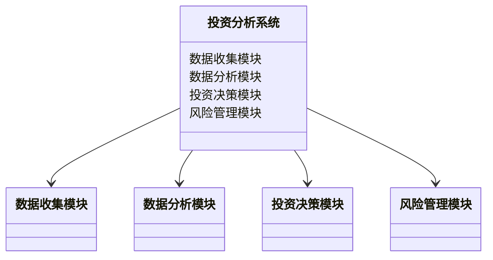
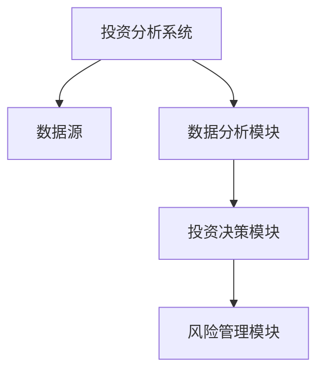

                 


# 彼得林奇的"反周期"投资策略探讨

> 关键词：反周期投资、彼得林奇、价值投资、风险管理、经济周期

> 摘要：本文探讨了彼得林奇的反周期投资策略，分析其核心理念、选股方法及风险管理策略，结合实际案例，深入解析其在不同经济周期中的应用。

---

## 第一部分：反周期投资策略的背景与基础

### 第1章：反周期投资策略的概述

#### 1.1 反周期投资的基本概念

- **经济周期的基本定义**：经济周期分为四个阶段：繁荣、衰退、萧条和复苏。
- **反周期投资的定义与特点**：在经济低谷时投资，利用周期性回升获利。
- **反周期投资的核心理念**：买入被市场低估的资产，等待周期反转。

#### 1.2 彼得林奇与反周期投资

- **彼得林奇的生平简介**：著名基金经理，擅长价值投资。
- **彼得林奇的投资哲学**：寻找被低估的企业，长期持有。
- **彼得林奇与反周期投资的关联**：在经济衰退时买入优质股，利用周期性反弹获利。

---

### 第2章：反周期投资的理论基础

#### 2.1 经济周期波动与投资机会

- **经济周期的四个阶段**：
  - 繁荣：市场高估，投资风险大。
  - 衰退：市场恐慌，投资机会出现。
  - 萧条：市场底部，买入优质资产。
  - 复苏：市场回升，资产增值。

#### 2.2 投资组合的构建与风险管理

- **投资组合的基本原理**：分散投资，降低风险。
- **风险管理的重要性**：避免重大损失，确保长期收益。
- **反周期投资中的风险管理策略**：
  - 设置止损点，控制回撤。
  - 保持充足流动性，应对市场变化。

---

## 第二部分：彼得林奇的反周期投资策略

### 第3章：彼得林奇的投资策略分析

#### 3.1 价值投资的核心要素

- **价值投资的定义与特点**：
  - 寻找市场价格低于内在价值的股票。
  - 长期持有，等待市场发现其价值。

- **彼得林奇的价值投资方法**：
  - 专注于基本面分析，寻找被低估的企业。
  - 重点考察企业的财务健康状况和竞争优势。

- **价值投资与反周期投资的结合**：
  - 在经济衰退时，市场低估优质企业，是买入的最佳时机。

#### 3.2 市场情绪与投资决策

- **市场情绪的周期性波动**：
  - 恐慌：市场恐慌时，优质资产价格被压低。
  - 乐观：市场上涨时，优质资产价格被高估。

- **市场恐慌与投资机会**：
  - 经济衰退时，市场情绪低落，反周期投资机会出现。

- **如何利用市场情绪进行反周期投资**：
  - 在市场恐慌时，买入被低估的资产。
  - 在市场乐观时，卖出高估的资产。

---

### 第4章：彼得林奇的选股方法

#### 4.1 选股标准与流程

- **企业基本面分析**：
  - 财务指标：市盈率（P/E）、市净率（P/B）、股息率等。
  - 行业分析：选择景气度向上的行业。
  - 竞争优势：企业是否有独特的竞争优势。

- **财务指标的评估**：
  - 市盈率：$$市盈率 = \frac{股价}{每股收益}$$
  - 市净率：$$市净率 = \frac{股价}{每股净资产}$$
  - 股息率：$$股息率 = \frac{每股股息}{股价}$$

- **行业分析与竞争优势**：
  - 选择具有持续增长潜力的行业。
  - 重点考察企业的竞争优势，如成本优势、品牌优势等。

#### 4.2 投资组合的构建与调整

- **投资组合的构建原则**：
  - 分散投资：避免过度集中。
  - 逆向思维：在市场低谷时增加仓位。
  - 长期持有：耐心等待市场反转。

- **投资组合的调整策略**：
  - 定期审视：根据市场变化调整持仓。
  - 逐步建仓：避免一次性投入，分批买入。

---

## 第三部分：反周期投资策略的系统分析与实战

### 第5章：系统分析与架构设计

#### 5.1 系统功能设计

- **领域模型**：使用Mermaid类图展示投资分析系统的功能模块。



#### 5.2 系统架构设计

- **系统架构图**：展示投资分析系统的整体架构。



### 第6章：项目实战

#### 6.1 环境配置

- **工具安装**：安装Python、Pandas、Matplotlib等工具。

#### 6.2 核心实现

- **代码实现**：使用Python代码计算市盈率并筛选股票。

```python
import pandas as pd

# 假设data是一个包含股票数据的DataFrame
data = pd.DataFrame({
    '股票名称': ['A', 'B', 'C'],
    '股价': [10, 20, 30],
    '每股收益': [2, 3, 4]
})

# 计算市盈率
data['市盈率'] = data['股价'] / data['每股收益']

# 筛选市盈率小于15的股票
filtered = data[data['市盈率'] < 15]
print(filtered)
```

#### 6.3 案例分析

- **实际案例**：2008年金融危机期间，彼得林奇如何选择投资标的。

---

## 第四部分：最佳实践与小结

### 第7章：最佳实践

- **风险管理**：设置止损点，避免重大损失。
- **长期投资**：耐心持有优质资产，等待周期反转。
- **持续学习**：不断更新知识，适应市场变化。

### 第8章：小结

- 本文系统地介绍了彼得林奇的反周期投资策略，分析了其核心理念、选股方法及风险管理策略。
- 通过实际案例和系统设计，深入解析了反周期投资在不同经济周期中的应用。

### 第9章：注意事项

- **市场风险**：经济周期不可预测，投资需谨慎。
- **时间因素**：反周期投资需要较长的时间跨度。
- **信息获取**：确保数据来源可靠，分析准确。

### 第10章：拓展阅读

- **推荐阅读书籍**：
  - 《彼得林奇的选股术》
  - 《价值投资实战》
- **推荐阅读文章**：经济周期与投资策略相关文章。

---

## 作者信息

作者：AI天才研究院/AI Genius Institute & 禅与计算机程序设计艺术 /Zen And The Art of Computer Programming

